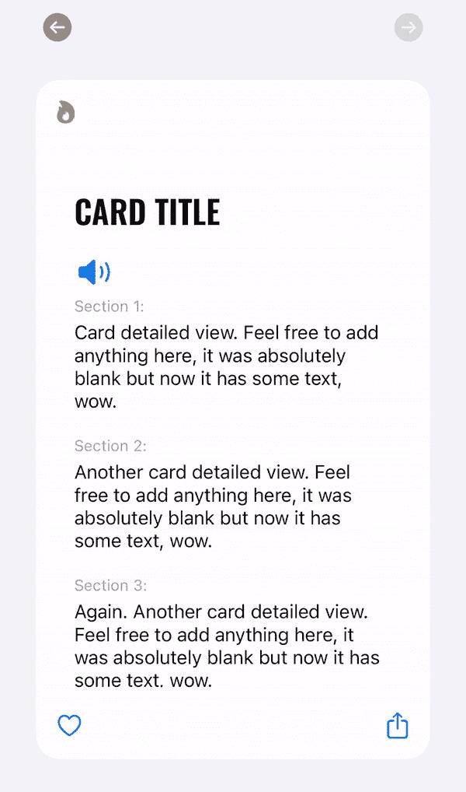
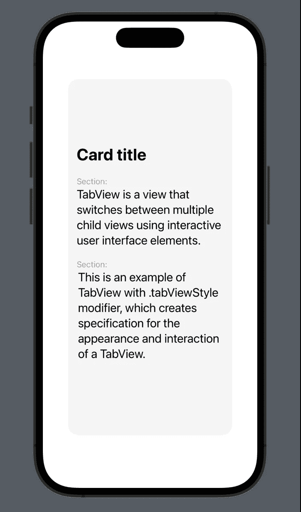

# SwiftUI 中带分页的 ScrollView

> 原文：<https://betterprogramming.pub/scrollview-with-paging-in-swiftui-5948a9d5875d>

## 本文将帮助您在 UIKit 中构建看起来像 UIPageViewController 的 SwiftUI 元素。

这是我在 SwiftUI 项目中实现的元素

“SwiftUI 中分页的 ScrollView”正是我在 SwiftUI 项目中尝试实现分页的水平滚动时输入到 Google 中的查询。然而，我在网上冲浪了几个小时，才发现这个在 UIKit 中相当简单的任务在 SwiftUI 中并不明显。

到处都有开发人员在创建过于复杂的视图来模仿 SwiftUI 中的`UIPageViewController`。他们中的一些人建议使用 SwiftUI 内部 API 的方式毕竟不能被认为是安全的。事不宜迟，让我们研究一下在 ScrollView 中重新创建分页的方法。

# **UIScrollView.appearance()。ispaginagenabled**

如果项目中的所有 ScrollViews 都将被分页(意味着您将不再需要经典的滚动视图)，最简单的方法是设置`UIScrollView.appearance().isPagingEnabled = true`。

但是，记住`UIScrollView.appearance()`应该设置一次。

而在`UIScrollView.appearance().isPagingEnabled` 上不断切换真假，终究不是最好的选择。

# **选项卡视图**

用分页制作 ScrollView 最方便最正确的方法其实根本不用 ScrollView，而是用`TabView`！

尽管 SwiftUI `TabView`与 UIKit 的`UITabViewController`相似，但它有一些额外的内部功能。

从 iOS 14 开始，你现在可以使用带有`.tabViewStyle modifier`的 TabView 来创建分页 UI 元素。让我们深入一些代码。首先，让我们创建基本的卡片模型，它将包含我们的视图使用的数据(`title`、`subtitle`、`description`、`card`、`background color`和`id`)。

静态函数`getExampleModels(count: Int)`的存在只是为了说明，所以我可以快速创建一些具有不同背景颜色的模拟模型。

现在切换到内容视图并添加`TabView()`。这个结构有两个初始化器:`TabView(selection: Binding<Hashable>?, content: () -> View) or TabView(content: () -> View)`。

我们将选择第二个选项，因为在本教程中，我们不需要知道现在选择了哪张卡片。随着`ForEach`的推出，我们将增加所有的模拟模型。

最后添加`.tabViewStyle`修改器，创造出漂亮的翻页效果(第 23 行)。你可能也注意到了我使用了`indexDisplayMode: .never.`

这是故意使用的，因为我不想让经典的圆点在卡片下面显示页面索引。

你可能想显示点，然后你应该坚持`.tabViewStyle(PageTabViewStyle(indexDisplayMode: .always)**.**`

给您现在你可以添加自定义字体，图像，按钮等。重新创建您需要的页面。GitHub 上的这个例子:`[git@github.com:sashamyshkina/tabViewExample.git](https://github.com/sashamyshkina/tabViewExample)`