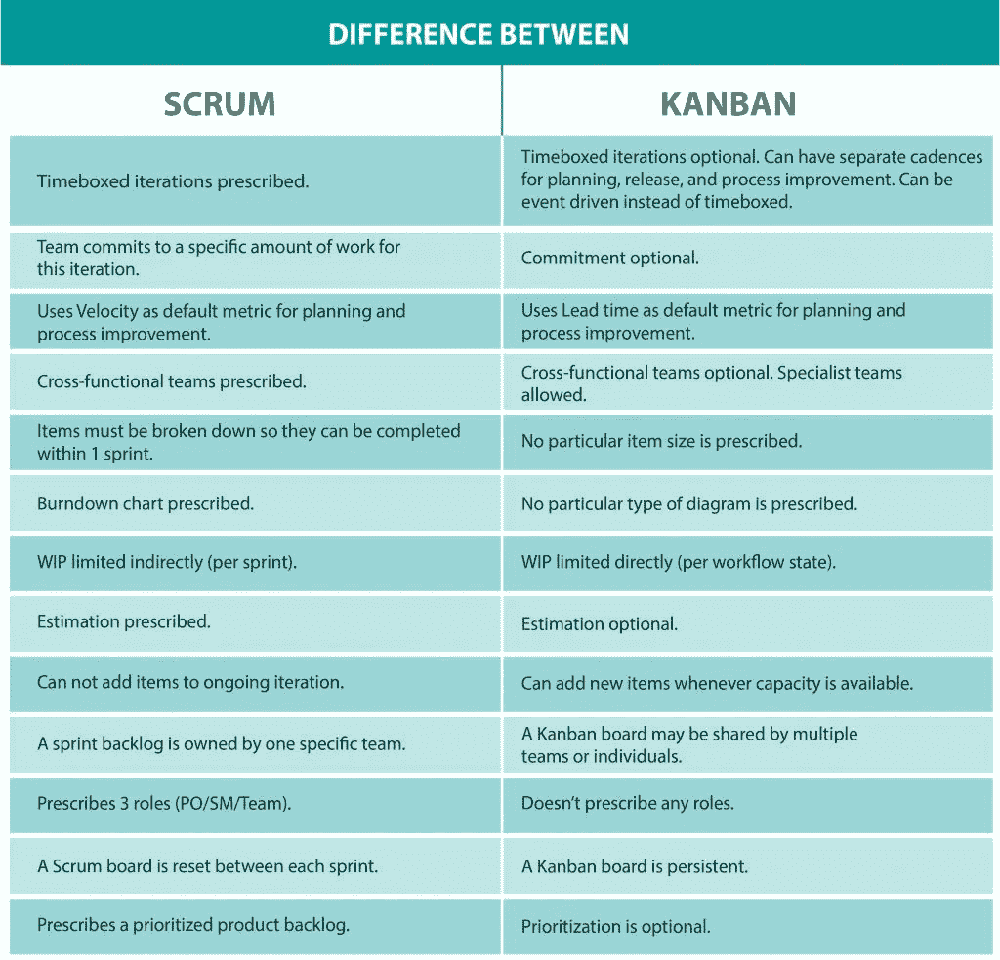
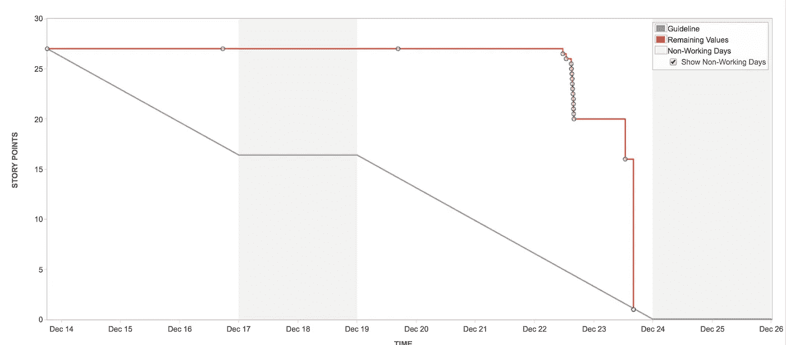
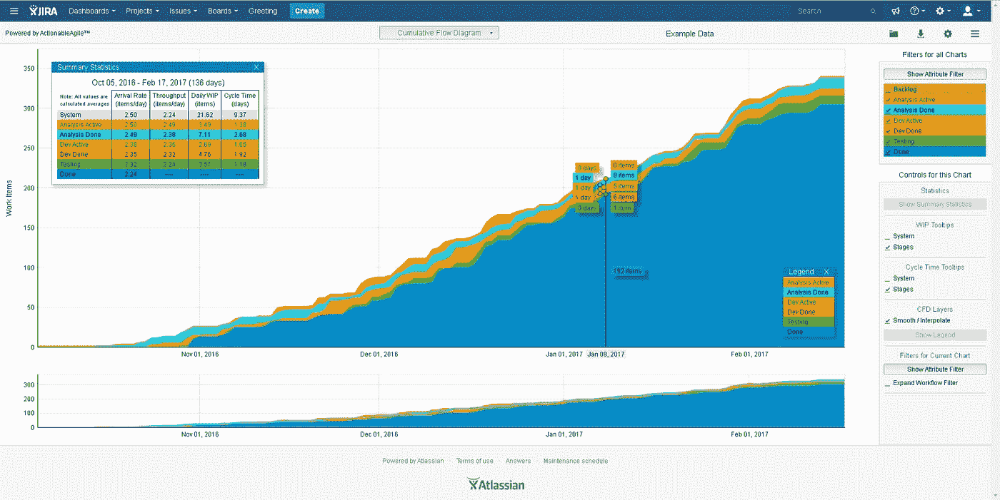

# Scrum 已经死了。向看板致敬，新的王者

> 原文：<https://betterprogramming.pub/scrum-is-dead-all-hail-kanban-the-new-king-2cd6249feef8>

## Scrum 为什么没有成功？

[空中聚焦](http://www.airfocus.com)在 [Unsplash](https://unsplash.com/@airfocus) 上拍摄的照片。

我从职业生涯开始就一直在使用 Scrum。这是我在大学里学到的管理软件开发的最佳框架。当我开始工作的时候，我喜欢这一切:每天的会议、计划、回顾、冲刺等等。毕竟，我是在学以致用。

几年后，我开始注意到一件事:在冲刺的最后几天，每个人都急于交付他们在之前两周完成的一切，以避免遗留问题，经常承担不必要的风险。

为什么？有些任务不能等到下周吗？在周末之前交付每一项任务都那么重要吗？不，不是的。我们这样做是因为“遗留物是不好的。”

# Scrum 不够敏捷

我得出的结论是，Scrum 过于强调过程——或者至少人们对它给予了太多的关注:

*   在 sprint 的最后一天发布一个故事是可以的。但是第二个星期一，它是一个结转。
*   如果你需要做意想不到的工作(程序错误，生产中的问题，等等)。)，这会影响你的时间，从而使你无法实现在计划会议上做出的承诺。
*   评估成功最常用的指标是承诺与完成，它比较了你在 sprint 开始时承诺的故事和你完成的故事(我甚至懒得提这会带来什么问题)。

Scrum 不再指导我们了。它限制了我们。

有了上面提到的所有要点，团队开始感到沮丧，并且它影响了产生的工作的质量。比起期望的质量水平，人们更关心及时交付。

在这一点上，我们开始研究更适合我们工作方法的其他可能的敏捷框架。

我们发现了看板。

由[费伦茨·霍瓦特](https://unsplash.com/@designhorf?utm_source=medium&utm_medium=referral)在 [Unsplash](https://unsplash.com?utm_source=medium&utm_medium=referral) 上拍摄的照片。

# 什么是看板？

看板是一种工作管理框架，早在 40 年代就由丰田生产系统首次引入。这时，丰田使用了一个可视板，有三栏:已请求、进行中、完成。当生产线的某些区域出现瓶颈时，这个框架允许丰田更好地分配资源。

当人们看到看板可以给交货速度带来的好处时，看板就被应用于技术行业。

# Scrum 与看板

近年来，Scrum 和看板一直在争夺领先敏捷框架的位置。尽管 Scrum 是目前排名第一的敏捷框架，看板在过去几年里越来越被采用。但是这两个框架如何比较呢？

以 Scrum 为基础:

*   看板没有时间限制的迭代(冲刺)。
*   看板不需要故事估算。
*   看板没有承诺的概念。项目在需要完成时进入流程。
*   看板提供了几个度量标准来衡量一个故事在看板上花费的时间。
*   看板不需要 Scrum 大师(很明显)。

图片来自 [Cuelogic](https://www.cuelogic.com/blog/scrum-vs-kanban-a-developers-on-the-project-comparison) 。

看板为团队提供了更多的灵活性。故事比在 Scrum 中更自由地流动。但是伴随着巨大的自由而来的是巨大的责任。尽管没有每两周一次的承诺，但是必须使用其他指标来评估团队的表现，比如周期时间和吞吐量。

# 这都是关于度量的

如果没有可以让你评估自己进步的标准，你就无法衡量自己的成功(或失败)。

## Scrum 度量标准

Scrum 使用这些度量和图表:

*   速度:每次冲刺交付的故事点的数量
*   承诺与完成:被承诺和交付的故事的百分比
*   燃尽图:显示给定 sprint 的故事发展的图表

这些指标很难帮助你改进你的工作流程。

速度并不能衡量传递的速度。它计算了已交付的故事点的数量。如果一个故事花费的时间比预计的要长，这个指标就不再有任何意义。

承诺与完成绝不应该成为衡量标准。它将交付的内容与承诺的内容进行比较。不用说，这可以让人们关闭并重新打开他们要“完成”的任务

燃尽图是我个人从来没有太注意过的东西，主要是因为它经常是这样的:

来自[视图 26](https://view26.com/blog/2018/01/05/burndown-chart-jira/) 的照片。

为什么会这样？你从一块空白的木板开始，比方说，平行的三个故事。这些故事很可能同时向前发展，这意味着你会在燃尽图上看到这些巨大的下降。此外，如果你有一个测试所有故事的测试人员，你将会有一个瓶颈。

## 看板指标

在我看来，指标是看板的最大优势。它有一个不同指标的池，使您能够更好地了解您的团队正在发生什么，例如:

*   吞吐量:在给定的时间跨度内交付的故事数量
*   周期时间:故事开始后交付故事所需的天数。这使用置信区间。最常看的是 85%的信心。
*   累积流程图:让你可以直观地看到故事在你的板上是如何流动的。它看起来应该像一头梳理过的鲸鱼。

图片来自[亚特兰大市场](https://marketplace.atlassian.com/apps/1216661/actionableagile-for-jira-agile-metrics?hosting=cloud&tab=overview)。

吉拉有一个插件可以提供所有这些现成的指标。它叫做[吉拉的可操作敏捷——敏捷度量](https://marketplace.atlassian.com/apps/1216661/actionableagile-for-jira-agile-metrics?hosting=cloud&tab=overview)。您可以使用用于管理工作的相同软件来探索您团队的指标。

# 我们根据我们的团队进行了调整

纯粹的看板不需要你做 Scrum 所必需的几项活动。但是，如果您预见到将它们添加到您的工作流程中的价值，它会给您带来灵活性。

回顾会议是团队最重要的会议之一。在这里，你可以回顾你已经完成的工作，不尽如人意的地方，以及如何改进。这是一个安全的地方，在这里你可以暴露你的问题，并祝贺那些工作出色的人。

尽管在看板中这不是必需的(在 Scrum 中，它是在每个 sprint 结束时完成的)，我们看到了它的价值并保留了它。事实上，我们开始每周做一次，而不是每两周做一次，这样当出现问题时，我们可以更快地做出反应。我们还利用这些会议来查看团队的度量标准，并检查问题和瓶颈。

我们选择保留的另一个可选活动是细化过程中的故事评估。在 Scrum 中，评估被用来更好地理解什么适合 sprint。因为看板没有冲刺，你可能会认为这没有用。

不对！

乔希·卡拉布雷斯在 [Unsplash](https://unsplash.com?utm_source=medium&utm_medium=referral) 上的照片。

评估一个故事有助于确保每个人对故事中要做的事情有相同的想法。如果有人投 8，其他人投 3，显然这个故事还需要进一步讨论。有人可能在解释一个其他人没有意识到的问题，或者反过来，有人在这个故事中加入了额外的工作。

评估会激发讨论。

当这种情况发生时，显然不是每个人都清楚地知道需要做什么。

另一个常见的场景是整个团队投票支持高价值(通常是 8 以上)。高值意味着不确定性。要么是要做的事情太多，要么是任务的复杂程度让人不舒服。在这种情况下，最佳实践是将故事分成目标更明确的小故事。

# 最后的想法

Scrum 作为第一个广泛传播的敏捷方法，将永远在我们心中占有一席之地。但是随着公司转向持续部署，有时间限制的冲刺不再有意义。

总会有一些特定的项目需要使用 Scrum。随着公司变得越来越敏捷，看板将取代 Scrum 成为最常用的敏捷框架。

感谢您阅读我的文章。如果你想收到关于我最新作品的更新，[订阅我的邮件列表](https://emanuelsmarques.medium.com/subscribe)。

如果您有任何问题或主题想要进一步讨论，请留下回复。我很乐意谈论它！