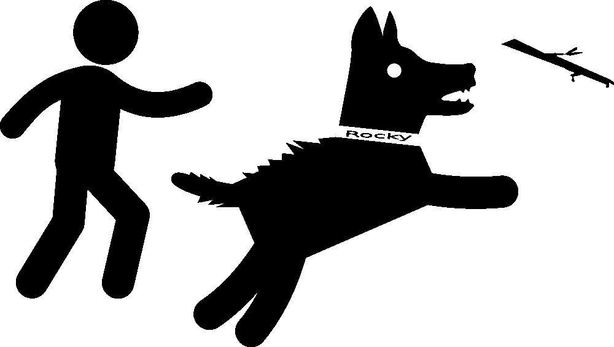

# Rocky 的 Scrum:冲刺目标

> 原文：<https://betterprogramming.pub/scrum-sprint-goal-5fd75dfd3781>

## 冲刺目标的重要性


让我从介绍演员开始我的故事:

```
The guy — Product Owner
Rocky — Development team.
```

根据戏剧规则，每个故事显然都有冲突。没有冲突，故事就没意思了。

# 以下是潜在冲突的列表

*   开发团队永远达不到冲刺目标；
*   开发团队总是达到冲刺目标，但是没有增量；
*   开发团队很努力，但是看不到结果。

正如您在冲突示例中看到的，开发团队并不满意。

**首先，我来澄清一下什么是冲刺目标。**

以下是 Scrum 指南对 Sprint 目标的描述:

> 冲刺目标是冲刺的唯一目标。尽管 Sprint 目标是开发人员的承诺，但是它在实现目标所需的具体工作方面提供了灵活性。Sprint 的目标也创造了一致性和焦点，鼓励 Scrum 团队一起工作，而不是各自为战。

# **那么问题是什么呢？**

上面的关键词是“单身”。目标，开发团队的主要焦点，应该是单一的。Sprint 目标不是用户故事的列表。正确的 Sprint 目标是需要这个迭代的一个原因。

以下是潜在问题的列表:

> 没有“单一”目标

在这种情况下，团队不是作为一个团队而是作为个人一起工作。团队的每个成员都试图达到自己的目标，就像他们有个人冲刺一样。在最好的情况下，结果将是一组完成的，但是不相关的用户故事，但是通常是最坏的情况:故事没有完成或者没有增量。

# **团队不理解冲刺目标**

在冲刺开始之前，整个团队都应该非常清楚冲刺的目标。万一谁也不清楚或者没有共同认识，那么冲刺就有非常大的概率不成功。

开发团队应该与产品负责人讨论 Sprint 计划的 Sprint 目标，并将需要的故事带到 Sprint 中。

# **现在让我们看看一个理想但“无聊”的故事会是什么样子**



你可以看到，洛奇拿起一根棍子很兴奋。它看到了要跑的方向，所以毫无疑问它会把棍子带给它的主人。

# **结论**

我这篇简短文章的目的是展示 Sprint 目标的重要性。网上有很多如何写正确目标的例子。但是请注意，“产品目标”是一个不同的术语，也是非常重要的术语。

*感谢克里斯托弗·金的剪辑。*