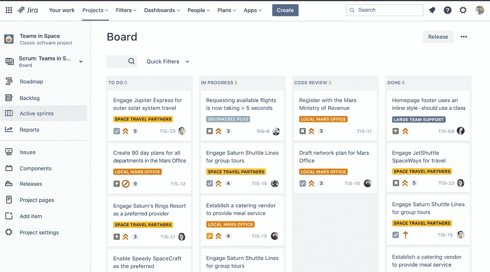
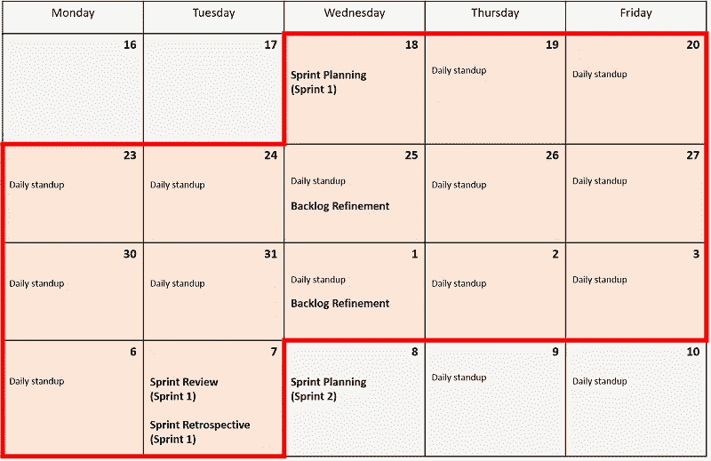

# 作为软件开发人员，你应该熟悉的 Scrum 术语

> 原文：<https://betterprogramming.pub/scrum-terms-you-should-be-familiar-with-as-a-software-developer-fd7502ccb304>

## 谁是 Scrum 大师，我们有 Scrum 仪式吗？这是我第一次听到这些术语时问自己的问题


杰森·古德曼在 [Unsplash](https://unsplash.com/s/photos/software-team?utm_source=unsplash&utm_medium=referral&utm_content=creditCopyText) 上的照片

我第一次接触 Scrum 是在我实习的时候。一开始感觉很吓人。像 Scrum 仪式、故事点、冲刺等术语对我来说是陌生的，我花了几个星期才理解它们的意思以及为什么需要它们。我原以为 scrum 仪式是为了颁发诸如最佳团队成员之类的奖项，但事实并非如此。

虽然学习这些术语的最好方法是在工作中，但是这篇文章将作为一个温和的介绍，希望能让你熟悉一些常用的 SCRUM 术语。我不是项目经理，也没有接受过任何与 Scrum 相关的正式培训。这篇文章的内容是基于我的经验，所以一些术语可能过于简化，虽然他们不是。再次强调，了解 Scrum 的最好方法是在工作中或者从项目经理那里学习。

# 什么是 Scrum，为什么需要它

Scrum 是一种组织工作的方式。团队一起工作，如果变得困难，他们可以改变他们正在做的事情。这是一种敏捷方法，这意味着制造东西的人决定如何制造它们。他们也不会试图把事情变得太大或太难。它是一种迭代和增量的方法，允许团队在短时间内生产高质量的软件产品。使用 Scrum 框架的主要好处是它有助于:

*   最大化团队生产力
*   加速项目交付
*   提高产品质量
*   促进团队成员之间的沟通和协作
*   降低项目风险

# 理解 Scrum 团队中的各种角色

scrum 团队中有三个关键角色:产品负责人、Scrum 主管和开发团队。

*   **产品负责人**:负责理解项目的商业目标，确保团队拥有成功所需的一切。
*   scrum master :确保团队中每个人都遵守 scrum 规则的人。他们还对每个开发团队成员下一步应该完成的任务进行优先排序和组织，以便成功地满足最后期限。他们还确保团队富有成效。
*   开发团队:负责开发产品的人，也就是你和我。

# 理解 Scrum 是如何被用来管理项目的

为了理解 Scrum 如何被用来管理项目，首先理解 Scrum 实际上是什么是很重要的。

Scrum 是一个管理软件开发项目的框架。这是一种敏捷的方法，这意味着它的设计是灵活的，能够适应变化。

Scrum 背后的基本思想是，项目被分成一系列短的、有时间限制的迭代，称为**冲刺**。在每个冲刺阶段的开始，团队开会并就他们想要在冲刺阶段实现的一系列目标达成一致。然后，他们将这些目标分解成单独的任务，分配给特定的团队成员。团队在冲刺阶段一起工作来完成那些任务，在冲刺阶段结束时，他们再次会面来回顾已经完成的内容，并确定目标是否已经实现。如果是的话，太好了！目标已经实现。如果不是，那么团队讨论为什么会发生这种情况，并为下一个 sprint 提出一组新的任务。当每次迭代完成时，您就有了产品的增量。

# 你可能会听到一些 Scrum 术语

*   **冲刺:**冲刺是 Scrum 中团队致力于完成项目目标的一段时间。它们通常持续 2-4 周。
*   **每日 Scrum 会议**:也称为**每日站立**。这是一个每天 15 分钟的会议，团队中的每个人都要回答三个问题:你昨天做了什么？你今天打算做什么？在你的道路上有什么阻碍你实现目标的障碍吗？
*   回顾会议:这是在每个冲刺阶段结束时召开的会议，团队中的每个人都在会上讨论在冲刺阶段哪些进展顺利，哪些进展不顺利，并提出如何改进的想法。
*   Scrum Board:Scrum Board 是一个帮助团队跟踪他们的进度并直观地看到他们做得如何的工具。通常它至少有三列:待办事项、进行中、完成。团队在每天的 scrum 会议上更新 Scrum 板。它还可能有其他列，如“已提出拉取请求”、“已批准拉取请求”等。这通常是自动完成的，也就是说，无论何时你做一个 PR，你都必须标记一个任务，这个任务将会从正在进行的状态转移到拉请求状态。当有人批准您的 PR 时，任务将移动到“拉动请求批准”,最后，当利益相关者满意时，任务将移动到“完成”。用于 Scrum 板的一些流行服务有吉拉、GitHub 项目、Azure DevOps 等。下面是吉拉 Scrum 板的一个例子



*来源:*[*https://www.atlassian.com/software/jira*](https://www.atlassian.com/software/jira)

*   时间限制:时间限制是指 scrum 板上的所有任务都应该有一个指定的完成时间。它们既可以被分解成更小的任务，也可以作为一个整体进行评估。一旦冲刺开始，团队成员在一项任务上花费的时间不能超过分配给他们的时间，这一点很重要。这有助于确保任务按部就班地顺利进行。
*   **产品积压**:这是您的项目中需要完成的所有项目的列表。这些可以包括新的特性、错误或者任何需要完成的事情。产品负责人对产品待办事项列表中的项目进行优先级排序，团队的角色是按照指定的优先级完成它们。未完成的项目在变得可用时会提升到更高的优先级。
*   **Sprint Backlog** :这是团队在下一个 Sprint 期间需要做的事情的列表，也就是 Sprint 周期持续的一周或两周。清单上最重要的项目被认为是最重要的，该轮到他们先完成了。这个列表中的每一项都被称为一个用户故事，必须在 sprint 期间完成。
*   **用户故事**:对需要做出的特性或变化的描述。这些是由产品所有者编写的，然后由团队来决定为了交付这些需求(按优先顺序)需要首先完成什么。团队负责编写他们自己的用户故事，以充分理解他们应该做什么。在上面 scrum 板的图片中，栏内的每个框都是一个用户故事。
*   **故事要点:**衡量一项任务相对于其他任务付出多少努力。比如一个故事点可以相当于半天的工作量。由团队成员自己来决定需要完成的工作的规模和复杂性，以便对其进行正确的评估。
*   **持续集成**:一套旨在提高软件发布质量的软件开发实践。它的目标是在非常频繁的周期中构建、测试和发布高质量的代码(例如每次签入都会导致一个构建)，这样当添加新特性时，它们会快速增值。
*   **待办事项整理**:这是产品负责人和团队检查和细化产品待办事项，为冲刺做准备的过程。产品负责人对项目进行优先排序，而团队则确保他们完全理解每一个项目。这一步有助于确保在冲刺阶段应该做的每一件事都是清晰易懂的。
*   速度(Velocity):一个团队在给定时间内可以完成多少工作的度量。这也用来决定一个 sprint 可以承担多少工作。随着这个数字的增加，速度成为一个越来越准确的指标，来衡量一段时间内完成了多少工作。
*   **Sprint Burndown** :这是团队已经完成了多少工作以及他们还剩下多少工作要做的图形表示。它提供了进度的可见性，实现了现实的预测，还帮助产品所有者规划未来的冲刺。这也比较了为了达到冲刺目标应该做多少和实际做了多少。

# 三个主要的 Scrum 仪式

作为开发过程的一部分，Scrum 团队必须进行 3 个关键的仪式。它们如下:

*   **每日站立会议或 Scrum 站立**在每个工作日开始时举行，在此期间每个团队成员必须回答三个问题:自从昨天站立以来我完成了什么？在明天的单口相声之前我会完成什么？我的道路上有什么障碍吗？这在上一节中也讨论过。
*   冲刺计划会议是团队一起回顾未来冲刺所需任务的地方。这是通过分解工作项，用故事点估计它们(见上文)，然后将它们添加到 Sprint Backlog 中来完成的。
*   Sprint Review 是团队向项目涉众展示他们已经完成的工作的地方。这个会议不是为了讨论问题，而是给利益相关者一个机会来提供到目前为止已经完成的工作的反馈，并给出需要完成的未来工作的方向。

下面是一个样本 Scrum 日历模板。你从冲刺计划会议开始，然后每天站立直到冲刺结束。在你的冲刺阶段结束时，你会有一个冲刺回顾会议。在此之后，您将为下一个 sprint 召开另一个 Sprint 规划会议。此外，您可能还会在 sprint 中进行一些待办事项整理或待办事项细化会议，并在 sprint 结束时召开回顾会议。



*来源:*[*https://www . agile uprising . com/2017/01/01/sprint-schedule-template/*](https://www.agileuprising.com/2017/01/01/sprint-schedule-template/)

# 作为一名开发人员，知道自己成功使用 SCRUM 的目标

当使用 SCRUM 时，对开发人员来说，清楚地理解他们的目标是很重要的。这样，他们可以最大限度地利用 SCRUM 方法，并确保他们的项目不断取得进展。开发人员可能需要记住的一些目标包括:

*   及时完成任务
*   确保任务得到正确的优先排序
*   不断地将新代码集成到项目中
*   确保所有利益相关者了解项目进展的最新情况

许多开发人员通过遵循这些简单的指导方针，成功地使用了 SCRUM 方法。值得注意的是，这种方法并不是每个项目的灵丹妙药，而是一种有助于保持项目顺利运行的有用工具。只要你正确使用它并遵循它的原则，那么你没有理由看不到积极的结果。

# 结论

值得注意的是，本文只提供了 Scrum 的基础知识。如果您想了解更多关于如何将其用于软件开发的信息，或者如果您是该过程的新手，并且需要帮助开始使用您的项目管理方法，请联系您的项目经理！我希望这篇文章提供了 SCRUM 术语的介绍，这样下次有人在会议中提到它们时，它们就不会显得那么吓人了。

```
**Want to Connect With the Author?**This article was originally posted on [realpythonproject.com](https://www.realpythonproject.com/scrum-terms-you-should-be-familiar-with-as-a-software-developer/)
```