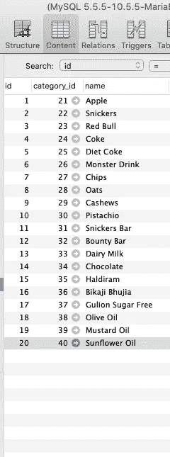

# SwiftUI 中带有组合的搜索栏

> 原文：<https://betterprogramming.pub/search-bar-and-combine-in-swift-ui-46f37cec5a9f>

## 在您的应用中搜索，由 Combine 提供支持

由[保罗·美并](https://unsplash.com/@paulminami?utm_source=medium&utm_medium=referral)在 [Unsplash](https://unsplash.com?utm_source=medium&utm_medium=referral) 上拍摄

最近我在 SwiftUI 上做一个项目。SwiftUI 对于 iOS 开发人员来说是一件轻而易举的事情。我记得我们很难布置视图的时候，不管是使用程序性的还是故事板的方法(尽管我不是故事板的粉丝)。对我来说，在模拟器和设计师之间来回奔波是一件乏味的工作。幸运的是，SwiftUI 出现了，iOS 开发的方方面面正在慢慢发展。当然，我们都喜欢 UI Kit，它仍将统治 iOS 开发多年。

尽管如此，SwiftUI 在中很容易工作和实现，尽管仍然有一些警告。例如，`UISearchController`和`SearchBar`在 SwiftUI 中不可用，获取键入文本的委托方法也不可用。在这里，我试图呈现一个简单的情况，您希望发送一个带有搜索关键字的网络请求，并在 SwiftUI 中呈现数据。

为了实现这个演示/教程的目的，我将使用[组合](https://developer.apple.com/documentation/combine)和 SwiftUI。Combine 也是在 2019 年 WWDC 奥运会上推出的，它是一个反应式框架，是苹果对 Rx 编程风格的实现。对于像我这样之前没有 RxSwift 使用经验的人来说，Combine 会感觉很艰难。然而，与传统方法相比，使用 Combine 的好处是代码更加健壮，并且消除了我们通常在网络调用和其他地方实现的各种完成处理程序块。我将尽力解释所使用的方法；尽管如此，我还是强烈建议多读一些关于联合收割机的书。

对于这个例子，我们将创建一个普通视图，其中有一个搜索栏，允许在某个远程服务器上搜索产品。

这段代码中发生了很多需要解释的事情。首先，布局数组定义了列表中的项目应该如何显示。它甚至可以说是 SwiftUI 的集合视图，因为它充当了委托流布局的`sizeForItemAt`方法。然而，布局属性告诉 SwiftUI，“嘿 SwiftUI，我想要一个具有灵活宽度或者跨越视图整个宽度的网格项目。”很简单，对吧？这个代码库中第二件看起来令人畏惧的事情是`ObservedObject`的属性包装。稍后我会解释它，但让我们首先关注布局。

SearchView.swift

布局很简单:我们正在创建一个`VStack`，它将保存我们的搜索栏和结果。搜索栏是一个在`HStack`内的纯文本字段，它的宽度可以调整所有的屏幕尺寸。还有一个`ScrollView`，它封装了负责显示列表项的`LazyVGrid`。内嵌的`ItemView`有一个`ZStack`和`HStack`比较好理解。

SwiftUI 中的`TextField`期望绑定从`ProductViewModel`传来的字符串，这是这个谜题的关键部分。我们负责向网络发送请求和更新视图模型中的数据源。注意变量中的`Published`属性包装器；这将有助于 SwiftUI 计算各州的差异。让我们看看视图模型的组织。

正如我们所见，`ViewModel`承担了所有的重担。`TextField`的可绑定字符串也由此对象提供。注意产品数组前面的关键字`@Published`和`searchText`。

首先，我们来看看`searchText`。这就像一个上游发布者，随着时间的推移发布值。也就是说，每当用户开始在字段上输入时，这个`searchText`就会产生值。在这个`ViewModel`的初始化器上，我们订阅了`searchText`发布者发出的值。这里我们是*反跳*，这意味着将值的检索延迟 800 毫秒，因为我们不想在用户键入后立即发送请求，我们希望等待几秒钟，这样我们就不必在每个键入的字母上往返一次。在等待 800 毫秒后，我们将转向另一个运营商`removeDuplicates`，如果用户键入重复的字母并迅速删除它们以使我们崩溃，iOS 将智能地处理这一问题。

此后，订户链上出现了`map`操作符，它检查字符串的计数是否合适。例如，如果用户放置光标并使其保持不动，那么就没有必要去服务器获取数据。如果计数大于 1，发布的值只通过`map`；如果没有，则传递 nil。注意`compactMap`，它巧妙地过滤掉了不会在这个操作符下面传递的零值，因此，它将允许我们进入网络。

如果上述所有操作都成功，我们将发送一个网络请求并检索结果。订阅集对我们来说起着重要的作用。它为我们保存订阅，并在需要时清除内存。这是 iOS 自己完成的，所以我们不需要担心。但是，如果我们想使用发布者-订阅者链，最好记住保留订阅。然后，调用一个函数进入网络并获取所需的结果。

现在让我们看看结果。

搜索结果

数据库ˌ资料库

我希望这是一个令人兴奋的阅读对我们所有人来说。我没有包含`Codable`模型文件，我们都知道它简单且易于实现，也没有添加`NetworkManager`代码。它只是访问网络，并使用所需的查询字符串获取端点的结果。我还添加了数据库的截图，作为我们的证据。