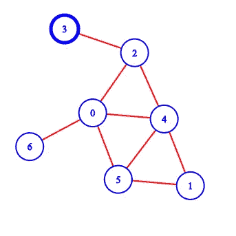
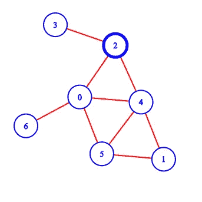
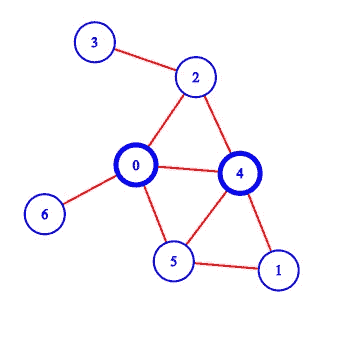
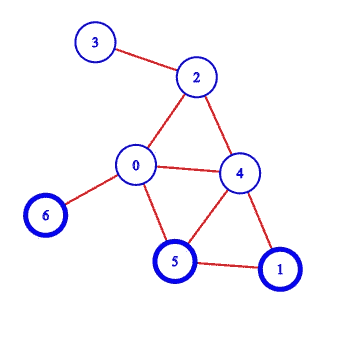

# 图上搜索技术:广度优先搜索

> 原文：<https://betterprogramming.pub/search-technique-on-graphs-breadth-first-search-dab467f73ff8>

## 四处搜寻


图片由 [AnaSophia Eiseman](https://www.pinterest.co.uk/brashash/)

*广度优先搜索* (BFS)是图上常见的搜索技术。BFS 是深度优先搜索的同伴。当 DFS 在图的深度方向上遍历时，BFS 在图的宽度方向上遍历。它被用来在图中寻找一个节点。它也可以用来获得从一个给定节点到那个节点的路径，或者只是遍历一个图中的所有节点和边。

## 为什么使用 BFS 而不是 DFS？

假设我们想在一棵树上找到一个节点，我们事先知道这棵树不是浓密的(直径更大),并且这个节点位于树的中间。然后我们使用 BFS 而不是 DFS。

当边上没有权重或权重相同时，它通常用于查找从某个给定节点到某个节点的最短路径。

这一块用到的所有[代码都可以在 GitHub 上找到。](https://github.com/abecus/DS-and-Algorithms/tree/master/graph)

# 广度优先搜索

在广度优先搜索技术中，我们逐层遍历图。首先，从一个起始节点开始，我们存储它的所有相邻节点。然后，我们浏览存储的节点，并以首先浏览首先存储的节点的方式存储它们的所有相邻节点。

我们以这样的方式维护图的遍历，即我们探索一个级别的所有节点，然后是它下面的级别，等等。



在上图中，我们希望使用 BFS 从节点 3 转到所有节点。假设我们在 0 层(因为我们的自然数从 0 开始)。我们将节点 3 存储在一个队列中。(队列被定义为至少支持从前面移除项目和将项目添加到后面或常数时间的追加操作的数据结构，并且通常使用双向链表来实现。)现在说我们的队列是[3]。



通过从队列的前面弹出项目，即节点 3，并遍历它，我们转到第 1 层的相邻节点 2。现在我们将节点 2 添加到队列[2]中。



我们再次从队列的前端(即节点 2)弹出项目，并转到节点 2 的所有相邻节点，即第 2 层的 0 和 4。然后我们将这些节点添加到队列[0，4]。



我们再次从队列的前面弹出项目，它们是节点 0 和 4。然后从节点 0，我们到它的相邻节点 6，把它追加到队列，队列就变成了[6]。我们对节点 4 的相邻节点 5 和 1 进行同样的操作，队列变成[6，5，1]，它们位于第 3 层。这就是我们如何在图中使用 BFS 技术进行遍历。

# 让我们编码吧

```
from collections import deque 
def bfs(G, start, end):
    ...
```

在第一行，我们正在导入 Python 的内置队列模块。然后我们创建一个函数`bfs`，它接受参数图、开始节点和结束节点。

```
if start in Graph.graph:
    visited = set()        
    parent = {}        
    queue = deque([])    
    visited.add(start)        
    queue.append(start)
    ...
```

在第二行中，我们检查开始节点是否在图中。如果是，那么我们初始化访问过的集合来检查一个节点以前是否被访问过，有一个父字典作为父指针来重新创建路径，还有一个队列来存储节点。之后，我们将开始节点插入到被访问的集合和队列中。

```
while queue:            
    ...
```

现在我们一直循环，直到队列为空。

```
node = queue.popleft()
if node==end:                
    return backtrace(parent, start, end)  
visited.add(node)
...
```

现在，我们从队列的前面弹出节点，并检查该节点是否是结束节点。如果是，那么我们调用函数`backtrace`，用它来重新创建到结束节点的路径。如果该节点不是结束节点，那么我们将把该节点添加到已访问的集合中。

```
for child, _ in G.getAdjacentNodes(node):                
    if child not in visited:                    
        parent[child]=node                    
        queue.append(child)
...
```

现在我们循环遍历该节点的所有相邻节点。如果它们以前没有被访问过，我们将把它们添加到队列中(即，把它们添加到末尾)，并在父字典中将它们的父标记为`node` 。

```
return f"Path does not exists between the Nodes ({start} to {end})"
```

如果没有找到结束节点或者开始节点不在图中，我们返回一条消息。

为了重新创建路径，我们使用父字典并使用结束节点进行循环，直到找到开始节点。在这个过程中，我们将循环的节点添加到数组或列表中。在最后一行中，我们返回了反向列表，因为我们追加了从结束节点到开始节点的路径。

# 运行代码


```
G=Graph()
G.add(3, [2])
G.add(2, [0,4])
G.add(0, [6,5])
G.add(4, [5,1])
```

使用`[Graph](https://github.com/abecus/DS-and-Algorithms/blob/master/graph/graph.py)`类创建一个如上图。

```
print(bfs(G, 3, 5))
# [3,2,0,5]
```

运行`bfs`函数，将 3 作为起始节点，5 作为结束节点，打印出[3，2，0，5]。

# 时间复杂度

与 DFS 类似，BFS 的时间复杂度是 O(V+E ),因为访问每个节点一次并检查该节点是否被访问需要恒定的时间。此外，我们已经使用邻接表(使用嵌套字典和集合)表示了该图。

在下一篇文章中，我将介绍拓扑排序算法。

# 资源

你可以在我的 GitHub 上找到我在上面用过的所有[代码。](https://github.com/abecus/DS-and-Algorithms/tree/master/graph)

感谢阅读！