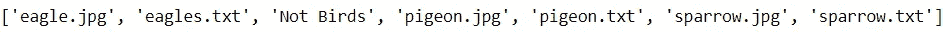
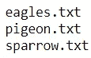
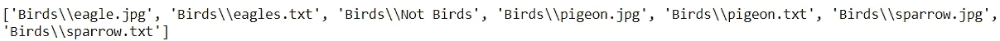
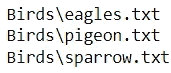
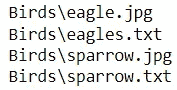
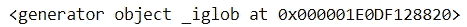
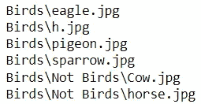

# 使用 Python 的 Glob 模块搜索文件很容易

> 原文：<https://betterprogramming.pub/searching-files-is-easy-with-pythons-glob-module-15ad170ba255>

## 用最少的努力简化复杂的搜索

由[马克西姆·卡哈里茨基](https://unsplash.com/@qwitka?utm_source=medium&utm_medium=referral)在 [Unsplash](https://unsplash.com?utm_source=medium&utm_medium=referral) 拍摄的照片

在大多数情况下，解析给定目录中的文件并对它们执行某些操作是一项简单的任务。

但是，如果您必须根据特定的标准来搜索文件，您将如何处理这种情况呢？最初的反应可能是添加额外的代码行来检查文件是否满足某些条件。

然而，这可能很麻烦，尤其是当搜索标准变得更加复杂时。

幸运的是，Python 的 Glob 模块使用户能够用最少的代码方便地搜索文件。

在这里，我们提供了 Glob 模块的快速概要，并展示了使其成为搜索文件的首选工具的特性。

# 为什么是 Glob？

通常，当用户查找符合特定标准的文件时，他们必须添加一行代码来评估感兴趣的文件路径，并在路径符合标准时执行任务。

在下面的例子中，我们探索了一个名为“Birds”的文件夹，其中包含了图像和文本文件的集合。

代码输出(由作者创建)

如果我们只想获得这个文件夹中的文本文件，我们可以使用下面的代码:

代码输出(由作者创建)

该方法需要使用一行来解析所有文件路径，使用另一行来检查文件是否满足特定条件。这是一种可行的方法，但是随着搜索条件的增加，这种方法变得不太理想。

如果您要搜索的文件路径必须满足多个条件，您会怎么做？使用上面的方法，您将不得不添加更多的 if 语句或延长当前的 if 语句，这只会使代码更不简洁，可读性更差。

用最少的努力定义所有的搜索标准不是更好吗？这就是 Glob 的用武之地。

# 一团

Glob 模块旨在允许用户查找符合特定标准的文件。

它要求用户使用搜索模式来定义标准，这些搜索模式将用于匹配相关的文件路径。这些搜索模式可以包含特殊字符，这些字符提供了定制搜索操作以满足用户需求的方法。

在 Glob 中定义搜索模式不应该是一个陌生的概念，因为模块中使用的搜索模式类似于正则表达式，后者通常用于搜索字符串，而不仅仅是文件路径。

然而，即使您是定义搜索模式的新手，熟悉这个工具应该没有什么困难。

Glob 中的搜索模式主要利用了特殊字符:`*`、`?`和`[]`。

要更深入地了解这些特殊字符的功能，请查看 Glob 模块的[文档](https://docs.python.org/3/library/glob.html)。

# 个案研究

让我们用 Glob 执行一些操作，从“Birds”文件夹中获取文件路径。这些操作将利用一些特殊字符来定义适合感兴趣的任务的搜索模式。

## **1。列出所有文件路径**

glob 模块中的许多操作都可以用同名的`glob`方法来执行，该方法显示所有与用户在参数中定义的搜索模式相匹配的文件路径。

为了找到文件夹中的所有路径，我们可以使用`*`字符。

代码输出(由作者创建)

## **2。获取当前目录下的所有文本文件**

我们可以调整之前的搜索模式，只选择文本文件，而不是搜索“Birds”文件夹中的所有文件。

代码输出(由作者创建)

通过将感兴趣的扩展名类型包含到 glob 方法的参数中，用户可以过滤掉不需要的文件类型，而无需添加任何额外的代码行。

**3。获取所有以“e”或“s”开头的文件**

现在，我们只希望获得以 e 或 s 开头的文件路径。

这可以通过使用“[]”特殊字符来执行。

代码输出(由作者创建)

## **4。获取目录和所有子目录中的所有 jpg 文件。**

最后，我们不仅希望选择当前文件夹中的 jpg 文件，还希望选择子目录中的 jpg 文件。当前的“Birds”文件夹还包含另一个名为“Not Birds”的文件夹，该文件夹可能也有 jpg 文件。

为了获得当前目录以及子目录中的 jpg 文件，用户可以将`**`字符合并到搜索模式中，执行递归读取。

和前面的例子一样，`glob`方法能够执行这个任务。

这种方法是可行的，但是对于较大的目录来说，它会导致较长的运行时间，并且是内存低效的，因为所有的文件路径都直接存储在内存中。

一个更好的选择是利用`iglob`方法。

`iglob`方法与`glob`方法的不同之处在于，它返回一个迭代器对象，而不是一次收集所有值。

代码输出(由作者创建)

因此，目录和子目录中的文件可以以更节省内存的方式进行解析。

代码输出(由作者创建)

# 结论

照片由 [Unsplash](https://unsplash.com?utm_source=medium&utm_medium=referral) 上的 [Prateek Katyal](https://unsplash.com/@prateekkatyal?utm_source=medium&utm_medium=referral) 拍摄

Glob 模块使用户能够以最少的代码使用更具体的标准来方便文件搜索，这要归功于它使用了搜索模式，搜索模式可以包含特殊字符。

要更深入了解该模块及其其他功能，请随意查看其[文档](https://docs.python.org/3/library/glob.html)。

编码快乐！