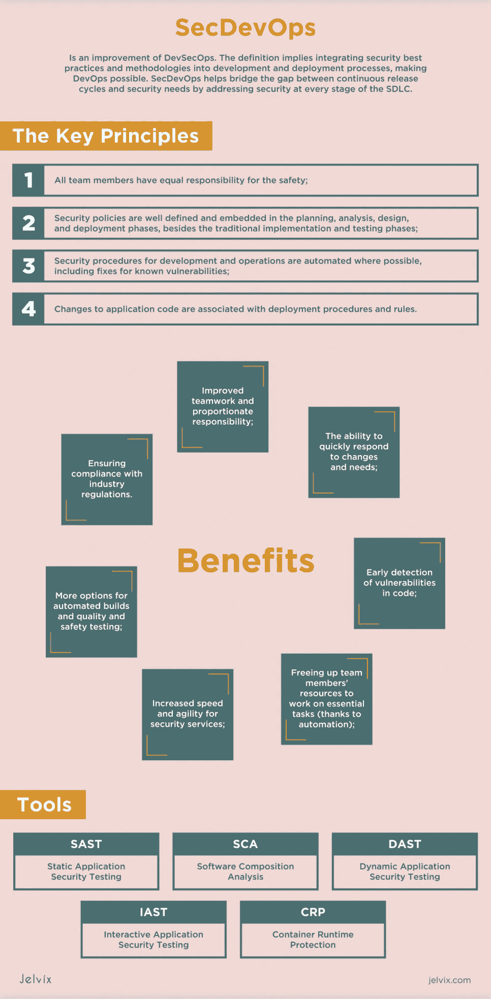

# 安全第一的时候

> 原文：<https://betterprogramming.pub/secdevops-when-the-safety-comes-first-c5dbd38e464d>

## 组织从实施 SecDevOps 中获得的技术和商业利益是巨大的


凯文·卡纳斯在 [Unsplash](https://unsplash.com?utm_source=medium&utm_medium=referral) 上的照片

如果你参与软件开发，你大概知道 DevOps 是什么。它的方法在开发者圈子里越来越受欢迎，所以难怪大多数大公司都在他们的工作流程中实现它。

因此，DevOps 专家和开发人员表示他们已经提高了软件部署的质量和速度，55%的人表示协作得到了改善，38%的人表示他们已经提高了代码质量，这一点您应该不会感到惊讶。

更重要的是，[木偶实验室](https://puppet.com/)报告了缺陷和崩溃的减少。

同时，超过 20%的被调查公司发现 DevOps 方法“非常困难”他们都称安全性是这种策略的瓶颈。针对这些担忧，SecDevOps 诞生了。

# SecDevOps 运动是如何开始的？

传统上，大型软件公司每隔几个月甚至几年就会发布新的应用程序。它为代码通过质量保证和安全测试提供了足够的时间——自治的专业团队负责这些过程。

然而，随着公共云的使用越来越多，许多流程已经使用新技术和工具实现了自动化，使公司能够更快地创新，并在竞争中保持领先地位。

在容器和微服务模型出现之后，单一的应用程序开始分解成更小的独立部分。这使得软件开发和部署的方式更加灵活。

尽管如此，大多数安全和合规性监控工具并没有显示出这样的进展。结果，他们中的大多数人无法像典型的 DevOps 环境所要求的那样快速地测试他们的代码。

实现 SecDevOps 是为了解决这个问题，并将安全测试完全集成到持续集成(CI)和持续交付(CD)管道中，同时开发开发团队内部进行测试和修补所需的知识和技能。

# 从敏捷到开发团队

经常有人问:DevSecOps 和敏捷有什么区别？但是我们认为没有必要将它们对立起来。每种方法都包含另一种方法的组件，因此它们必须共存，以便组织最大限度地利用业务机会。

然而，需要注意的是，您可以在任何环境中实现 DevSecOps 敏捷环境或其他环境。

*   敏捷的目标领域是软件开发，而 DevOps 的目标领域是创建端到端的业务解决方案和快速交付。
*   DevOps 是将开发和运营团队聚集在一起的实践，而敏捷是一种以协作、持续反馈和小规模快速发布为中心的迭代方法。
*   DevOps 需要一个相对较大的团队，而对于敏捷来说，一个小团队就足够了。
*   DevOps 集中于持续的测试和交付，而敏捷过程关注于持续的变化。
*   DevOps 利用左右移位原理；另一方面，敏捷使用左移原则。
*   DevOps 更侧重于操作和业务准备，而敏捷侧重于功能和非功能准备。

# 非字面意义上的 DevSecOps 与 SecDevOps

许多人认为这些术语可以互换，但它们的含义完全不同。

那么，什么是 DevSecOps？DevSecOps 管道的主要焦点是创建无缝和敏捷的软件开发过程。为了提高效率，所有小组在整个流程中进行合作。然而，在大多数情况下，DevSecOps 优先考虑开发和解决安全问题。

反过来，SecDevOps 管道将安全性转移到左边，首先消除了孤岛和瓶颈。这些团队紧密合作，以确保应用程序的可靠性，所有项目参与者都对最终产品的质量和安全负责。

自动化是流水线的一个重要方面，因为它有助于提高生产率。SecDevOps 模型需要尽可能多地自动化重复任务的工具。

除了自动化，管道还需要集成技术堆栈并提供集中接口的工具。SecDevOps 假定所有 DevOps 专业人员必须使用这些工具来有效地实现安全性。

但是，我们想指出的是，DevSecOps 和 SecDevOps 最常提及的是将安全性嵌入 SDLC 的每个阶段并考虑相同的好处的相同想法。

# 什么是 SecDevOps？

简单来说，SecDevOps 是对 DevSecOps 的改进。该定义意味着将安全最佳实践和方法集成到开发和部署流程中，使开发运维成为可能。SecDevOps 通过在 SDLC 的每个阶段解决安全性问题，帮助弥合连续发布周期和安全性需求之间的差距。

此外，这种方法是在应用程序发布到生产环境之前就进行连续的自动化安全测试。它提供了问题跟踪，以确保尽早发现任何缺陷。这种方法还预见了自动化和测试，以在整个 SDLC 中提供更有效的安全测试。SecDevOps 的主要原则是:

*   所有团队成员对安全负有同等责任；
*   除了传统的实施和测试阶段之外，安全策略在规划、分析、设计和部署阶段得到了很好的定义和嵌入；
*   开发和操作的安全程序尽可能自动化，包括修复已知的漏洞；
*   对应用程序代码的更改与部署过程和规则相关联。

SecDevOps 包含两个不同的部分:

1.  **代码安全(SaC)** 涉及将安全性构建到 DevOps 管道中的工具中。这意味着自动化手动过程，并使用静态分析工具，这些工具只检查代码的更改部分，而不是扫描整个代码库。
2.  **基础设施即代码(IaC)** 定义了一组 DevOps 工具，用于配置和更新基础设施组件，以提供安全可控的部署环境。IaC 使用相同的编码规则来管理操作的基础结构，消除了不一致性，并有助于降低常常掩盖安全问题的复杂性。

# SecDevOps 为您的组织带来的优势

DevSecOps 方法最重要和最明显的好处是提高了整体安全性。从商业角度来看，产品越安全，越容易销售。您可以在管道的早期发现漏洞，从而更容易修复它们。持续监控增强了您的威胁检测能力。

SecDevOps 定义了编码标准、静态和动态分析指南、测试指南、避免糟糕的加密、不安全的 API 等的规则。它还列出了需要安全团队手动干预的标准(例如，身份验证或授权模式的更改)。

由于安全性是开发过程的一部分，SecDevOps 团队变得更有经验，确保在管道的末端有最小的安全漏洞。但是，如果任何漏洞持续存在，可以快速调查、更新和改进流程。

根本原因分析还有助于团队改进安全策略和建议。换句话说，他们可以在每个周期后改善结果。此外，迭代增强在周期的后期提供了破坏性较小的升级。

SecDevOps 的一些更显著的优点是:

*   改进团队合作和相应的责任；
*   快速响应变化和需求的能力；
*   代码中漏洞的早期检测；
*   释放团队成员的资源来处理重要的任务(由于自动化)；
*   提高安全服务的速度和灵活性；
*   自动化构建和质量与安全测试的更多选择；
*   确保符合行业法规。

# 标准 SecDevOps 工作流程

由于开发人员在源代码控制中工作，他们可以跟踪软件开发项目中的任何变化。他们使用分支轻松地分割任务，在代码上进行协作。

所以，首先，代码被创建，系统中的变化被记录。然后对静态代码进行分析，以识别安全缺陷或错误。然后，标准的 SecDevOps 工作流如下进行。

IaC 工具创建一个环境来部署应用程序并将安全配置应用于系统。接下来，为新部署的应用程序执行测试自动化套件，包括后端、集成、API、安全性和用户界面测试。

然后，团队在测试环境中自动测试部署的应用程序。下一步是将应用程序部署到生产环境中，并持续监控生产环境中的活动安全威胁。


麦克斯韦·尼尔森在 T2 的照片

# DevSecOps 工具

安全性和合规性工具包可用于解决 SDLC 的各个方面。这包括软件组成分析(SCA)，静态代码分析(SAST)，以及各种测试代码漏洞的方法(IAST 和 DAST)。

此外，还有一些工具专门用于监视和保护生产环境中的二进制文件，使其免受利用您的代码或环境中的漏洞的攻击。理想情况下，团队应该努力使用这些工具来实现完整的 SDLC 安全性。

## SAST

这些工具有助于识别已经开发的代码中的漏洞。开发人员可以将它们作为开发过程的自动化部分，并在 DevOps 周期的早期检测和修复潜在的漏洞。静态分析工具的例子有[sonar cube](https://www.sonarqube.org/)和 [Veracode](https://www.veracode.com/) 。

## （同 sickle-cellanemia）镰状红细胞贫血

软件组合分析包括管理和监控开源组件中的许可证合规性和安全漏洞。

增强的 SCA 工具提供了防止二进制下载和构建失败、实施策略以及向其他系统发送通知的功能。SCA 工具发现的漏洞更容易修复，因为开发人员社区修复了 [97%](https://www.whitesourcesoftware.com/open-source-vulnerability-management-report/#chapter_1) ，您只需要进行更改或下载最新版本。

## DAST 和 IAST

动态和交互式应用程序安全测试工具测试正在运行的应用程序的开放接口的弱点和缺陷。DAST 将应用程序视为黑盒，而 IAST 则结合使用 DAST 和 SAST 来提高应用程序安全测试的准确性。IAST 工具的例子包括 [Synopsys](https://www.synopsys.com/) 、[对比安全](https://www.contrastsecurity.com/)和 [Checkmarx](https://checkmarx.com/) 。

## 容器运行时保护工具

这些工具在运行时跟踪容器，并提供各种功能，包括基于行为分析的异常检测、不同级别的防火墙等等。运行时保护的例子包括 [NeuVector](https://neuvector.com/) 、 [Twistlock](https://www.infoguard.ch/en/partners/twistlock-container-security) 和 [Rezilion](https://www.rezilion.com/) 。

# SecDevOps 在云安全中的作用是什么？

公共云迁移使组织能够访问 CSP 提供的创新工具和功能，如容器、微服务、DevOps 功能、CI/CD 和增强的无服务器架构。这有助于加快产品开发，包括设计、组装和产品发布，帮助公司显著缩短上市时间。

云可以通过自动化的内置安全流程和工具提高平台的完整性。但是不要把安全的责任完全推给云服务提供商。

应该使用 SecDevOps 最佳实践和模式在每个级别构建安全。在此过程中，应优先考虑确保身份验证和授权、保护机密性、维护数据完整性以及确保需要时的可用性。

它还要求对工作流程进行重大变革。例如，只需点击一个按钮，云、服务和应用程序就可以快速更新或更改，传统的安全解决方案将落后于这些快速部署。

您可以使用 DevSecOps 方法来调整流程和思维，使其更具动态性、协作性和迭代性，并在每个阶段持续关注安全性。

通过设计实现安全性是一个很好的解决方案，可以在早期将安全性构建到所有流程和产品中。这将提供更强大、更一致的保护，而不是依赖于事后添加安全补丁的系统。


布鲁克·卡吉尔在 [Unsplash](https://unsplash.com?utm_source=medium&utm_medium=referral) 上的照片

# SecDevOps 最佳实践

软件开发中的 SecDevOps 方法反映了公司的成熟。如果你正在开发一个初创公司的产品，你通常不需要这样的过程，因为它需要大量的人力和物力资源。但是对于一个有财务和 GR 风险的大公司来说，许多安全措施是非常合适的，可以在许多问题出现在生产环境之前解决它们。

该公司必须足够成熟，以添加到“DevOps”的缩写。在开发过程中，您不需要对安全性要求严格。但请记住，我们谈论的是不需要遵守外部监管机构要求的公司。对于其他方面，安全性取决于业务的具体情况。

虽然可能没有放之四海而皆准的方法，但有一些最佳实践可供任何希望实施 SecDevOps 的公司采用。

# 实践安全发展

SecDevOps 要求优先考虑安全性，经常鼓励开发人员采用安全的编程技术。然而，这并不意味着开发人员应该紧急学习先进的安全工具或成为安全专家。您可以将学习集成到流程中，以便开发人员在日常职责所需的级别上学习和应用安全实践。

红色和黑色部署还可以降低支持两个相同生产环境但只有一个运行的生产环境中的风险。这允许您在生产基础设施中测试新版本的代码，而不会影响事务、会话或用户交互。

# 确定安全策略

这些策略可以包括使用 DAST、SAST 或 SCA 时的编码最佳实践、加密规则和测试指南。Clarity 更好地理解了潜在的挑战和限制，并提高了应用程序的安全性。

此外，开发人员、测试人员和其他团队成员必须分担安全责任。这增强了团队成员之间的交流，改进了安全设计模式，并使安全响应策略更加动态。

# 对所有事情都使用版本控制

DevOps 环境中的所有应用软件、模式、图表和脚本都应该使用有效的版本控制工具和技术。版本控制具有许多安全优势，并允许命令:

*   调查并识别开发管道中引入的漏洞或恶意组件。
*   跟踪安全事件，直至特定的版本或功能。
*   维护开发活动的审计跟踪，以符合法规要求。

# 自动化重复性任务

大多数成熟的 DevSecOps 程序很早就经常使用自动化。例如，自动化安全检查有助于加速开发过程，并通过更容易地识别代码中的潜在漏洞来提高开发人员的生产率。对于开发人员一天多次运行不同代码版本的大型组织来说尤其如此。

# 应用威胁建模来确定差距

从攻击者的角度处理安全问题的团队更善于识别代码中的弱点。这就是灰尘进来的地方。扫描仪可以快速、轻松地集成到开发管道中，为您的应用程序增加另一层保护。

# 投资 SecDevOps 工具

如果您不确定如何使您的应用程序安全方法现代化，请考虑合适的 DevSecOps 工具，使您的团队能够在风险最高的关键早期开发阶段自动化安全和合并关键数据。


安妮·斯普拉特在 [Unsplash](https://unsplash.com?utm_source=medium&utm_medium=referral) 上的照片

# SecDevOps 问题及其解决方法

以下是采用 SecDevOps 的组织所面临的一些挑战，以及如何解决这些挑战。

***挑战 1:*** 缺乏安全天赋。这可能是优先考虑安全性的最重要的方面。大多数情况下，组织无法找到所需数量的安全专家。

**解决方案:** SecDevOps 敦促 [DevOps 工程师](https://jelvix.com/blog/devops-engineer)负责保护他们的代码和 IT 操作，以保护基础设施。SecDevOps 提供工具和技术来帮助开发人员和操作团队执行安全分析，检测安全问题，并改进您编程和管理软件的方式。

***挑战二:*** 抗拒改变。个别团队成员可能不喜欢与他们传统遵循的方式相反的激烈变化。

**解决方案:**让这些人参与开发创新的解决方案；开发人员可以开发自动化的解决方案，在不影响开发速度的情况下帮助解决安全问题。

***挑战三:*** 以持续发展和部署的名义忽视安全。

**解决方案:**创建自动化安全检查点，以确保达到质量目标，并在安全错误数量超过目标时停止输送机。

***挑战四:*** 信息安全团队与开发人员之间缺乏协调。

**解决方案:**将您的团队使用的 bug 跟踪工具与安全工具集成，这样开发人员可以将安全 bug 视为日常任务。

***挑战五:*** 复杂工具集成。大多数 DevOps 工具包来自不同的供应商，添加安全工具会使任务变得更加困难。

**解决方案:**找到一个能够解决您的安全问题的工具，将会使开发人员在个人层面和整个组织层面的工作变得更加轻松。

# 如何实现 SecDevOps

现在我们将列出任何 DevSecOps 实现中的一些基本步骤。请记住，根据项目的复杂性和规模，您的路线图可以包括一些特殊的附加步骤。

# 规划和发展

SecDevOps 之路，始于规划。但是，请记住，为了成功实施，计划必须是战略性的和简明的。专业人员还应该建立验收测试标准、用户设计和威胁模型。简单的基于性能的描述是不够的。

下一步是开发，团队应该从评估他们现有实践的成熟度开始。从多个来源收集资源来提供指导是一个好主意。创建一个代码审查系统也可以派上用场，因为它促进了一致性，这是 DevSecOps 的一个方面。

# 构建和测试

接下来是构建，自动化构建工具开始发挥作用。这些工具使用汇编脚本将源代码组合成机器码。构建自动化工具具有强大的特性。除了丰富的插件库，他们还提供了几个用户界面。有些还可以自动检测任何易受攻击的库，并用新的库替换它们。

下一步是测试，在测试中，健壮的测试自动化框架将严格的测试实践注入到管道中。


照片由 [Hannah Busing](https://unsplash.com/@hannahbusing?utm_source=medium&utm_medium=referral) 在 [Unsplash](https://unsplash.com?utm_source=medium&utm_medium=referral) 上拍摄

# 部署和操作

部署是使用 IaC 工具执行的，因为它们自动化并加速了软件交付。

运营也至关重要，定期维护是运营团队的常规特征。为了防止人为错误的发生，DevSecOps 可以使用 IaC 工具快速有效地保护组织的基础设施。

# 监控和缩放

强大的持续监控工具是该过程的另一个重要部分。它们确保您的安全系统正常工作。

缩放也是必要的。借助虚拟化，组织不再需要花费资源来维护大型数据中心。相反，他们可以扩展 IT 基础架构来管理任何威胁。



# 最后的话

组织从实施 SecDevOps 中获得的技术和商业利益是巨大的。从 SecDevOps 的角度来看，有了安全性作为基础，应用程序开发和其他过程变得更加安全和高效。

像谷歌或网飞这样的创新公司已经将安全性作为他们 DevOps 文化的必要组成部分。我们也在应用程序开发中使用 SecDevOps 原则，为我们的客户创造最好的产品。如果你想更聪明地工作，而不是更长时间，请联系我们。

```
**Want to Connect?**This post was originally published at [https://jelvix.com](https://jelvix.com/blog/what-is-secdevops).
```