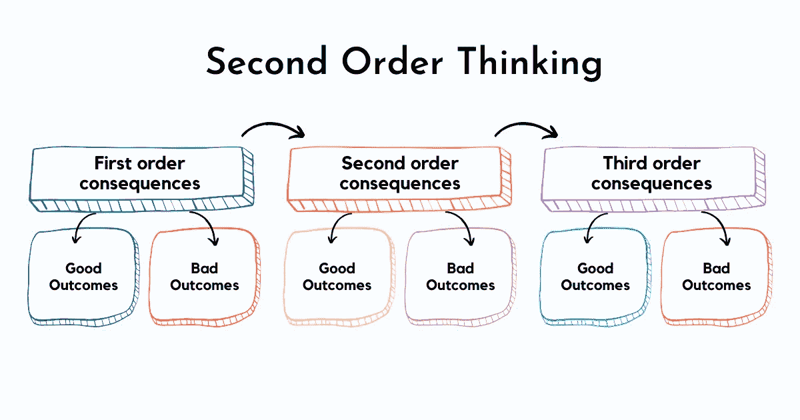
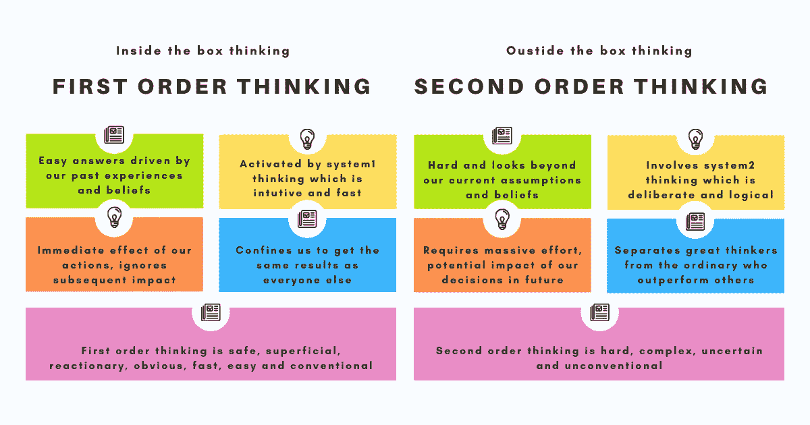
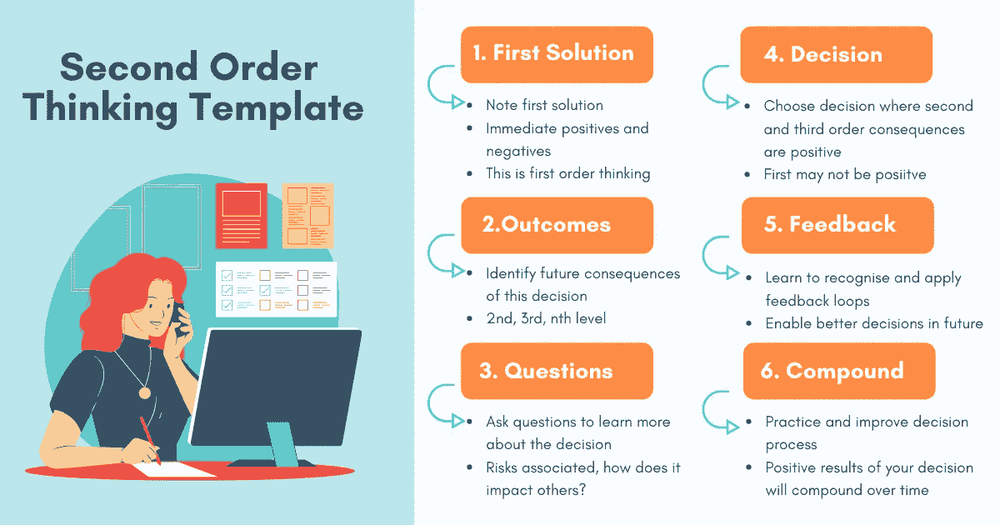

# 二阶思维

> 原文：<https://betterprogramming.pub/second-order-thinking-b28ab1115c35>

## 思考实践以做出更好的决策

图片来源:作者

在做决策时，我们以短期痛苦为代价优化长期收益的频率有多高？一个好的决策过程需要*二阶思维*——通过思考未来的后果来揭示我们决策的含义。它要求以避免意外和不可预见的结果的方式解决问题。

如果我们想超越我们所知道的去思考，运用发散的信息，形成新的联想和联系，二阶思维是必要的。

我们很容易屈服于好的结果，这些好的结果有我们容易看到的小优点，而忽略了这些决定在未来潜在的大缺点。我们的经验和信仰也限制了我们超越自然，通过提出困难的问题，探索未知的领域和怀疑看似显而易见的选择来寻求真理的能力。

在组织中，通过金钱奖励来鼓励高绩效和良好行为在短期内似乎是一个自然的选择。然而，大量研究表明，如果不了解你工作环境的动态，经过长时间的分析，金钱奖励实际上可能会适得其反，或者实际上不会增加人们的动力。在设计政策时，组织需要超越简单和明显的东西去思考不可见的东西。

# 什么是二阶思维？

我们呆在一个安全的盒子里，这个盒子对我们来说很容易接近，并指导我们做出许多决定。它融合了我们的环境和经历，让位于我们的思想和信仰。我们如何思考和决定很大程度上受到这个盒子的影响和约束。

作为一种[心智模式](https://www.techtello.com/category/mentalmodels)的二阶思维意味着走出我们的舒适区，跳出这个框框去思考。这需要分析我们的决策对未来的潜在影响。这需要问以下问题:

*   我如何做出对未来有积极影响的决策？
*   这个决定吸引人仅仅是因为它有直接的积极影响(一阶后果)吗？
*   这个决定的潜在负面影响是什么？他们以后会有什么影响？
*   我能看多远才能确定每一个随后的决定是如何创造了一个充满可能性的世界，还是限制了我能达到的结果？

二阶思维通过学习我们的决策的二阶后果并分析它们在不久的将来的影响，为决策提供了一个框架。超越第二层次的思维很难，但有些人通过在每个层次问同样的问题，学会了把思维拓展到第三层次甚至更高层次。

雷伊·达里奥在他的《原则》一书中对此描述得很好

> 未能考虑二阶和三阶后果是许多痛苦的糟糕决定的原因，当第一个次等选择证实了你自己的偏见时，这尤其致命。在你提出问题和探索之前，永远不要抓住第一个可行的选择，不管它看起来有多好

# 一阶思维和二阶思维的区别

图片来源:作者

在我们学习如何应用二阶思维去挖掘未知之前，先来了解一下一阶和二阶思维的区别。区分这两者很重要，以便有意识地从一阶思维转移到二阶思维。

## 一阶思维是“盒子里”的思维

一级思维寻找由我们过去的经验和信念驱动的简单答案。它更看重我们行动的即时效果，而忽略了后续影响。当我们寻求即时满足时，我们的一阶思维在起作用。

它被直观快速的“系统一思考”激活(来源:丹尼尔·卡内曼的《思考快慢》)。当我们需要毫不费力地快速做出决定时，这种思维方式非常有效。我们的许多日常决定都属于这一类——去办公室穿什么，去哪里见朋友吃饭，开车去上班时该穿什么。

一阶思维的传统本质限制了我们获得和其他人一样的结果。

总之，一阶思维是安全的、肤浅的、反动的、明显的、快速的、容易的、常规的，关注的是直接的影响。

## 二阶思维是“框外”思维

第二层次的思考很难，它超越了我们当前的假设和信念。挖掘我们的决策对未来的潜在影响需要付出巨大的努力。

考虑到我们决策的复杂性和不确定性，它涉及到“系统二思维”，这是深思熟虑的和合乎逻辑的。

超越直觉，通过运用二阶思维寻求非常规的解决方案，这是伟大的思想家与众不同的地方，他们超越他人，取得更大的成功。

总之，二阶思维是艰难、复杂、不确定和非传统的，渴望探索潜在的未来后果并使其利益最大化。

# 如何发展二阶思维:做出更好决策的模板

图片来源:作者

为了培养二阶思维技能，让我们通过创建一个模板来学习评估一阶效应的影响:

*   记下你想到的第一个解决方案，包括它的正面和负面。这是你的一阶思维。
*   然后问“这个决定的未来后果是什么？”评估第二、第三、第 n 级后果。对于每一个决定和水平，写下它相应的积极和消极的后果。
*   问问题，然后问更多的问题，从这些问题中学习:
*   这个决定会给我带来什么风险？
*   我的决定如何影响他人？
*   别人对我的决定怎么看？
*   为什么我觉得我的决定是对的？
*   我可以应用[奥卡姆剃刀](https://www.techtello.com/occams-razor/)来寻求更简单的解决方案吗？
*   选择二阶和三阶结果为正的决策，即使一阶可能不是正的(短期痛苦有利于长期收益)。
*   学会识别和运用反馈回路。它可能对你当前的决定没有帮助，但随着时间的推移，它会使你做出更好的决定。

一旦你采用了二阶思维心智模型，并开始在你的决策过程中应用它的模板，你会看到你努力的积极结果随着时间的推移而复合。

伟大的美国投资家和作家霍华德·马克斯分享了他对一阶和二阶思维的看法:

> 第一级和第二级思维之间的工作量差异显然是巨大的，而有能力进行第二级思维的人数与有能力进行第一级思维的人数相比是微不足道的。一级思考者寻找简单的公式和容易的答案。第二层次的思考者知道投资成功是简单的对立面

# 二阶思维的例子

通常情况下，我们的行为会产生意想不到的后果。让我们用几个例子来看看一阶思维如何限制，而二阶思维如何让位于更好的决策。

## 例子 1:管理或避免工作中的危机

当处理工作中的危机时，经理可以采用一阶或二阶思维。

**一级思维**:我以前做过。我比队里任何人都知道如何做得更好。现在让我接手并解决它。我的团队可以稍后学习。

**一级思维后果**:每次有问题，经理都需要干预，因为她从来不会帮助她的团队自己解决问题。她总是忙于处理危机，从来没有时间进行团队发展。团队感觉不到授权，团队中的人没有成长，这导致团队士气低落。

二阶思考:我过去也这样做过。我比队里任何人都知道如何做得更好。但是，如果我继续解决它，我的团队将永远不会站出来自己解决问题。这是我的团队学习如何管理和处理危机情况的绝佳机会。我会在整个过程中指导他们。

**二阶思维后果**:首先，团队可能会陷入困境，危机可能需要稍长时间才能解决。然而，在未来，他们将更有能力独立处理这些问题。这将为经理腾出时间来进行更有效的规划，减少此类危机情况的数量。团队也感到有动力和能力做得更多、更好。

在这个例子中，一阶思维具有短期利益和长期负面影响。二阶思维有短期的痛苦，但从长期来看有多重好处。作为管理者你会选择哪一个？

## 示例 2:现在招聘与未来招聘

在为一个长期空缺的职位做出招聘决定时，招聘经理可以运用一阶或二阶思维。

**一级思维**:我真的需要担任这个角色。如果我找不到人立即开始，许多项目将会被推迟。这个人似乎最适合当前的角色。她有一定的差距，可能会挑战我未来的需求。但是，到时候我们可以照顾他们。我们雇用她吧。

**一阶后果**:新员工能够启动项目。随着这些项目越来越复杂，她开始面临向员工提供方向和指导的挑战。这导致了沟通上的差距，缺乏清晰度，以及不良的协作，从而导致多个项目的延迟。随着建设性的争论变得具有破坏性，员工开始指责其他团队和职能部门错过了最后期限，没有取得成果，企业文化也受到了冲击。

**二阶思考**:我真的需要填补这个角色。如果我找不到人立即开始，许多项目将会被推迟。这个人似乎最适合当前的角色。但是，她有差距，这将是对这个职位的未来需求的挑战。我需要雇用能够满足我未来需求的人，而不仅仅是满足我当前需求的人。虽然接下来的几个月会很艰难，但正确的做法是继续寻找，直到我们找到合适的人。

二阶后果:项目进展缓慢。然而，在接下来的几周内，团队中的人会承担更多的责任。同时，招聘经理也能够带来一个有巨大潜力和素质的强有力的领导者，这将帮助你满足未来的需求。新领导通过强烈的清晰性、目的感和方向来凝聚团队，激励员工尽最大努力向前。在她的指导下，团队能够取得长足的进步，并取得丰硕的成果。

这是一个很好的例子，说明了为什么在组织中做出招聘决定以聘用合适的人才时，运用二阶思维是至关重要的。

在做出重要决策时，有意识地尝试运用二阶思维，可以为组织及其员工带来巨大优势。我希望能激发你以不同的方式思考，付出额外的努力去想象未来，并从中获益。

对于在工作和生活中应用这种心智模式，你有什么想法？

图片来源:作者

感谢阅读！我希望这对您的编码之旅有所帮助。