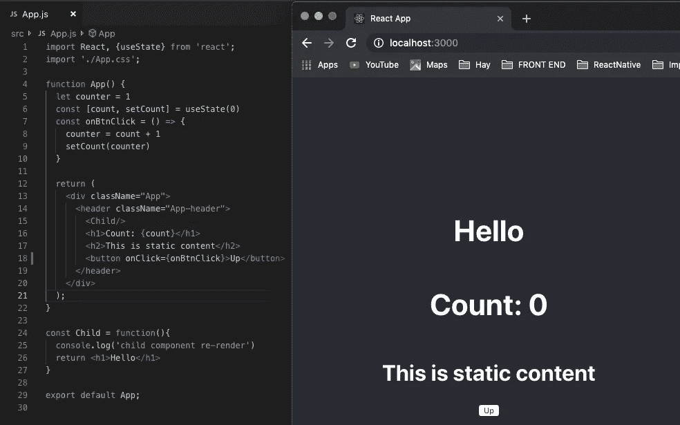
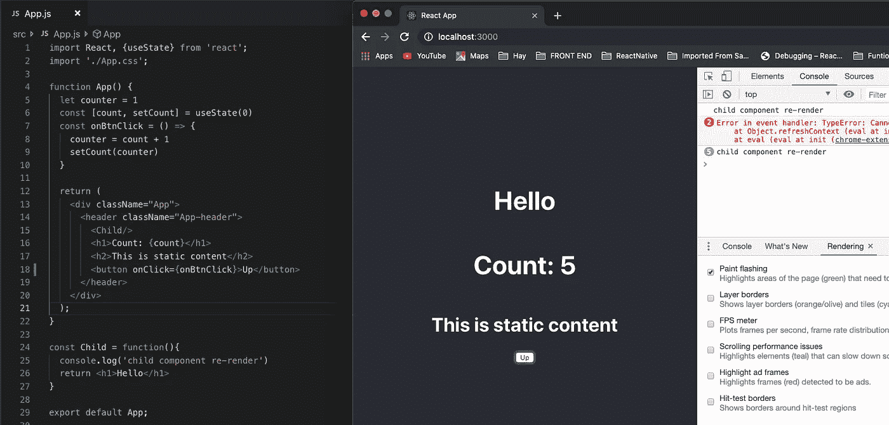
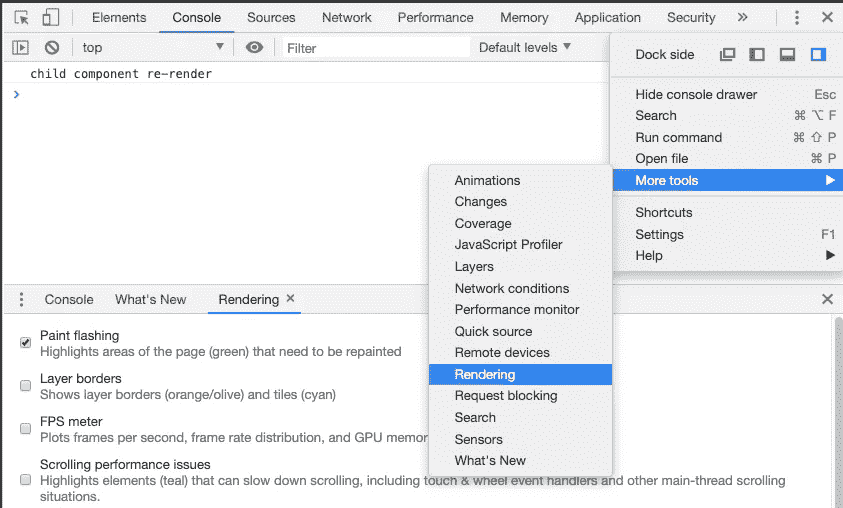
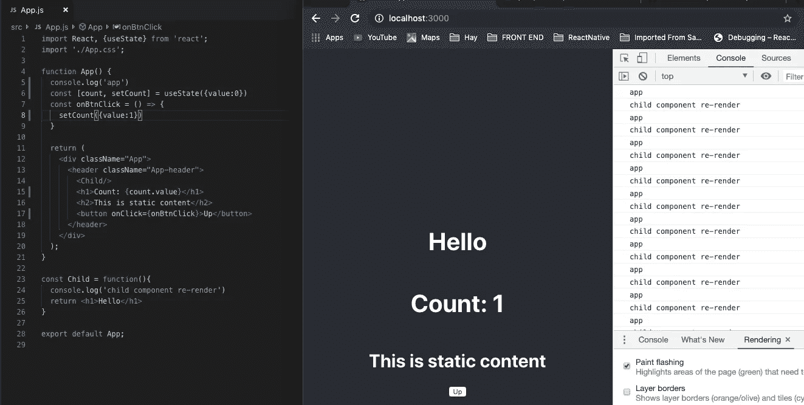

# React 渲染函数的秘密

> 原文：<https://betterprogramming.pub/secret-about-react-render-function-abefcd32f625>

## 区分调用渲染函数和实际的重新渲染

照片由[卡斯帕·卡米尔·鲁宾](https://unsplash.com/@casparrubin?utm_source=unsplash&utm_medium=referral&utm_content=creditCopyText)在 [Unsplash](https://unsplash.com/search/photos/react?utm_source=unsplash&utm_medium=referral&utm_content=creditCopyText) 上拍摄

我最近写了一篇关于 React-Redux 和 React Thunk 的文章，收到了很多反馈和问题。

大多数问题都是关于我的方法的性能。大家都说使用 [React](https://reactjs.org) context 会对其消费者造成不必要的重渲染。

我通过将`console.log`放在一个渲染函数上并观察它来创建一个简单的测试。我发现了一些有趣的东西——它实际上并不是重新渲染，它只是被称为渲染函数。

迷茫？让我们找出原因。

# 标准 React 组件将在每次其父组件重新渲染时调用渲染函数

让我们看看这个简单的例子。这是一个简单的计数器应用程序。每当用户点击“向上”按钮，计数器将增加 1，应用程序组件得到重新呈现。

所以问题是:“子组件也会被重新渲染吗？”

看，当我们点击五次向上按钮时，它已经记录了五次`child component re-render`,计数器增加到五。

那么，这是否意味着子组件被重新渲染了？

**否**，不重新渲染。它只是被调用了渲染函数，并没有真正的重新渲染。所以，我们需要区分“重新渲染”和“被调用函数渲染”。(在这种情况下，子组件是一个功能组件，所以呈现功能是它本身。)

当父组件被重新渲染时，普通组件将调用渲染函数。在这种情况下，app 组件被重新呈现，因为当我们单击 Up 按钮时，它的状态发生了变化，所以它导致子组件调用 render 函数。

当 render 函数被调用时，React 会重新计算该组件的虚拟 DOM，并将其与之前的虚拟 DOM 进行比较。

如果不同，React 实际上会在我们的浏览器中重新渲染真实的 DOM。如果没有，我们的浏览器没有任何变化。这是 React 快的主要原因。

我将向您展示如何测试真正的 DOM 是否被更新。

## 1.启用 Chrome 控制台中的渲染选项卡

## 2.运行您的应用程序并观察

每个被重新渲染的 DOM 节点将以绿色背景闪烁，如下所示:

正如您所看到的，在第一次加载时，整个 DOM 被重新渲染，因此背景绿色区域显示在整个页面上。

但是，当我们单击 Up 按钮时，即使控制台日志显示了五次，但是子组件(Hello text)没有重新呈现。

# 如果调用 setState，React 组件还会调用 Render 函数

如果调用了【The React 组件也会调用 render 函数，而不管 state 的值是否改变。

让我们来看看这个例子:

我们只将 count 对象的值设置为 1 并显示它。当计数值从 0 变为 1 时，您可能会认为`console.log`(‘app’)只调用一次。

然而，它实际上在我们每次点击向上按钮时都会调用。(参见控制台。)

事件多次调用 render 函数，但真正的 DOM 只更新了一次。

如上所述，您可以使用调试工具中的渲染选项自行测试。

# 结论

1.  渲染函数调用只会触发虚拟 DOM 的重新渲染，这并不意味着真实 DOM 会重新渲染。
2.  状态更改将触发渲染函数回调，无论其值是否更改。
3.  明智地选择优化您的组件。你不应该到处使用`PureComponent`,相反，更喜欢为列表组件优化，这些组件有繁重的 JS 计算。

我希望你喜欢这首曲子。感谢阅读！