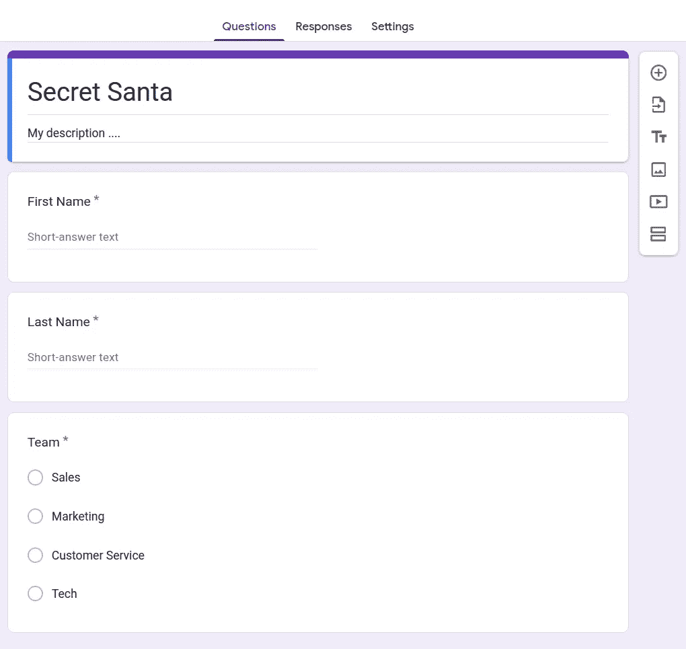
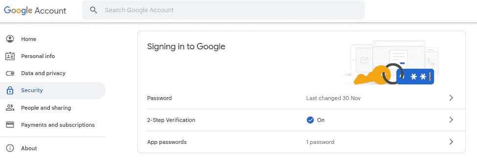

# 谷歌表单上的神秘圣诞老人🎅

> 原文：<https://betterprogramming.pub/secret-santa-from-a-google-form-32841566d984>

## 创建一个谷歌表单，解析其答案，计算出谁给了谁，并通过电子邮件通知秘密圣诞老人参与者。

由[梅尔·普尔](https://unsplash.com/es/@melpoole?utm_source=medium&utm_medium=referral)在 [Unsplash](https://unsplash.com?utm_source=medium&utm_medium=referral) 上拍摄

这篇文章是我去年的上一篇文章[的续篇，让我来帮你整理你最好的秘密圣诞老人](https://medium.com/@thom01.rouch/let-me-help-you-organize-your-best-secret-santa-ever-c0fef5e61ba2)。如果你还没有读过，我建议你这样做，以便更好地理解/欣赏这里的一个。

# 介绍

在我的上一篇文章中，我解释了如何在人与人之间生成礼物属性的连通图。这同时处理一个禁止分配的列表，即每个人都有一个他/她不应该向其送礼的人的名单。

在本文中，我想与您分享两项改进:

*   让人们填写谷歌表格，而不是自己写邮件地址
*   继续使用 Gmail 发送邮件，即使谷歌决定在 2022 年 5 月移除*“不太安全的应用程序访问”*选项。

# 谷歌表单

## 创建 Google 表单

这个表格的目的是收集想要参加秘密圣诞老人的人的名字和电子邮件地址。我们可以添加一个*团队*问题，禁止同组成员之间的礼物分配。

选项*“收集电子邮件地址”*允许您确保没有任何打字错误，并且邮件将成功到达其收件人。

*注意*如果你的公司使用 Gmail 给员工发邮件，而你正在组织一个秘密的圣诞老人，就有可能强迫员工在回复表格时使用他们公司的邮件。在这种情况下，电子邮件将被自动收集，而用户似乎必须手动填写。

## 解析 Google 表单

首先，我们可以通过点击*“下载回复(。CSV)*。

这里的技巧只是将结果按团队分组，然后用类`PlayerInfo`所需的字段重命名列(参见[我以前的文章](https://medium.com/@thom01.rouch/let-me-help-you-organize-your-best-secret-santa-ever-c0fef5e61ba2))。

最后，我们在每个团队内部应用排除规则，并转储相应的`PlayerInfo`列表。

# 电子邮件自动化

不幸的是，谷歌决定在 2022 年 5 月移除*“不太安全的应用访问”*选项。因此，我们不能再像上一篇文章中解释的那样使用`smtplib`从我们的 Gmail 帐户登录和发送电子邮件。

一种解决方法是启用两步验证，并在*“应用程序密码”*中生成访问令牌。它会给你一个 16 个字母的密码，由四个 4 个字母的令牌组成，当你用`smtplib`登录时，你必须使用它来代替你通常的密码。

我希望你喜欢读这篇文章，并且它给了你更多关于如何组织你自己的秘密圣诞老人的见解！

请随意使用我的秘密圣诞老人实现。它可以在 GitHub 资源库中找到:

 [## GitHub-ThomasParistech/secret _ Santa

### 让人们填写您的 Google 表单，下载 CSV 格式的结果，并使用以下命令解析它:python3…

github.com](https://github.com/ThomasParistech/secret_santa)