# 安全访问亚马逊 EKS 上的 Kubernetes 部署端点

> 原文：<https://betterprogramming.pub/secure-access-to-kubernetes-deployment-endpoints-on-amazon-eks-4826a8e87c6f>

## 如何为您在亚马逊 EKS 上的 Kubernetes 部署端点提供安全的 HTTPS 访问


图片由 Pixabay 提供

# 目录

```
[**Introduction**](https://medium.com/p/4826a8e87c6f#780d)[The idea](https://medium.com/p/4826a8e87c6f#3e6e)
[**Requirements**](https://medium.com/p/4826a8e87c6f#101e)
[**Setting Up an Ingress Controller**](https://medium.com/p/4826a8e87c6f#3ef1)
  [Installing ingress-nginx](https://medium.com/p/4826a8e87c6f#ba8c)
  [Setting an external IP](https://medium.com/p/4826a8e87c6f#8020)
[**Setting Up a Certificate Issuer**](https://medium.com/p/4826a8e87c6f#af7c)
  [Installing cert-manager](https://medium.com/p/4826a8e87c6f#6860)
  [Adding support for private VPCs](https://medium.com/p/4826a8e87c6f#d7d8)
  [Providing DNS access](https://medium.com/p/4826a8e87c6f#1671)
  [Deploying the certificate issuer](https://medium.com/p/4826a8e87c6f#66f9)
[**Setting Up Your Ingress**](https://medium.com/p/4826a8e87c6f#f651)
[**Summary**](https://medium.com/p/4826a8e87c6f#9cbd)
```

# 介绍

因此，您的所有负载都在最先进的 [Kubernetes](https://kubernetes.io/) 集群中运行，一切都比以往更加顺畅。

此外，由于一切都在 VPC 内，感觉安全问题已经解决了。这在某种程度上是正确的:如果一切都配置正确，就没有对集群资源的外部访问。

但是我们仍然需要保护内部交通。我们从不希望任何普通数据在传输中，尤其是当它涉及敏感的客户数据时。

在我以前的文章中，“[使用 Amazon EKS 将 Docker 映像转变为自动伸缩的 Kubernetes 部署](https://medium.com/better-programming/turn-your-own-docker-image-into-an-auto-scaling-kubernetes-deployment-using-amazon-eks-bd2ab8ef56cc)”和“[使用 Spot 实例在 Amazon EKS 上的自动伸缩 Kubernetes 部署中利用 Jenkins](https://itnext.io/utilize-jenkins-in-an-auto-scaling-kubernetes-deployment-on-amazon-eks-with-spot-instances-f9159df00aee)”，我演示了如何使用自定义 Docker 映像、Spot 实例等在自动伸缩的 EKS 环境中设置 Kubernetes 部署，但是我们没有讨论安全性。现在是时候投入进去了。

## 这个想法

如果你对 Kubernetes 稍有了解，你就会知道其中的几乎所有东西都是(或者可以是)动态的。您的部署可以由许多基于输入、负载等来来去去的单元组成。，并且手动跟踪安全端点，尤其是使用证书，可能是一场噩梦。有一些解决方案，比如在图像中嵌入证书，但是这些仍然很难管理。

幸运的是，Kubernetes 带来了另一个名为 *Ingress* 的概念，这将是我们解决方案的基石。

入口提供对 Kubernetes 集群端点的访问。可以将它想象成一个路由器，它接收外部流量并将其定向到集群服务:

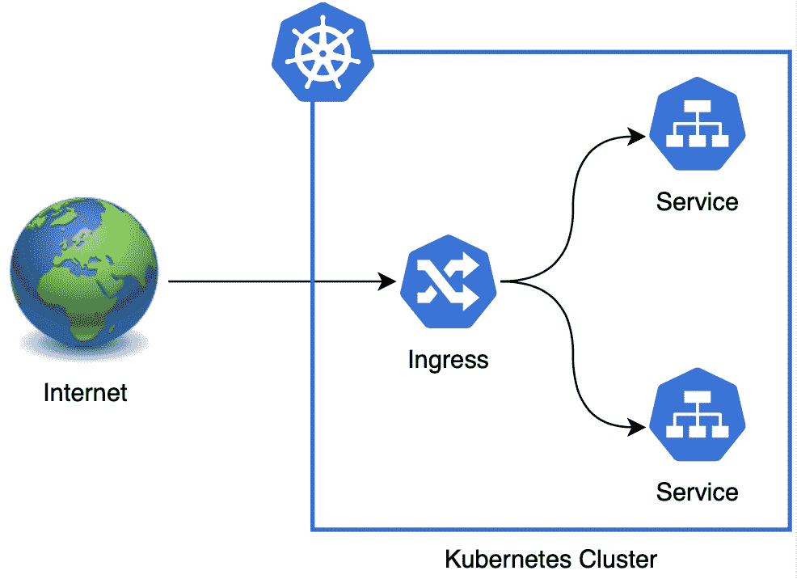

图片由作者提供

# 要求

本文假设您将 AWS 作为云提供商，并且您可以访问 EKS 和 ECR 管理控制台，以及 AWS CLI。

我还假设您已经安装并配置了`eksctl`和`kubectl`，并且在您的集群上有某种带有 web 端点的部署。

我再一次尝试对以前的知识做最少的假设，并尽我所能解释，但我确实假设对 Kubernetes 的概念有些熟悉。

最后，请注意，本文中所有的[代码片段和引用文件](https://gist.github.com/ohanetz/bf2c4ef9cc4fe47cb366de59cd37c53c)都可以在 GitHub 上获得。

# 设置入口控制器

在添加入口之前，我们将向 Kubernetes 集群添加几个组件。我们需要的第一个组件是入口控制器，它将管理我们集群的传入流量。

我们将使用 ingress-nginx，也称为 Kubernetes 的 nginx ingress 控制器，这是 Kubernetes 社区官方支持和维护的两个 Ingress 控制器之一(另一个是 ingress-gce)。

有关备选入口控制器的列表，请查看 Kubernetes 文档。

Kubernetes 的 nginx 入口控制器是一个简单的入口控制器，它基于 nginx web 服务器，并利用其反向代理和负载平衡器功能来处理流量。

## 安装 ingress-nginx

打开您的终端并运行以下命令:

```
kubectl apply -f [https://raw.githubusercontent.com/kubernetes/ingress-nginx/master/deploy/static/provider/aws/deploy.yaml](https://raw.githubusercontent.com/kubernetes/ingress-nginx/master/deploy/static/provider/aws/deploy.yaml)
```

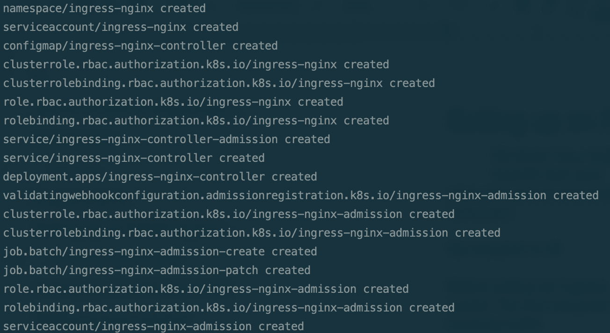

注意，这个命令将部署最新版本的 ingress-nginx。对于以前的版本或其他平台，检查[https://github.com/kubernetes/ingress-nginx](https://github.com/kubernetes/ingress-nginx)。有关 ingress-nginx 的更多信息，请查看项目主页[https://kubernetes.github.io/ingress-nginx/](https://kubernetes.github.io/ingress-nginx/)。

## 设置外部 IP

接下来我们需要为`ingress-nginx-controller`服务设置一个外部访问点，我们将使用它来管理对集群的访问。

如果你读过我以前的 Kubernetes 文章，你已经知道当你在私人 VPC 上使用 EKS 时，你的服务不会自动分配一个外部 IP。

我已经在我的文章“使用亚马逊 EKS 将您的 Docker 映像转变为自动伸缩的 Kubernetes 部署”中描述了一种通过注释您的服务来解决这个问题的方法另一种解决方案是在服务规范中手动设置负载平衡器外部 IP。

运行以下命令找到您的`ingress-nginx-controller`服务外部 IP(如果您不知道):

```
kubectl describe service ingress-nginx-controller -n ingress-nginx | grep Endpoints | awk -F'[ :]+' 'NR==1{print $2}'
```

运行以下命令来编辑您的`ingress-nginx-controller`服务:

```
kubectl edit svc/ingress-nginx-controller -n ingress-nginx
```

将下列行添加到规范部分的末尾(请参见下面的示例):

```
externalIPs:
- YOUR_EXTERNAL_IP
```

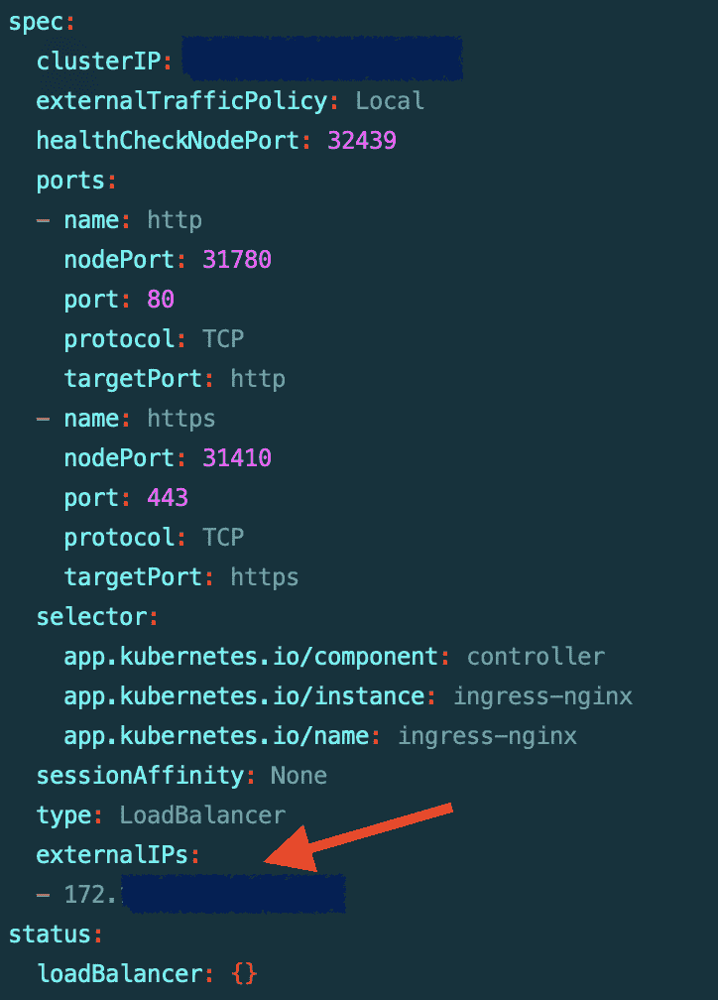

完成编辑后保存文件。

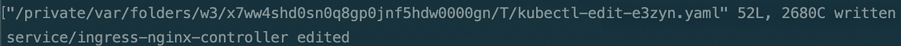

# 设置证书颁发者

我们需要的下一个组件是一个证书发行者，它将管理我们集群的端点证书，以确保安全访问。

我们将使用 cert-manager，这是一个 Kubernetes 证书管理控制器，它可以自动发布和更新来自各个提供商的证书。

在本文中，我们将建立一个自动更新的加密证书(查看[让我们加密](https://letsencrypt.org/)了解更多细节)。

## 正在安装证书管理器

打开您的终端并运行以下命令:

```
kubectl apply --validate=false -f [https://github.com/jetstack/cert-manager/releases/download/v0.14.2/cert-manager.yaml](https://github.com/jetstack/cert-manager/releases/download/v0.14.2/cert-manager.yaml)
```

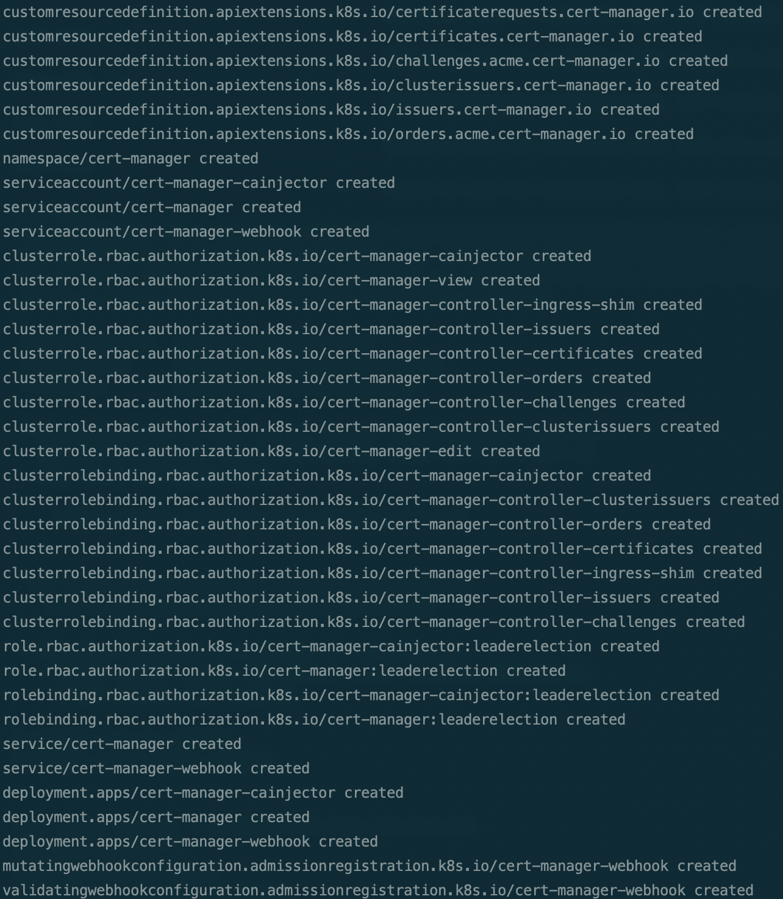

该命令将为 Kubernetes 引擎版本 1.15 及更高版本部署最新版本的 cert-manager。

注意，`--validate=false`标志只有在运行 Kubernetes 1.15.4 或更早版本时才需要，否则会导致良性的验证错误。

有关不同的 Kubernetes 引擎版本和安装过程的其他信息，请查看证书管理器 Kubernetes 安装指南:[https://cert-manager.io/docs/installation/kubernetes/](https://cert-manager.io/docs/installation/kubernetes/)。

有关 cert-manager 的更多信息，请查看项目主页 [https://cert-manager.io](https://cert-manager.io/) 。

## 添加对私有 VPC 的支持

如果您使用的是私有 VPC,“让我们加密”将使用您的私有 DNS 名称服务器，通过 ACME 质询来尝试验证您的 DNS 所有权。但是，由于无法从互联网访问这些名称服务器，验证将会失败。

我们需要给 cert-manager 添加一个标志，以便使用公共 DNS 名称服务器(比如谷歌的 8.8.8.8)来验证您的 DNS。

运行以下命令编辑证书管理器部署:

```
kubectl edit deployments.apps/cert-manager -n cert-manager
```

将以下行添加到 cert-manager args 部分:

```
- --dns01-recursive-nameservers="8.8.8.8:53"
- --dns01-recursive-nameservers-only
```

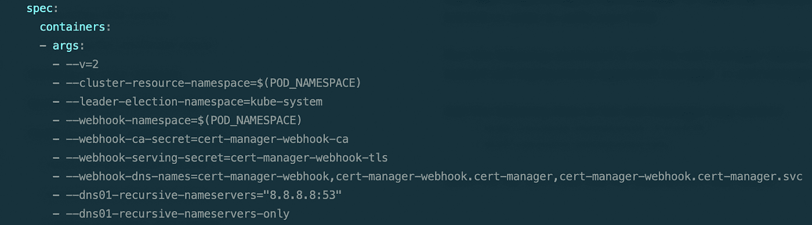

保存文件，注意部署已被编辑:

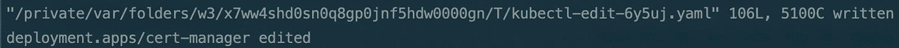

## 提供 DNS 访问

我们将使用 Let's Encrypt 来颁发我们的证书。Let's Encrypt 是一个提供免费证书的证书颁发机构(CA)。证书的有效期很短，但可以轻松更新(cert-manager 会自动为您更新)。

为了给一个域颁发证书，CA 必须确认您拥有该域。让我们加密使用 ACME 挑战来进行验证。在这种方法中，CA 为您提供一个唯一的文本密钥来存储在您的域中，然后尝试访问您的域并读取该密钥来验证所有权。

在我们的例子中，cert-manager 使用一个名为*证书发行者*的实体来为我们处理这个过程。但是，我们需要为证书颁发者提供对我们的 DNS 服务器的访问，以便自动将密钥放在那里进行质询。

我们将假设您使用 AWS Route 53 作为您的 DNS 提供者，并演示如何为证书颁发者提供访问它的权限。

请注意，如果您使用不同的 DNS 提供商，您仍然可以使用 Route 53 来公开管理您的域的特定子域。

最后，如果您使用 Route 53 作为您的私有 VPC 的私有 DNS，您需要为相同的子域创建一个额外的公共 DNS 托管区域，这只是为了 ACME challenges 的目的。

在这两种情况下，为您的子域创建一个公共托管区域，并在您的外部 DNS 提供商中设置名称服务器。

在 53 号公路上设置好公共托管区域后，复制托管区域 ID。

接下来，我们需要创建一个策略来提供对该托管区域的访问。

在 AWS 管理控制台中打开 IAM。在访问管理下选择策略并点击‘创建策略’按钮。

选择 JSON 选项卡并粘贴以下文本(在[要点](https://gist.github.com/ohanetz/bf2c4ef9cc4fe47cb366de59cd37c53c#file-aws-iam-route53-policy-json)中也有):

```
{
  "Version": "2012–10–17",
  "Statement": [
    {
      "Effect": "Allow",
      "Action": "route53:GetChange",
      "Resource": "arn:aws:route53:::change/*"
    },
    {
      "Effect": "Allow",
      "Action": [
        "route53:ChangeResourceRecordSets",
        "route53:ListResourceRecordSets"
      ],
      "Resource": "arn:aws:route53:::hostedzone/YOUR_HOSTED_ZONE_ID"
    }
  ]
}
```

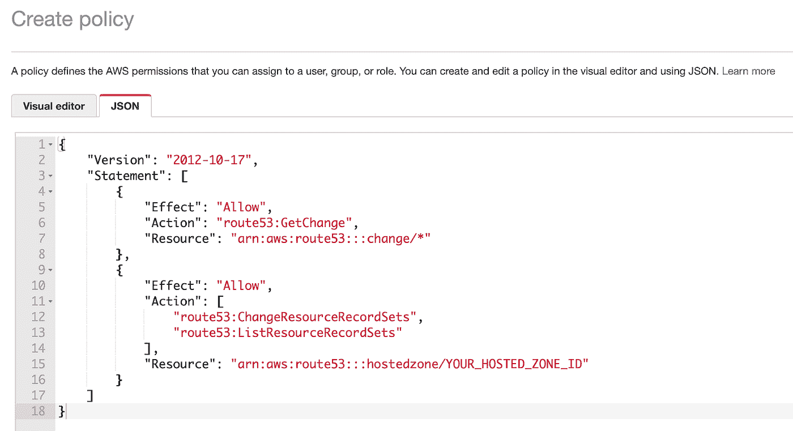

确保将 `YOUR_HOSTED_ZONE_ID`占位符替换为您从 Route 53 复制的托管区域 ID。

单击“查看策略”，键入名称，然后单击“创建策略”完成。

接下来，我们需要创建一个用户并附加这个策略。

仍然在 IAM 中，在访问管理下选择用户并点击“创建用户”按钮。

键入名称，并为“访问类型”选择“编程访问”

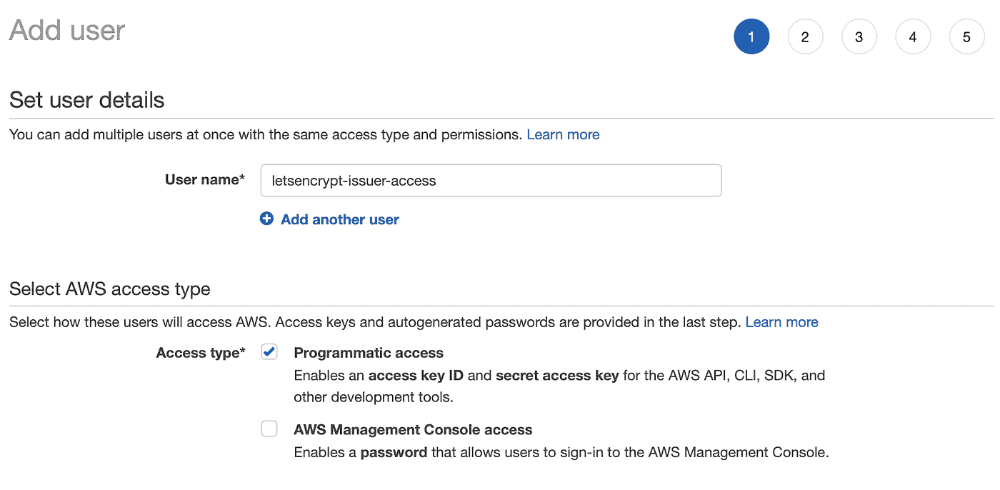

点击【下一步:权限】按钮。选择“直接附加现有策略”并选择您刚刚创建的策略。

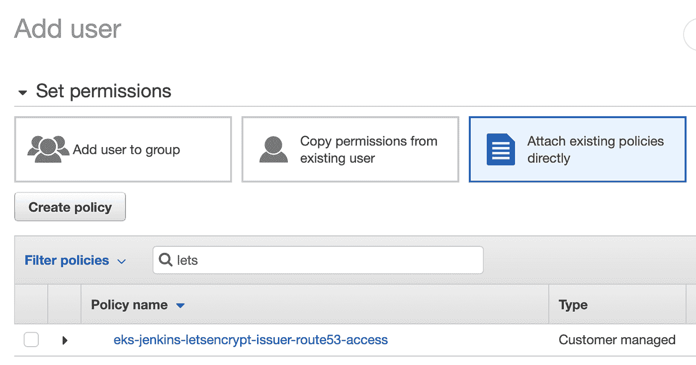

继续单击“下一步”,最后单击“创建用户”按钮。

在下一个屏幕上，您将获得用户访问密钥 ID 和秘密访问密钥。把它们放在手边——我们接下来会用到它们。请注意，AWS 不会再向您显示秘密访问密钥，但是如果您丢失了它，您可以很容易地生成一个新的密钥。

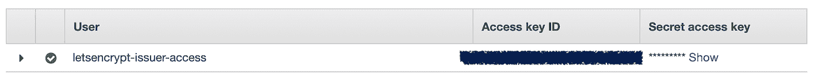

## 部署证书颁发者

现在，我们需要部署一个证书颁发者，它将连接到 Let's Encrypt 来为我们颁发证书。

发行者将使用我们刚刚创建的用户自动将 ACME 挑战放入 Route 53 并验证我们的域所有权。

因此，我们首先需要在 Kubernetes 中存储一个秘密实体来保存 AWS 访问凭证。

从要点中获取`[letsencrypt-issuer-secret.yaml](https://gist.github.com/ohanetz/bf2c4ef9cc4fe47cb366de59cd37c53c#file-letsencrypt-issuer-secret-yaml)`示例文件。Secret 实体包含一个键-值记录，其中键是 AWS 用户名，值是用户的秘密访问键。将占位符替换为您刚刚在 IAM 中创建的用户名，该值是您之前保存的秘密访问密钥，以 base64 编码。

为了用 base64 编码您的密钥，请打开您的终端并运行以下命令:

```
python3 -c "import base64;print(base64.b64encode(b'YOUR_SECRET_ACCESS_KEY_HERE').decode())"
```

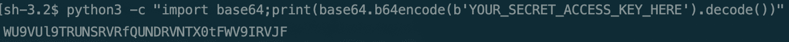

运行以下命令来部署您的机密:

```
kubectl apply -f letsencrypt-issuer-secret.yaml
```

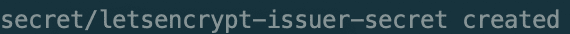

最后，我们需要部署证书颁发者本身。

从要点中获取`[letsencrypt-issuer.yaml](https://gist.github.com/ohanetz/bf2c4ef9cc4fe47cb366de59cd37c53c#file-letsencrypt-issuer-yaml)`示例文件。替换您的域名(您希望为其创建一个安全子域)、您的 AWS 区域、您刚刚在 IAM 中创建的用户名以及您之前复制的那个用户的访问密钥 ID 的占位符(请注意，这不是我们之前使用的秘密访问密钥)。

运行以下命令部署证书颁发者:

```
kubectl apply -f letsencrypt-issuer.yaml
```

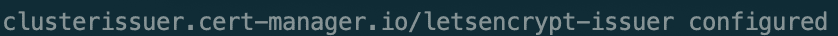

有关使用 AWS Route 53 创建 cert-manager 证书颁发者的更多详细信息，请查看 cert-manager 文档中的[一文。](https://cert-manager.io/docs/configuration/acme/dns01/route53/)

# 设置您的入口

我们要做的最后一步是创建入口实体，它将为您的端点提供实际的安全访问。

从要点中获取`[my-ingress.yaml](https://gist.github.com/ohanetz/bf2c4ef9cc4fe47cb366de59cd37c53c#file-my-ingress-yaml)`示例文件。该文件将创建一个入口实体，该实体将自动为您的主机颁发证书，并将该主机的传入请求定向到您的 Kubernetes 端点服务。

入口配置文件中有两个规范部分:一个为您的主机设置证书，另一个为您的服务设置请求路由。

在两个位置替换主机 URL 的占位符(一个用于 TLS 证书设置，一个用于路由规则)，以及 Kubernetes 端点服务名称和端口的占位符。

运行以下命令来部署入口:

```
kubectl apply -f my-ingress.yaml
```

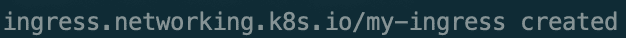

运行以下命令检查您的证书状态:

```
kubectl describe certificate my-ingress-tls
```

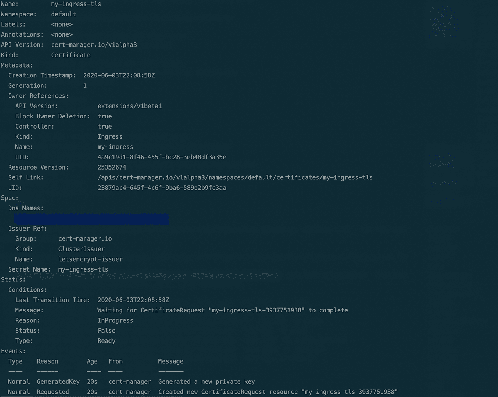

请注意，证书申请正在进行中。等待几分钟，让 cert-manager 颁发您的证书，然后再次检查状态:

```
kubectl describe certificate my-ingress-tls
```

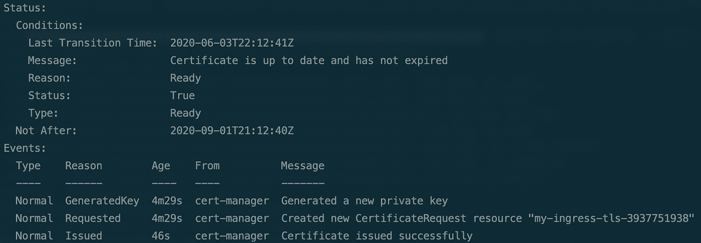

最后，您的证书准备好了，您可以通过您提供的主机 URL 访问您的服务，并安全地路由到您的 Kubernetes 端点。

# 摘要

即使在您的私有网络中，您的 web 端点仍然是您的云架构中最脆弱的部分。无论您的设计有多可靠，您的 Kubernetes 实体得到了多好的保护，您都必须确保您的数据管道在每个端点以及端点之间的任何地方都是安全的。

在本文中，我展示了如何使用 Kubernetes Ingress 概念，并将其与流行的开源组件和 AWS 功能相结合，以提供一个简单但强大且安全的解决方案。

通过这个基本用例，我试图向您介绍概念和功能，我相信根据您的特定需求进行调整会相对容易。

要了解更多关于 EKS 及其功能的信息，请访问 https://docs.aws.amazon.com/eks/index.html 的 EKS AWS 文档。

你还应该参考亚马逊提供的这个 EKS 在线研讨会，它也可以帮助你入门，并向你介绍 https://eksworkshop.com/[的所有 EKS 特色。](https://eksworkshop.com/)