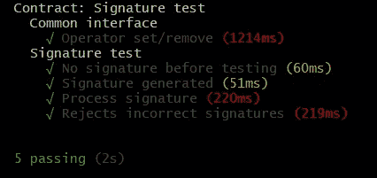

# 使用 ECDSA 签名保护和测试合同

> 原文：<https://betterprogramming.pub/secure-and-test-the-contract-with-ecdsa-signature-3ff368a479a6>

## 签署和验证消息—为您的合同增加更多安全级别

[斯科特·格雷厄姆](https://unsplash.com/@homajob?utm_source=medium&utm_medium=referral)在 [Unsplash](https://unsplash.com?utm_source=medium&utm_medium=referral) 上拍照

欢迎来到我的**区块链无处不在**系列的另一个作品。这是我分享我在软件开发和区块链技术领域五年经验的地方。如果您错过了它—检查之前连接到 [DeFi 协议集成](/how-to-integrate-the-curve-fi-protocol-into-your-defi-protocol-e1d4c43f716d)和 [ERC20 令牌的高级测试](/how-to-integrate-the-curve-fi-protocol-into-your-defi-protocol-e1d4c43f716d)的部件。此外，今天我们将再次讨论可靠性合同测试，但现在是从安全性和验证的角度。

区块链项目的主要目标之一是验证数据。对于实例，您可以查看数字身份和在线文档存储和检查。事实上，这些情况中的任何一种都需要动作/交易发起者验证来确认个人或实体。例如，如果一个人拥有数字形式的身份证件，确保所有权就变得至关重要。因此，这是数据可验证性问题的一个很好的例子。让我们回顾一下解决方案的最简单形式——数字签名，它的测试是智能合约开发过程中的关键点之一。

# 我们在谈论什么

方法很简单:

1)系统通过众所周知的规则生成消息
2)签名者获取消息并添加一组特定的符号——数字签名，通过私钥从消息构造的代码
3)生成的签名现在被发送到合同，在合同中被分解以检索签名者的地址。

Solidity 为您提供了用于签名生成和进一步分解的 ECDSA 算法。我们不需要深入算法本身(您可以在适当的资源中找到必要的信息[)。我们需要知道的是，ECDSA 是非对称加密的一个例子，其中第一个用户用他们的私钥创建一个签名，第二个用户应用一个标准算法来检索签名者的公钥。因此，它可以验证签名的来源。相反，让我们把重点放在实践部分——签名的使用和测试。](https://en.wikipedia.org/wiki/Elliptic_Curve_Digital_Signature_Algorithm)

首先，我们需要认清一个问题。例如，契约需要执行某个操作，比如说，存储调用者的地址。尽管只有在调用者被验证的情况下，契约才应该执行存储，但是我们需要确保没有人能够在没有许可的情况下使用他们的地址。为了检索真实的调用者，我们需要生成一些消息，对其进行签名，并在契约中对其进行分解。

你可以在 Solidity 文档中找到[的标准解(例如 0 . 8 . 4](https://docs.soliditylang.org/en/v0.8.4/solidity-by-example.html?highlight=ecrecover#the-full-contract)——本文目前最新的稳定版本中的[)。文档为我们提供了契约，它需要以下内置功能:消息生成、签名分割和检索签名者的汇编代码。这个例子展示了所有必要的方法，并且非常简单，尽管它有两个缺点:它缺乏通用性，并且没有解决方案测试的好例子。这就是为什么我提供我的代码版本和(实际目标)——合同的测试策略。](https://docs.soliditylang.org/en/v0.8.4/index.html)

# 深入研究代码

当然，你可以使用[标准的 OpenZeppelin 库](https://github.com/OpenZeppelin/openzeppelin-contracts/blob/master/contracts/utils/cryptography/ECDSA.sol)进行 ECDSA 操作，但是你将再次面临同样的问题——缺乏灵活性和测试方法。所以，让我们深入我的基于签名的逻辑的例子。你可以在我的 GitHub 中找到完整的[工作示例，但是我想完整展示的地方很少。](https://github.com/Midvel/medium_blockchain_notes/tree/main/test-notes/sig-test)

首先，我们将准备消息。如您所见，它由两个打包和散列的钱包地址组成:

第二段重要的代码是将消息与标准以太坊消息散列在一起:

它显示消息是在以太网内发送的，长度为 32 字节，不是一个随机数。在前面的操作之后，我们得到了长度为 32 字节的散列。以这种形式拥有额外的散列函数是必要的，我们将在稍后讨论其原因。

其他代码片段相当标准。分割签名的功能如下:

下面是检索签名者的函数:

对于外部接口，我们将使用自定义函数，该函数接收签名和必要的参数，检查用户是否已经注册，形成消息，并验证签名:

# 准备测试

首先，我们将模仿需要签名的消息。我们将使用 **ethers.js** 库，这是(与 **web3** 一起)使用最多、最方便的库。因为它是一个开源库，你可以自由探索[的代码和文档](https://docs.ethers.io/v5/)。此外，该库为我们提供了构建以下消息的完美接口:

两个 **web3** 和 **ethers** 库的缺点之一是它们没有本地 Ganache 环境的所有功能，因为两个库都旨在与完整的 Ethererum 节点一起工作。然而，有一种使用 [web3 账户功能](https://web3js.readthedocs.io/en/v1.2.11/web3-eth-accounts.html#sign)进行本地测试的方法。尽管您需要创建一个额外的帐户，它将实现 singer 功能并提供到当前 web3 提供商的连接:

现在，我们已经生成并签名了消息。但是，这不是一切；还剩下几件事要谈。两个库(web3 和 ethers)都在签名创建之前提供了额外的消息散列。此外，该消息不仅经过哈希处理，还与我们之前看到的标准以太坊消息相结合:

这就是我们在合同中加入附加方法的原因。因此，如果您想使用自定义消息，请跳过额外的散列等。，您需要创建签名功能的自定义版本。我们已经在上面讨论了原因——两个标准库都实现了签署消息的典型方法，这只能通过覆盖功能来改变。

作为最后一步，让我们运行测试并检查它是否正常工作:

对加纳切进行测试

我们已经测试了签名生成、消息生成、签名批准和拒绝。所以这是一套非常完整的验证功能测试。

我发现区块链世界非常迷人。每天，我都在这个领域里寻找更多令人兴奋的东西。如果你和我一样对区块链发展感兴趣，就等着看区块链的下一期吧。

和往常一样，您可以在我的 GitHub 上找到一个完整的工作示例:

 [## 中级/中等 _ 区块链 _ 笔记

### 这是测试基于签名的功能的一个例子。您可以在[关于…的适当文章]中找到更多信息

github.com](https://github.com/Midvel/medium_blockchain_notes/tree/main/test-notes/sig-test) 

确保你不要错过我的**区块链无处不在**系列的最后一部分:

 [## 让我们来谈谈智能合同单元测试

### 用几行代码向您的智能合约添加一个完整的测试套件

better 编程. pub](/lets-talk-about-smart-contract-unit-testing-1317a2d2365a)