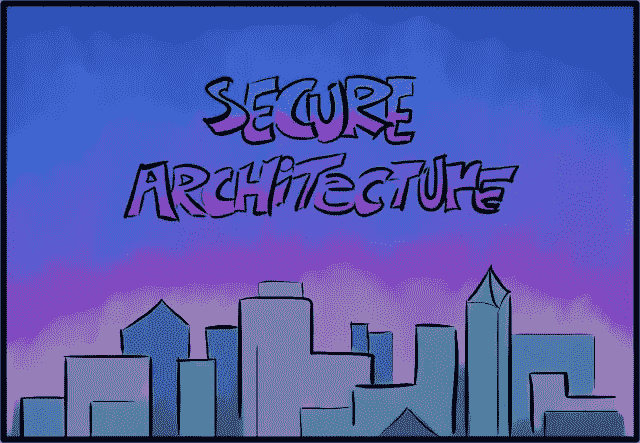
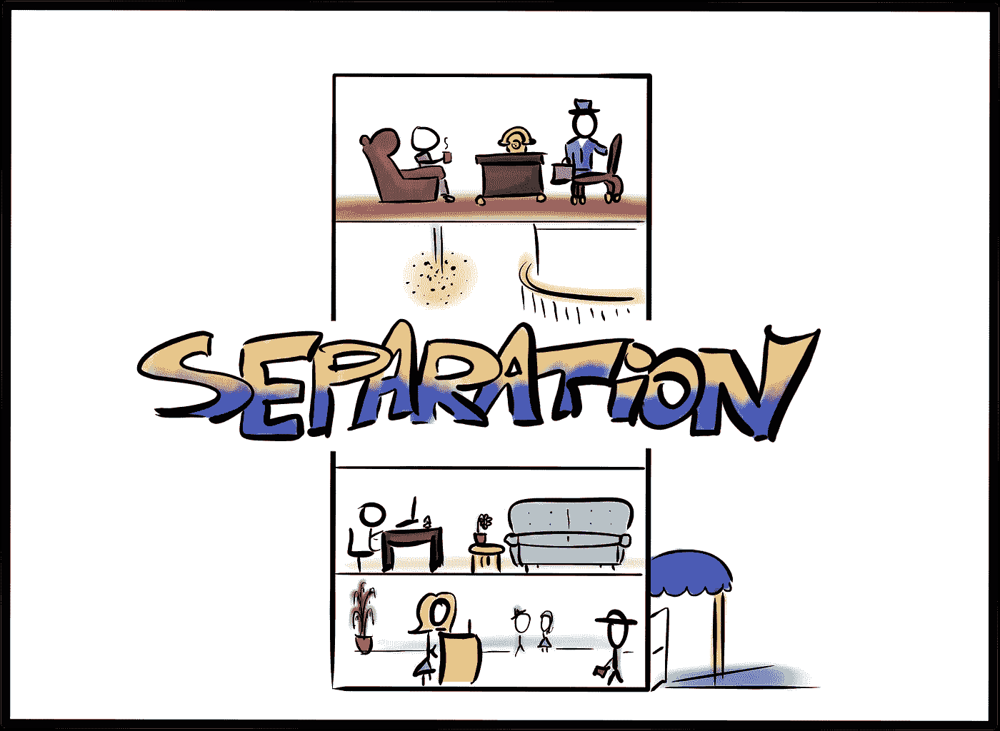
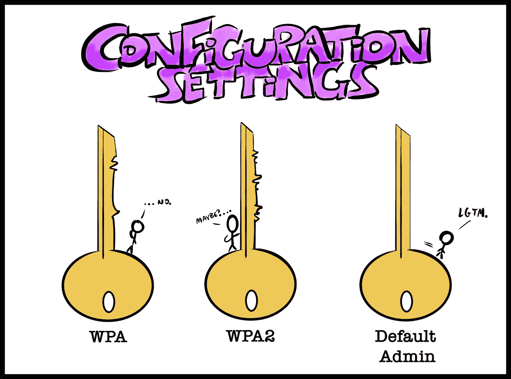
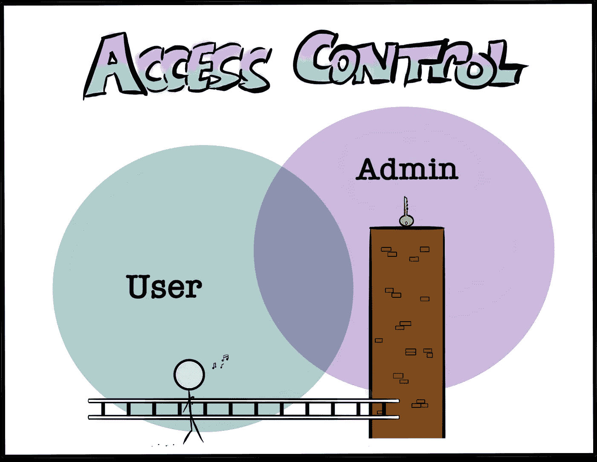

# 安全应用程序架构基础:分离、配置和访问

> 原文：<https://betterprogramming.pub/secure-application-architecture-basics-separation-configuration-and-access-505a45d7c547>

## 为忙碌的开发人员构建安全应用程序架构的起点



如今，软件开发人员被鼓励专注于构建，这是一件很棒的事情。我们受益于创客文化、一种“永远发货”的态度、开源协作以及一系列帮助我们以最高效率进行优先排序和执行的应用程序。我们处在一个不断创造的环境中，团队和个体企业家都可以最大限度地发挥生产力。

有时，这种极快的生产率显示出它的缺点。

随着我对安全最佳实践的了解越来越多，我不禁看到越来越多的应用程序毫无头绪。缺乏安全意识似乎会导致那些不直接支持产品发布的任务优先级的缺失。市场似乎已经使得推出一个可用的产品比一个安全的产品更重要。普遍的态度似乎是“我们可以以后再做安全工作。”

拼凑一个基于权宜之计而非长久之计的基础不是构建应用程序的好方法，也是构建安全债务的好方法。安全债务和技术债务一样，是通过做出(通常是草率的)决策而积累起来的，这些决策会使以后保护应用程序变得更加困难。

如果你熟悉“向左推”的概念(或者如果你读过我的关于敏感数据暴露的[文章](https://victoria.dev/blog/hackers-are-googling-your-plain-text-passwords-preventing-sensitive-data-exposure/)，你就会知道，谈到安全，有时没有一个版本的“后来”不是*太晚*。这是一个遗憾，特别是因为在开发过程的早期遵循一些具有高收益的基本安全实践并不比*不*遵循它们花费更多的时间。通常，它归结为拥有一些基本但重要的知识，使您能够做出更安全的决定。

虽然应用程序架构千差万别，但一些基本原则可以通用。本文将提供一些领域的高级概述，我希望这些领域能帮助开发人员找到正确的方向。

我们称之为应用程序“体系结构”肯定是有原因的，我认为这是因为软件的体系结构在某些基本方面类似于建筑的体系结构。(或者至少，以我绝对零的建筑创作专业知识，我是如何想象一个非常实用的建筑的。)下面是我如何总结构建安全应用程序架构的三个基本点:

1.  分离存储
2.  定制配置
3.  受控访问和用户范围

这只是一个起点，意在让我们有一个良好的开端。一个完全实现的应用程序的安全状态的完整描述包括本文范围之外的领域，包括身份验证、日志记录和监控、集成，有时还包括法规遵从性。

# 1.分离存储

从安全的角度来看，分离的概念指的是将用于不同目的的文件存储在不同的位置。当我们建造我们的建筑并决定所有房间的走向时，我们同样在底层创建大厅，并将行政办公室放在较高的楼层，可能在主要路径之外。虽然两者都是房间，但我们知道它们有不同的用途，有不同的功能需求，可能有非常不同的安全要求。



对于我们的文件，如果我们考虑一个简单的文件结构，这种好处可能最容易理解:

```
application/
├───html/
│ └───index.html
├───assets/
│ ├───images/
│ │ ├───rainbows.jpg
│ │ └───unicorns.jpg
│ └───style.css
└───super-secret-configurations/
└───master-keys.txt
```

在我们的简化示例中，假设我们应用程序的所有图像都存储在`application/assets/images/`目录中。当我们的某个用户创建了一个个人资料并将他们的图片上传到该个人资料中时，该图片也会存储在该文件夹中。有道理，对吧？这是一个图像，这就是图像去的地方。有什么问题？

如果您熟悉在终端中导航文件结构，您可能以前见过这个语法:`../../`。这两个点是“向上一个目录”的简便表达方式如果我们在上面的简单文件结构的`images/`目录中执行命令`cd ../../`，我们将进入`assets/`，然后再次进入根目录`application/`。这是一个问题，因为有一个被称为[路径遍历](https://cwe.mitre.org/data/definitions/22.html)的小漏洞。

虽然点语法为我们节省了一些输入，但它也引入了一个有趣的优点，即实际上不需要知道父目录的名称就可以访问它。考虑一个攻击有效负载脚本，它被传递到我们不安全的应用程序的`images/`文件夹中，使用`cd ../`进入一个目录，然后重复发送它发现的所有内容给攻击者。最终，它会到达根应用程序目录并访问`super-secret-configurations/`文件夹。不太好。

虽然其他措施当然应该到位，以防止路径遍历和相关的用户上传漏洞，最简单的预防措施是存储分离。核心应用程序文件和资产不应与其他数据结合，尤其不应与[用户输入](https://victoria.dev/blog/sql-injection-and-xss-what-white-hat-hackers-know-about-trusting-user-input/)结合。最好将用户上传的文件和活动日志(可能包含有趣的数据，容易受到注入攻击)与主应用程序分开。

可以通过几种方式实现分离，例如使用不同的服务器、不同的实例、不同的 IP 范围或不同的域。

# 2.定制配置

当谈到快速开发时，在定制上花费时间在某些场景中可能是不可取的，但是我们肯定想要定制的一个领域是配置设置。[安全错误配置](https://github.com/OWASP/Top10/blob/cb5f8967bba106e14a350761ac4f93b8aec7f8fa/2017/en/0xa6-security-misconfiguration.md)被列入 OWASP 十大安全事件，因为大量安全事故的发生是因为服务器、防火墙或管理帐户在生产环境中使用默认设置运行。在我们的新大楼开业时，我们希望更加小心，以确保我们没有把任何钥匙留在锁里。



通常，与默认设置相关的攻击的受害者并不是特定的目标。相反，它们是通过自动扫描工具发现的，攻击者可以在许多可能的目标上运行，有效地刺激许多不同的系统，以查看是否有任何滚动，并暴露一些有用的利用。这种攻击的自动化性质意味着我们必须检查架构的每一部分的设置。即使一个单独的部分看起来不重要，它也可能提供一个漏洞，使得攻击者可以将它作为我们更大的应用程序的入口。

特别是，检查无人值守区域的架构组件，例如:

*   默认帐户，尤其是带有默认密码的帐户，仍在使用中；
*   示例网页、教程应用程序或留在应用程序中的示例数据；
*   保留不必要的服务端口，或对互联网开放的端口；
*   不受限制的允许的 HTTP 方法；
*   存储在自动日志中的敏感信息；
*   托管服务中默认配置的权限；而且，
*   默认情况下，目录列表或敏感文件类型仍可访问。

此列表并不详尽，具体的架构组件，如云存储或 web 服务器，将具有其他可以配置的功能，因此应该进行审查。一般来说，当涉及到架构组件时，我们可以通过成为极简主义者来减少应用程序的攻击面。如果我们使用更少的组件或不安装我们并不真正需要的模块，我们将有更少的可能攻击入口点来配置和保护。

# 3.受控访问和用户范围

在应用程序中测试更困难的安全问题之一是不正确配置的访问控制。自动化测试工具在发现一个用户不应该访问的应用程序区域方面能力有限。因此，这通常留给手工测试或源代码审查来发现。通过在软件开发生命周期的早期做出架构决策时考虑这个漏洞，我们降低了它成为以后更难修复的问题的风险。毕竟，我们不会简单地把万能钥匙放在高高的窗台上够不着的地方，希望没有人拿着梯子过来。



[被破坏的访问控制](https://github.com/OWASP/Top10/blob/master/2017/en/0xa5-broken-access-control.md)被列在 OWASP 前 10 名中，它对其各种形式进行了更详细的描述。举个简单的例子，考虑一个有两个访问级别的应用程序:管理员和用户。我们可以为我们的应用程序构建一个特性，比如控制或禁止用户的能力，目的是只允许管理员使用它。如果我们意识到访问控制配置错误或被利用的可能性，我们可能会决定在一个与用户可访问空间完全分离的区域中构建审核功能，例如在不同的域中，或者作为用户不共享的模型的一部分。这极大地降低了访问控制错误配置或特权提升漏洞可能允许用户稍后不正确地访问调节功能的风险。

当然，我们的应用程序中的健壮访问控制需要进一步的支持才能有效。因此，我们应该考虑一些因素，比如作为 URL 参数传递的敏感令牌或密钥，或者控件是否安全失败。然而，通过在架构阶段考虑授权，我们可以使我们自己更容易实现进一步的增强。

# 最大收益的安全基础

类似于通过选择经过严格审查的框架来避免累积技术债务，开发人员可以通过了解常见的漏洞以及我们可以做出的有助于减轻这些漏洞的简单架构决策来避免安全债务。关于如何从一开始就将安全性融入我们的应用程序的更详细的资源，OWASP 应用程序安全性验证标准是一个可靠的指南。