# 使用 Amazon Cognito 和 AWS Lambda 保护 AWS API 网关

> 原文：<https://betterprogramming.pub/secure-aws-api-gateway-with-amazon-cognito-and-aws-lambda-535e7c9ffea1>

## 如何使用 Amazon Cognito 用户池和 Python AWS Lambda 后端来保护 AWS API 网关端点


马克-克里斯蒂安·基里克-卡尔弗在 [Unsplash](https://unsplash.com/s/photos/jacuzzi?utm_source=unsplash&utm_medium=referral&utm_content=creditCopyText) 上的照片

## 目录

*   [简介 ](https://medium.com/p/535e7c9ffea1#0b2c)
*   【OAuth 2.0 简介
*   [**要求**](https://medium.com/p/535e7c9ffea1#6350)
*   [**创建亚马逊认知用户池**](https://medium.com/p/535e7c9ffea1#5f13)
*   [创建用户池](https://medium.com/p/535e7c9ffea1#d16e)
*   [添加用户](https://medium.com/p/535e7c9ffea1#7a10)
*   [创建应用客户端](https://medium.com/p/535e7c9ffea1#8948)
*   [配置应用客户端身份提供者](https://medium.com/p/535e7c9ffea1#a93d)
*   [添加用户—续。](https://medium.com/p/535e7c9ffea1#1834)
*   [使用内置表单注册用户](https://medium.com/p/535e7c9ffea1#7e37)
*   [**设置授权端点**](https://medium.com/p/535e7c9ffea1#1976)
*   [创建授权λ函数](https://medium.com/p/535e7c9ffea1#0933)
*   [编写功能代码](https://medium.com/p/535e7c9ffea1#c197)
*   [授予 Cognito 访问功能的权限](https://medium.com/p/535e7c9ffea1#c861)
*   [测试功能](https://medium.com/p/535e7c9ffea1#809f)
*   [创建授权端点](https://medium.com/p/535e7c9ffea1#a60f)
*   [**设置 AWS API 网关授权**](https://medium.com/p/535e7c9ffea1#b483)
*   [创建授权人](https://medium.com/p/535e7c9ffea1#3caa)
*   [设置我们的端点授权](https://medium.com/p/535e7c9ffea1#cdeb)
*   [**测试安全 API 网关**](https://medium.com/p/535e7c9ffea1#bf2b)
*   [测试授权端点](https://medium.com/p/535e7c9ffea1#7123)
*   [测试安全端点](https://medium.com/p/535e7c9ffea1#00b3)
*   [**汇总**](https://medium.com/p/535e7c9ffea1#eaa6)

# 介绍

作为处理敏感数据的几个组织的一部分，安全性一直是我在设计架构时要记住的事情，不管有多复杂。

当涉及到与我们的云环境交互的面向互联网的终端时，安全性成为首要问题。

在我的[上一篇文章](https://medium.com/swlh/upload-binary-files-to-s3-using-aws-api-gateway-with-aws-lambda-2b4ba8c70b8e?)中，我展示了带有 Python AWS Lambda 后端的 AWS API 网关端点的基本实现。但是我没有展示的一件重要的事情是如何保护端点。

AWS API Gateway 内置了与 Amazon Cognito 的集成，后者是一种管理用户池和安全访问 AWS 服务的服务。这种内置的集成使得为您的终端增加安全性变得相对容易。

## OAuth 2.0 简介

Amazon Cognito 使用 OAuth 2.0 协议来授权对安全资源的访问。

OAuth 2.0 使用访问令牌来授权对资源的访问。

访问令牌只是一个字符串，它存储了关于所授予权限的信息。该令牌通常在很短的时间内有效，通常长达一小时，并且可以使用密码或特殊的刷新令牌进行刷新。

刷新令牌通常使用密码认证来获得。它的有效期更长，有时是无限期的，它的全部目的是生成新的访问令牌。刷新令牌可用于生成无限数量的访问令牌，直到其过期或被手动禁用。

在 Amazon Cognito 中，访问令牌被称为 ID 令牌，它的有效期为 60 分钟。刷新令牌作为用户池应用程序客户端的一部分获得(稍后将详细介绍)，有效期最长可达 10 年。

# 要求

本指南仅假设您将 AWS 作为云提供商，并且您有权访问 Cognito、API Gateway 和 Lambda 管理控制台。

我还假设您已经设置了某种 AWS API 网关端点。我的[上一篇文章](https://medium.com/swlh/upload-binary-files-to-s3-using-aws-api-gateway-with-aws-lambda-2b4ba8c70b8e?)可以带你建立这样一个端点。

解决方案是使用用 Python 编写的 AWS Lambda 函数，但是对于 AWS Lambda 支持的其他语言，类似的解决方案也是可能的。

# 创建 Amazon Cognito 用户池

我们将首先创建 Amazon Cognito 用户池来管理我们的用户——以及身份验证方法、注册流程和许多其他安全特性。

## 创建用户池

打开 AWS 管理控制台，从服务菜单中选择“Cognito”在 Cognito 主屏幕中，选择“管理用户池”，然后在下一个屏幕中，单击“创建用户池”为您的用户池键入一个名称，然后选择“查看默认值”

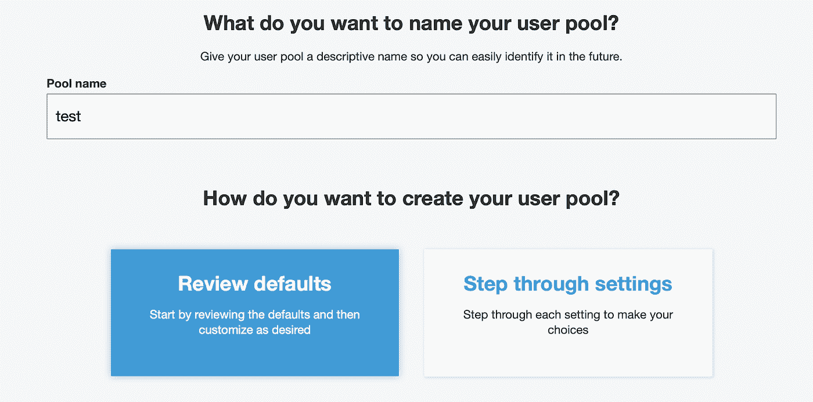

这将使用默认属性和安全设置来设置用户池。在下一个屏幕中，您将能够查看和更改默认设置。现在让一切保持原样。我们稍后将更改其中的一些默认值。点击“创建池”完成。

有关用户池设置的更多信息，请查看开发者指南[此处](https://docs.aws.amazon.com/cognito/latest/developerguide/cognito-user-identity-pools.html)。

## 添加用户

创建池后，您将被重定向到用户池管理屏幕。现在，我们可以将第一个用户添加到我们的池中。

在“常规设置”部分，选择“用户和组”，然后点击“创建用户”在下一个屏幕中，键入用户名，然后单击“创建用户”

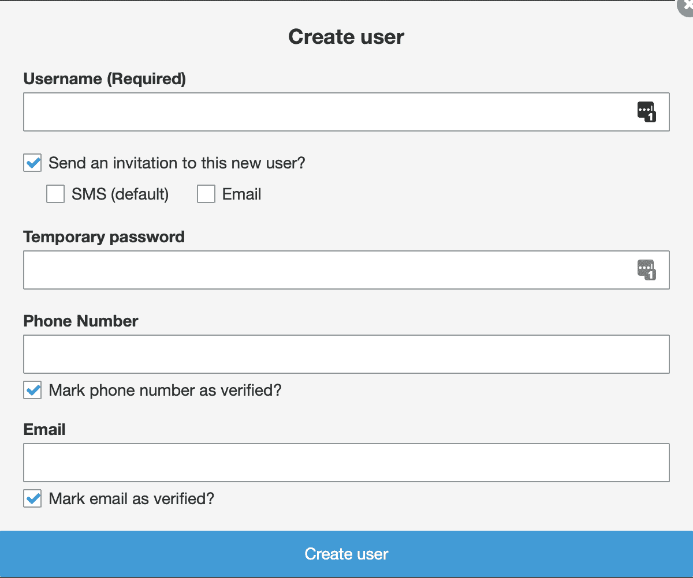

您还可以向新用户发送邀请(并相应地定义电话号码和电子邮件地址)，并为用户定义临时密码(否则，将自动生成临时密码并通过电子邮件/SMS 提供)。

创建用户后，帐户状态会自动设置为 FORCE_CHANGE_PASSWORD。用户必须登录并设置永久密码才能确认其帐户。为此，我们需要设置一个应用程序客户端。

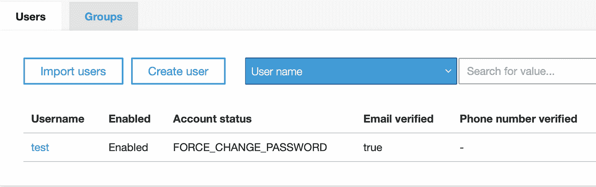

## 创建应用程序客户端

应用程序客户端充当用户池的授权端点。它还为用户提供了注册、登录和管理其帐户的能力。

在“用户池管理”屏幕中，在“常规设置”部分选择“应用客户端”，然后单击“添加应用客户端”

键入名称，并确保选中“生成客户端密码”和“为基于服务器的身份验证启用登录 API(ADMIN _ NO _ SRP _ AUTH)”(客户端密码和登录 API 是我们创建身份验证 Lambda 函数所必需的)。

您还可以修改刷新令牌过期时间(默认为 30 天，但最多可设置为 10 年)。点击“创建应用客户端”完成。

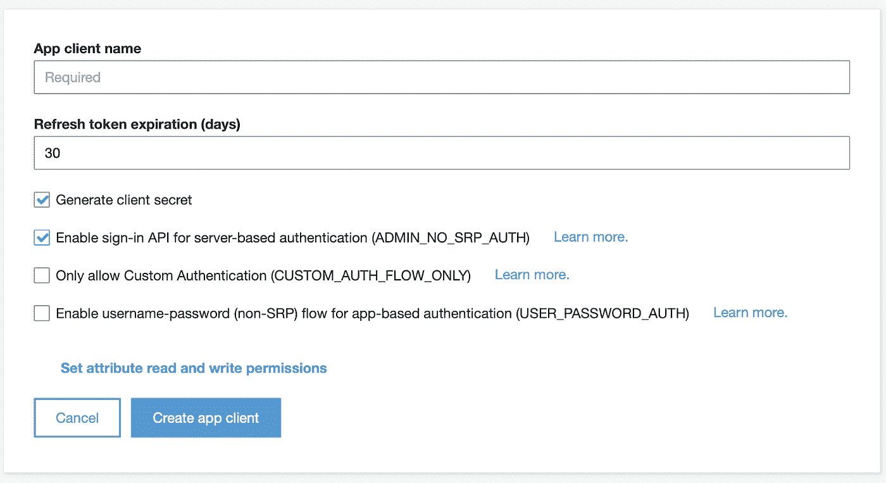

您还可以在此定义应用程序客户端可以访问哪些用户属性(默认设置为全部)。

## 配置应用程序客户端身份提供者

接下来，我们需要配置将用于对我们的用户进行身份验证的身份提供者。

我们将使用一个简单的配置，允许 Cognito 用户池本身对用户进行身份验证。或者，我们可以使用第三方提供商来完成这项工作(更多信息，请查看开发者指南[这里](https://docs.aws.amazon.com/cognito/latest/developerguide/cognito-user-pools-identity-federation.html)))。

首先，我们需要一个域来公开注册和登录我们的应用程序客户端。在用户池管理屏幕中，在应用程序集成部分选择“域名”。

键入一个子域名称，然后单击“保存更改”为此，您也可以配置自己的域。

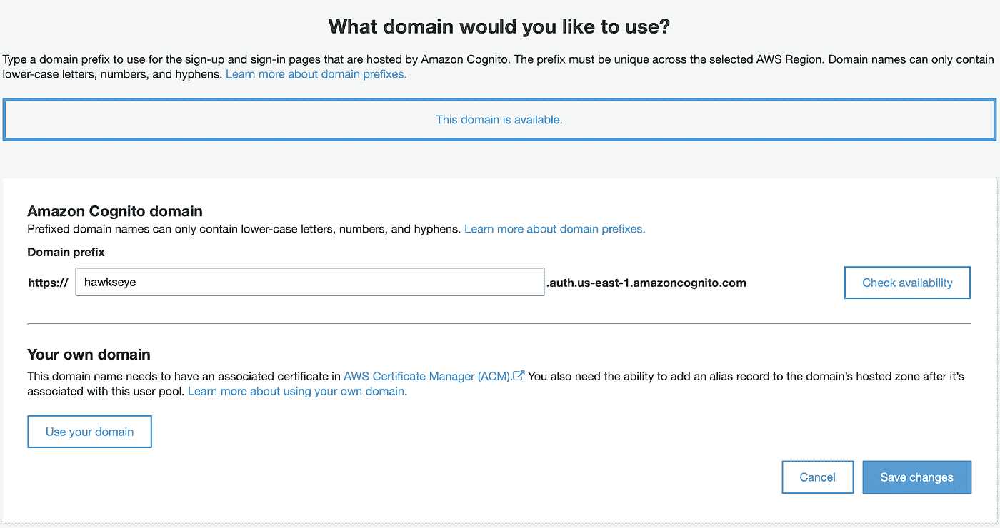

现在，在用户池管理屏幕中，在应用程序集成部分选择“应用程序客户端设置”。

选择“Cognito 用户池”身份提供者以启用它。

在回拨 URL 部分中，键入您希望用于从登录/注册页面重定向用户的 URL。

选择“授权码授予”和“隐式授予”OAuth 流程。

在允许的 OAuth 范围下选择“openid”。

这将允许我们创建一个 AWS API 网关端点，为用户提供身份令牌，并允许我们的用户使用内置的 Cognito 接口登录和注册。

完成后，单击“保存更改”。

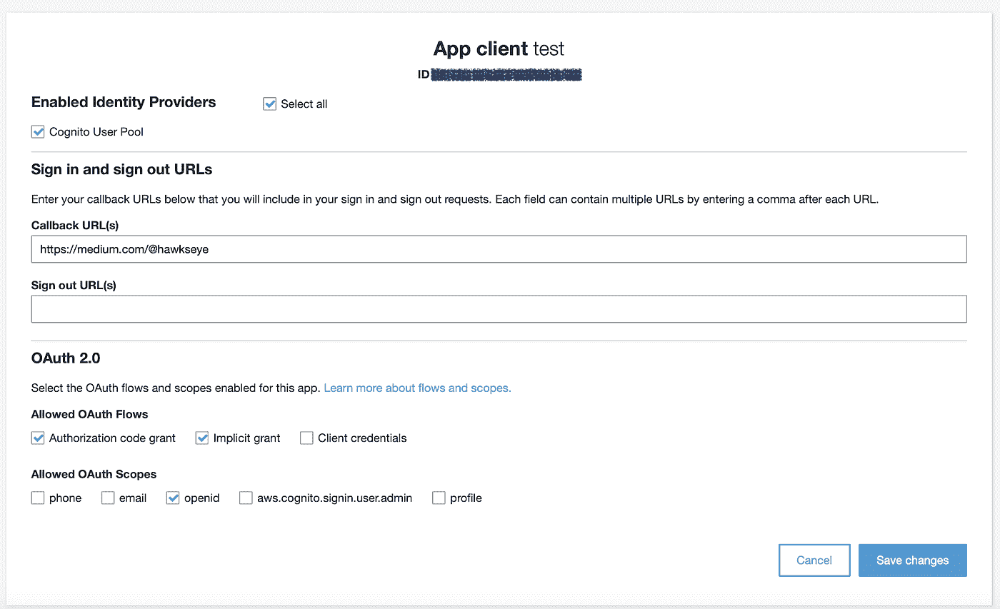

## 添加用户—续。

一旦我们设置好 app 客户端，就可以使用登录网址来确认我们之前创建的用户账号:
[https://YOUR _ SUB _ domain . auth . us-east-1 . amazoncognito . com/log in？response _ type = code&CLIENT _ ID = YOUR _ APP _ CLIENT _ ID&redirect _ uri = YOUR _ CALLBACK _ URL](https://your_sub_domain.auth.us-east-1.amazoncognito.com/login?response_type=code&client_id=YOUR_APP_CLIENT_ID&redirect_uri=YOUR_CALLBACK_URL)

确保将占位符替换为您自己的子域名、应用程序客户端 ID 和回拨 URL。

该 URL 假设您使用内置的 Cognito 子域，但是对于您自己的自定义域，其行为也是类似的。

转到您的登录 URL，键入您的用户名和临时密码。点击“登录”然后会提示您更改临时密码。一旦你这样做，你将被重定向到您的回拨网址。

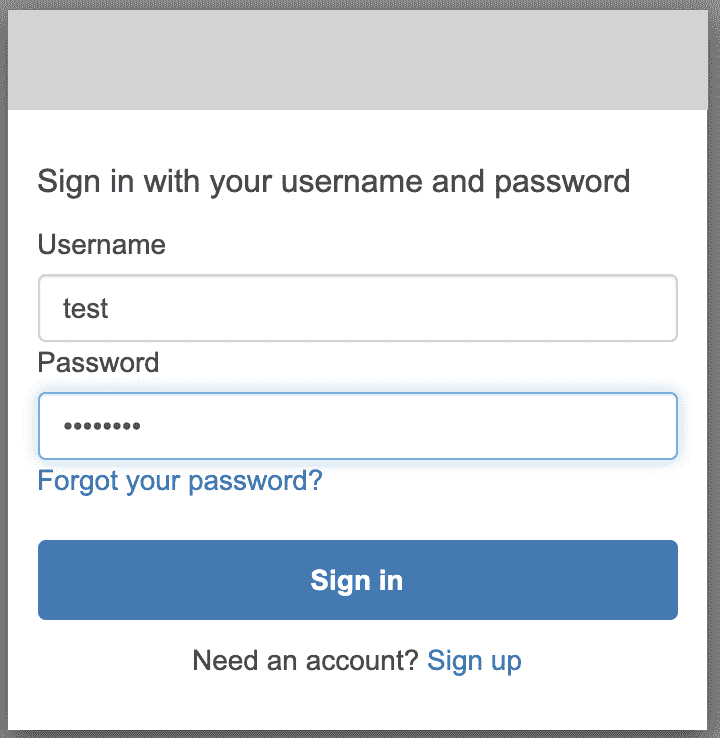

如果您现在在用户管理页面检查您的帐户，您会注意到它被标记为“已确认”，可以用来访问您的安全环境。

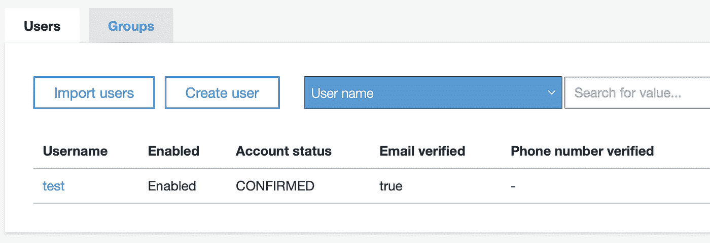

## 使用内置表单注册用户

除了登录 URL，您还可以允许用户使用内置的注册表单进行注册。

[https://YOUR _ SUB _ domain . auth . us-east-1 . Amazon cognito . com/sign up？response _ type = code&CLIENT _ ID = YOUR _ APP _ CLIENT _ ID&redirect _ uri = YOUR _ CALLBACK _ URL](https://your_sub_domain.auth.us-east-1.amazoncognito.com/signup?response_type=code&client_id=YOUR_APP_CLIENT_ID&redirect_uri=YOUR_CALLBACK_URL)

同样，这个 URL 假设您使用内置的 Cognito 子域，但是对于您自己的自定义域，其行为也是类似的。

转到您的注册 URL，键入用户名、电子邮件地址和密码。点击“注册”然后会要求您输入通过电子邮件发送给您的验证码。键入代码，然后点击“确认帐户”完成。

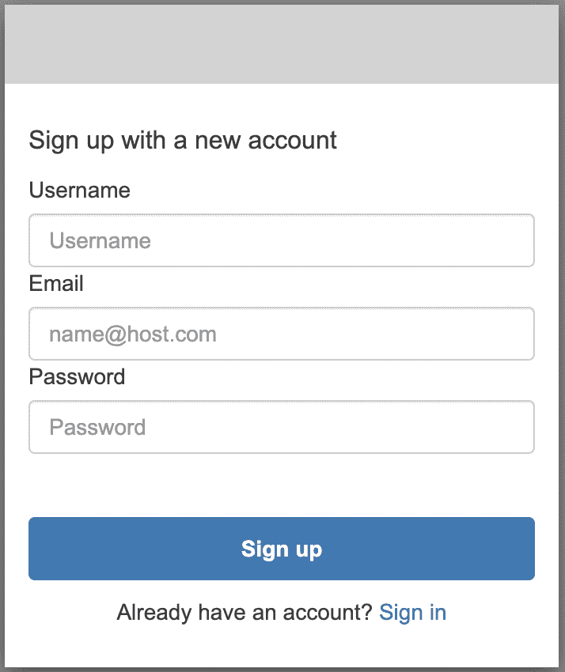

可以禁用注册表单，这样用户只能像我们第一次做的那样手动添加。为此，请转到“用户池管理”屏幕中的“常规设置”页面，并选择“允许用户注册？”部分旁边的小编辑图标设置。

确保您选择了“仅允许管理员创建用户”，并点击“保存更改”

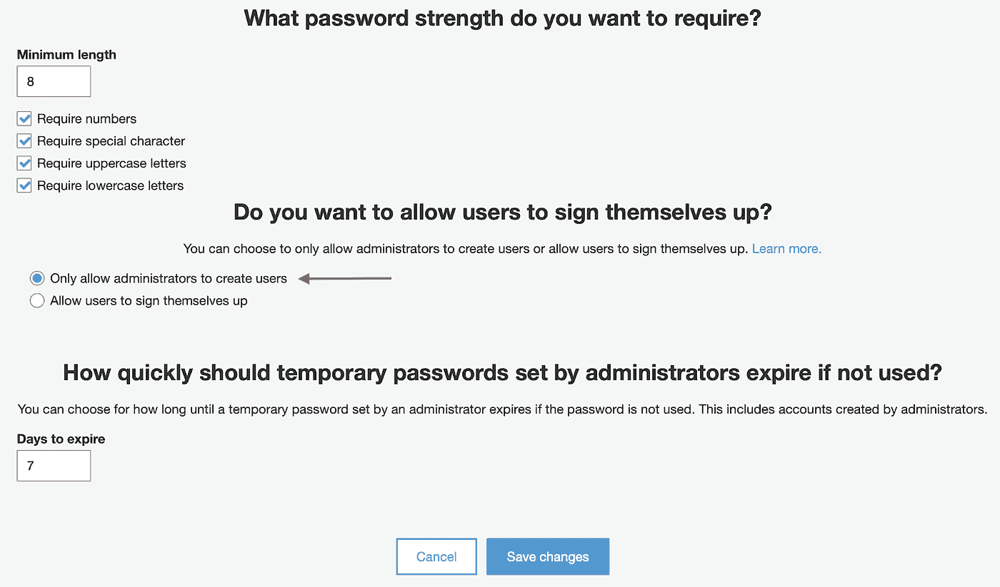

# 设置授权端点

接下来，我们需要创建一个授权端点，为我们的用户提供可以用来访问其他端点的 ID 令牌。

## 创建授权 Lambda 函数

打开 AWS 管理控制台，从服务菜单中选择“Lambda”

在 Lambda 页面中，点击“创建函数”选取“从头开始创作”，键入名称，然后选择“Python 3.6”或“Python 3.7”运行时。展开“权限”部分，并选择“创建具有基本 Lambda 权限的新角色”我们稍后将处理所需的权限。

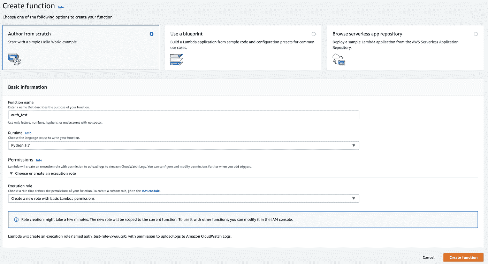

## 编写功能代码

一旦创建了函数，您将看到函数管理屏幕，在这里您可以处理配置、测试函数，当然还有编写代码。

Python Lambda 代码编辑器附带了一个默认的`lambda_function.py`文件和一个`lambda_handler` 方法。在我们的例子中，我们将使用这个默认的文件和方法。

在代码编辑器中，删除`lambda_function.py`文件的内容，并键入以下代码:

```
import boto3
import hmac
import hashlib
import base64USER_POOL_ID = 'TYPE_USER_POOL_ID_HERE'
CLIENT_ID = 'TYPE_APP_CLIENT_ID_HERE'
CLIENT_SECRET = 'TYPE_APP_CLIENT_SECRET_HERE'client = Nonedef get_secret_hash(username):
    msg = username + CLIENT_ID
    digest = hmac.new(str(CLIENT_SECRET).encode('utf-8'), msg=str(msg).encode('utf-8'), digestmod=hashlib.sha256).digest()
    dec = base64.b64encode(digest).decode()
    return decdef initiate_auth(username, password):
    try:
        resp = client.admin_initiate_auth(
            UserPoolId=USER_POOL_ID,
            ClientId=CLIENT_ID,
            AuthFlow='ADMIN_NO_SRP_AUTH',
            AuthParameters={
                'USERNAME': username,
                'SECRET_HASH': get_secret_hash(username),
                'PASSWORD': password
            },
            ClientMetadata={
                'username': username,
                'password': password
            })
    except client.exceptions.NotAuthorizedException as e:
        return None, "The username or password is incorrect"
    except client.exceptions.UserNotFoundException as e:
        return None, "The username or password is incorrect"
    except Exception as e:
        print(e)
        return None, "Unknown error"
    return resp, None

def refresh_auth(username, refresh_token):
    try:
        resp = client.admin_initiate_auth(
            UserPoolId=USER_POOL_ID,
            ClientId=CLIENT_ID,
            AuthFlow='REFRESH_TOKEN_AUTH',
            AuthParameters={
                'REFRESH_TOKEN': refresh_token,
                'SECRET_HASH': get_secret_hash(username)
            },
            ClientMetadata={ })
    except client.exceptions.NotAuthorizedException as e:
        return None, "The username or password is incorrect"
    except client.exceptions.UserNotFoundException as e:
        return None, "The username or password is incorrect"
    except Exception as e:
        print(e)
        return None, "Unknown error"
    return resp, Nonedef lambda_handler(event, context):
    global client
    if client == None:
        client = boto3.client('cognito-idp') username = event['username']
    if 'password' in event:
        resp, msg = initiate_auth(username, event['password'])

    if 'refresh_token' in event:
        resp, msg = refresh_auth(username, event['refresh_token']) if msg != None:
        return {
            'status': 'fail', 
            'msg': msg
        }

    response = {
        'status': 'success',
        'id_token': resp['AuthenticationResult']['IdToken']
    }

    if 'password' in event:
        response['refresh_token'] = resp['AuthenticationResult']['RefreshToken']

    return response
```

该函数接收用户名和密码或刷新令牌:

*   如果提供了密码，则响应包括 ID 令牌和刷新令牌
*   如果提供了刷新令牌，则响应仅包括 ID 令牌

不要忘记用用户池管理屏幕中的数据替换占位符:

*   用户池 ID 可以从“常规设置”页面获取
*   应用程序客户端 ID 和密码可以从“常规设置”部分的“应用程序客户端”页面获取

## 授予 Cognito 访问该功能的权限

为了让 Lambda 函数工作，我们需要授予它访问 Cognito 的权限。

在“功能管理”页面中，转到“执行角色”部分，然后在 IAM 控制台上单击“查看…角色”。

在“角色 IAM”页面中，单击“附加策略”选择 AmazonCognitoPowerUser 策略，并点击“Attach policy”

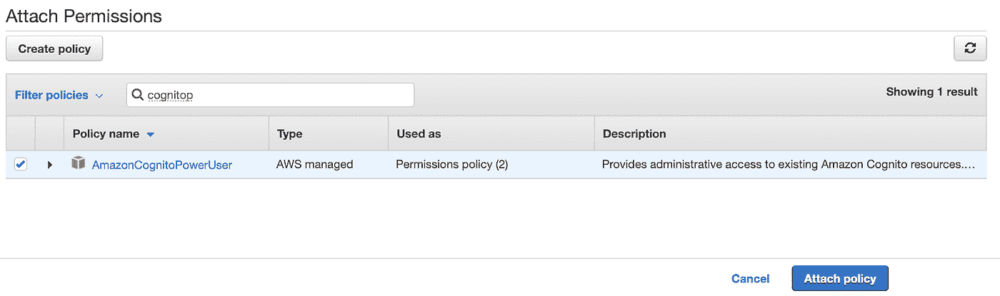

您还可以创建一个新策略来限制对特定操作或特定用户池的访问，但是由于访问是硬编码在 Lambda 函数中的，所以在这里使用超级用户策略是安全的。

## 测试功能

您可以使用示例消息来测试 Lambda 函数。在这种情况下，我们可以使用之前创建的用户来测试访问。

在 Lambda-function 管理页面中，点击“测试”，然后选择“创建新的测试事件”键入一个名称，并用一个包含您的用户名和密码的简单 JSON 对象替换示例数据，如下所示:

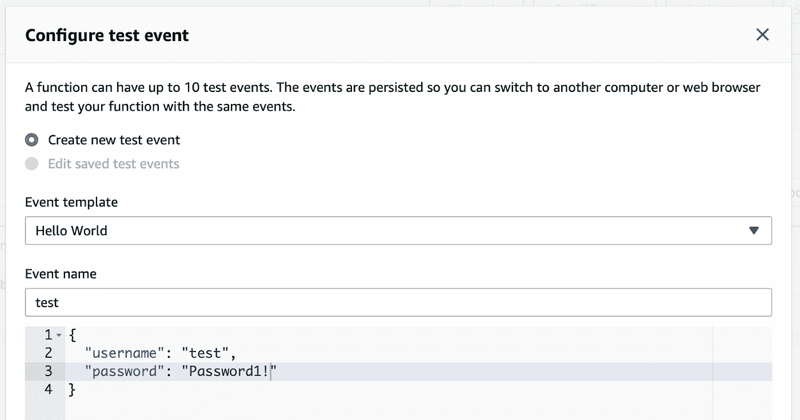

单击“Create”创建测试事件，然后在函数管理页面中，再次单击“test”测试您的函数。一个成功的测试应该会给你一个类似这样的响应:

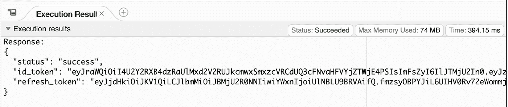

## 创建授权端点

打开服务菜单，选择“API 网关”

在“资源”页面中，打开“操作”菜单，然后选择“创建资源”键入资源名称和路径(例如，`/oauth`)，然后单击“创建资源”或者，您可以创建另一个名为 token 的资源，这样到您的资源的完整路径将是`/oauth/token`。

然后，再次打开动作菜单，这次选择“创建方法”在打开的下拉菜单中选择“POST”，然后点击小 V 图标进行确认。

在打开的表单中，选择“Lambda Function”作为集成类型，并通过键入名称或 ARN 标识符来选择新创建的 auth Lambda 函数。点击“保存”，并确认您允许 API Gateway 调用您的 Lambda 函数。

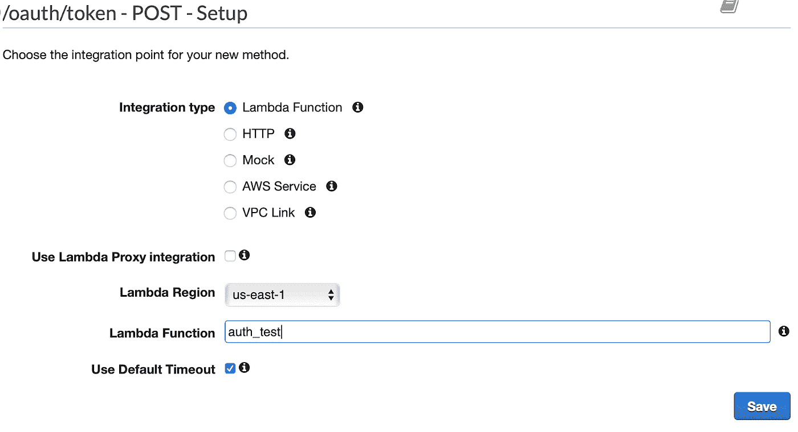

现在，任何对端点中的`/oauth/token` 的 POST 请求都将调用我们之前创建的 Lambda 函数。如前所述，将用户名+密码作为参数发送会给你一个 ID 令牌和一个刷新令牌，发送用户名+刷新令牌会给你一个 ID 令牌。

# 设置 AWS API 网关授权

接下来，我们需要使用我们的 Cognito 用户池为我们的 AWS API 网关端点设置授权。

## 创建授权人

选择“授权人”页面，并点击“创建新的授权人”键入名称，选择“Cognito”作为类型，然后选择您的 Cognito 用户池。在“令牌源”字段中，键入“授权”，然后单击“创建”

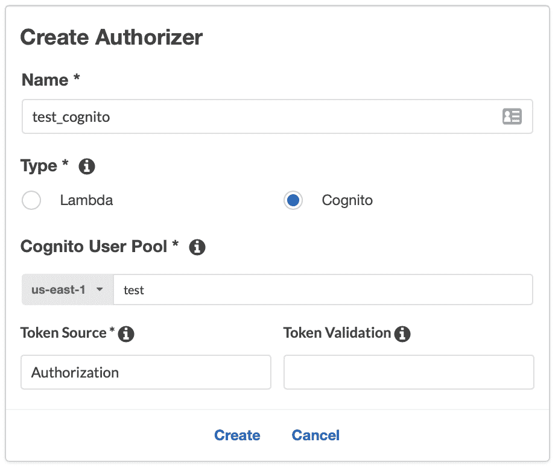

您现在可以点击“测试”来测试您的新授权人

在授权令牌字段中，键入测试 Lambda 函数时返回的 ID 令牌。记住这个令牌只在一个小时内有效，但是如果必要的话，你可以再次测试你的 Lambda 函数来生成一个新的。单击“Test”来测试您的授权者，您应该会看到“Response Code: 200”，其中包含您使用的 ID 令牌的用户的详细信息。

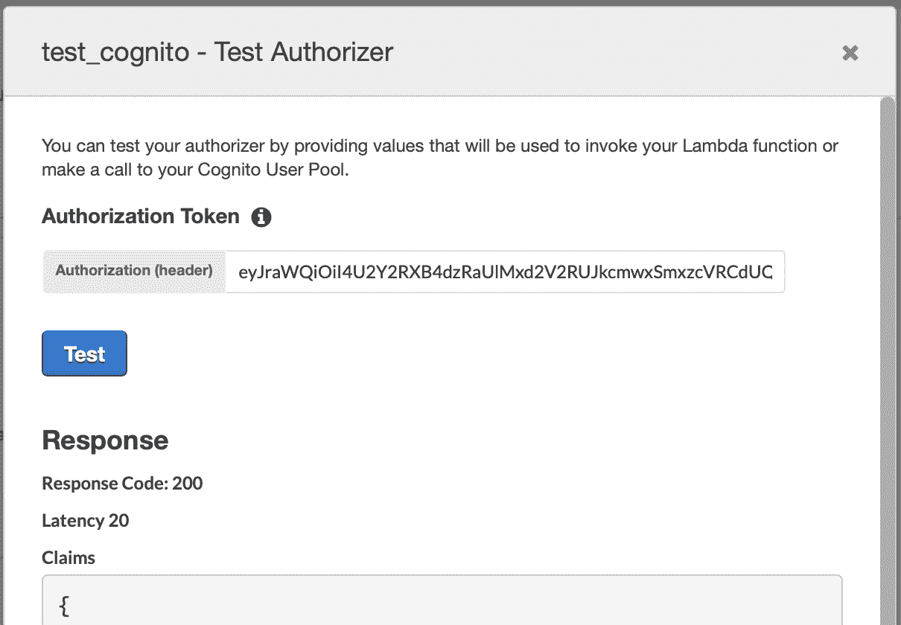

## 设置我们的端点授权

接下来，我们需要将我们的授权者连接到我们的端点以获得安全的访问。

回到资源页面，选择 API 网关端点的方法(例如，我们在上一篇文章中创建的/upload 端点的 POST 方法)。

在授权中，选择您的新授权人，并点击小 V 进行确认。请注意，您可能需要刷新页面，以便新的授权人出现在下拉菜单中。

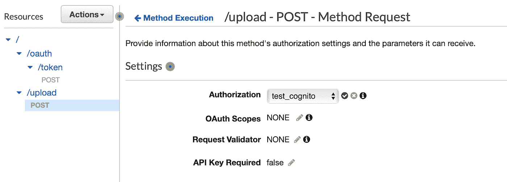

最后，我们需要部署最新的 API 网关变更(授权端点和附加的授权)。

从“操作”菜单中，选择“部署 API”选择您当前的阶段(例如，v1)或创建一个新的阶段，然后单击“部署”

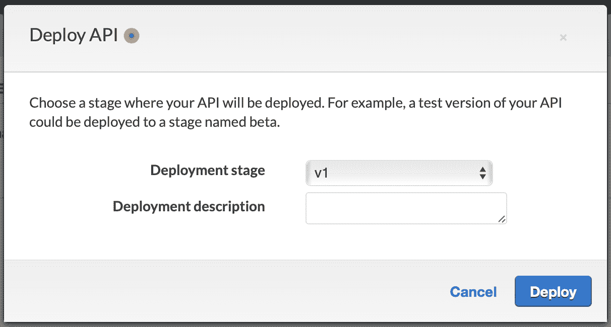

# 测试安全 API 网关

您可以使用 cURL 命令或者一个请求生成器应用程序(比如 Postman)来测试您新部署的 API 网关端点。

## 测试授权端点

授权端点应该获得用户名+密码或用户名+刷新令牌，并返回一个 ID 令牌，用于需要安全访问的端点。

对于 cURL 命令，运行类似以下示例的内容:

```
curl --request POST --data '{"username": "test", "password": "Password1!"}' https://YOUR_API_GATEWAY_ID.execute-api.us-east-1.amazonaws.com/v1/oauth/token
```

成功的执行应该返回 Lambda 函数发送的响应:

```
{
    "status": "success",
    "id_token": "eyJ…",
    "refresh_token": "eyJ…"
}
```

## 测试安全端点

安全端点应该获得一个包含您的 ID 令牌的授权头。没有 ID 令牌的请求将导致“未经授权”的响应。

假设您使用的是我们在上一篇文章中创建的端点，对于 cURL 命令，运行如下示例:

```
curl --request POST -H 'Authorization: Bearer YOUR_ID_TOKEN_HERE' -H "Content-Type: application/pdf" --data-binary "@/path/to/your/file.pdf" https://YOUR_API_GATEWAY_ID.execute-api.us-east-1.amazonaws.com/v1/upload
```

成功的执行应该返回 Lambda 函数发送的响应:

```
{
    statusCode": 200,
    "body": {
        "file_path": "sample.txt"
    }
}
```

# 摘要

向外界开放您的环境时，安全性是要考虑的最重要的方面。您的互联网终端可能是您的云架构中最脆弱的部分，您必须确保它尽可能安全。

这篇文章介绍了如何使用 Amazon Cognito 用户池向 AWS API 网关端点添加基本的安全性。虽然这种基本的安全性涵盖了大多数用例，并且肯定足够了，但 Amazon Cognito 是一种强大的工具，可用于通过添加额外的身份验证层、MFA 以及与几个身份提供商的集成来增强您的端点(以及一般的云环境)的安全性。

关于 Amazon Cognito 用户池和不同用例的其他文档可以在[这里](https://docs.aws.amazon.com/cognito/latest/developerguide/cognito-user-identity-pools.html)找到。