# 通过应用锁定保护 iOS 应用

> 原文：<https://betterprogramming.pub/secure-ios-apps-through-app-pinning-4106d31c5d7d>

## 如何在 iOS 中提供高级别的 API 安全性

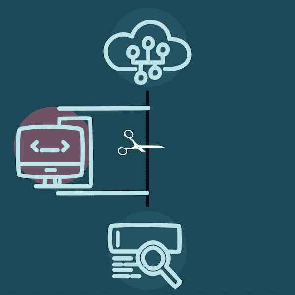

SSL pin 可以帮助您构建安全的移动应用程序，即使用户选择使用不安全的(麦当劳，有人吗？)无线网络。使用应用程序锁定有助于避免中间人攻击。

难度:简单|普通| **挑战**

# 先决条件

*   对 iOS 应用从完成到生产的一些了解
*   使用[阿拉莫菲尔](https://github.com/Alamofire/Alamofire)
*   下载 iOS 版[查理斯](https://www.charlesproxy.com/documentation/ios/)

# 术语

*中间人*:攻击者坐在用户和**【漏字】之间的攻击。**

*公钥加密*:使用两个密钥的加密系统:一个大家都知道的公钥和一个私钥。私钥可以用来读取用公钥加密的未加密的消息，反之则不成立。

*公钥基础设施(PKI)* :分发、使用、存储和撤销数字证书以及管理公钥加密所需的一组角色、策略、硬件、软件和过程。

*安全套接字层(SSL)*:HTTP 上的加密客户端-服务器通信(由 HTTPS 规定)。

# 问题是

SSL 通信被认为是安全的，通过最合理的措施，如花费的时间打破；对 128 位 SSL 加密字符串的暴力攻击需要数年时间。中间人攻击可以通过地址解析协议(ARP)缓存中毒或 DNS 欺骗来实现。ARP 缓存中毒利用 ARP 的性质(将 IP 地址映射到设备的 MAC 地址)，而 DNS 欺骗是一种破坏名称服务器域名映射的攻击，其方式是返回不正确的 IP 地址，并将流量转移到非预期的计算机。

在 iOS 应用程序中，iOS 信任商店中的证书用于建立连接并确定信任哪些证书。但是，如果攻击者将自签名证书注入信任存储，就可能发生中间人攻击，即应用程序与它认为是受信任目的地的服务器进行通信。

另一种可能的方法是破解根 CA 证书。

## SSL 固定

这是一种确保应用程序只与指定服务器通信的方法。目标的服务器 SSL 证书保存在 app bundle 中，并在定义固定证书时使用。

这是苹果应用传输安全(ATS)的基础，自 iOS 9 以来，该应用一直是 iOS 的一项功能，因为该设备仍然容易受到使用黑客或自签名证书的攻击。

# 我们如何知道证书是有效的？

这是一个有趣的问题。我们如何知道来自证书颁发机构的证书是有效的？我们有一个信任链，它是通过验证每个证书直到根证书来建立的。换句话说，根 CA 最终必须是可信的。

我们如何相信一个人的身份是有效的？我们看他们的护照，但最终我们不得不相信护照签发机构，以及他们如何验证护照持有人的身份。应用程序验证评估日期和数字签名。

# 履行

## 起点

我们有一个简单的应用程序，在一个 ui table 视图中显示来自[https://haveibeenpwned.com/api/v2](https://havibeenpwned.com/api/v2i)的违规列表

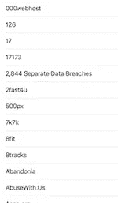

我们要确保 haveibeenpwned.com 就是那个网站。

这段代码使用 Alamofire 使证书锁定变得更加容易。作为一种替代方案，可以用 [AFNetworking](https://github.com/AFNetworking/AFNetworking) 甚至`NSURLSession`来实现这一点(尽管后者比较棘手，需要使用 C API)。

AF 请求的代码非常简单:

## 访问证书

从终端，我们可以输入以下内容

`$ openssl s_client -connect haveibeenpwned.com:443 </dev/null`

这提供了一个证书列表:

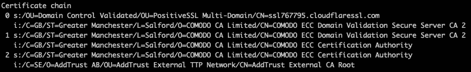

当然，还有将要使用的证书:

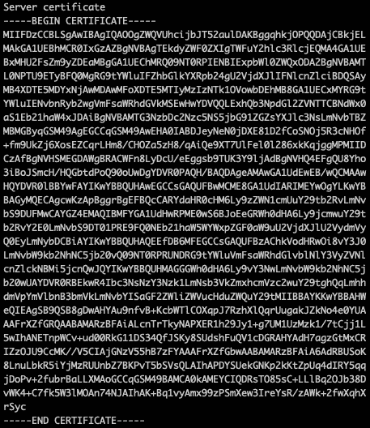

我们可以使用终端命令将其复制到一个文件中。

`openssl s_client -connect haveibeenpwned.com:443 </dev/null | openssl x509 -outform DER -out haveibeenpwned.com.der`

这将生成。finder 中的 der 文件。然后，您可以将它复制到应用程序的根目录:

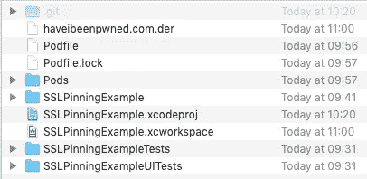

然后我们需要将这个复制到应用程序中。拖放就可以了:

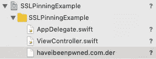

## 陷害查尔斯

你应该已经有了查尔斯代理服务器，但是如果你没有，下载它吧！

从多项代理菜单中选择 SSL 代理设置:

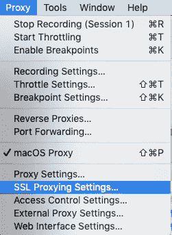

输入 haveibeenpwned.com 并勾选启用 SSL 代理复选框:

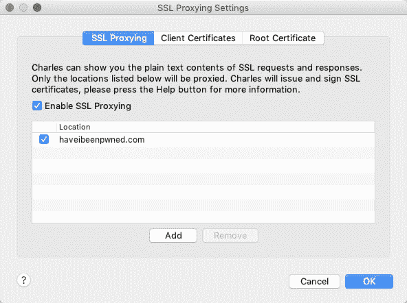

## 设置模拟器

您需要通过菜单帮助> SSL 代理>在 iOS 模拟器中安装查尔斯根证书，在 iOS 模拟器中安装查尔斯根证书:

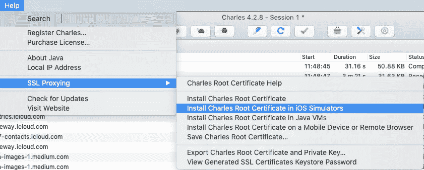

在模拟器上，您需要通过菜单 General > About > Certificate Trust Settings 安装证书，并启用 Charles Proxy。

这使得应用程序通过 Charles 代理运行，就像中间人攻击一样:

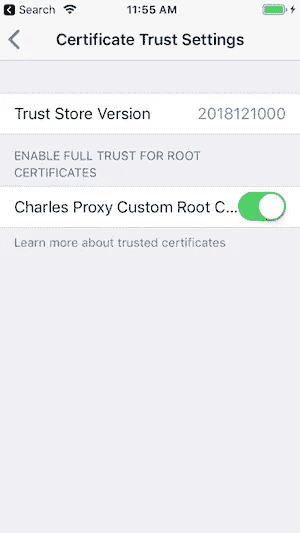

当查尔斯运行时，我们得到一个错误。否则，应用程序会正常运行:

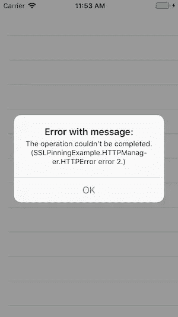

要重置模拟器，您需要重置。为此，菜单项是硬件>清除所有内容和设置:

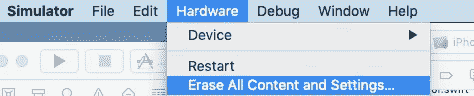

# 结论

中间人攻击是一种真实的可能性，尤其是在移动设备上使用金融应用时。

是时候让开发人员认真对待这种风险了。尽管对于大型团队来说，这可能很难实现，但是没有理由不认真对待这一点并采取预防措施！