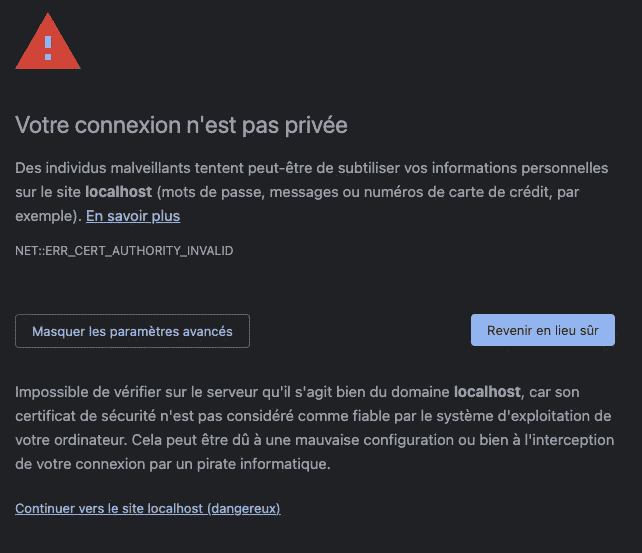
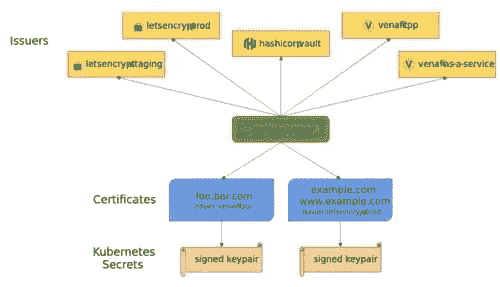

# 如何用“让我们加密”和“证书管理器”保护 K8S Nginx 入口

> 原文：<https://betterprogramming.pub/secure-k8s-nginx-ingress-with-lets-encrypt-46e46abe822b>

## 自动调配让我们加密证书并保护您的应用


由[尼古拉斯·希伯特](https://unsplash.com/@nhippert?utm_source=medium&utm_medium=referral)在 [Unsplash](https://unsplash.com?utm_source=medium&utm_medium=referral) 上拍摄的照片

Kubernetes ingress 将集群中的 web 应用程序或 REST API 向外部公开。但是，默认情况下可以通过 HTTP 访问应用程序，这是不安全的。应用程序和客户端之间的流量没有加密。

入口可以配置为服务于 HTTPS 的应用。它像一个反向代理一样工作，从应用程序中卸载这个功能。为此，您需要在入口中配置一个证书，并在`tls`字段中指定它:

```
apiVersion: networking.k8s.io/v1
kind: Ingress
metadata:
  name: wordpress
  annotations:
    kubernetes.io/ingress.class: nginx
spec:
  rules:
    - http:
        paths:
          - path: /
            pathType: Prefix
            backend:
              service:
                name: wordpress
                port:
                  number: 80
  tls:
    - hosts:
      - example.com
```

这样，浏览器将不会信任该证书，访问者将会收到警告。这可能会降低用户体验和应用程序的流量。为了避免这种情况，有必要生成有效的证书，尤其是来自证书颁发机构的证书。



浏览器中出现不受信任的 HTTPS 证书警告

这里的目的是向您详细介绍如何使用 [Cert-manager](https://cert-manager.io/docs/) 和[将](https://letsencrypt.org/)加密为认证机构来自动化证书的生命周期。Cert-manager 可以在您的 Kubernetes 集群中自动提供 HTTPS 证书。它提供自定义资源来简化这些证书的获取、续订和使用。

为了让我们了解如何:

*   在 k8s 集群中安装证书管理器
*   为“让我们加密”创建证书颁发者
*   使用 Nginx 入口控制器在 HTTPS 公开一个 WordPress 博客

# 正在安装证书管理器

Cert-manager 易于使用 Helm 安装。Helm 是一个 Kubernetes 包管理器，允许您使用带有预构建图表的存储库将应用程序添加到集群中。

第一步是添加 Jetstack 存储库:

```
$ helm repo add jetstack https://charts.jetstack.io $ helm repo update
```

将带有 CRDs 的 Cert-Manager 安装到您的群集中:

```
$ helm install cert-manager jetstack/cert-manager --namespace cert-manager --create-namespace --set installCRDs=true
```

Jetstack 还提供了一个 kubectl 插件来轻松管理集群中的 cert-manager 资源:

```
$ curl -L -o kubectl-cert-manager.tar.gz https://github.com/jetstack/cert-manager/releases/download/v1.6.1/kubectl-cert_manager-darwin-amd64.tar.gz
$ tar xzf kubectl-cert-manager.tar.gz
$ sudo mv kubectl-cert_manager /usr/local/bin
```

我建议您安装`cmctl`,通过标签自动补全获得更好的体验:

```
$ curl -L -o cmctl-darwin-amd64.tar.gz https://github.com/jetstack/cert-manager/releases/download/v1.6.1/cmctl-darwin-amd64.tar.gz
$ tar xzf cmctl-darwin-amd64.tar.gz
$ sudo mv cmctl /usr/local/bin$ kubectl cert-manager help                                               

kubectl cert-manager is a CLI tool manage and configure cert-manager resources for Kubernetes

Usage: kubectl cert-manager [command]

Available Commands:
  approve      Approve a CertificateRequest
  check        Check cert-manager components
  convert      Convert cert-manager config files between different API versions
  create       Create cert-manager resources
  deny         Deny a CertificateRequest
  experimental Interact with experimental features
  help         Help about any command
  inspect      Get details on certificate related resources
  renew        Mark a Certificate for manual renewal
  status       Get details on current status of cert-manager resources
  version      Print the cert-manager CLI version and the deployed cert-manager version

Flags:
  -h, --help                           help for kubectl
      --log-flush-frequency duration   Maximum number of seconds between log flushes (default 5s)

Use "kubectl cert-manager [command] --help" for more information about a command.
```

对于本教程的其余部分，您还需要安装 Nginx 入口控制器:

```
$ helm repo add ingress-nginx https://kubernetes.github.io/ingress-nginx
$ helm update
$ helm install ingress-controller ingress-nginx/ingress-nginx
```

# 配置让我们加密证书颁发者

颁发者和群集颁发者是向群集提供证书的资源。证书管理器安装无法颁发证书。您需要为“让我们加密”配置一个颁发者，以便为您的服务动态获取新证书:



来自[https://cert-manager.io/docs/](https://getbetterdevops.io/secure-k8s-nginx-ingress-with-lets-encrypt/cert-manager%20presentation%20diagram%20from%20https://cert-manager.io/docs/)的证书管理器演示图

> ClusterIssuer 资源是基于集群的，而 Issuer 是基于名称空间的

我们将为试运行和生产使用设置一个集群发行者。在配置集成时，最好选择分段。它避免了达到加密生产率的极限。

> 在下面的集群颁发者清单中，您需要将电子邮件地址替换为您的电子邮件地址

## 脚手架

创建一个名为`letsencrypt-staging.yaml`的 YAML 文件:

```
apiVersion: cert-manager.io/v1
kind: ClusterIssuer
metadata:
  name: letsencrypt-staging
spec:
  acme:
    server: https://acme-staging-v02.api.letsencrypt.org/directory
    email: example@domain.com
    privateKeySecretRef:
      name: letsencrypt-staging
    solvers:
      - http01:
          ingress:
            class: nginx
```

应用清单:

```
$ kubectl create -f letsencrypt-issuer-staging.yaml
```

## 生产

创建一个名为`letsencrypt-production.yaml`的 YAML 文件:

```
apiVersion: cert-manager.io/v1
kind: ClusterIssuer
metadata:
  name: letsencrypt-production
spec:
  acme:
    server: https://acme-v02.api.letsencrypt.org/directory
    email: example@domain.com
    privateKeySecretRef:
      name: letsencrypt-production
    solvers:
      - http01:
          ingress:
            class: nginx
```

应用清单:

```
$ kubectl create -f letsencrypt-issuer-staging.yaml
```

# 获得 HTTPS 证书

颁发者现在已经就位，并准备好为入口资源公开的服务检索证书。Cert-manager 监控入口资源，并根据`tls`字段创建证书。

```
apiVersion: apps/v1
kind: Deployment
metadata:
  name: wordpress
spec:
  replicas: 1
  selector:
    matchLabels:
      app: wordpress
  template:
    metadata:
      labels:
        app: wordpress
    spec:
      containers:
        - name: wordpress
          image: wordpress:latest
          ports:
            - containerPort: 80
---
apiVersion: v1
kind: Service
metadata:
  name: wordpress
spec:
  selector:
    app: wordpress
  ports:
    - protocol: TCP
      port: 80
---
apiVersion: networking.k8s.io/v1
kind: Ingress
metadata:
  name: wordpress
  annotations:
    kubernetes.io/ingress.class: nginx
    cert-manager.io/cluster-issuer: letsencrypt-staging
spec:
  rules:
    - http:
        paths:
          - path: /
            pathType: Prefix
            backend:
              service:
                name: wordpress
                port:
                  number: 80
  tls:
    - hosts:
      - example.com
```

上面的 YAML 文件定义了创建一个 pod、一个服务和一个公开服务的入口的部署。入口使用之前部署的 Nginx 控制器。pod 运行一个 WordPress 容器，可以通过 HTTPS 到达。

Cert-manager 检测到入口资源中的注释`cert-manager.io/cluster-issuer`。它将使用`letsencrypt-staging`集群发行者为 tls hosts 字段中定义的主机名获取证书。

一旦获得的证书通过了临时发行方的验证，您就可以进入生产发行方。临时证书有效，但不被浏览器信任。您必须用`letsencrypt-production`替换入口资源字段`cert-manager.io/cluster-issuer`的值。

# 结论

我们已经看到了如何通过 HTTPS 和入口在安全的环境中公开 web 应用程序。现在可以动态地为集群端点设置可信且有效的证书。只需要在入口资源中添加一个简单的注释。

Cert-Manager 使用此注释监控入口资源，并自动提供有效的加密证书。它还处理证书更新。