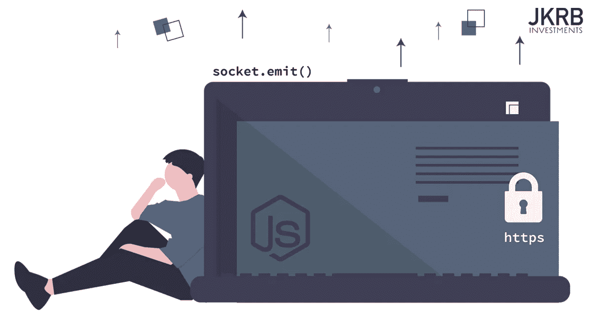
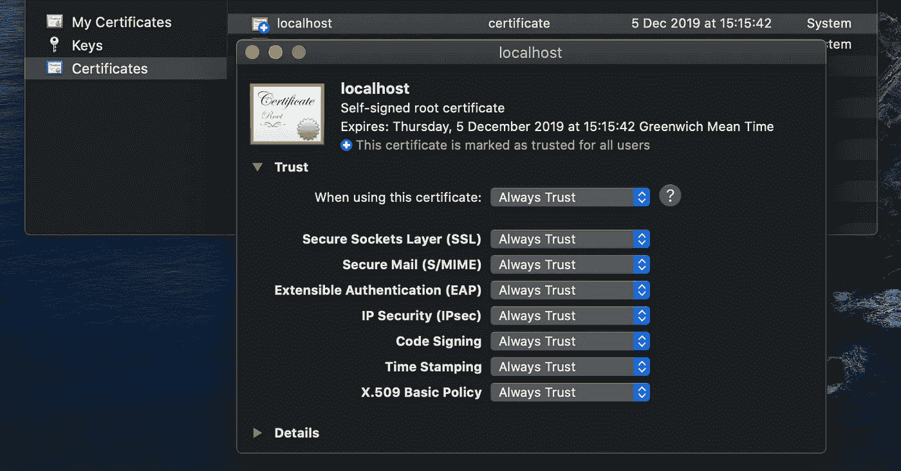

# 使用 Express 和 Socket.io 加密 Websockets

> 原文：<https://betterprogramming.pub/secure-websockets-with-express-and-socket-io-d9a0976c1427>

## 如何在开发和生产 Express 中配置 SSL 加密的 Websockets



您刚刚生成了一个新的 [Express](https://www.npmjs.com/package/express) 项目，准备开发您的下一个 API——这恰好需要一个安全的 WebSocket 连接。

```
**# firing up yet another Express boilerplate with** [**express-generator**](https://www.npmjs.com/package/express#quick-start)express secure-websocket
```

这篇文章从这里开始——一个新的 Express 样板文件——带您完成配置安全 Websocket 的过程，从加密的 Nginx [反向代理](https://docs.nginx.com/nginx/admin-guide/web-server/reverse-proxy/)到运行在 PM2 上的加密 Socket.io 服务。

更具体地说，我们将涵盖:

*   如何为您的开发环境生成自签名 SSL 证书，以模拟生产环境的加密连接
*   创建一个`SocketService` ES6 类来管理 Websocket 服务器的初始化过程
*   使用 [PM2](https://pm2.keymetrics.io/) 进程管理器运行我们的 Express 服务器，并配置 Nginx 来代理对它的安全请求

*HTTPS 网页上的所有内容都必须加密，包括 Websocket 连接。Safari 等主流浏览器会阻止加密网页上不安全的 Websocket 连接(这是一种“混合内容”的场景，加密网页试图连接到非加密服务)。这篇文章关注的是这个问题的解决方案，所以它永远不会应用到你的应用程序中。*

我们需要的另一个依赖项是`[socket-io](https://www.npmjs.com/package/socket.io)`:

```
**# install socket.io**cd secure-websocket && yarn add socket.io
```

现在，对于这样的设置，我们的首要任务是准备好 SSL 证书来服务 Websocket。对于您的生产服务器，您最有可能从可信机构购买证书，但是出于开发目的，我们将需要自签名证书来加密`localhost`。

在进入一些代码之前，下一节将介绍使用`[openssl](https://www.openssl.org/)`为您的开发环境生成自签名证书的过程。

# 为开发生成自签名证书

出于本地开发的目的，我们将生成一个自签名的 SSL 证书，用于加密的 WebSocket。存储这些证书最简单的方法是在您的项目文件夹中放置一个`ssl/`目录，这个目录在您的`.gitignore`文件的源代码控制中被忽略了:

```
**// .gitignore**# development
/ssl
```

该目录位于托管`.crt`和`.key`文件的项目文件夹中:

```
/secure-websocket
   /ssl
      **server.crt
      server.key**
   ...
```

两个加粗的文件是我们想用`openssl`生成的证书文件。它们将在开发模式下初始化我们的套接字服务器时使用。

## 生成证书

任何人都可以在没有 CA 帮助的情况下生成自己的证书。唯一的区别是，您自己制作的证书，而不是从受信任的一方购买的，不会被其他任何人信任。

对于本地开发，这很好——我们只希望这些证书模拟进出 Websocket 的加密数据流。

*作为购买 SSL 证书的替代方案，我们有*[*Certbot*](https://certbot.eff.org/)*，这是一个免费的开源工具，可以自动使用* [*让我们来加密*](https://letsencrypt.org/) *证书。谷歌 Chrome 甚至是 Let's Encrypt 的“白金赞助商”，因此在可预见的未来，Chrome 不信任它的可能性很小。但是，请记住，Let's Encrypt 没有绿条支持——它们停留在域级别的验证。*

为`localhost`生成私钥和自签名证书的最简单方法是使用一个`openssl`命令。创建并跳转到项目目录中的`/ssl`文件夹来生成它们:

```
**# jump into ssl folder**
mkdir ssl && cd ssl**# generate certificate for localhost**openssl req -x509 \
  -out localhost.crt \
  -keyout localhost.key \
  -newkey rsa:2048 -nodes -sha256 \
  -subj '/CN=localhost' \
  -extensions EXT -config <( \
   printf "[dn]\nCN=localhost\n[req]\ndistinguished_name = dn\n[EXT]\nsubjectAltName=DNS:localhost\nkeyUsage=digitalSignature\nextendedKeyUsage=serverAuth")
```

运行上面的代码，您将在终端中收到以下输出，验证密钥和证书已成功生成:

```
Generating a 2048 bit RSA private key
..........+++
................................+++
writing new private key to 'localhost.key'
-----
```

## 信任证书(在 macOS 上)

现在，在信任证书之前，需要采取几个重要步骤。

这部分是基于 macOS 开发的，但是同样的概念也适用于其他系统——系统必须信任证书。

请按照以下说明来信任带有钥匙串访问的证书:

*   双击`localhost.crt`在钥匙串访问中打开它。
*   双击证书列表中的`localhost`证书
*   在信任部分下，切换到`Always Trust`

下面的屏幕截图说明了这一过程:



使用**证书**，双击 **localhost** 证书文件，将信任设置切换为**始终信任**。

## 现在重启你的机器

在这些改变生效之前还有最后一步:重启你的机器。否则，由于证书颁发机构不受信任，您的证书将在浏览器中无效。

现在我们的证书已经设置好了，我们现在可以继续创建 SocketService 类，它将处理我们的 socket.io 连接。我们还将探索一些管理代码的技巧，同时使其对多环境友好。

# 返回 Javascript: SocketService 类

在本节中，我们将定义一个`SocketService`类来管理我们的 Websocket 连接。完整的`SocketService`类作为 Github 要点提供在文章的最后。

## SocketService 概述

`SocketService`将您的 express `app`和一个端口号作为它的构造函数参数——这只是我们启动和运行 Websocket 所需的两个数据。在它的构造函数中，`SocketService`声明了一个 HTTPS 服务器(在这里我们的 SSL 证书发挥了作用)，并将结果对象存储为一个类属性:`this.server`。

从这里，我们可以简单地实例化一个新的`SocketService`，并在`app.js`中用一个单独的方法`initServer()`初始化套接字服务器:

```
**// app.js**var SocketService = require('./SocketService');*...*var socket = new SocketService(app, 3003);
socket.initServer();
```

*我在这里使用了* `*var*` *变量声明以符合 Express 的样板代码，但是* `*const*` *也可以在这里使用。*

如果您想知道此时`initServer()`是什么样子，它只是实例化 socket.io 并在我们传递给构造函数的端口监听:

```
**// SocketService.js initServer() method**initServer () {
   this.io = require('socket.io')(this.server);
   this.server.listen(this.port);
}
```

如您所见，我们将`socket.io`实例存储在另一个类属性`this.io`中。从这里我们可以引用这个类属性来定义 io 事件，所有这些都从`app.js`内部继续:

```
**// app.js continued**socket.io.on('connection', socket => {
   ...
}
```

我已经将套接字实例化和`initServer()`方法分开，以将 WebSocket 连接从类实例化中分离出来——这是一个很好的实践，因为它使您的逻辑更具可读性和灵活性。为什么？因为在某些情况下，您不会希望 Websocket 立即初始化——我们可能希望在满足某些条件时有条件地初始化套接字服务器。`constructor()`很有用，但是我们不希望它做太多:

```
**// At this stage, our Websocket is configured**
var socket = new SocketService(app, 3003);// further setup and initialisation...**// Now when we are ready, initialise socket.io and listen at port**
socket.initServer();
```

这是一个更加灵活的解决方案，它遵循面向对象的方法来管理套接字连接。接下来让我们深入研究一下`SocketService`模块和构造函数。

## SocketService 模块和构造函数

`SocketService`只是一个 ES6 类，我们在顶部定义它的依赖项，定义类，然后提供它作为模块的唯一导出:

```
**// import dependencies** var fs = require('fs');
var https = require('https');
var path = require('path');**// define the class** class SocketService {
   constructor(app, port) {
      ... 
   } initServer() { 
      ...
   }
}**// export the class** module.exports = SocketService;
```

*如果你在一个模块中定义了多个类，你的* `*module.exports*` *可以扩展成一个类的对象。*

`constructor()`首先将我们提供的端口设置为一个类属性，然后引入一个基于`process.env.NODE_ENV`的 **switch 语句**——NodeJS 提供的一个环境变量，用于确定我们所处的环境。然后，此 switch 语句用于根据我们的环境配置不同的 HTTPS 服务器:

```
constructor (app, port) {
   this.port = port; switch (process.env.NODE_ENV) {
      case 'development':
        // define development https server
      break; default:
        //define production https server
   }
}
```

在这里，我们将`default`案例视为我们的生产服务器。这种语法非常灵活，如果您的应用程序需要，您也可以在其中加入一个`staging`案例，为您的每个环境定义一个定制的 HTTPS 服务器。

要试验更多的`NODE_ENV`值，只需在运行 express 时提供环境变量:

```
**# providing NODE_ENV when starting your express server**NODE_ENV=production yarn start
```

我们还在 switch 语句中使用了环境变量来帮助我们的 SSL 证书。让我们先看看我们是如何定义`development`服务器的:

```
case 'development':
   this.server =
      https.createServer({
         key: fs.readFileSync(
           path.resolve(
              process.env.SSL_DEV_KEY || './ssl/localhost.key'
           )
         ),
         cert: fs.readFileSync(
            path.resolve(
               process.env.SSL_DEV_CRT || './ssl/localhost.crt'
            )
         )
      }, app);
break;
```

在这个模块中发生了很多事情，但是我们只是通过之前导入的`https`模块配置了一个 HTTPS 服务器，将结果存储为一个`server`类属性。让我们进一步分析一下:

*   `https.createServer()`(文档[此处为](https://node.readthedocs.io/en/stable/api/https/#httpscreateserveroptions-requestlistener))提供了`key`和`cert`字段供我们插入证书。正如我们将进一步看到的，我们还可以为证书的 ca-bundle 文件使用一个`ca`字段。出于开发目的，这是不需要的。
*   我们使用导入的`[fs](https://nodejs.org/api/fs.html)`模块返回文件路径的内容，使用`[fs.readFileSync()](https://nodejs.org/api/fs.html#fs_fs_readfilesync_path_options)`。然而，我们提供的文件路径是*相对文件路径*，而不是绝对路径——我们知道它们存在于我们的`ssl/`文件夹中，与当前文件位于同一目录，这就是为什么我们使用了`./ssl/<name_of_cert>`的相对路径。
*   为了适应这些相对路径，我们使用了来自我们导入的`path`模块的`path.resolve()`。现在，我们的证书将在`fs.readFileSync()`之前找到并解决，不会出现问题。
*   我们实际上在`path.resolve()`中有一个条件语句——我们首先检查环境变量是否存在——分别是`SSL_DEV_KEY`和`SSL_DEV_CRT`——让我们可以在启动服务器时选择提供一个自定义路径。如果这些环境变量不存在，我们将使用提供的字符串:

```
**// environment variable if provided *or* default string fallback value**path.resolve(
   process.env.SSL_DEV_KEY || './ssl/localhost.key'
);
```

如果一个开发团队进行了讨论并突然决定将`ssl/`目录移动到一个新的位置，那么我们可以使用这些环境变量并简单地重启服务器进程以使更改生效:

```
SSL_DEV_KEY=**./new/location/localhost.key** yarn start
```

现在，让我们看看默认情况下的生产服务器，它使用类似的设置:

```
**// production server - default case**default:
   this.server = https.createServer({
      key: fs.readFileSync(
         process.env.SSL_PDT_KEY || '/etc/nginx/ssl/domain.key'
      ),
      cert: fs.readFileSync(
         process.env.SSL_PDT_CRT || '/etc/nginx/ssl/domain.crt'
      ),
      ca: fs.readFileSync(
         process.env.SSL_PDT_CA || '/etc/nginx/ssl/domain.ca-bundle'
      ),
      requestCert: true,
      rejectUnauthorized: false
   }, app);
```

这一次我们采用了绝对文件路径，从文件位置中省略了`path.resolve()`。如果您求助于可能存储在文件系统上其他地方的生产 SSL 证书，比如 Nginx `ssl/`目录，这就更有意义了。还为 ca-bundle 文件提供了`https.createServer()`的`ca`字段。

还包括设置为`true`的`requestCert`字段，确保使用证书认证。`rejectUnauthorized`也被设置为`false`，因为如果您在设置中找不到任何错误，授权失败导致的错误可能会成为连接的障碍。一旦你确认没有额外的检查也能正常工作，就切换到`true`。

*如果* `*rejectUnauthorized*` *设置为* `*true*` *(这也是它的默认值)，服务器证书将根据提供的 ca 列表进行验证。如果验证失败，将发出一个* `*error*` *事件。在发送 HTTP 请求之前，在连接级别进行验证。*

那是`SocketService`的构造器盖的。现在再看一下`initServer()`，很清楚我们是如何获取已经配置好的`this.server`和`this.port`值来初始化 socket.io:

```
initServer () {
   this.io = require('socket.io')(**this.server**);
   this.server.listen(**this.port**);
 }
```

## 在 app.js 中实例化 SocketService

我们简要介绍了`SocketService`实例化在`app.js`中是如何发生的，但是让我们扩展一下，当一个客户端连接和断开服务时，有`console.log()`输出。

为了简单起见，让我们将实例化的 WebSocket 放在配置完`app`之后，结束的`module.exports = app;`行之前:

```
**// app.js**var SocketService = require('./SocketService');...var mySocket = new SocketService(app, 3003);
mySocket.initServer();mySocket.io.on('connection', socket => {
   console.log('client connected'); // define more events here...

   socket.on('disconnect', reason => {
    console.log(client disconnected);
    console.log(reason);
  });
}module.exports = app;// end of file
```

有了这些，我们就可以运行服务器了。为此，将使用 [PM2](https://pm2.keymetrics.io/) 流程管理器。

# 和 PM2 一起跑快车

无论是在本地还是在生产服务器上，开始使用 PM2 都非常简单。如果您尚未安装，请全局安装 PM2:

```
yarn global add pm2
```

在您的 express 项目目录中，将您的服务器作为 PM2 进程启动的最快方法是简单地运行带有`--watch`标志的`start`命令——当对源代码进行更改时，它会自动重新启动进程:

```
PORT=3001 pm2 start bin/www --name 'secure-websocket' --watch
```

注意，在初始化 PM2 进程之前，我们已经定义了运行服务器的端口。当我们将 Nginx 请求路由到服务器时，这很重要。

## 而是使用 PM2 生态系统文件

然而，有一种更复杂的方式来启动 PM2 进程——PM2 称之为“[生态系统文件](https://pm2.keymetrics.io/docs/usage/quick-start/#ecosystem-file)”，我们在启动进程时会用到它。

生态系统文件可以配置一个或多个同时运行的应用程序或进程。对于我们的用例，我们可以使用一个生态系统文件来配置我们前面定义的环境变量。在您的项目目录中创建以下`ecosystem.config.js`文件:

```
module.exports = {
  apps: [
    {
      name: 'secure-websocket',
      cwd: '~/www/secure-websocket',
      script: 'npm',
      args: 'start',
      env: {
        PORT: 3001,
        NODE_ENV: 'production',
        SSL_DEV_KEY: './ssl/server.key',
        SSL_DEV_CRT: './ssl/server.crt',
        SSL_PDT_KEY: '/etc/nginx/ssl/domain.key',
        SSL_PDT_CRT: '/etc/nginx/ssl/domain.crt',
        SSL_PDT_CA: '/etc/nginx/ssl/domain.ca-bundle',
      },
    },
  ],
};
```

现在，如您所见，我们可以在`env`字段中以一种可管理的方式定义环境变量。我们还提供了其他数据，如端口、进程名和启动命令，所有这些都在这个文件中。

现在，我们只需参考这个生态系统文件，就可以在项目目录中启动 PM2 流程:

```
pm2 start ecosystem.config.js --watch
```

*根据该文件中提供的数据的敏感度，您可能希望将* `*ecosystem.config.js*` *的所有实例添加到* `*.gitignore*` *中。Node JS 环境中的环境变量通常用于存储敏感值，如 API 键。*

这个难题的最后一部分是通过 Nginx 反向代理为您的生产服务器路由流量。现在让我们来讨论这个。

# Nginx Websocket 反向代理

为 WebSocket 设置代理传递的方式与标准 API 服务非常相似。下面的基本配置监听端口 443，这是我们的加密通道，并将请求传递给运行在`localhost:3001`上的 PM2 快速进程。

将此配置添加到您的`/etc/nginx/conf.d`目录中，将粗体值更改为您自己的值:

```
**# /etc/nginx/conf.d/domain.com.conf**server {
  listen 443;
  server_name **domain.com www.domain.com**; ssl on;
  ssl_certificate **/etc/nginx/ssl/domain.crt**;
  ssl_certificate_key **/etc/nginx/ssl/domain.key**;
  ssl_session_cache shared:SSL:1m;
  ssl_session_timeout  10m;
  ssl_ciphers HIGH:!aNULL:!MD5;
  ssl_prefer_server_ciphers on; resolver 127.0.0.1;
  ssl_stapling on;
  ssl_stapling_verify on;
  ssl_trusted_certificate **/etc/nginx/ssl/domain.ca-bundle;** location / {
    proxy_set_header   X-Forwarded-For $remote_addr;
    proxy_set_header   Host $http_host;
    proxy_pass         "[https://localhost:**3001**](https://localhost:3001)";
    proxy_http_version 1.1;
    proxy_set_header   Upgrade $http_upgrade;
    proxy_set_header   Connection "upgrade";
  }
}
```

这个设置提供了一个加密的数据通道，加密的请求进入我们的服务器，由 Nginx 处理，然后被代理到我们的安全 WebSocket 服务。因为我们在内部代理请求，所以不需要从防火墙打开端口`3001`，或者您正在使用的任何端口。

*可以在 Nignx 层执行其他身份验证方法，例如测试请求报头以确保它们来自已知的发送方。当然，这也可以在节点层进行测试。*

准备好这个配置文件后，继续重新启动 Nginx 服务，以便将服务器添加到您的配置中:

```
sudo service nginx restart
```

## 从前端安全连接

最后，记住从你的前端应用安全地连接到 Websocket。例如，在 Javascript 应用程序中使用`[socket.io-client](https://www.npmjs.com/package/socket.io-client)`包:

```
**// connecting to a secure websocket from the frontend**import io from 'socket.io-client';const socket = io.connect('**https**://localhost:3001/', {
   transports: ['websocket'],
   **secure: true**
});
```

让您的服务 URL 以`https`开始，并将`secure`配置设置为`true`。

# 摘要

本文介绍了使用 Express 和 Socket.io 以及 PM2 和 Nginx 的安全 WebSocket 连接设置。

为了帮助将一个安全的 Websocket 解决方案应用到现实世界的用例中，我发表了一篇关于构建针对实时价格数据的价格图表 SVG 的文章。作为一个有趣的挑战，你能把 SVG 数据和一个活动的 websocket 连接联系起来吗？

[](https://medium.com/@rossbulat/react-real-time-price-chart-svg-components-3f93767fc350) [## React:实时价格图表 SVG 组件

### 如何在 React 中实现实时 SVG 线图

medium.com](https://medium.com/@rossbulat/react-real-time-price-chart-svg-components-3f93767fc350) 

以下是`SocketService.js`的全部要点——它可以作为您自己服务的良好基础: