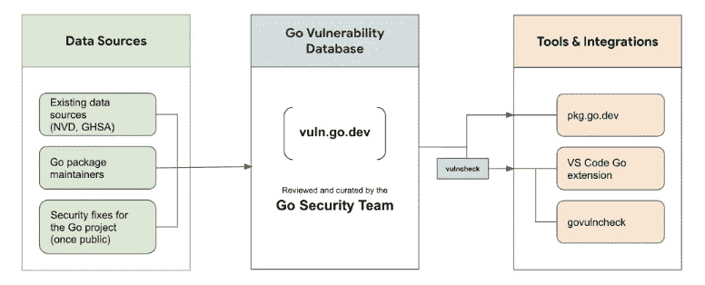
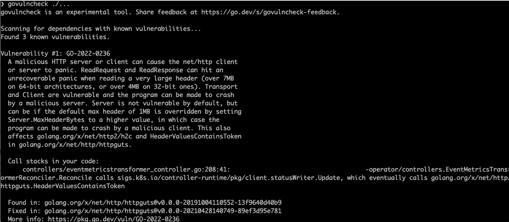
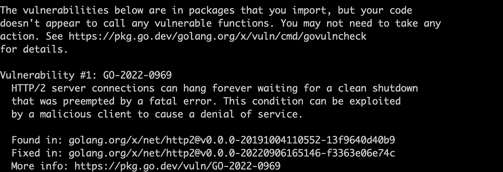
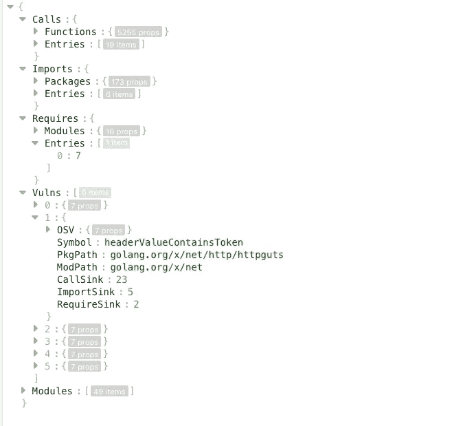
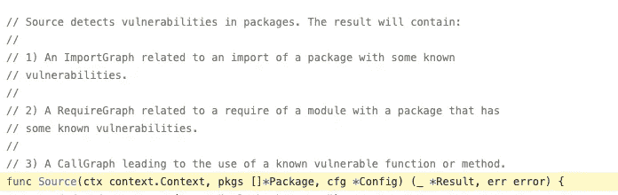
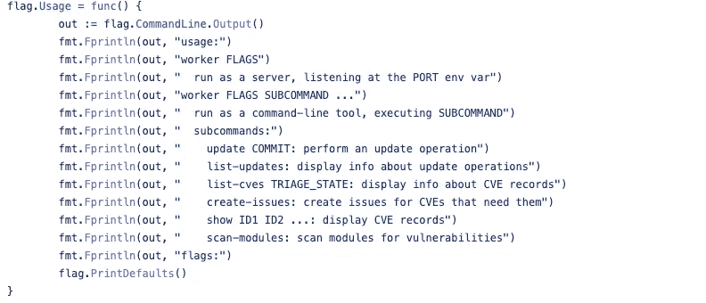
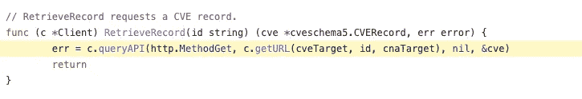
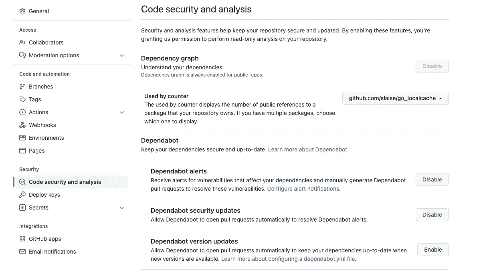
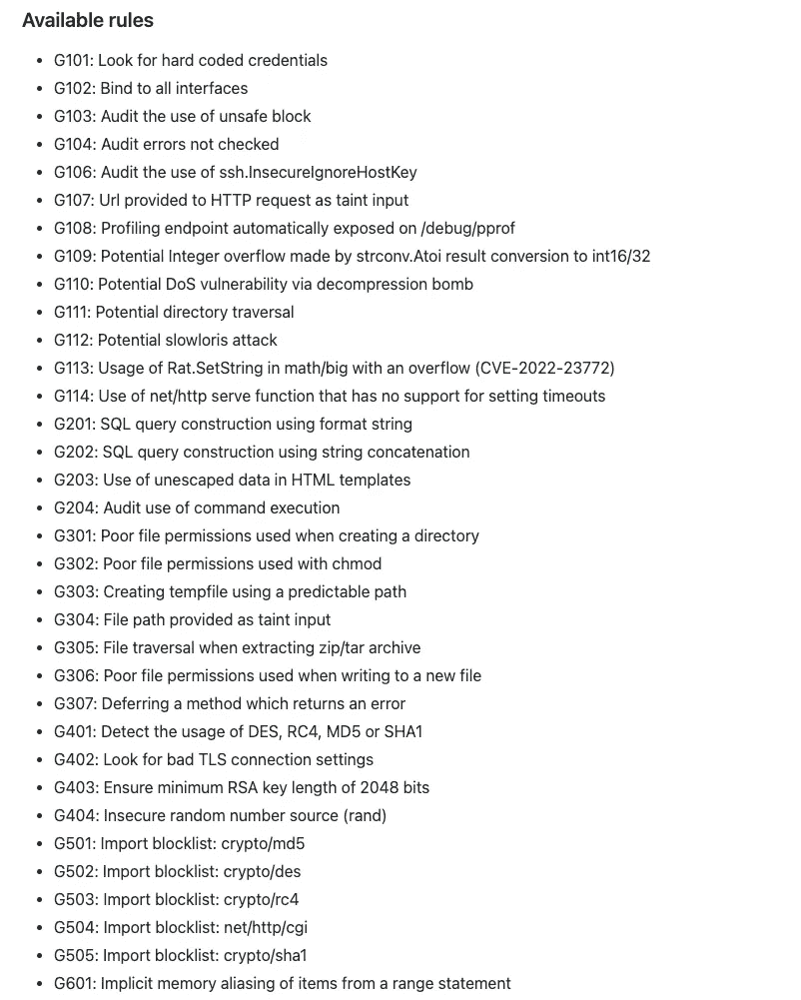

# 使用漏洞检查工具保护您的 Go 代码

> 原文：<https://betterprogramming.pub/secure-your-go-code-with-vulnerability-check-tool-bb9f8c5ecd00>

## 保护代码的官方工具


来自[Unsplash](https://unsplash.com/photos/Skf7HxARcoc)Markus Spiske

任何语言、任何代码都存在安全漏洞，有的是我们自己写的，但更多的是来自上游的依赖，甚至是底层的 Linux。我们已经在 [*路径中讨论了 Go 和 Kubernetes 映像的安全保护方法，以实现最佳 Kubernetes 安全性的*](/path-to-a-perfect-go-dockerfile-f7fe54b5c78c) 和 [*映像漏洞扫描*](/image-vulnerability-scanning-for-optimal-kubernetes-security-c3ba933190ef) *、*，其中安全扫描是基于泛型执行的。

随着 Go 社区的壮大，越来越多的开源包造成了更多的安全漏洞，这引起了 Go 官方的关注，随后在 2022 年 9 月推出了安全扫描工具 Go 漏洞检查。



来自[https://go.dev/blog/vuln/architecture.png](https://go.dev/blog/vuln/architecture.png)

如果你对这个工具感兴趣，就跟我来，我们一起消化它的内在逻辑，然后充分利用它。

# 使用 Go 漏洞检查

首先，我们来试试。

安装(仅从 Go 1.18 开始支持)。

```
go install golang.org/x/vuln/cmd/govulncheck@latest
```

然后在项目目录下运行，`go.mod`文件所在的目录。

```
govulncheck ./...
```

以我的一个 Kubernetes 操作员项目作为演示。报告中显示了两个漏洞。

*   **扫描与已知漏洞的依赖关系，**是项目代码中的漏洞，可能是当前 Go 版本中的漏洞，升级 Go 即可解决。



*   **以下漏洞存在于您导入的包中，**是项目依赖关系中的漏洞，只能通过升级相应的包依赖关系来修复。



以下给出了这两个漏洞的信息。

*   检测到多少漏洞
*   每个漏洞的具体信息，包括提交日期、详细描述和漏洞报告的链接
*   发现漏洞的具体代码，如哪种方法和哪一行
*   发现漏洞的版本和修复版本

## **在 CI/CD 中运行政府性**

如果我们将工具集成到 CI/CD 管道中会更有效，这可以通过导出 JSON 文件的结果，然后使用`-json`标志来实现。

```
govulncheck -json ./...
```

JSON 文件是详细的输出，包括扫描过程、调用条目和扫描结果。



`Calls`是与本机代码相关的检查。`Imports`是检查依赖关系。而`Vulns`就是检查结果。

对于`jq '.Vulns | length'`，我们可以设置`!= 0`。对于当前的操作者，我们可以将相关的 bash 放到 Makefile 中，并在 CI/CD 中运行它。

`vuln`还支持通过用二进制文件名替换`./…` 来测试二进制文件。除此之外，当集成到 CI/CD 中时，它还适用于检测只有 Docker 映像的 Go 项目中的漏洞。

## **检查测试代码**

默认情况下，vuln 不检查测试代码，但是您可以使用以下命令扫描测试文件:

```
-test flag govulncheck -test pkg/test/*
```

# 内部 Go 漏洞检查

vuln 工具的工作原理是运行命令行工具，读取 vuln 数据库来分析`go.mod`文件和 Go 代码。所以主要由两部分组成。

*   vuln 命令行工具的开发
*   `vulndb`数据库的维护

## Vuln 命令行工具

读取命令行工具代码通常[从定义命令行的地方开始](https://github.com/golang/vuln/blob/cbe0a6944b8b222c8d3af76d422695d0d486627b/cmd/govulncheck/main.go#L76)。整个过程很简单，只需要 5 个步骤就可以查来源。

*   读取和配置数据库客户端
*   加载配置
*   阅读源代码和序列
*   发现
*   处理结果

核心是`[vulncheck.source()](https://github.com/golang/vuln/blob/cbe0a6944b8b222c8d3af76d422695d0d486627b/vulncheck/source.go#L30)` [](https://github.com/golang/vuln/blob/cbe0a6944b8b222c8d3af76d422695d0d486627b/vulncheck/source.go#L30)法。



分别建立`import`和`require`图形，进行扫描。`import`用于当前代码中使用的内容，而`require`用于连接未直接使用的依赖包。​

## Vuln 数据库

`vulndb`包含所有漏洞信息，同步其他一些开源漏洞库，用用户提交的票介绍社区发现的漏洞。你可以在 https://pkg.go.dev/vuln/的[查看所有相关的漏洞。](https://pkg.go.dev/vuln/)

每个漏洞都有六个详细的属性。

> ***始乱终弃的数据集。*** *该数据库将由 Go 安全团队积极维护，并将提供一致的元数据和对所跟踪漏洞的统一分析，其重点不仅在于实现检测，还在于实现精确的影响评估。*
> 
> ***基础元数据。*** *条目将包括漏洞的特定于数据库的唯一标识符、受影响的软件包和版本范围、粗略的严重性等级，以及* `*GOOS*` */* `*GOARCH*` *(如果适用)。如果丢失，我们还将分配一个 CVE 号码。*
> 
> ***定位元数据。*** *每个数据库条目将包括足以能够以低误报率检测受影响的下游应用程序的元数据。例如，它将包括受影响的符号(函数、方法、类型、变量……)，以便可以通过静态分析识别未受影响的消费者。*
> 
> ***网页。*** *每个漏洞都会链接到一个网页，上面有漏洞的描述、补救说明和附加链接。*
> 
> ***真理之源。*** *该数据库将被维护为一个公共 git 存储库，类似于其他 Go 存储库。数据库条目将通过一个稳定的协议可用(见“协议”)。存储库本身的内容将采用内部格式，如有更改，恕不另行通知。*
> 
> ***分诊流程。*** *候选条目将来自现有的流(如 CVE 数据库和安全邮件列表)以及社区提交的内容。两者都将由团队进行处理，以确保元数据和分析的一致性。*我们特别鼓励维护人员报告他们自己模块中的漏洞。

在实现时，`vulndb`还提供了一套 cmd 命令，用于数据库维护、在线验证等。例如， [worker](https://github.com/golang/vulndb/blob/master/cmd/worker/main.go) 命令可以在本地启动一个服务器并扫描 Git 中的文件。



[cve](https://github.com/golang/vulndb/blob/master/cmd/cve/main.go) 命令可以查询和更新漏洞信息，调用 HTTP 请求获取相关信息。



我们可以下载`vulndb`代码`git clone [https://github.com/golang/vulndb.git](https://github.com/golang/vulndb.git),`，然后通过`devtools`下的脚本在本地测试和运行这些命令。

# 可供选择的事物

`vuln`来自 Go 官方，应该很快就会流行，但还是有一些缺点。

*   它只有一个`Expeirmental tool`。
*   仅支持 Go 1.18 及以上版本的二进制代码校验。
*   它只检测当前 Go 版本中的漏洞。例如，如果我将我的 Go 升级到最新的 1.19，那么 1.18 中的依赖项漏洞将不会被报告。
*   它的输出方式是有限的。`JSON` 输出太复杂，`text` 只针对本地环境，比如源代码中的汇总输出格式只支持开发和测试环境。
*   它在扫描接口和函数指针时会返回误报或不准确的堆栈报告。

不要固步自封，等 vuln 工具完善的时候再看看其他的 Go 依赖安全扫描工具。目前最流行的是 Github 安全依赖扫描和 [*gosec*](https://github.com/securego/gosec) 工具。

## *GitHub 安全依赖扫描*

对于开源的 Github Go 项目，我们可以通过在设置中配置`Dependabot alerts`来进行定期的依赖扫描。



GitHub 安全扫描支持通过电子邮件或 GitHub 通知的每日或每周扫描报告。它还提供了一键修复的快捷方式，非常适合开源 Go 项目。

## [*gosec*](https://github.com/securego/gosec)刀具

`gosec`工具与 vuln 工具非常相似，两者都是命令行工具，并且使用相似的规则扫描 Go 漏洞。



但是`gosec`支持所有 Go 版本，操作选项更加丰富，比如扫描特定规则，扫描配置文件，输出 JSON、YAML、CSV 等多种格式的报告。

在`vuln`提供更多功能之前，可以说`gosec`更加成熟。

# *结论*

随着 Go 的发展，越来越多的安全问题出现，仔细选择依赖项并定期更新非常重要。然而，当需要定期更新 pr 和 merge 时，这并不是一件容易的事情。这将被一些用户忽略。依赖扫描是一种解决方法，通过直接在 CI/CD 中构建失败来迫使用户进行更新。

工具正在发展中，我将密切关注它，并期待它未来的优化。

# *参考*

*   [https://go.dev/blog/vuln](https://go.dev/blog/vuln)
*   [https://go . Google source . com/proposal/+/master/design/draft-vulndb . MD](https://go.googlesource.com/proposal/+/master/design/draft-vulndb.md)
*   [https://docs . github . com/en/repositories/managing-your-repository ys-settings-and-features/enabling-features-for-your-repository/managing-security-and-analysis-settings-for-your-repository](https://docs.github.com/en/repositories/managing-your-repositorys-settings-and-features/enabling-features-for-your-repository/managing-security-and-analysis-settings-for-your-repository)
*   [https://github.com/securego/gosec](https://github.com/securego/gosec)