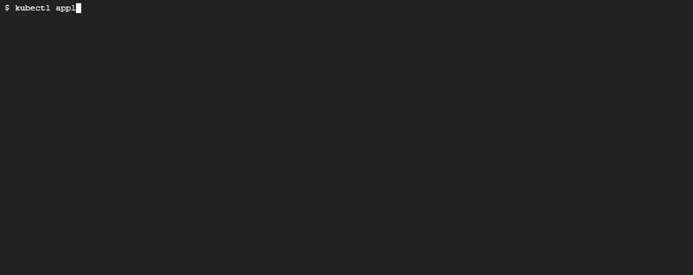

# 使用 AppArmor 保护您的 Kubernetes 集群

> 原文：<https://betterprogramming.pub/secure-your-kubernetes-cluster-with-apparmor-e4bb9fef37e1>

## 为您的集装箱工作负载启用 AppArmor 的实用指南


Pierre Bamin 在 [Unsplash](https://unsplash.com?utm_source=medium&utm_medium=referral) 上拍摄的照片

[AppArmor](https://apparmor.net/) 是一个标准的 Linux 安全模块实现，允许您在组和用户级权限之上，对您的 Linux 系统实施细粒度控制。因此，它有助于将您的程序限制在运行所需的有限的资源、文件和其他权限范围内。此外，它使您能够在容器应用程序中实现最小特权原则。

市场上的大多数容器都使用标准 Linux 发行版的基本映像。虽然使用像 Alpine 这样的发行版作为基础映像可以在很大程度上帮助减少攻击面，因为它不包含不必要的包管理器和其他膨胀软件，但我们仍然需要限制容器进程，只做它打算做的事情，即，它应该只修改文件，并运行它需要的命令——其他所有事情都应该被拒绝。

AppArmor 帮助实施这种方法。然而，虽然 AppArmor 在减少攻击面方面有很大帮助，但它也有其局限性。因此，不应将其视为灵丹妙药，还应考虑保护容器的其他方法。

AppArmor 使用包含允许或拒绝特定操作的特定规则的配置文件。您可以在“强制”或“审核”模式(也称为投诉模式)下使用 AppArmor 配置文件。当你对一个特定的程序不够了解时，最好先在抱怨模式下运行它，看看你的容器进程正在执行什么合法的操作。然后，您可以在配置文件中添加所需的操作，并使用 enforce 模式拒绝所有其他操作。

因为 AppArmor 是一个标准的 Linux 特性，所以概要文件应该加载到 Kubernetes 节点上。虽然您可以通过将配置文件复制到 Kubernetes 集群的所有节点上，使用 Ansible 或类似的启动脚本来手动完成此操作，但它在 GKE 这样的托管产品中效果不太好，在这些产品中，您的节点也会随着流量自动缩放，并且使用 AppArmor 配置文件初始化新节点可能并不简单。

这个问题的一个很好的解决方案是使用 DaemonSet 在您的节点上配置 AppArmor 配置文件，因为 daemon set 在所有节点上运行。管理配置文件的一个很好的方法是使用 Kubernetes 本地 configMap 资源，它可以帮助将它们存储在您的 Kubernetes 集群的 etcd 中。我们将在演示中研究这种方法。

# 创建 GKE 集群

在本练习中，我们将使用 GKE，为此您需要一个 GCP 帐户。然而，请随意使用您喜欢的任何解决方案。没关系。首先，我们需要使用以下命令创建我们的 GKE 集群:

```
$ gcloud container clusters create cluster-1 --zone us-central1-a
```


正如我们所见，GKE 集群已经创建。下一步是查看 AppArmor 装载机 DaemonSet。

# 表观装载机 DaemonSet

我们将在集群中创建三个配置文件:

*   拒绝写入—此配置文件拒绝所有写入。它特别适用于只读窗格。
*   审核写入—此配置文件不拒绝任何写入，但它将审核对计划 pod 的节点日志的所有写入尝试。
*   Nginx——这个概要文件是一个细粒度策略的例子，它在 nginx 容器上实现了最小特权原则。我们将详细研究这个问题。

资源清单文件由多个资源组成。建议我们在不同的名称空间中创建 DaemonSet 和相关的 ConfigMap 资源，以将该名称空间仅限于集群管理员。因此，`apparmor-loader.yaml`清单文件的第一部分是名称空间:

然后我们需要在下面的`ConfigMap`中定义概要文件:

在数据部分中，我们有多个要加载到节点上的概要文件。第一个概要文件，如下面的部分清单所示，由“拒绝所有文件写入”规则`deny /** w,`组成

`ConfigMap`中的下一个配置文件是审计所有写入，如下所示:

最后，我们有以下细粒度的策略，允许 NGINX 需要运行的一切，拒绝它不需要做的事情:

清单的下一部分是`DaemonSet`。让我们来看看:

虽然大部分清单都是标准的，但是让我们来看看 spec 部分:

*   它运行一个名为`apparmor-loader`的容器，这个容器使用了`google/apparmor-loader:latest`容器。容器将在`/profiles`目录中定义的所有 AppArmor 概要文件加载到它正在运行的节点上。这里要记住的一点是，虽然它可以将新的概要文件加载到节点中，但是它不能删除或修改现有的概要文件。
*   它每 30 秒轮询一次`/profile`目录中的新配置文件
*   它挂载`/sys`和`/etc/apparmor.d`目录来访问 AppArmor 模块，并从`ConfigMap`挂载 profiles 目录来访问我们已经定义的概要文件。

现在，我们已经了解了它的作用，让我们继续应用它:


正如我们所见，`DaemonSet`的 pod 正在每个节点上运行。现在，让我们打开一个外壳，看看里面有什么。我们将首先切换到`/profiles`目录并列出概要文件，我们应该看到所有三个概要文件都列在其中。当我们`cat`配置文件时，我们应该看到我们包含在`ConfigMap`中的数据，如下所示:


因此，当所有三个概要文件都被加载时，让我们创建使用这些概要文件的 pod。

# 拒绝所有写入

让我们首先创建一个使用“拒绝所有写入”规则的 pod。要使用规则，我们需要在`annotations`中指定规则，如下面的`busybox-deny-writes.yaml`清单文件所示:

该注释的格式如下:

`container.apparmor.security.beta.kubernetes.io/<container_name>: localhost/<profile_name>`

在这种情况下，我们将`k8s-apparmor-deny-write`概要文件应用到`busybox`容器。让我们在这个 yaml 上做`kubectl apply`,看看我们会得到什么:


当我们使用`exec`命令获取 pod 的 shell 并尝试使用`touch`命令创建文件时，我们什么也做不了。这就是否认规则为我们做的。现在，让我们看一下审计规则。

# 审核所有写入

在实施规则之前，我们使用审计模式来查看容器试图做什么。因此，让我们尝试使用这里的规则，以便当我们向容器文件系统写入内容时，日志中会生成一个审计日志。

以下`busybox-audit-writes.yaml`清单使用审计写入规则:

现在，让我们继续应用这个清单，打开一个到 pod 的 shell 会话，并尝试编写几个文件。我们还将尝试打开一个到部署了 pod 的节点的 shell 会话，并从日志中获取审计日志。让我们看看如何:



如您所见，我们可以写入文件系统，所有写入也可以在日志中获得。现在，没有人想在一个容器中实现简单的“拒绝所有写入”或“审计所有写入”规则。相反，您应该对您希望在系统上给予容器的权限进行更细粒度的控制。接下来让我们来看看。

# NGINX 的细粒度策略

我们将在运行 NGINX 容器的 pod 中使用我们之前定义为`k8s-apparmor-nginx`的 NGINX 细粒度策略。让我们先看看`nginx.yaml`清单文件:

```
apiVersion: v1
kind: Pod
metadata:
  name: nginx
  labels:
    app: nginx
spec:
  securityContext:
    seccompProfile:
      type: Localhost
      localhostProfile: profiles/fine-grained.json
  containers:
  - name: nginx
    image: nginx
    securityContext:
      allowPrivilegeEscalation: false
```

现在让我们继续应用它:


如我们所见，我们已经成功创建了 nginx pod。现在，它似乎运行得很好，我们还可以看到 pod 的一些审核事件，就像我们审核文件写入操作一样。现在，让我们继续向 nginx pod 发送一个请求，看看是否会得到响应。我们将使用`kubectl port-forward`将流量从本地机器的端口`8080`转发到容器的端口`80`，然后从一个单独的终端会话中点击`localhost:8080`上的`curl`命令，如下所示:


正如我们所见，我们在这里得到默认的 NGINX 响应。细粒度的规则不会阻止 NGINX 需要做的任何事情。但是，它会拒绝访问 NGINX 不需要运行的文件和目录。这是对您的细粒度访问，以及我们如何使用 AppArmor 对我们的容器执行最小特权原则。

# 结论

AppArmor like [Seccomp](/secure-your-kubernetes-cluster-with-seccomp-9403ecf831b2) 有助于围绕容器工作负载启用安全边界，并允许我们实现最小特权原则。在加强 Kubernetes 集群时，它们很有帮助，并且是基本的 Kubernetes 安全最佳实践。

感谢阅读！我希望你喜欢这篇文章！