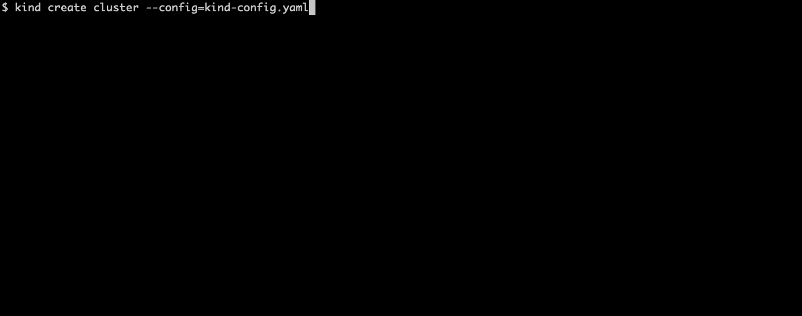
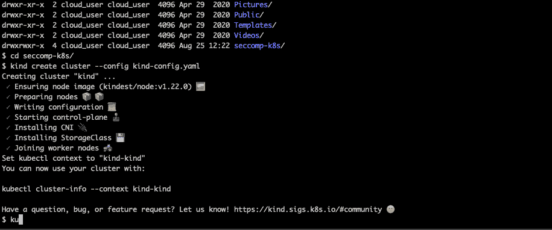
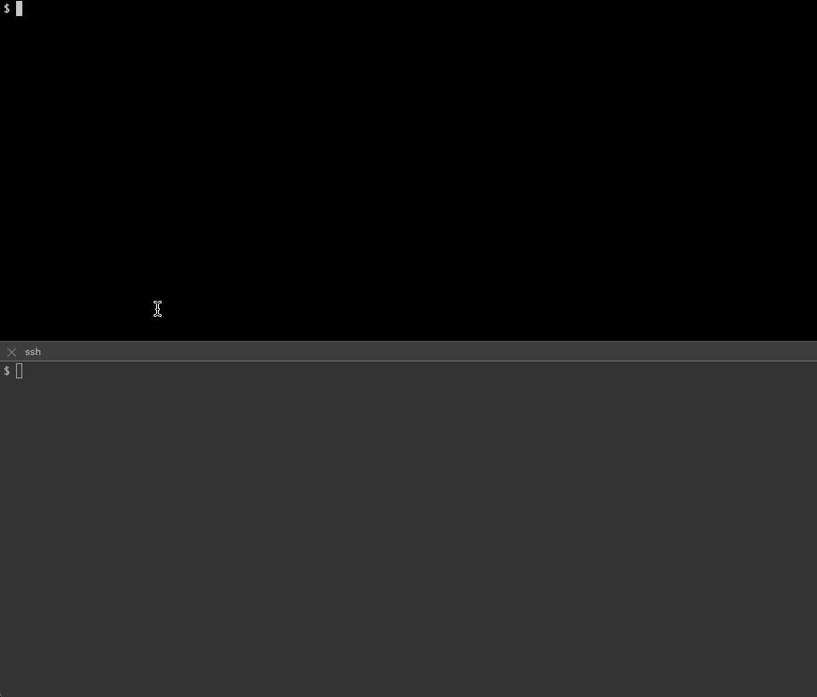

# 使用 Seccomp 保护您的 Kubernetes 集群

> 原文：<https://betterprogramming.pub/secure-your-kubernetes-cluster-with-seccomp-9403ecf831b2>

## 在容器的系统调用中应用最小特权原则的实践指南

照片由[马特·阿特兹](https://unsplash.com/@mattartz?utm_source=medium&utm_medium=referral)在 [Unsplash](https://unsplash.com?utm_source=medium&utm_medium=referral) 上拍摄

Kubernetes 已经在那里存在了一段时间，从那以后，它在技术爱好者和严肃的企业中非常受欢迎。虽然它试图改善我们部署和运行应用程序的方式，这本身就是一个巨大的飞跃，但它是一项相对较新的技术，正在逐步走向成熟。Kubernetes 一直特别关注安全性，我们有多种方法可以解决这个问题。一种这样的方法是使用 Seccomp。

Seccomp 代表安全计算，是从 2.6.12 版开始的标准 Linux 内核特性。它允许您使用 syscall 过滤器来限制特定进程的权限，只允许它进行系统调用。

当我们想要减少容器的攻击面时，这是特别有用的。例如，如果一个容器只呈现静态网页，那么它就不需要拥有对文件系统的写访问权。同样，大多数容器不需要访问诸如重新启动或更改系统配置之类的命令。

您可以将多个功能整理到 Seccomp 配置文件中，并将该配置文件应用到您的流程中。像 Docker 这样的容器运行时默认使用这个特性，并提供适用于它运行的每个容器的`RuntimeDefault` seccomp 策略。然而，当我们运行 Kubernetes 时，它用不限制任何系统调用的`Unconfined`替换了默认的 seccomp 配置文件。

现在，这是一个网络罪犯可以利用的安全漏洞。因此，Kubernetes 允许我们从 1.19 版开始使用 Seccomp。Kubernetes 1.22 版上的一些 alpha 特性使我们能够在 Kubernetes 集群的所有工作负载上默认应用 sec comp 策略，我们也将在本教程中探讨这些特性。

# 先决条件

在这个练习中，您需要一台安装了 Docker CE 和 KinD 的 Linux 机器。您还需要分叉[这个](https://github.com/bharatmicrosystems/seccomp-k8s)存储库并将& cd 克隆到其中。

# 引导没有默认 Seccomp 配置文件的 Kubernetes 集群

由于默认的 Seccomp 策略是一个 alpha 特性，仅在 Kubernetes v1.22 及更高版本中可用，所以我们没有默认启用它。您可以通过在 kubelet CLI 中提供`feature-gates=SeccompDefault=true`和`seccomp-default`标志或者在 kubelet 配置文件中设置它们来启用该特性。

现在，让我们首先使用不带标志的 KinD 引导一个 Kubernetes 集群。

为此，我们将使用下面的`kind-config.yaml`文件:

现在让我们使用配置文件创建一个 KinD 集群:

我已经创建了一个 Docker 映像，列出了所有被阻塞的系统调用。因此，我们将使用该图像创建一个 pod，它将告诉我们哪个 seccomp 配置文件应用于我们的工作负载。让我们现在就开始吧:

正如我们所看到的，Seccomp 对于该群集是禁用的。那是因为我们没有设置正确的标志。

现在，让我们继续创建一个设置了标志的集群。

# 使用默认 Seccomp 配置文件引导 Kubernetes 集群

现在，让我们创建以下类型的配置文件:

在这个 yaml 文件中，我们有几个不同的部分。我们包含了一个`featureFlags`部分，其中`SeccompDefault`被设置为`true`。这将在该集群中启用`SeccompDefault`配置文件。我们还需要显式地将标志应用于特定的节点，所以我们添加了`kubeadmConfigPatches`，在两个节点上将`kubeletExtraArgs` — `seccomp-default`设置为`true`，将`feature-gates`设置为`SeccompDefault=true`。这也意味着我们可以在特定的节点上应用这个特性，并根据我们的需要使用`nodeAffinity`在节点上调度 pod。

现在，让我们删除旧群集，并使用所需的配置创建一个新群集:

正如我们看到的，这一次，Seccomp 被设置为过滤。这意味着 Seccomp 默认应用于所有容器。

默认设置是不错的开始，但是它们可能不足以满足您的安全需求。要解决这个问题，您还可以实现自定义的 Seccomp 配置文件。让我们在下一节看看这些。

# 实施自定义 Seccomp 配置文件

要实现自定义的 seccomp 配置文件，您必须创建一些配置文件。我们将创建三个概要文件供我们使用— `audit.json`、`violation.json`和`fine-grained.json`。

我们先来看`audit.json`。

这包含一个简单的设置为`SCMP_ACT_LOG`的`defaultAction`属性。这意味着它将审核对 Syslog 文件的所有系统调用。当我们在创建一个细粒度的概要文件之前理解什么样的系统调用是应用程序所必需的时，这个策略是有益的。

现在，让我们看看 violation.json 文件:

该文件包含设置为`SCMP_ACT_ERRNO`的`defaultAction`属性。它将拒绝所有的系统调用，因此，虽然它适合于演示目的，但在实际场景中它不会工作。

在系统调用上实现最小特权原则的整个思想是通过使用细粒度的策略，该策略包含我们的应用程序需要的系统调用并阻塞其余的系统调用。那么，让我们看看下面的`file-grained.json`政策文件:

该文件包含一个设置为`SCMP_ACT_ERRNO`的`defaultAction`，这意味着它将默认拒绝所有呼叫。然后我们定义需要允许的`syscalls`，并将动作设置为`SCMP_ACT_ALLOW`。这意味着该配置文件将阻止除允许列表中的系统调用之外的所有系统调用。

现在，事不宜迟，让我们创建一个新的集群并测试它。

# 使用自定义 Seccomp 配置文件引导 Kubernetes 集群

为此，我们将创建以下类型的配置文件:

这个文件与上一个非常相似，除了它包含一个`extraMounts`部分，该部分将`profiles`目录挂载到每个 Kubernetes 节点上的`/var/lib/kubelet/seccomp/profiles`。这将允许我们在我们的吊舱中使用这些配置文件。

让我们删除旧集群并创建一个新集群:

现在，随着集群的创建，让我们一次使用一个概要文件。让我们创建一个使用审计配置文件的 pod。

## 审计模式

我们将为此创建以下`audit-mode.yaml` pod 清单:

这里我们部署了`nginx`映像并使用了`localhostProfile` — `profiles/audit.json`。

现在让我们应用这个 yaml，看看我们得到了什么:

我们可以看到 pod 正在运行，现在我们可以测试 pod 了。

为此，我们将执行以下操作:

*   将 pod 公开为一个`NodePort`服务。
*   获取服务的`NodePort`。
*   获取其中一个 KinD 节点的 docker 容器 id。
*   使用`localhost:<NodePort>`上的`curl`点击服务。
*   在一个重复的终端中结束本地主机中的`/var/log/syslog`文件。

正如我们所看到的，当我们进行调用时，我们会在 Syslog 中看到许多审核事件。这就是审计模式的作用。让我们看看如果使用违规模式会发生什么。

## 违规模式

这次我们将使用以下`violation-mode.yaml` pod 清单:

它与`audit-mode.yaml`非常相似，但这里我们使用的是`localhostProfile` — `profiles/violation.json`。

让我们应用 yaml，看看我们会得到什么。

而这一次，吊舱在`CrashLoopBackoff`。同样，这是因为容器无法启动，因为我们已经限制了所有的系统调用。现在，让我们来看一个细粒度的策略。

## 自定义模式

在这种模式下，我们将允许 NGINX 需要运行的所有系统调用，但我们将有目的地限制其中一个，以便我们可以测试它。为此，我们使用下面的`custom-mode.yaml`文件:

这个 yaml 用的是`localhostProfile` — `profiles/fine-grained.json`。所以让我们应用它，看看我们得到了什么。

这导致了一个错误。当我们查看日志时，它不能统计一个共享对象，因为不允许该操作。这是因为我们还没有明确提供该策略。

# 结论

Kubernetes 允许 Seccomp 进入产品是一个受欢迎的变化，从安全角度来看非常有帮助。我们只是在等待这个特性从 alpha 到 beta，最后到 GA。如果您想在生产中使用这个特性，因为这个特性是在 alpha 中，请小心操作，一次滚动一个节点，以确保不会破坏任何东西。

感谢阅读！我希望你喜欢这篇文章！