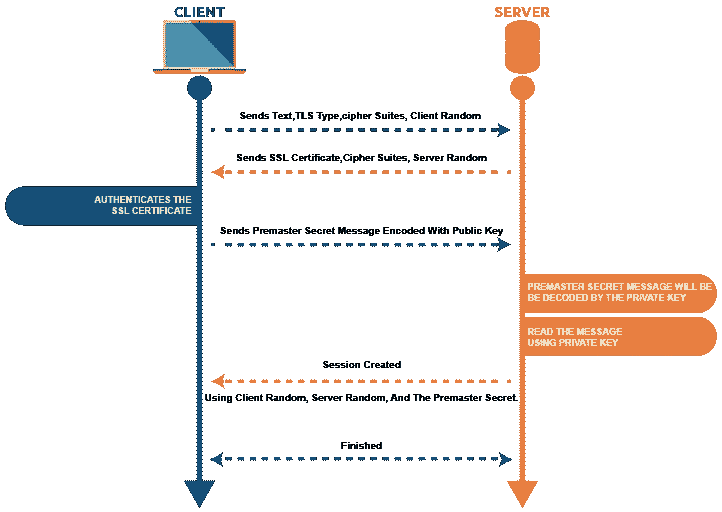
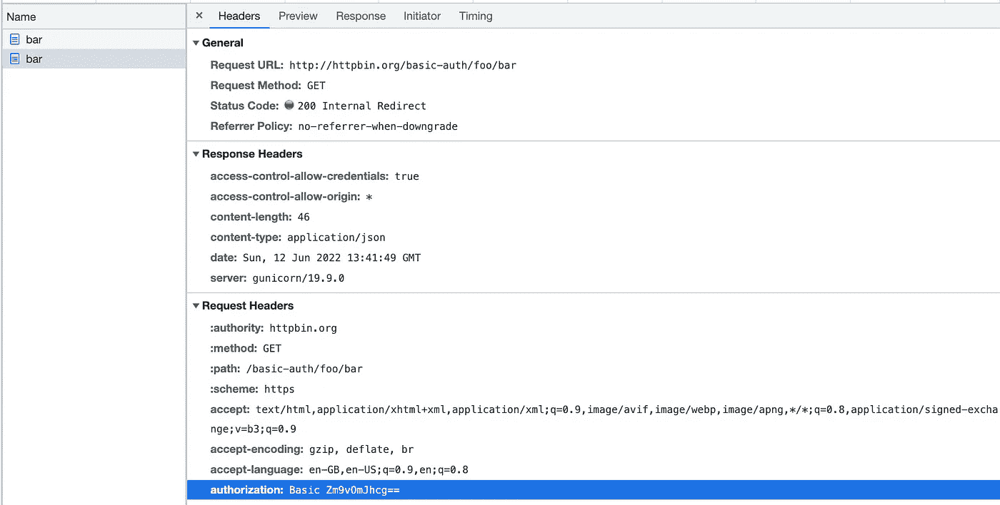
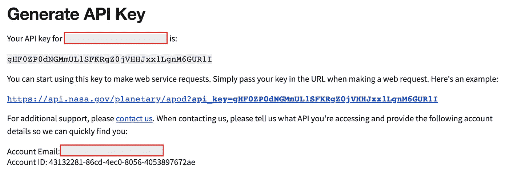
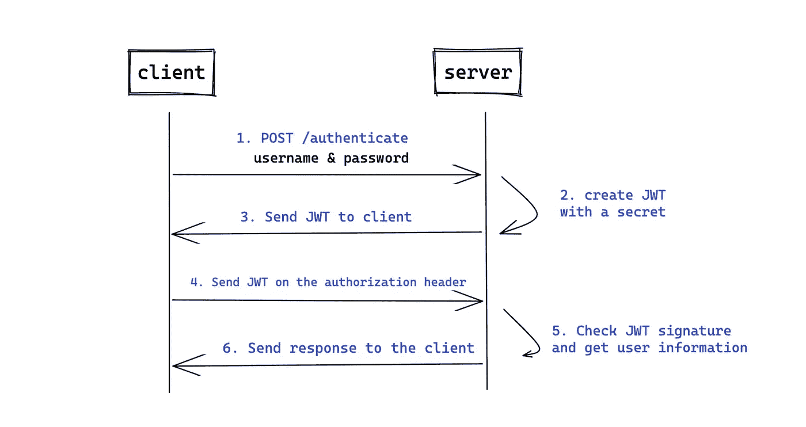
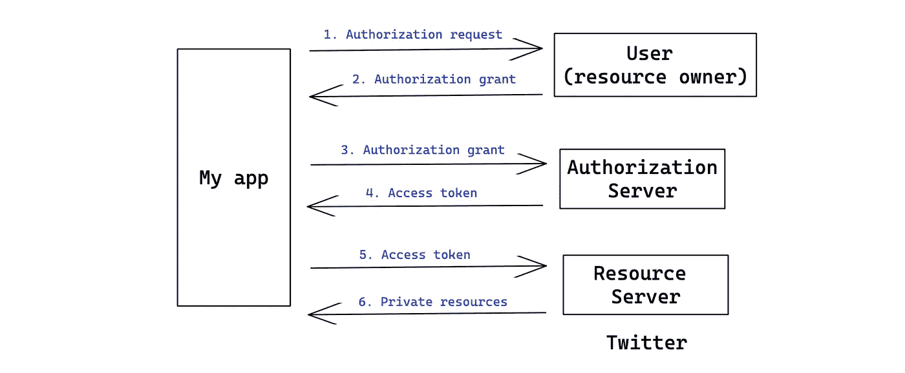

# 保护 API 的 Python 最佳实践

> 原文：<https://betterprogramming.pub/secure-your-python-api-7e52c475665e>

## 从三个方面保护您的 API


托拜厄斯·图利乌斯在 [unsplash](https://unsplash.com/) 上的照片

API 已经成为当今应用驱动世界的基础元素。包括亚马逊在内的许多公司都采用了 API 优先的方法。它将 API 的角色视为独立的产品，而不是与其他系统集成的解决方案。

通过设计，API 向世界公开了有价值的信息，如公共天气数据和私人敏感个人身份信息(PII)数据，正因为如此，[API 成为黑客的新目标。](https://securityboulevard.com/2021/07/for-hackers-apis-are-low-hanging-fruit/)没有安全的 API，就不可能构建成功的产品。

如果您还没有对您的 API 应用任何安全策略，那么这篇文章应该是一个警钟。像往常一样，我将为一些最佳实践提供 Python 实现。保护您的 API 可以被视为一个非功能性需求(NFR)。与性能和可靠性等其他 nfr 一样，很难定义 API 何时足够安全。

这就是为什么许多公司会聘请第三方来执行 API 渗透测试，以获得公平的判断。简而言之，pen tester 将尝试攻击您的 API 来检查任何可利用的漏洞。

## API 安全性的上下文

重要的事情先来。为什么我们甚至需要关心 API 安全性？API 定义了调用者可以使用的一组操作。如果我不希望这个操作被调用，那么我可以简单地排除它或者把它放在防火墙后面。

要回答这个问题，我们需要知道我们到底需要保护什么。API 安全涉及几个安全领域:信息安全、网络安全和应用程序安全。

信息安全与保护敏感数据有关。每个端点都是应用于一个或多个对象的操作。只有具有特殊角色的一组用户才能访问对象的操作。

不同角色的人可以坐在同一个房间里共享同一个 wifi，因此简单地阻断网络并不是最优的解决方案。当 API 从客户端接收请求时，需要进行某种身份验证和授权。

> 身份验证和授权的区别。简单来说，认证就是验证你是谁的过程。例如，公司内部有一个公开员工工资的内部端点。
> 
> 身份验证确认您是该公司的员工。授权是验证您有权访问哪些特定对象的过程。在这种情况下，如果您的身份检查通过，它将验证您是否有权检查公司 PII 数据。

网络安全保护网络和数据免受破坏和其他威胁。围绕这个主题有很多东西，但是在 API 的上下文中，最适用的组件是 TLS 协议(传输层安全性),它提供通信安全性。

这基本上是 HTTPS 协议的 S 部分。在 TLS 握手期间，双方交换消息以确认对方，并就他们将使用的加密算法和会话密钥达成一致。从那时起，将使用会话密钥对通信进行加密。

这是为了避免[中间人](https://en.wikipedia.org/wiki/Man-in-the-middle_attack)的攻击。

值得注意的是，TLS 用于加密传输中的数据，而不是静态数据。这超出了本文的范围。



来源: [TLS 握手步骤](https://www.ssl2buy.com/wiki/wp-content/uploads/2021/02/ssl-tls-handshake.png)

应用程序安全性确保软件能够抵御攻击和误用。例如，黑客可以在请求中注入脚本或代码，恶意数据可以欺骗软件执行非预期的命令。应用输入验证变得至关重要。

在本文的剩余部分，我将列出一些实用的 Python 安全技巧来保护应用程序。

# Python 中的 API 安全提示和实现

在了解了我们想要在 API 的上下文中保护什么之后，让我们跳到一些受这个 [OWASP API 安全十大](https://owasp.org/www-project-api-security/)列表启发的例子。

## **认证和授权**

这可能是我们在 API 安全性方面需要遵循的最重要的原则。有几种身份验证和授权方法，它们在复杂性和安全性方面各不相同。但是他们达成了共识——客户端必须提供某种与其身份相关的凭证，服务器将比较发送的内容和存储的内容。

如果凭据匹配，服务器将创建一个用户会话，并向客户端发布一个 cookie。

## *基本认证*

基本认证是非常基本的。客户端只需在请求头中包含他们的用户名和密码。它可以是明文或编码成 base 64 以节省空间。

```
requests.get('https://httpbin.org/basic-auth/foo/bar', auth=('foo', 'bar'))
```



使用 base64 编码(由作者创建)

基本身份验证是最少的身份验证方法，因为如果流量被黑客劫持，黑客可以很容易地从请求头中获得凭据，或者执行暴力攻击，他们可以尝试不同的用户名和密码，直到他们发现可以工作为止。

## *API 键*

API 密钥是服务器生成的唯一字符串，用于对客户端进行身份验证。它不同于基本身份验证中的 base64 字符串，在基本身份验证中，该字符串由客户端自己生成。一旦 API 客户机从服务器获得了密钥，它们就可以将它包含在由提供者指定的请求中的某个地方，提供者可以是查询字符串参数、请求头或请求体。

密钥生成的过程取决于提供者。比如 [NASA 开放 API](https://api.nasa.gov/) 要求客户提供姓名和邮箱。并且该密钥应该作为 URL 参数传递。



NASA API 的关键一代

在 Python 中使用 API 键

API 密钥比基本身份验证更安全。首先，它很长，很复杂，而且是随机生成的，这使得黑客很难进行暴力攻击。此外，密钥可以包含更多信息，如到期时间。即使以某种方式泄露了密钥，过了过期时间，它也会很快失效。

然而，API 密钥仍然不被认为是安全的。通常，软件使用一种算法来生成密钥，密钥可能包含用户信息。黑客可能只是通过学习 API 客户端来猜测算法。

根据来自 Google 的[建议](https://cloud.google.com/endpoints/docs/openapi/when-why-api-key)，如果您想要了解 API 流量中的使用模式、阻止匿名流量或控制调用数量，则需要 API 密钥是有意义的，但不要使用 API 密钥来认证或授权用户。

## *JWT (JSON Web 令牌)*

JWT 是一种基于令牌的身份验证。客户端首先使用用户名和密码向 API 提供者进行身份验证。提供者生成一个 JWT 并将其发送回客户端。然后，客户端将令牌添加到 API 请求的授权头中。

Python 中的 JWT 令牌



JWT 验证流程(由作者创建)

令牌本身有三个部分:`Header`部分包含用于签名和令牌类型的算法。`Payload`部分包含令牌数据，如用户名、令牌生成日期和到期日期。`Signature`部分是`Header`和`Payload`的结果，用私钥连接和加密。

当服务器收到令牌时，它将使用私钥解密签名，并将其与报头和有效负载进行比较。JWT 比 API 密钥更安全，因为 1)令牌不包含密码等敏感数据，2)使用 HMAC-SHA256 签署的签名更难解密。

PyJWT 是一个 Python 库，允许你编码和解码 JSON Web 令牌(JWT)。多用于服务器端。

然而，JWT 仍然有一些缺点。如果用户想要更改他们的密码，并且事先已经执行了身份验证，则具有先前密码的令牌在到期之前仍然有效。此外，用户需要在令牌过期后重新认证。

为了应对这些挑战，一些 JWT 库允许刷新令牌机制，或者在某些情况下强制用户重新进行身份验证。

## *OAuth 2.0*

OAuth 2.0 是一种授权标准，允许不同的服务访问彼此的数据。一个用例是，我的应用程序可以登录到用户的 Twitter 帐户，并在不知道用户的 Twitter 凭据的情况下检索用户的推文。

在 OAuth 之前，应用程序只是通过表单检索您的 Twitter 凭据，然后代表您登录，这通常是有风险的，因为应用程序可能会存储所有用户的 Twitter 凭据。使用 OAuth，服务之间的通信是基于令牌的。

下面是抽象的 Oauth2.0 流程。总的来说，有六个步骤。应用程序首先向用户请求访问 Twitter 数据的授权。如果用户授权请求，意味着成功登录 Twitter，应用程序将收到授权许可。

随后，应用程序通过提供自己的身份认证和授权许可向 Twitter 请求访问令牌。如果一切都通过验证，应用程序将通过提供一个访问令牌来检索用户资源。



抽象 Oauth 2.0 流程(由作者创建)

实际的实现因提供商而异。我写过一篇关于[使用 NextJS 和 Flask](https://medium.com/swlh/build-a-twitter-login-component-using-nextjs-and-python-flask-44c17f057096) 构建 Twitter 登录组件的文章，其中我详细解释了 Twitter Oauth 流程。

# **速率限制**

速率限制是用户在给定时间段内可以进行的 API 调用的次数。如果超过此限制，用户可能会受到限制。任何公共 API 都有速率限制，因为它保护 API 不被过度使用，以避免 DDoS 攻击之类的事情。

这里是 Zoom 的漏洞，由于缺乏速率限制，[允许攻击者在几分钟内尝试 100 万个 Zoom 密码](https://cloudsecurityalliance.org/blog/2021/05/11/understanding-the-owasp-api-security-top-10/)。简而言之，速率限制基于 API 提供者设置的阈值来限制用户对 API 的访问。

除了保护资源使用，还可以实施速率限制来控制数据流。在分布式系统中，API 负载可能不会均匀地分布在处理器上。具有速率限制可以避免一个处理器过载而另一个处理器空闲的情况。

还可以实施费率限制来控制成本。每个请求总会产生一个成本，API 收到的请求越多，它累积的成本就越多。费率限制对于节约成本可以起到极其重要的作用。API 用户也是如此。

许多现代 API 服务基于速率限制提供不同的订阅模型。在这种情况下，可以根据个人用户的需求对其应用不同的速率限制，这将确保公平使用，而不会干扰其他人的访问。

实现速率限制的 Python 库之一是`[ratelimiter](https://pypi.org/project/ratelimiter/)`。事实上，这个库对任何函数都应用了速率限制，而不仅仅是针对 API。您可以选择将其用作装饰器或上下文管理器。

```
from ratelimiter import RateLimiter

@RateLimiter(max_calls=10, period=1)
def api_call():
    passrate_limiter = RateLimiter(max_calls=10, period=1)

for i in range(100):
    with rate_limiter:
        do_something()
```

当设置并触发了速率限制时，您的 API 应该返回下面的 HTTP 状态代码:`429 Too Many Requests`。虽然 HTTP 头没有标准名称来通知用户速率限制，但是许多现代 API 服务，包括 GitHub 和 Twitter，都使用下面的头。

每个报头的描述可能因提供商而异。但一般来说，他们的意思是:

*   `X-RateLimit-Limit`:每个限制窗口允许的最大通话次数(可以是 1 小时/分钟)。
*   `X-RateLimit-Remaning`:当前限制窗口中剩余的请求数。
*   `X-RateLimit-Reset`:当前速率限制窗口重置的时间，以 UTC 表示。

一些 API 也使用类似`Retry-After`的头来告诉用户何时可以再次调用它。因此，请在 API 文档中找到这些信息。

作为一个用户，当我们收到一个 429 状态码时应该怎么做？我们不应该回避它，而是应该相应地处理它。有几个选项:1)响应通常包含上面的一个头，带有您应该等待直到下一个请求的秒数。请记住，在任务队列中等待太久不是一个好习惯。

您应该稍后重试请求，以便为其他事情释放队列。2)如果服务器没有告诉你要等多久，可以用[指数退避](https://cloud.google.com/iot/docs/how-tos/exponential-backoff)。客户端定期重试失败的请求，请求之间的延迟不断增加。延迟从一秒、两秒、四秒、八秒或更长时间开始增加。Google 在 [google-api-core](https://pypi.org/project/google-api-core/) 中提供了一个[重试](https://googleapis.dev/python/google-api-core/latest/retry.html)类，这是一个使用指数回退重试函数的助手。

# **审计日志**

保护您的 API 的另一个方面是全面了解“谁在何时何地做了什么”？许多企业，如 [Google](https://cloud.google.com/service-infrastructure/docs/audit-logging) 和 [Slack](https://api.slack.com/admins/audit-logs#who_this_document_is_for) 都提供了审计日志 API，它提供了对你的资源是如何被访问的分析。

这个想法是给资源所有者查询用户操作的能力。有了这个 API，资源所有者可以将资源访问数据提供给审计工具。所有者还可以监控潜在的安全问题或恶意访问企图。

因此，如果您是客户，可以考虑利用审计日志 API 来构建监控和警报系统。如果您是服务提供商，考虑向您的客户提供这样的 API，并帮助他们了解任何恶意的用户模式。

# **验证输入**

输入验证是应用程序安全性的一部分。这是为了确保只有格式正确的数据进入系统，防止格式错误的数据在数据库中持续存在或触发恶意脚本。输入验证应该在数据流中尽可能早地发生。在 API 的上下文中，它应该在从客户端收到数据时立即发生。

当数据到达时，应用自动模式验证通常是一个好的实践。许多 API 框架如 [connexion](https://connexion.readthedocs.io/en/latest/) 支持 [OpenAPI](https://www.openapis.org/) 规范。规范文件包括所有类型的验证，这些验证将由框架自动应用于请求体。

返回的状态代码通常是`400: Bad Request`和类似`The value is expected to be a positive integer.`的描述性错误消息，它帮助客户了解哪里出错了，并相应地更改他们的请求。

# 不要暴露不必要的数据

当错误发生在客户端或服务器端时，API 响应应该给出一些关于错误原因的提示。但是 API 不应该泄露太多关于内部服务器错误的信息。例如，状态 500 表示内部服务器错误。这就足够了。

不要将实际的错误原因放在响应体中，例如，特定的数据库错误消息或内存错误。与`400 Bad Request`错误不同，这种类型的消息对客户没有帮助，因为他们对此无能为力。经验法则是确保 API 只返回完成其功能所需的信息。

# 结论

希望这篇文章对你有用！这个清单可以一直列下去。

如果你知道其他每个人都需要知道的 API 安全项目，请在下面随意评论。

干杯！

# 参考

[https://brightsec.com/blog/api-security/](https://brightsec.com/blog/api-security/)