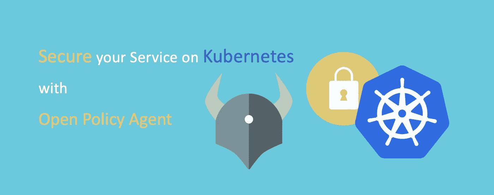
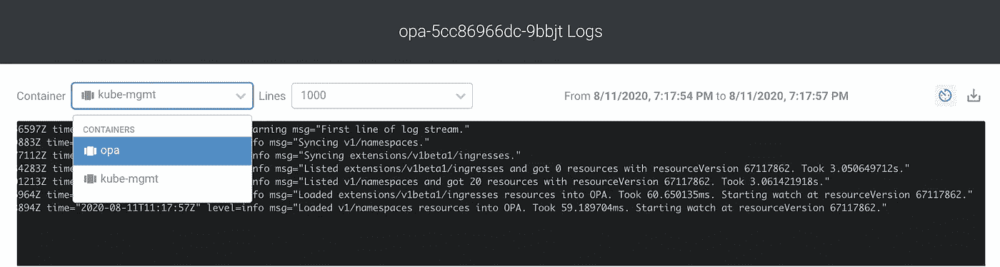

# 使用开放策略代理保护您在 Kubernetes 上的服务

> 原文：<https://betterprogramming.pub/secure-your-service-on-kubernetes-with-open-policy-agent-38a800ca1696>

## *将策略作为代码用于云原生环境，并将准入控制与您的应用分离*



图片来源:作者

在本文中，我将介绍开放策略代理 Kubernetes 准入控制器，以及如何应用策略，并提供一步一步的指导方针。

# 什么是开放策略代理(OPA)？

开放策略代理(OPA)是一个开源策略引擎，它将策略决策与服务相分离。它将策略作为代码启用，这允许策略被自动化、测试，并在版本控制中重用。它可以跨不同系统(例如 Linux、Kubernetes、CI/CD 管道、API 网关、应用程序等)统一策略实施，以便进行适当的管理和审查。

开放策略代理可以部署为 Kubernetes 中的准入控制器。出于安全、成本和管理方面考虑，您可以通过减压阀语言将自己的策略定制为代码，并在 Kubernetes 中实施策略。

你可以在 https://www.openpolicyagent.org/的[了解更多关于开放式保单代理的信息。](https://www.openpolicyagent.org/)

# Kubernetes 入场控制器

Kubernetes 准入控制器在创建、更新和删除操作期间对对象实施策略。在请求被认证和授权之后，在请求发生并存储在配置中之前，它们拦截对 Kubernetes API 服务器的请求。

在 Kubernetes 中部署 OPA 作为准入控制器，允许容器映像只来自公司映像注册中心的要求，防止创建冲突的入口对象，为非根用户实施策略，等等。

你可以在[https://Kubernetes . io/docs/reference/access-authn-authz/admission-controllers/](https://kubernetes.io/docs/reference/access-authn-authz/admission-controllers/)了解更多关于 Kubernetes 准入控制器和政策的信息。

# 打开策略代理安装

## 先决条件

Kubernetes 集群已经启动并运行。

## 部署 OPA

运行以下命令创建 OPA 证书颁发机构和密钥对。

```
openssl genrsa -out ca.key **2048**
openssl req -x509 -new -nodes -key ca.key -days **100000** -out ca.crt -subj "/CN=admission_ca"cat >server.conf <<EOF
[req]
req_extensions = v3_req
distinguished_name = req_distinguished_name
[req_distinguished_name]
[ v3_req ]
basicConstraints = CA:FALSE
keyUsage = nonRepudiation, digitalSignature, keyEncipherment
extendedKeyUsage = clientAuth, serverAuth
EOFopenssl genrsa -out server.key **2048**
openssl req -new -key server.key -out server.csr -subj "/CN=opa.opa.svc" -config server.conf
openssl x509 -req -in server.csr -CA ca.crt -CAkey ca.key -CAcreateserial -out server.crt -days **100000** -extensions v3_req -extfile server.conf
```

然后，在 Kubernetes 中创建一个秘密来存储 OPA TLS 凭证。

```
kubectl create secret tls opa-server --cert**=**server.crt --key**=**server.key
```

为 opa 创建一个名为“OPA”的名称空间

```
kubectl create namespace opa
```

部署下面的 yaml 文件进行安装。

检查您的 OPA 状态。

```
kubectl get pod -n opa
```

你应该能看到分离舱已经启动并运行了。


opa pod 状态



使用 kube-mgmt 和 opa 的 opa 容器日志

标记 OPA 将跳过资源控制的名称空间。我们现在用下面的命令跳过 kube-system 和 opa。

```
kubectl label ns kube-system openpolicyagent.org/webhook**=**ignore
kubectl label ns opa openpolicyagent.org/webhook**=**ignore
```

您可以检查名称空间标签。

```
kubectl get ns --show-labels | grep openpolicyagent
```


带有`openpolicyagent.org/webhook**=**ignore`的名称空间标签

将 OPA 注册为准入控制器。

# 定义和应用策略

我们将使用下面的例子来应用检查有效入口主机是否在名称空间中被注释的策略。

例如，创建一个名为`ingress-whitelist.rego`的减压阀策略。

减压阀是声明性的，支持 JSON 等结构化数据输入。

您可以通过[https://www . openpolicy agent . org/docs/latest/policy-language/](https://www.openpolicyagent.org/docs/latest/policy-language/)了解更多关于减压阀的信息。

https://play.openpolicyagent.org/p/ikesWCFIH8 减压阀政策游乐场。

```
*package kubernetes.admission**import data.kubernetes.namespaces**operations = {"CREATE", "UPDATE"}**deny[msg] {
 input.request.kind.kind == "Ingress"
 operations[input.request.operation]
 host := input.request.object.spec.rules[_].host
 not fqdn_matches_any(host, valid_ingress_hosts)
 msg := sprintf("invalid ingress host %q", [host])
}**valid_ingress_hosts = {host |
 whitelist := namespaces[input.request.namespace].metadata.annotations["ingress-whitelist"]
 hosts := split(whitelist, ",")
 host := hosts[_]
}**fqdn_matches_any(str, patterns) {
 fqdn_matches(str, patterns[_])
}**fqdn_matches(str, pattern) {
 pattern_parts := split(pattern, ".")
 pattern_parts[0] == "*"
 str_parts := split(str, ".")
 n_pattern_parts := count(pattern_parts)
 n_str_parts := count(str_parts)
 suffix := trim(pattern, "*.")
 endswith(str, suffix)
}**fqdn_matches(str, pattern) {
    not contains(pattern, "*")
    str == pattern
}*
```

将策略存储到标签为***openpolicyagent.org/policy=rego***的配置图中

```
kubectl create configmap ingress-whitelist --from-file=ingress-whitelist.rego -n opakubectl label  configmap ingress-whitelist openpolicyagent.org/policy=rego -n opa
```

然后我们可以测试政策是否有效。

# 测试策略

使用下面的命令创建一个简单的 web 服务。

```
kubectl create ns testkubectl create deployment web --image=gcr.io/google-samples/hello-app:1.0 -n test kubectl expose deployment web --type=NodePort --port=8080 -n test
```

然后尝试应用以下入口设置。

注意:由于我们应用了检查只有有效的入口主机在名称空间中被注释的策略，我们应该预料到它会失败。

```
apiVersion: networking.k8s.io/v1beta1
kind: Ingress
metadata:
 name: example-ingress
 namespace: test
spec:
 rules:
 — host: “test-hello.opa”
 http:
 paths:
 — path: /
 backend:
 serviceName: web
 servicePort: 8080
```

您应该得到“拒绝请求”,表明它是一个无效的入口主机。


由于入口主机无效，OPA 拒绝了入口创建请求

尝试在名称空间中添加一个注释来声明我们允许的主机。

```
kubectl annotate ns test ingress-whitelist="*.opa"
```


描述名称空间以查看注释

再次尝试应用入口。这一次，你应该会得到一个成功的结果。


入口创建成功

现在，您可以开始自定义自己的策略了。

# 我的工作版本


感谢阅读！