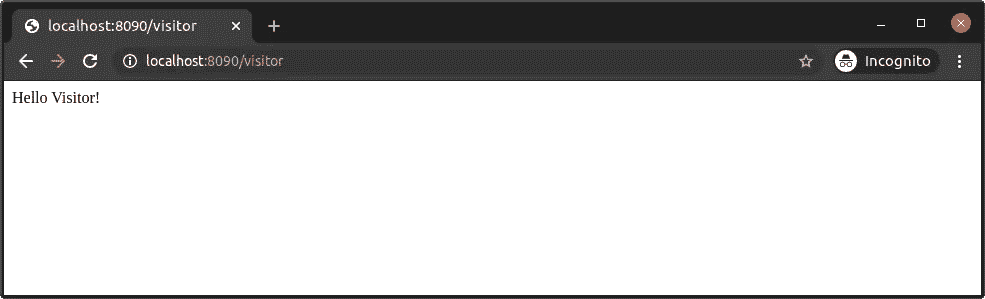
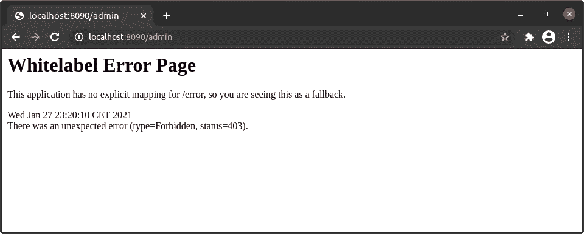
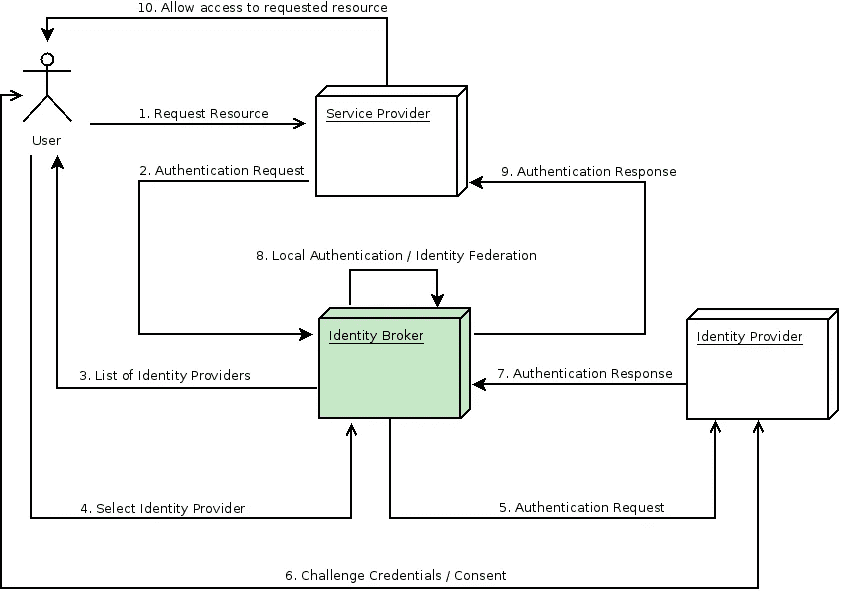
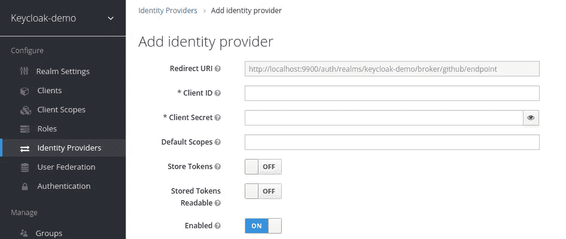
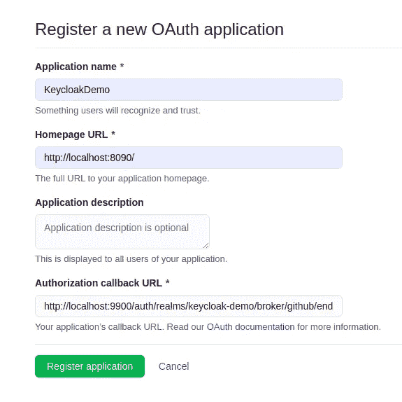
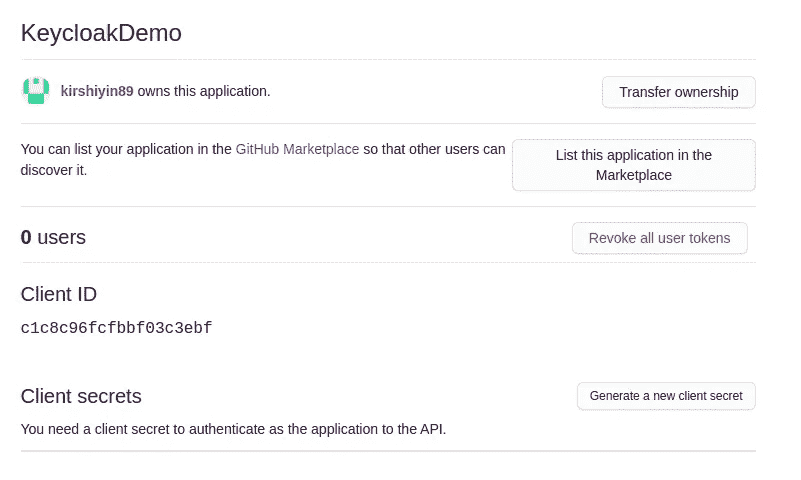
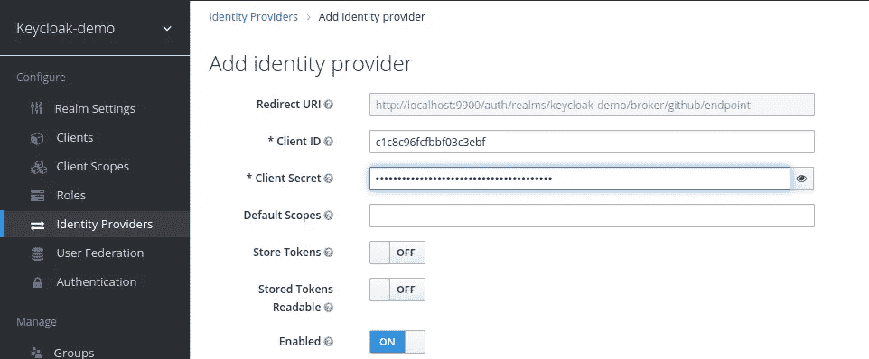
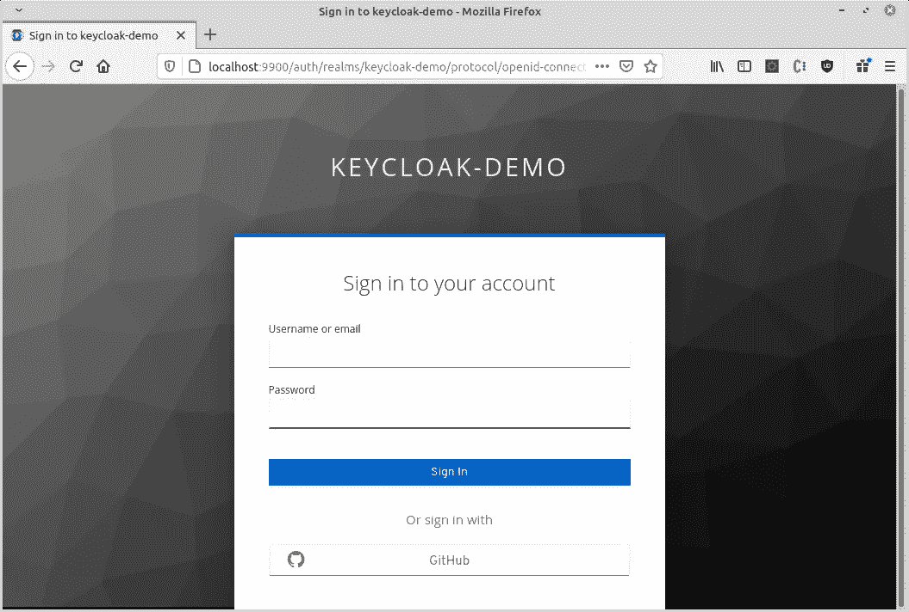
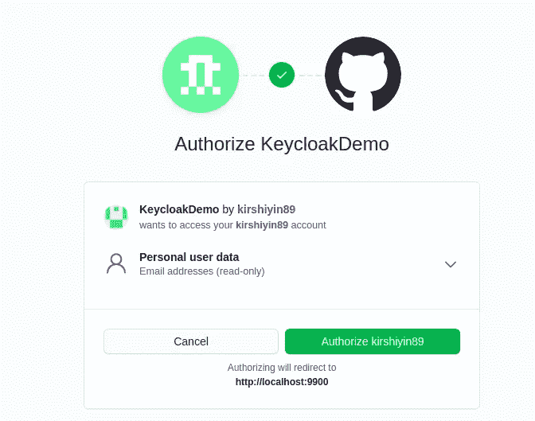
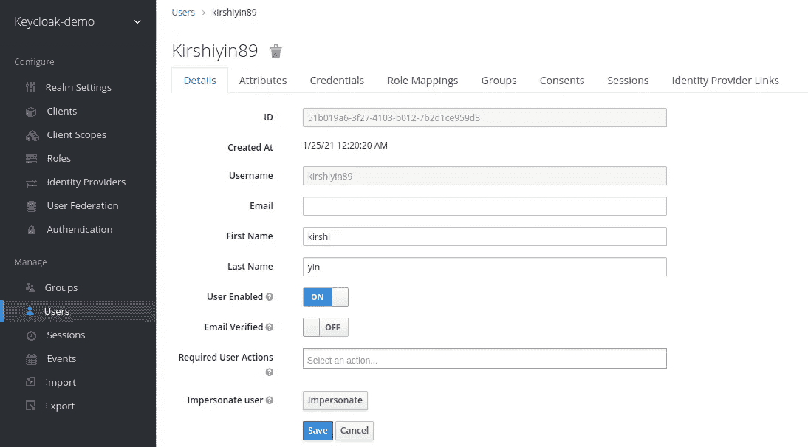

# 使用 Spring Security 和 GitHub 保护您的 Spring Boot 应用程序

> 原文：<https://betterprogramming.pub/secure-your-spring-boot-app-with-spring-security-and-github-using-keycloak-a6eb5bfeb4bf>

## 添加社交媒体身份提供商以安全地验证你的应用


照片由 [AltumCode](https://unsplash.com/@altumcode?utm_source=medium&utm_medium=referral) 在 [Unsplash](https://unsplash.com?utm_source=medium&utm_medium=referral) 上拍摄。

这篇文章是我之前关于如何用 [Keycloak](https://www.keycloak.org/) 认证 Spring Boot 应用的[教程](https://medium.com/better-programming/how-to-authenticate-your-spring-boot-application-with-keycloak-1e9ccb5f2478)的增强版。如果你不熟悉 Keycloak 的基本概念，我建议你浏览一下之前的教程。但是不要担心，你仍然可以跟上，因为我们现在将涉及不同的主题。

您将从本教程中学到什么:

*   如何将 Spring Security 与 Keycloak 集成
*   身份代理概念
*   如何使用第三方社交媒体身份提供商(例如 GitHub)来验证您的应用

让我们开始吧！

# 将 Spring Security 添加到您的 Spring Boot 应用中

快速回顾一下之前的教程:

*   我们开发了一个运行在`localhost:8090`上的简单 Spring Boot 应用。
*   Keycloak 服务器运行在`localhost:9090`上，对想要登录 Spring Boot 应用的用户进行认证。
*   拥有`visitor`角色的用户可以访问`localhost:8090/visitor`页面，拥有`admin`角色的用户可以访问`localhost:8090/visitor`和`localhost:8090/admin`。

我们将使用我们之前项目中的简单 Spring Boot 应用程序。您可以在本文末尾链接的 GitHub 资源库中找到完整的源代码。

## 更新依赖关系

修改`build.gradle`文件并添加 Spring 安全性的依赖项。您的最终文件应该如下所示:

# 配置 Spring 安全性

在 IDE 中打开 Spring Boot 项目，并添加一个名为`KeycloakConfig.java`的新 Java 类。下面将解释每种方法:

注意，`KeycloakConfiguration`注释定义了我们在 Spring Security 中集成 Keycloak 所需的所有注释。

`KeycloakWebSecurityConfigurerAdapter`是创建`[WebSecurityConfigurer](https://docs.spring.io/spring-security/site/docs/4.0.x/apidocs/org/springframework/security/config/annotation/web/WebSecurityConfigurer.html)`实例的一个方便的基类。

默认情况下，角色以`ROLE_`为前缀。由于我们不想要这种行为，我们定义了`configureGlobal(AuthenticationManagerBuilder auth)`方法来防止默认前缀。这样，我们的角色名称将与 Keycloak 管理控制台中的名称相同。

`sessionAuthenticationStrategy()`方法定义了认证策略。

你如何决定使用哪种策略？有两种类型的策略:

*   `RegisterSessionAuthenticationStrategy`用于公共或机密应用。
*   `NullAuthenticatedSessionStrategy`用于仅承载应用(不允许从浏览器登录)。

我们的应用是公开的，所以我们选择了`RegisterSessionAuthenticationStrategy`。

默认情况下，Spring 安全适配器会寻找一个`keycloak.json`配置文件来读取 Keycloak 的配置。`keycloakConfigResolver()`方法告诉 Spring 安全适配器寻找一个 Spring Boot 属性文件。这样，我们将能够使用我们自己的配置。

最后，我们在`configure(HttpSecurity http)`方法中定义了角色权限。现在，我们可以删除或注释掉在之前教程中配置的`application.properties`文件中的约束。

最终的`application.properties`应该是这样的:

```
server.port=8090

keycloak.realm=keycloak-demo
keycloak.resource=keycloak-app
keycloak.auth-server-url=http://localhost:9900/auth
keycloak.ssl-required=external
keycloak.public-client=true
keycloak.use-resource-role-mappings=true
```

# 测试应用程序

我们期待与前一篇文章相同的行为。

让我们通过尝试以`user`的身份访问`localhost:8090/visitor`来检查一下:



作为具有访问者角色的 GitHub 用户成功登录

太好了！现在，让我们尝试访问`localhost:8090/admin`:



试图访问管理页面的用户被拒绝访问

应用程序按预期运行。`user`不允许查看`admin`页面并收到 403 错误。

# 配置社交媒体身份提供者

## 基本概念

首先，让我们了解身份代理的关键概念。

身份提供者是一种用于对用户进行身份验证的服务。比如 GitHub，谷歌，脸书。Keycloak 本身也是一个身份提供者。

身份代理是一种中介服务，负责在多个服务提供者和不同的身份提供者之间建立可信连接。比如 Keycloak 可以作为身份代理，通过 GitHub 认证一个 app。

请看下图，了解完整的身份验证过程:



来源:[密匙文件](https://www.keycloak.org/docs/latest/server_admin/)

## 身份代理的优势

使用身份代理简化了登录过程。用户不需要注册和记住任何新的凭证。相反，他们可以简单地通过一个现有的帐户(如谷歌)进行认证。

## 在 Keycloak 中添加身份提供者

在这个演示中，我们将使用 GitHub 作为身份提供者。

1.  使用您的管理员凭据登录 Keycloak 管理控制台。
2.  单击“身份提供者”菜单项。
3.  单击【添加身份提供者】按钮。
4.  从下拉列表中选择 GitHub。



5.记下“重定向 URI”链接。

我们将很快填写其余的必填字段。

## 在 GitHub 中设置 OAuth 应用程序

1.  假设你有一个 GitHub 账户，导航到设置->开发者菜单或者点击[下面的](https://github.com/settings/developers)页面。
2.  选择“OAuth 应用程序”菜单项。
3.  从右上角选择“新建 OAuth 应用程序”。
4.  您可以为您的应用程序指定任何名称。
5.  提供一个链接到你的 Spring Boot 应用的 URL。
6.  将您从 Keycloak 复制的端点 URL 粘贴到“授权回调 URL”**字段**。**您的设置应该如下所示:**

****

**GitHub OAth App 注册**

**5.点击“注册应用程序”**

**6.打开新创建的应用程序:**

****

**7.复制客户端 ID 并粘贴到 Keycloak 管理控制台的“客户端 ID”字段中。**

**8.生成新的客户端密码。**

**9.将其粘贴到 Keycloak 管理控制台的“客户端密码”字段中。**

**您的身份提供者设置应如下所示:**

****

**10.保存设置。**

# **测试 GitHub 授权**

**当您尝试访问您的 Spring Boot 应用程序时，您应该会看到 GitHub 被列为“登录”选项:**

****

**系统将提示您授权该应用程序:**

****

**成功授权后，您将被重定向到 Keycloak。**

**请注意，您的 GitHub 用户没有被授予 Spring Boot 应用程序的任何角色，因此您将看不到任何页面。为了解决这个问题，让我们授予 GitHub 用户`visitor`权限。**

**单击“用户”菜单项。找到您的用户，然后单击“角色映射”选项卡。正如我们在上一教程中所做的，从客户端下拉列表中选择`keycloak-app`客户端。将`visitor`角色分配给 GitHub 用户:**

****

**如果您想自动为新用户分配一个角色，该怎么办？这可以通过定义[默认角色](https://wjw465150.gitbooks.io/keycloak-documentation/content/server_admin/topics/roles/user-role-mappings/default-roles.html)来实现。**

**让我们再次尝试访问`localhost:8090/visitor`路径。强制注销以结束当前用户的会话。或者，在匿名窗口中打开 URL:**

****

**作为 GitHub 用户成功登录**

**厉害，果然管用！**

# **结论**

**我们已经介绍了身份代理的概念，并看到了 Spring Security 如何与 Keycloak 一起工作。我们还学习了如何在 Keycloak 中设置一个身份提供者，比如 GitHub。**

**这个演示的完整代码链接在下面的参考资料部分。**

**我希望你喜欢这个教程，并学到了一些新的东西。感谢您的阅读和快乐编码！**

# **参考**

*   **[https://www . key cloak . org/docs/latest/securing _ apps/# _ spring _ boot _ adapter](https://www.keycloak.org/docs/latest/securing_apps/#_spring_boot_adapter)**
*   **[https://www . key cloak . org/docs/latest/server _ admin/# social-identity-providers](https://www.keycloak.org/docs/latest/server_admin/#social-identity-providers)**
*   **[https://github.com/kirshiyin89/keycloak-springboot-demo](https://github.com/kirshiyin89/keycloak-springboot-demo)**