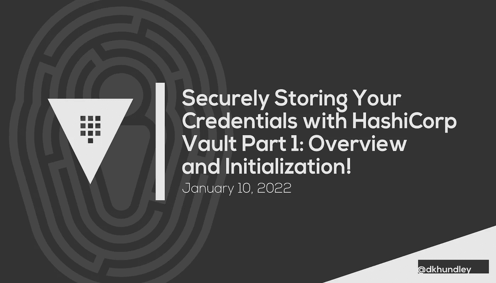
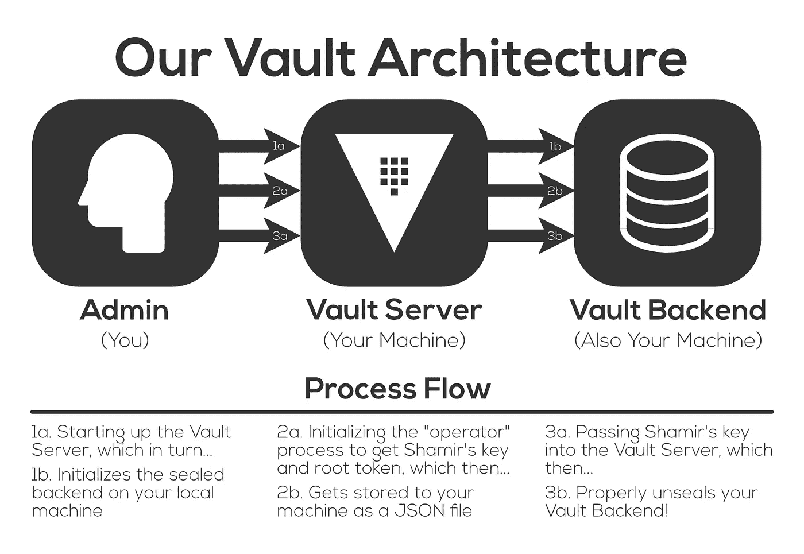
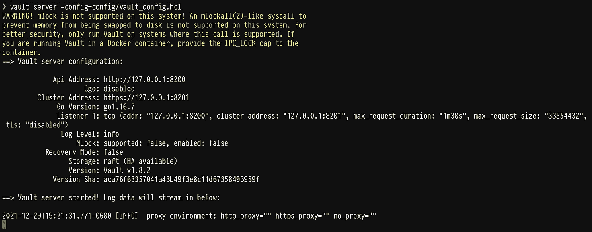
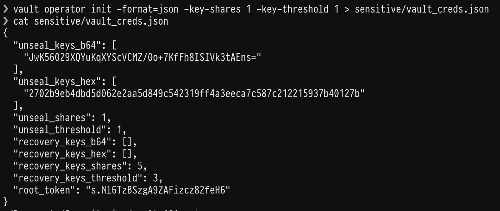
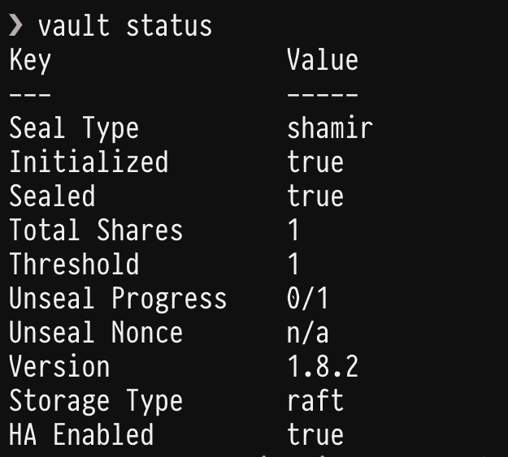
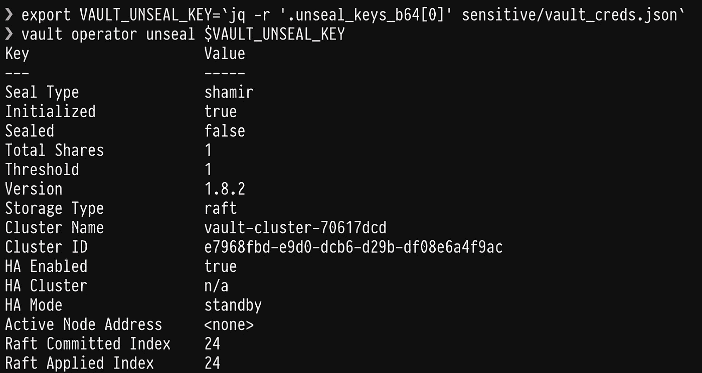
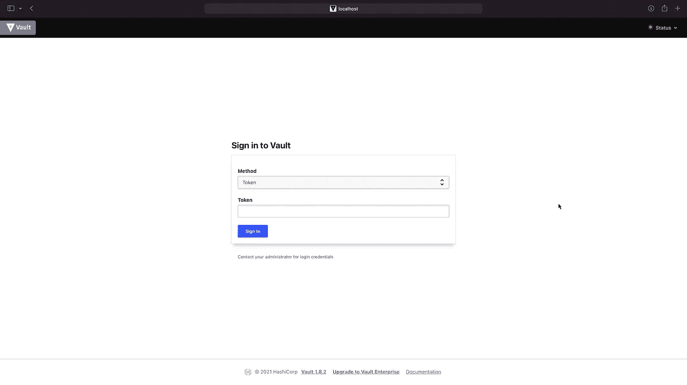

# 使用 HashiCorp Vault 安全存储您的凭证:概述和初始化

> 原文：<https://betterprogramming.pub/securely-storing-your-credentials-with-hashicorp-vault-overview-and-initialization-66cffe37733c>

## 开始使用 HashiCorp Vault 安全存储您的数据科学凭据



作者创建的标题图像

大家好！我们又回来了，推出了另一个关于如何安全存储您的凭据的新系列。本系列将带您了解如何使用 **HashiCorp Vault 无缝地完成这项工作。**(我就简称为[跳马](https://www.vaultproject.io)往前走。)

你可能熟悉 HashiCorp，因为他们也维护 Terraform，这是我们在[与 AWS SageMaker](https://towardsdatascience.com/tagged/terraform-sagemaker) 合作的另一个系列中报道的另一个产品。

HashiCorp 在使产品无缝交互方面做得很好，我们将在这个新系列中继续演示 Terraform 和 Vault 如何相互交互。

出于本系列的目的，我们将让事情变得非常简单。这里的想法是给你一个更多的“从业者的视角”如何在日常基础上与 Vault 交互。也就是说，创建一个高可用性、容错的架构，并使用基于硬件的密钥来保护，这不在讨论范围之内。如果你在一个更大的组织中工作，我会认为这样的事情非常重要，但是应该由一个专门的“保险库管理”团队来管理。

但是，即使我们不会使用企业级版本的 Vault，我们仍然需要自己进行一些设置，以启动和运行我们自己的小型 Vault 服务器。虽然 Vault 确实为示例使用提供了“开发模式”,但我们将创建一个小型架构，它将在我们的本地计算机上持续运行，以便我们可以继续使用它。

在我们进入该体系结构之前，让我们简单地讨论一下为什么您可能会考虑跳过另一个解决方案。

# 为什么跳马？

显然，Vault 不是唯一的凭据存储解决方案。每个云提供商都有自己的本地解决方案，虽然我个人不熟悉其他本地解决方案，但我不得不相信可能还有其他解决方案。但像 Terraform 一样，Vault 的伟大之处在于它可以覆盖所有那些云提供商、本地提供商等等。

Vault 是一个开源产品，它做了很多非常酷的事情来帮助支持敏感凭据的安全存储和检索。事实上，它的作用如此之大，以至于我们可能不会在本系列中涉及它的所有功能。下面是 Vault 可以做的一些事情:

*   通过 CLI、API 或 UI 安全地存储和检索敏感凭据(喜欢这种灵活性！)
*   存储可以根据需要进行版本控制或旋转的静态键值对
*   动态生成令牌以与包括 AWS、Google 云平台和 Microsoft Azure 在内的云提供商进行交互
*   允许企业级使用高可用性、容错后端存储
*   支持多种存储后端类型，包括本地存储、云存储和网络连接存储
*   使用各种机制在根级别保护 Vault，包括基于云的加密密钥甚至基于硬件的密钥

与 Terraform 类似，Vault 也提供分层服务，包括一个完全免费的层。虽然您可能想为大型组织考虑企业级版本的 Vault(称为 Vault Enterprise ),但它非常方便，因为我们可以完全免费创建自己的小型架构。我不知道你怎么想，但是我喜欢免费的！

正如我在上面提到的，我们可以通过我们的 Vault 体系结构的耐用性和可用性获得真正的健壮性，但是对于我们前面提到的“从业者的视角”，我认为更简单的体系结构就可以了。为此，让我们来看看这个架构是什么样子的！

# 我们的金库建筑



作者创作的图形

正如你可能猜到的，我是一个喜欢图片的人，所以我创建了上面的图表来帮助我们了解更多。如果图片现在有点混乱，不要担心，因为我们肯定会在接下来的小节中把事情弄清楚。您会注意到，我们的保险库架构基本上有两个组件:

*   **金库服务器**:这个小服务器将允许我们以三种不同的能力与金库后端交互:用户界面(UI)、命令行界面(CLI)或 API。我们不会在这篇文章中讨论这些交互，但是请继续关注，因为我们肯定会在以后的文章中讨论这三个问题！
*   **Vault 后端**:虽然 Vault 允许多种不同的后端类型，但我们将通过在本地机器上初始化一个后端来简化事情。这就像定义一个我们希望 Vault 存储加密凭证的目录一样简单。

虽然这看起来令人生畏，但是建立并运行这个架构实际上非常容易！在接下来的小节中我们如何启用这个架构之前，我已经在我的 GitHub repo 中维护了下面的代码[。本报告中的`README`还包含了完成本教程所需安装的一些依赖项。](https://github.com/dkhundley/vault-101)

现在，最后，让我们进入创建这个架构的第一部分！

## 1.启动 Vault 服务器

我们需要做的第一件事是启动 Vault 服务器，为了做到这一点，我们首先需要创建一个小的配置文件，说明应该如何创建 Vault。如果你不熟悉 HashiCorp，他们维护自己的语法语言 **HashiCorp 配置语言(HCL)** ，所以下面的配置是用 HCL 写的。我们的配置如下所示:

```
storage "raft" {
    path = "./sensitive/data"
    node_id = "node1"
}listener "tcp" {
    address = "127.0.0.1:8200"
    tls_disable = "true"
}api_addr = "http://127.0.0.1:8200"
cluster_addr = "https://127.0.0.1:8201"
ui = true
```

让我们来分析一下到底发生了什么:

*   **“raft”存储块**:存储块记录了后端类型和我们将存储 Vault 加密数据的位置。在这种情况下，“raft”指的是本地存储(很明显，我不知道它为什么被称为 raft)，它将数据存储在我的 Git repo 的位置中的`./sensitive/data`下。你可以把这个改成任何你想要的。如果你进入我的个人 GitHub repo，你会注意到没有一个叫做`sensitive`的目录。这是因为我使用了一个`.gitignore`文件来确保这个目录不会被推送到 GitHub。该目录将在下一节中用于另一个目的。
*   **“监听器”块**:该块记录了我们将使用什么 IP 地址与 Vault 进行交互。默认情况下，Vault 会将 API / UI 地址放在`127.0.0.1:8200`(或`localhost:8200`)，并将集群地址放在`127.0.0.1:8201`。同样，这可以根据您的需要进行更改，但我将保持默认值不变。
*   **其他内容**:基于前面的代码块，配置文件末尾的最后一点应该是不言自明的。还要注意，我们通过设置`ui = true`来启用用户界面。

在我的 Git repo 中，我将这个文件存储为`config/vault_config.hcl`。要实际启动 Vault 服务器，我们需要运行以下命令:

```
vault server -config=config/vault_config.hcl
```

如果成功，您应该会看到类似下面的截图。请注意，如果您想继续与您的终端交互，您需要打开一个新窗口。但是你仍然可以完全关闭终端。只要您不明确停止 Vault 服务器，它就不会自行停止。如果您确实关闭了您的终端，然后决定停止您的服务器，下面的命令就可以解决这个问题:

```
kill $(ps aux | grep vault\ server\ -config | awk '{print $2}')
```



作者截图

该命令不仅会启动 Vault 服务器，还会在**密封状态**下创建您的 Vault。让我们在下一节讨论这意味着什么。

## 2.正在初始化存储库操作员

启动 Vault 服务器时，您的 Vault 后端将在加密模式下初始化，在您的 Vault 解封之前，您将完全无法与该 Vault 后端进行交互。创建新的 Vault 服务器时，作为“操作员”的您需要首先初始化启封 Vault 的过程。

在我们展示命令如何做到这一点之前，让我们谈一谈打开保险库。自然，这可能是一个极其敏感的过程。你不希望任何人打开你的保险库，所以有很多方法可以打开保险库。正如我上面提到的，我们可以用类似云提供商甚至硬件密钥的东西来解封保险库，但出于我们的目的，我们将使用默认的**沙米尔的封印。** Shamir 的 seal 基本上是一种高级加密算法，它采用一个主加密密钥，然后根据您的需要将其拆分成任意多个密钥。这个想法是，然后你把每把钥匙给每一个单独委托的人。理论上这是一个非常酷的概念。我从 HashiCorp 网站上获得的图片很好地说明了这个概念:


图片来自哈希公司的金库网站([链接](https://learn.hashicorp.com/tutorials/vault/rekeying-and-rotating))

默认情况下，Vault 的 Shamir 封条将加密密钥分成 5 个密钥部分，提取主加密密钥需要其中的 3 个密钥部分。这可以根据您的偏好进行调整，因此出于简单的目的，我们将把它缩减为 1 个密钥共享。我们还将把这个密钥保存到一个 JSON 文件中，这样，如果我们重新启动本地计算机，就可以简单地重新启动 Vault 服务器。不言而喻，但请允许我重申:*这是* ***而不是*** *对真实世界设定的理想实践*。在现实世界的设置中，您至少应该使用 HashiCorp 默认的默认密钥共享，或者更好的是，使用类似硬件密钥的东西。

为了生成这个 Shamir 密钥并在一行中将其保存到 JSON 文件中，您需要运行以下命令:

```
vault operator init -format=json -key-shares 1 -key-threshold 1 > sensitive/vault_creds.json
```

如果这个命令成功，您应该能够查看 JSON 文件并看到下面的屏幕截图。(而且应该大概不用说了吧，不过我写了这篇帖子之后就把自己的金库作废了，所以下面截图里的这些凭证对你没什么好处。)



作者截图

我们特别关心两件事:

*   这是我们刚刚生成的单个 Shamir 密钥的 base64 编码版本。在下一小节中，我们将需要这个来实际开启我们的保险库。
*   `root_token`:这是保险库根令牌，一旦它解封并运行，我们将使用它实际进入保险库。在这篇文章中我们不会做太多，但它对以后的文章很重要。

## 3.开启保险库

Vault 服务器正在运行？检查！运算符已初始化？检查！手里拿着沙米尔的钥匙？检查！我们现在准备使用 JSON 文件中的 Shamir 密钥打开我们的保险库。在此之前，如果您运行`vault status`命令，您应该会看到如下所示:



作者截图

注意这里的`Sealed`处于`true`状态。当我们解封我们的保险库并再次运行该命令时，`Sealed`状态将自然变为`false`。

因为我们将 Shamir 密匙存储在 JSON 文件中，所以我们将使用另一个名为`jq`的 CLI 工具来使用一点自动化魔法，从 JSON 文件中提取密匙作为环境变量，然后将该密匙输入到解封保险库的命令中。看起来是这样的:

```
# Getting creds from the JSON file
export VAULT_UNSEAL_KEY=`jq -r '.unseal_keys_b64[0]' sensitive/vault_creds.json`# Unsealing the Vault with the Vault unseal key
vault operator unseal $VAULT_UNSEAL_KEY
```

运行该命令后，会显示以下屏幕截图。正如所料，`Sealed`状态现在是`false`，这意味着我们成功地解封了我们的保险库！



作者截图

## 验证我们的保险库正在运行

虽然我们不会在这篇文章中涉及更多，但我想你可能想验证你的保险库是否真的在运行！让我们通过用户界面登录 Vault 来验证这一点。为此，请打开任何 web 浏览器，导航到您在上面的配置中定义的任何地址。如果你坚持我所做的，这将是`localhost:8200`。这是您应该看到的屏幕:



作者截图

还记得我们作为 JSON 文件的一部分存储在 Shamir 密钥旁边的根令牌吗？是时候利用这一点了！将该令牌复制并粘贴到此处的“令牌”字段，然后单击“登录”如果你做对了，这是你应该看到的屏幕:


作者截图

恭喜你。您现在拥有了自己的小型 Vault 服务器！

现在，在我们结束这篇文章之前，还有一件小事要做…

# 如果你重启你的机器会怎么样？

当您重新启动机器时，您的 Vault 不会消失，但是 Vault 服务器会关闭，Vault 会回到密封状态。幸运的是，有一种方法可以让保险库起死回生，只需重新启动保险库服务器并再次解封保险库。本着自动化的精神，我创建了一个脚本，让 macOS 的 Automator 在启动时自动为我执行这个任务。我不打算深入了解它是如何工作的，但我的 Automator 脚本看起来是这样的:

```
# Changing the working directory appropriately
cd ~
cd Documents/Repositories/vault-101# Noting the proper Vault address as an environemnt variableexport VAULT_ADDR='http://127.0.0.1:8200'# Getting creds from the JSON file
export VAULT_UNSEAL_KEY=`/opt/homebrew/bin/jq -r '.unseal_keys_b64[0]' sensitive/vault_creds.json`
export VAULT_ROOT_TOKEN=`/opt/homebrew/bin/jq -r '.root_token' sensitive/vault_creds.json`# Killing the process behind the Vault server's last startup
kill -9 $(<sensitive/vault_pid.txt)# Starting the Vault server/opt/homebrew/bin/vault server -config=config/vault_config.hcl &> /dev/null &# Waiting 1 second for Vault server to startsleep 1 # Saving PID of started server to text fileecho $! > sensitive/vault_pid.txt# Unsealing the Vault with the Vault unseal key/opt/homebrew/bin/vault operator unseal $VAULT_UNSEAL_KEY# Waiting 10 seconds after unsealing
sleep 10 # Logging in with the Vault root token/opt/homebrew/bin/vault login $VAULT_ROOT_TOKEN
```

关于上面的 Automator 脚本，唯一需要注意的是，它需要完整的文件路径来运行专门安装的工具，如 Vault 和 JQ。老实说，我不知道为什么，但它不会工作，直到我这样做。

这个帖子到此为止！我们在这篇文章中涉及了很多内容，所以让我们在这里休息一下，因为我们准备在下一篇文章中更深入地研究跳马。希望你们都觉得这是有帮助的！感谢阅读，下期再见！