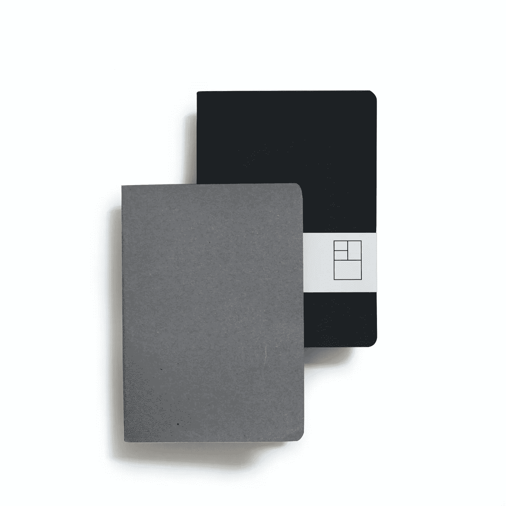

# 使用 SCP 安全地从远程服务器传输文件或将文件传输到远程服务器

> 原文：<https://betterprogramming.pub/securely-transfer-files-from-or-to-a-remote-server-using-scp-f776c42c42a4>

## 如何使用安全复制协议



照片由[莱卡笔记本](https://unsplash.com/@laikanotebooks?utm_source=unsplash&utm_medium=referral&utm_content=creditCopyText)在 [Unsplash](https://unsplash.com/s/photos/transfer-file?utm_source=unsplash&utm_medium=referral&utm_content=creditCopyText) 上拍摄

[SCP](https://en.wikipedia.org/wiki/Secure_copy) (安全复制协议)是一种基于 BSD RCP 协议的网络协议，支持网络上主机之间的文件传输。SCP 使用安全外壳(SSH)进行数据传输，并使用相同的机制进行身份验证。

使用 SCP，您可以从以下位置复制文件/目录:

*   您的本地机器到远程系统
*   本地系统的远程系统
*   从本地系统的一个远程系统到另一个远程系统

当使用 SCP 传输数据时，文件和密码被加密，这样任何窥探流量的人都不会得到任何敏感信息。

开始前需要记住的事项:

*   `scp`命令依赖 SSH 来传输数据，因此它需要 SSH 密钥或密码来在远程系统上进行身份验证。
*   要能够复制文件/目录，您必须至少拥有源文件的读取权限和目标系统的写入权限。

# 句法

`scp`命令的语法是:

```
scp [options] username@source_host:directory/filename  /where/to/put
```

在下面的例子中，我递归地复制整个目录。

# 例子

## 从远程到本地

```
scp -r username@ipaddress:/directory/to/send /local/where/to/put
```

## 从本地到远程

```
scp -r /local/directory/to/send username@ipaddress:/where/to/put
```

## 在两台远程主机之间拷贝

```
scp -r username@ipaddress1:/file/to/send username@ipaddress2:/where/to/put
```

根据您的要求，您可以将`scp`与以下选项一起使用。

# 选择

`scp –P port` —一般情况下，`scp`的默认端口为 22。您也可以指定特定的端口。
`scp –p` —预计时间和连接速度会出现在屏幕上。
`**scp –q**` —禁用进度表和警告。
`scp –r` —递归复制整个目录。
`scp –v` —将调试信息打印到屏幕上。它可以帮助您调试连接、身份验证和配置问题。
`scp -c` —默认情况下，SCP 使用 AES-128 加密文件。如果想换一个密码器加密，可以用`-c`。

我希望您现在已经理解了如何最好地利用`scp`命令在系统之间安全地传输文件。

如果你有什么建议，请在评论中告诉我。如果你知道`scp`命令的任何其他令人敬畏的特性，请与我们分享。