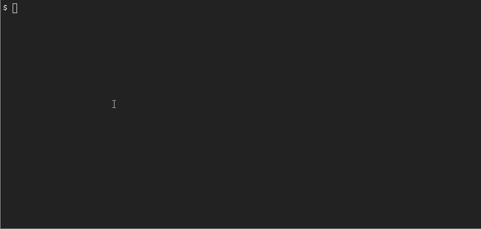
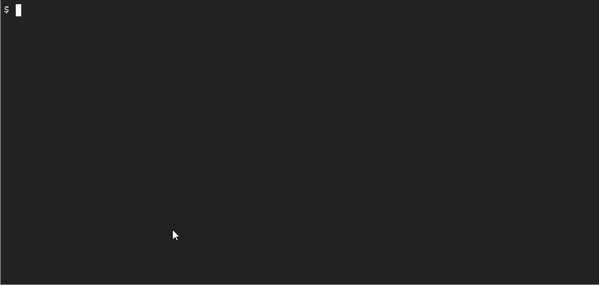
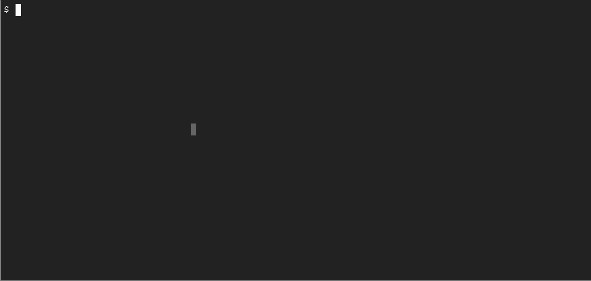
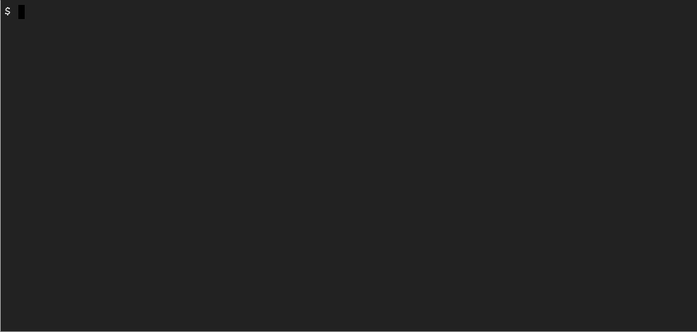

# 用 GVisor 和 GKE 沙盒保护 Kubernetes

> 原文：<https://betterprogramming.pub/securing-kubernetes-with-gvisor-and-gke-sandbox-78c6b152b3a0>

## 针对容器运行时和工作负载的深度防御


由[伊霍尔·德沃雷茨基](https://unsplash.com/@ihor_dvoretskyi?utm_source=medium&utm_medium=referral)在 [Unsplash](https://unsplash.com?utm_source=medium&utm_medium=referral) 上拍摄的照片

Kubernetes 和容器运行时安全性是您应该为您的 Kubernetes 集群考虑的最重要的安全性方面之一。容器确保了您的应用程序封装在它们自己的虚拟环境中，并且独立于其他应用程序。然而，使用 Kubernetes 集群的默认设置，您仍然可以从容器中访问大量内核资源，包括进行系统 API 调用。

这是网络犯罪分子利用来进入您的系统并实施恶意行为的一个方面，会危及您的许多应用程序和关键数据。

gVisor 是一个容器运行时安全工具，允许你在自己的沙盒应用内核中运行你的容器。这意味着您的容器在集群中作为单独的虚拟机运行，尽管仍然与其他容器共享计算资源，如 CPU、内存和磁盘。大家双赢！

Google Kubernetes 引擎在节点池上提供了 GKE [沙盒](https://cloud.google.com/kubernetes-engine/docs/concepts/sandbox-pods)模式，您可以使用该模式在您的托管 Kubernetes 集群中实现 gVisor，无需任何自定义设置，而您可能必须在自管理集群中进行设置。

我们将看看如何在 GKE 沙盒中运行容器，并做一些测试来演示安全性。因此，让我们从创建 GKE 集群开始。

# 先决条件

由于练习使用谷歌 Kubernetes 引擎(GKE)集群，您将需要一个 GCP 帐户。GCP 提供三个月的免费试用，所以如果你还没有注册，你可以注册。

# 创建 GKE 集群

首先，我们将使用以下命令创建一个 GKE 集群:

```
$ gcloud container clusters create cluster-1 --zone us-central1-a
```


这需要几分钟的时间，您应该已经启动并运行了 GKE 集群。现在，我们需要创建另一个启用了 gVisor 的节点池，因为 GKE 的默认节点池不提供该选项。

# 创建 gVisor 节点池

要创建 gVisor 节点池，我们将使用以下命令:

```
gcloud container node-pools create gvisor-np \
  --cluster=cluster-1 \
  --node-version=latest \
  --machine-type=n1-standard-2 \
  --image-type=cos_containerd \
  --sandbox type=gvisor \
  --zone us-central1-a
```

请注意，e2 微、e2 小和 e2 中节点池不支持 gVisor。



一旦创建了新的节点池，我们只需要检查节点池是否启用了 gVisor。为此，请运行以下命令:



因此，正如`runtimeclass`显示的`gvisor`，这意味着新节点池启用了 gVisor。

现在，我们已经准备好测试配置了

# 测试配置

为了测试配置，我们将使用`gvisor`节点池中的`Deployment`资源部署一个`fedora`容器，并使用`curl`命令获取集群元数据。由于沙盒环境不应该访问父内核，它应该不知道集群，因此这个调用应该会失败。

为了确保将`Pod`部署到启用了 gVisor 的节点，我们必须将`spec.template.spec.runtimeClassName`设置为`gvisor`，如下面的部署清单所示:

现在，让我们使用下面的命令来应用这个 yaml:

```
$ kubectl apply -f fedora.yaml
```

在 Pod 运行后，我们将使用`kubectl exec -it <pod_name> -- bash`打开一个 shell 并运行以下命令:

```
$ curl -s "http://metadata.google.internal/computeMetadata/v1/instance/attributes/kube-env" -H "Metadata-Flavor: Google"
```



正如我们看到的，当我们到达终点时，我们没有得到任何输出。这是因为 gVisor 正在无声地丢弃数据包，而`Pod`无法访问`metadata.google.internal`端点。

现在，为了证明这是因为 gVisor，让我们看看当我们使用没有将`RuntimeClassName`设置为`gvisor`的`Deployment`时会发生什么，如下面的清单所示:

让我们使用下面的命令来应用这个清单，并运行相同的`curl`命令来看看我们得到了什么:

```
$ kubectl apply -f fedora-norc.yaml
```



正如我们看到的，这一次，我们获得集群元数据以响应`curl`命令。这意味着 gVisor 在保护集群免受恶意外来者攻击方面做了自己的工作。就`Pod`而言，它没有对 Kubernetes 环境的访问权，因此，只需很少的修改，您的集群和容器运行时就是安全的。

# 结论

gVisor 帮助我们为容器工作负载实施深度防御，并保护容器运行时免受恶意攻击。如果我们仍然碰巧看到对特定`Pod`的攻击，它将仅限于该特定的`Pod`，并且攻击者将无法访问任何集群级资源。

感谢阅读。我希望你喜欢这篇文章。