# 使用安全保险库保护您的应用程序机密

> 原文：<https://betterprogramming.pub/securing-your-application-secrets-with-a-secure-vault-74f292c5b84e>

## 保管好你的钥匙和秘密，嗯，秘密


照片由[伯纳德·赫尔曼](https://unsplash.com/@bernardhermant?utm_source=medium&utm_medium=referral)在 [Unsplash](https://unsplash.com?utm_source=medium&utm_medium=referral) 上拍摄

如今，当构建应用程序时，我们倾向于存储各种应用程序秘密，如密码、API 密钥、访问密钥、SSL 证书和其他机密秘密，以便能够与应用程序的各种组件进行通信。

安全地存储这些类型的数据是一个挑战，因为我们希望我们的应用程序能够随时访问这些数据，同时防止其他人获得这些数据。我们希望我们的系统尽可能安全，所以我们不希望像过去那样将我们的密钥和证书存储在系统中，或者将配置存储在文件或类似的东西中。

在我的日常工作中，我要处理支付和区块链服务。在我的本地环境中，以及在 prod 环境中，我有一堆`.envfiles`保存着各种机密的 API 密钥和秘密密钥，如果落入坏人之手，可能会导致混乱。

我们现在需要的是真正安全的服务器存储，可用于随时随地存储和访问应用程序机密。我们需要的是一个金库。

保管库是存储应用程序机密的安全方式。保险库可以用来以安全的方式存储任何秘密。例如，这些秘密可能是您组织的域的 SSL 证书和密钥，或者是连接到公司数据库服务器的凭证。

保管库可以是托管在服务器上的任何应用程序，旨在保护您的应用程序机密，可以是自托管的，也可以作为服务提供。“存储库即服务”的一个例子是无密钥存储库。

在这篇评论文章中，我们将探讨如何使用无钥匙保险库来保护您的应用程序机密。

# 什么是无钥匙保险库，以及如何设置:复习

AKEYLESS 是一个秘密管理 SaaS，它提供了一个无忧的保险库来支持应用程序秘密的处理，简化开发运维工作流，并即时连接到任何云平台。它可以应用于各种用例以及软件开发的各个阶段。

无钥匙保险库可用于:

1.  存储密钥—可以是动态的，也可以是静态的
2.  存储加密密钥—可用于加密动态机密
3.  存储 SSH 证书颁发者
4.  PKI 证书颁发者

酷的事情是你可以创建访问角色和分配授权方法来定义如何访问你的秘密。

您可以通过命令行应用程序(CLI)、语言 SDK (Python、Go)、Restful API 和 Web UI 与 AKEYLESS vault 交互。最简单的当然是 Web UI，在这里你可以轻松地存储和检索秘密。

你需要一个账户才能使用金库，所以去注册[页面](https://console.akeyless.io/register)创建一个账户。您需要注册时提供的访问密钥和访问 Id 密钥才能登录 web dashboard 并与 CLI 连接，因此请确保您的安全。

获得所需的密钥后，您可以决定如何与 vault 交互。在这篇评论文章中，我将展示如何设置 CLI 和 Python SDK。

## **设置 CLI**

无键 CLI 支持主要的操作系统，包括 Linux、Mac 和 Windows。

如果您在 Linux 或 Mac 上，您将需要运行以下命令:

```
# Linux$ curl https://akeyless-cli.s3.us-east-2.amazonaws.com/cli/latest/production/cli-linux-amd64 -o akeyless# Mac$ curl https://akeyless-cli.s3.us-east-2.amazonaws.com/cli/latest/production/cli-darwin-amd64 -o akeyless
```

然后，运行:

```
$ chmod +x akeyless
$ ./akeyless
```

在 Windows 上，转到这个下载[链接](https://akeyless-cli.s3.us-east-2.amazonaws.com/cli/latest/production/cli-windows-amd64.exe)来安装可执行文件，并按照安装说明进行操作。

成功完成后，您可以在终端中运行以下命令:

```
C:/ akeyless configure
```

这应该提示输入 AccessId 和 AccessKey。确保您输入了正确的数据:

```
$ akeyless configure
Access ID:  p-access_id
Access Key: p-access_key
Profile default successfully configured
```

我们走吧！我们已经成功设置了我们的 CLI。接下来，我们来看看 Python 的设置。

## **无密钥 Python 设置**

确保你已经安装了 Python，我建议你为这个项目设置一个虚拟环境。如果你使用的是 Python3，你应该运行`python -m venv <env_name>`来创建一个 virtualenv。

AKEYLESS 有一个官方的 Python SDK 库，可以安装:

```
pip install akeyless-proxy-api
```

安装完成后，为了能够连接到我们的 vault，让我们看一下以下内容:

```
import akeyless_proxy_api # import our installled module# Setup our configuration
api_conf = akeyless_proxy_api.Configuration()
api_conf.host = "rest.akeyless-security.com"# create an instance of the Proxy API class
api_client = akeyless_proxy_api.ApiClient(api_conf)
api_instance =  akeyless_proxy_api.DefaultApi(api_client)# Authenticating - We'll be using our API Key
access_id = 'access_id' # Access Id
access_type = 'api_key' # Access Type (api_key/okta_saml) (optional)
access_key = 'access_key' # Access key (relevant only for access-type=api_key) (optional)# Authenticate to the service and returns an access token
auth_response = api_instance.auth(access_id, access_type=access_type, access_key=access_key)token = auth_response.token # this token will be used to interface with our vault.
```

我们现在已经成功地设置了 CLI 和 Python SDK，以便能够使用我们的无密钥保险库。

# 如何在无钥匙金库中存储和访问秘密

正如我前面提到的，有各种方法可以用来存储和访问无密钥库上的秘密，我们已经能够设置 CLI 和 Python SDK。

我没有提到的一件事是，你也可以使用 web dashboard 来管理你的秘密。因此，我们现在可以通过 web dashboard、CLI 和 Python SDK 来管理我们的应用程序秘密。

很酷，对吧？

让我们看看如何做到这一点。

## **使用网络仪表盘**

要使用 web UI 仪表板，您需要登录仪表板。因此，请前往登录页面[这里](https://console.akeyless.io/)并正确输入您的访问 ID 和访问密钥。一旦成功，它会将您带到下面的控制面板:

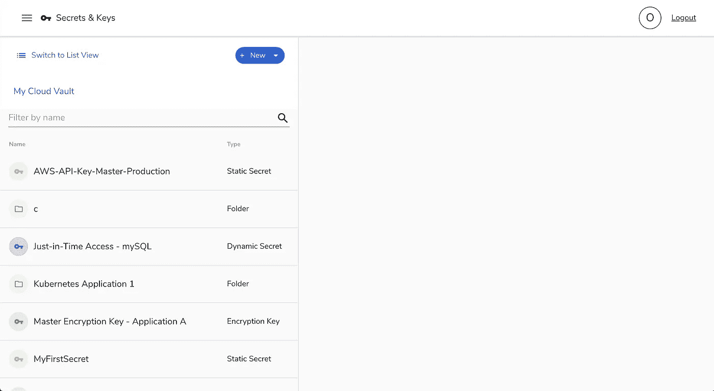

从这个视图中，您可以看到一个秘密列表——包括它们的名称和类型。要创建新的秘密或密钥，只需点击顶部的+ New 按钮。

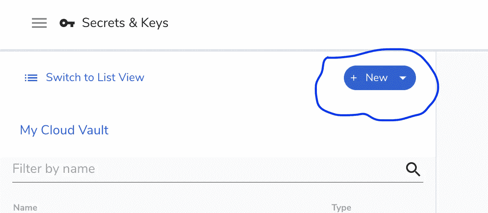

这应该会显示一个弹出窗口，其中列出了可用的机密/密钥类型。你可以点击你想创建的。

要创建一个新的静态秘密，点击**静态秘密**，输入名称、描述、秘密值和加密密钥，以防您想要使用自定义密钥对其进行加密。

然后点击**保存**创建您的新秘密。

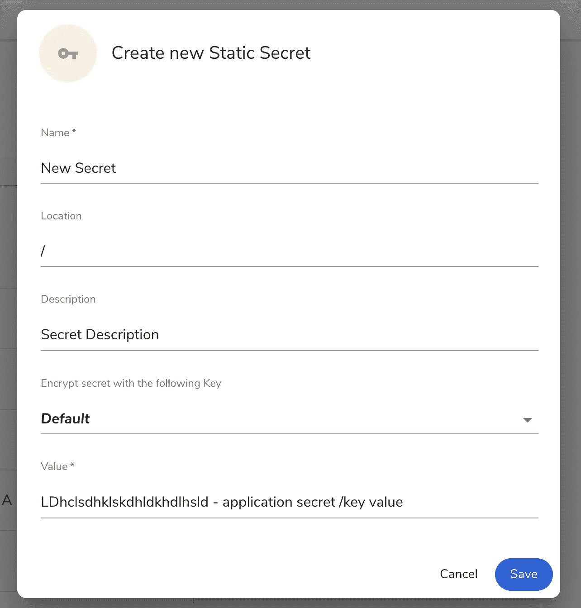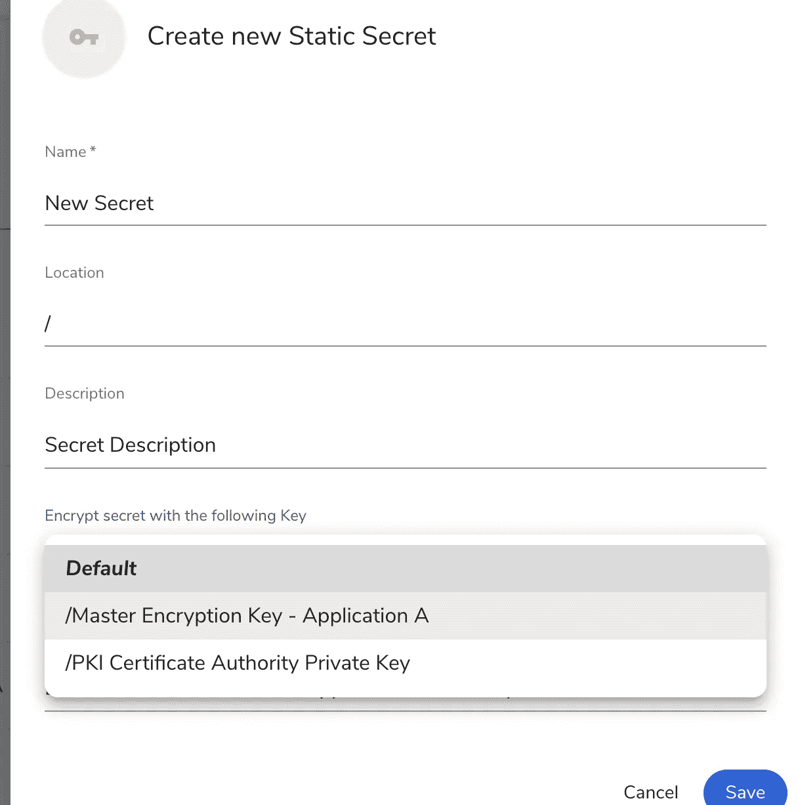

成功创建应用程序机密后，要通过 web 仪表板访问您的机密，您需要进入仪表板并单击机密/密钥的名称以打开机密详细信息。

默认情况下，您的机密值使用默认加密或您提供的加密进行加密。您可以点击**解密并复制到剪贴板**来解密该值并将其复制到您的系统剪贴板中。

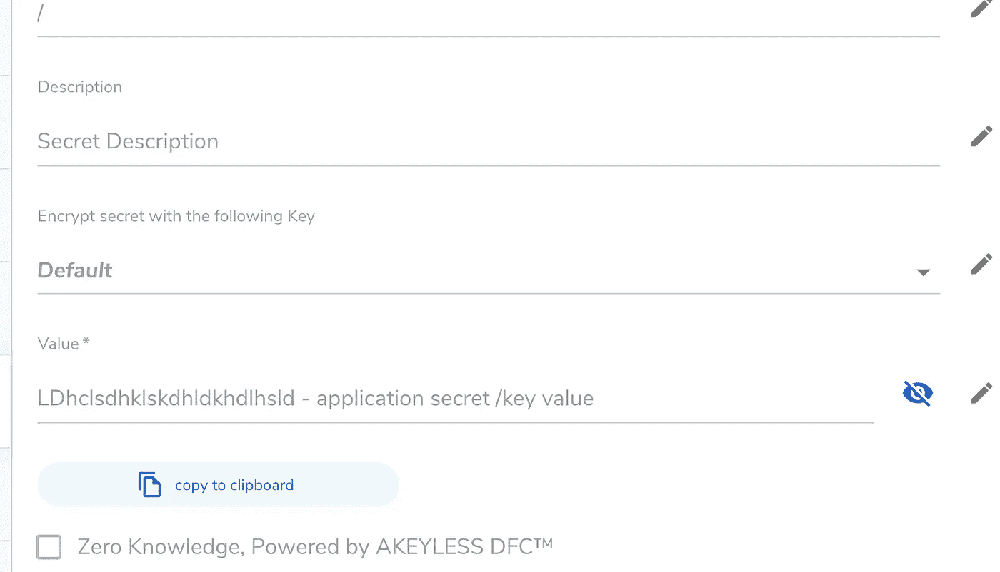

这就是 web dashboard vault 的全部内容。

## **使用存储库的 CLI**

现在，让我们看看如何使用我们之前安装的 CLI(命令行界面)应用程序与 AKEYLESS vault 进行交互。

这很容易使用，因为命令很容易记住。要验证我们的 CLI 是否正常工作，您可以尝试运行:

```
$ akeyless -h
akeyless <command> -h, --help
```

如果你得到和上面一样的信息，那么你可以继续或者你可以重新安装它。

这里我们要做的第一件事是使用 CLI create-secret 命令创建一个密钥。

要创建密钥，您需要遵循以下 create-secret 命令语法:

```
$ akeyless create-secret --name <SecretName> --value "<SecretValue>"
```

其中:

1.  是你的秘密的名字。
2.  `<SecretValue>`是密钥/值。

有了这个，我们可以创建一个新的密钥:

```
$ akeyless create-secret --name AppSecret --value "wiutiJHQ&(Q*&)R*Q7r^Q#"
```

然后，要得到我们的秘密，你需要使用`get-secret-value`命令结构，如下所示:

```
$ akeyless get-secret-value --name <SecretName>
```

这样，我们可以运行这个命令来获取我们的秘密值:

```
$ akeyless get-secret-value --name AppSecret
```

另一件很酷的事情是你可以使用下面的命令更新你的秘密:

```
$ akeyless update-secret-val --name AppSecret --value "new secret value"
```

其他可用的命令有:`create-dynamic-secret`、`get-dynamic-secret`、`create-ssh-cert-issuer`、`get-ssh-cert-issuer`等。你可以在这里阅读更多。

## **使用 Python SDK**

到目前为止，我们已经了解了如何使用 web 仪表板和 CLI 与我们的 vaults 进行交互。现在，我们将看看如何用 Python SDK 做到这一点。

为了继续，请确保您已经按照前面提到的 Python SDK 设置说明进行了操作。

我们将从 Python SDK 设置中停止的地方继续。确保运行以下连接代码:

就像我前面解释的那样，对于我们将通过 Python 模块发送的每个请求，我们需要传递令牌，因为它用作能够访问我们的保险库的认证。

为了创建一个新的秘密，我们将使用`create_secret`函数。让我们看看下面的代码:

```
secret_name = '<secret_name>' # Secret name
secret_value = '<secret_value>' # secret value
secret_metadata = '<secret_metadata>' # Description about the secret (optional)
create_response =  api_instance.create_secret(secret_name, secret_value, token, metadata=secret_metadata)
```

查看上面第 4 行的代码，我们将令牌传递给了`create_secret`函数来验证我们的请求。运行它将创建一个密码，其名称被赋予给定的值。

要访问我们的秘密，我们需要做的就是将令牌和秘密名称传递给 get_secret_value 函数:

```
secret_val_res = api_instance.get_secret_value(secret_name, token)print(secret_val_res) # secret value
```

这应该会打印出我们的应用程序密钥。

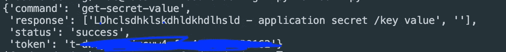

要更新我们的密钥，我们可以简单地写下:

```
new_secret_value = "this is a new secret"api_instance.update_secret_val(secret_name, new_secret_value, token)secret_val_res = api_instance.get_secret_value(secret_name, token)
```

以下是您可以调用来创建不同类型的秘密/密钥的其他函数:

```
dynamic_secret = api_instance.create_dynamic_secret(name, token, metadata=metadata, key=key) # creates a dynamic secret - can provide `key` for encryptionssh_cert = api_instance.create_ssh_cert_issuer() # create new ssh cert issuerpki_cert = api_instance.create_pki_cert_issuer() # create new ssh cert issuer
```

你可以在这里阅读更多可用功能[。](https://github.com/akeylesslabs/akeyless-python-sdk)

# 在您的应用程序中集成无钥匙保险库

到目前为止，我们已经探索了如何设置我们的无密钥库，以及如何通过 Web Dashboard、CLI 或 Python SDK 与它进行交互。

我们接下来要看的是使用 Python SDK 将 vault 集成到我们的应用程序中。我们将了解如何在现实应用中集成无钥匙保险库。

对于本教程，我们将构建一个简单的命令行应用程序来创建和管理订单。我们将使用托管在 [Heroku](http://store-ordering-api.herokuapp.com) 上的名为`store-ordering-api`的 Rest API 来管理订单；PyInquirer，命令行界面；和 Click，这是一个命令行框架，用于构建接受订单的命令行应用程序。

要开始，您需要设置您的环境(虚拟环境)并安装所需的模块。您可以在终端中运行以下命令来开始:

```
$ python3 -m venv food-ordering-env && source food-ordering-env/bin/activate
$ pip install PyInquirer click requests akeyless-proxy-api
$ mkdir food-ordering && cd food-ordering
$ touch main.py auth.py api.py cli.py
```

上面的内容应该已经设置好了开始使用该应用程序所需的一切。在您首选的代码编辑器或 IDE 中打开该文件夹。如果你和我一样用的是 VSCode，可以轻松运行代码。在项目目录中打开当前目录中的 vs 代码。

在我们继续之前，让我们对应用程序的结构有一个基本的了解。

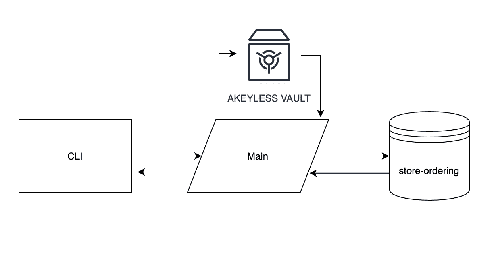

CLI 将作为接收用户订单的界面；main 将负责处理用户的请求，从 vault 获取 API 密钥，将密钥发送给商店订购 API，并返回一个响应。

要使用`store-ordering-api`，您需要请求一个 API 密钥，该密钥将用于身份验证，并且能够访问您保存的订单。你可以在这里阅读更多文档[。确保从 API 获取令牌时，令牌是安全的。](https://store-ordering-api.herokuapp.com/docs)

从文档中，您可以看到请求令牌的端点列表、创建订单、获取订单列表、获取特定订单等等。

有了这些端点，我们已经能够设置下面的基本 API 集成:

在上面的代码中，我们:

1.  添加了两个函数:`get_json`和`post_json`来简单地发送、获取和发布请求
2.  增加了`store-ordering-api`端点功能:
3.  `request_api_key`:请求 API 密钥
4.  `create_orders`:创建订单。您需要以基本的< token_key >格式在授权头中传递订单数据和 API 密钥。
5.  `get_orders`:获取订单列表。您需要传入 api_key/token。
6.  `get_order`:获取特定订单。

这里我们要看的第二个东西是`auth.py`，它负责从我们的库获取我们要使用的 API 密钥。

在上面的代码中，我们:

1.  初始化了我们的保险库设置和验证。
2.  添加了两个函数:`get_token`来获得保险库令牌认证，然后`get_api`来获得或创建我们从 **food-ordering-api** 应用程序获得的 API 密钥/令牌(以防 API 不存在)。

下一件事是在 main.py 中创建 API 和 auth 的简单实现:

```
# main.pyfrom api import get_order, get_orders, create_orders
from auth import get_apiapi_key = get_api()new_order_body =  {
"name":"Sandine (Milo)",
"customer_email":"[oyetoketoby80@gmail.com](mailto:oyetoketoby80@gmail.com)",
"customer_name":"Oyetoke Toby",
"quantity":5,
"customer_address": "Aboru, Lagos"
}new_order = create_orders(new_order_body, api_key)
order = get_order(new_order.get("data")["_id"], api_key)
print(new_order, order)
```

在上面的代码中，

1.  我们导入了 API 和 auth 函数
2.  请求商店订购 api 密钥
3.  添加订单数据
4.  发送订单数据和 api_key
5.  从新订单响应中获取 id 为的订单

这可以像下面这样运行:

`$ python main.py`

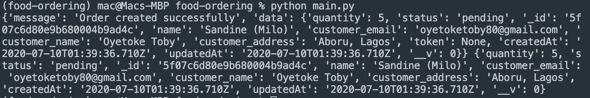

接下来是设置我们的 cli.py，并使用 click 命令行界面更新我们的 main.py。

下面是我们的命令行及其命令的基本结构:

我们创建了三个命令:

1.  `order`:创建订单的命令。
2.  `get`:获取特定订单的命令。
3.  `orders`:列出订单的命令。

现在，前面我提到了 PyInquirer 模块，它将用于收集订单细节。

下面是我们接受用户订单的 PyInquirer 设置:

我们添加了两种验证方法，用于验证空记录和有效电子邮件。

您可以轻松地运行它，如下所示:

```
$ python cli.py
```

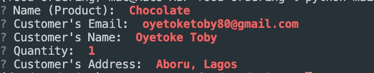

这里要做的下一件事是简单地将它连接到我们的 main.py。我们可以更新该文件:

我们已经更新了我们的:

1.  命令使用 api.py 中的`create_orders`函数。
2.  获取命令使用`get_order`命令获取带有 ID 的特定订单。
3.  订单命令使用`get_orders`命令获取可用订单列表。

为了测试这一点，让我们测试我们的第一个命令——命令:

```
$ python main.py order
```

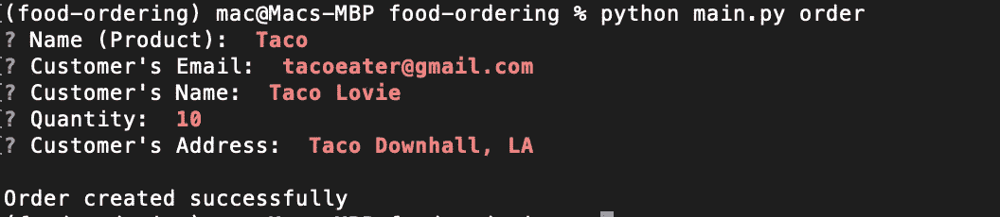

要获得订单列表，您只需:

```
$ python main.py orders
```

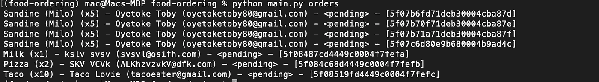

要获取 Taco 订单，我们只需提取方括号([])中的 id，并将其传递给 get 命令:

```
python main.py get 5f08519fd4449c0004f7fefc
```

Tada！我们的命令行应用程序已经准备就绪。

# 结论

到目前为止，我们已经探索了 secrets vault-like AKEYLESS 的重要性，如何使用和连接 AKEYLESS vaults，以及如何在现实世界的应用程序中实现它。我认为这是值得的，因为你的应用程序的秘密是安全的，任何人都不会计划错误地使用它。

在我们创建的应用程序中，我们没有访问 Rest API 密钥的权限，因为它会在请求时直接传递给 AKEYLESS vault，我们一直使用它来毫不费力地发出请求，而不关心 API 密钥的安全性或垃圾的压力。env 文件或环境变量。