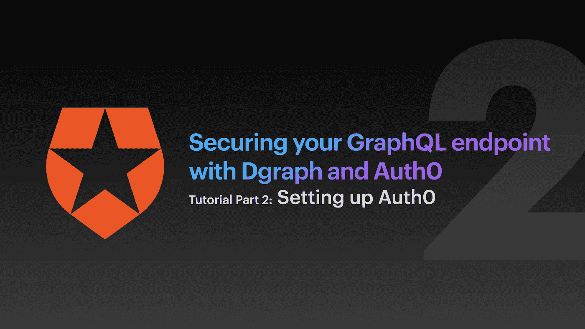
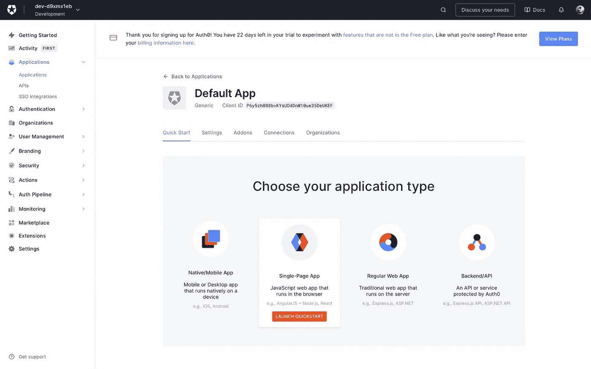
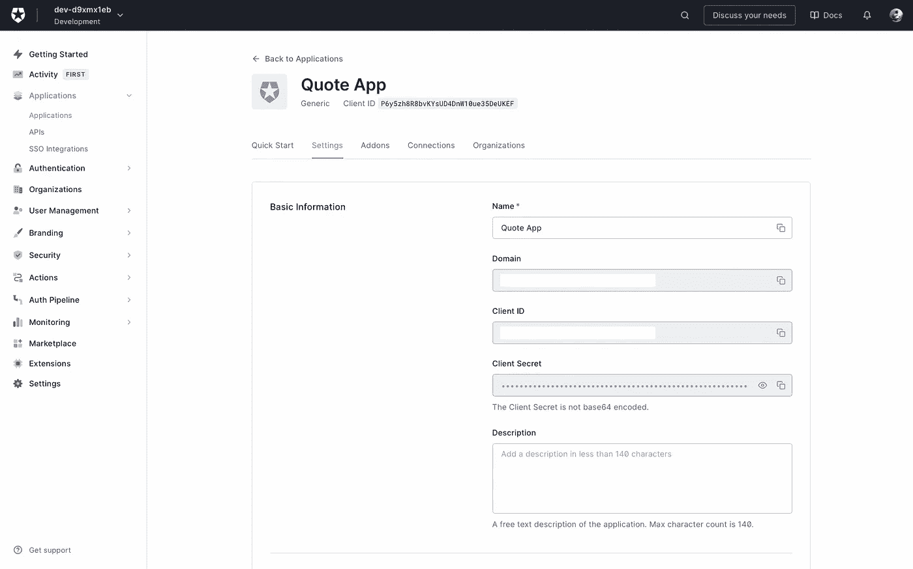
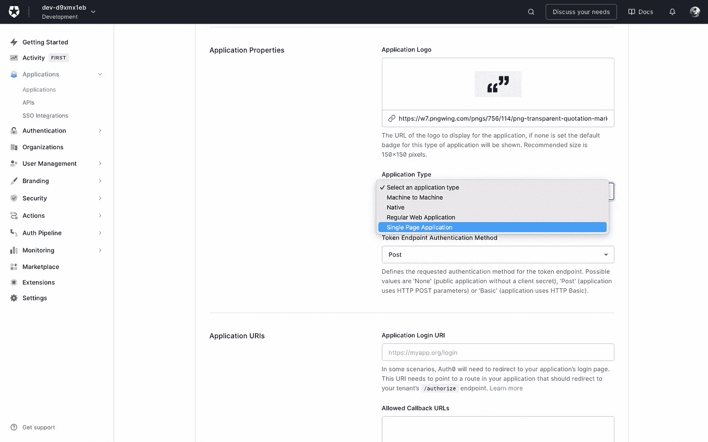
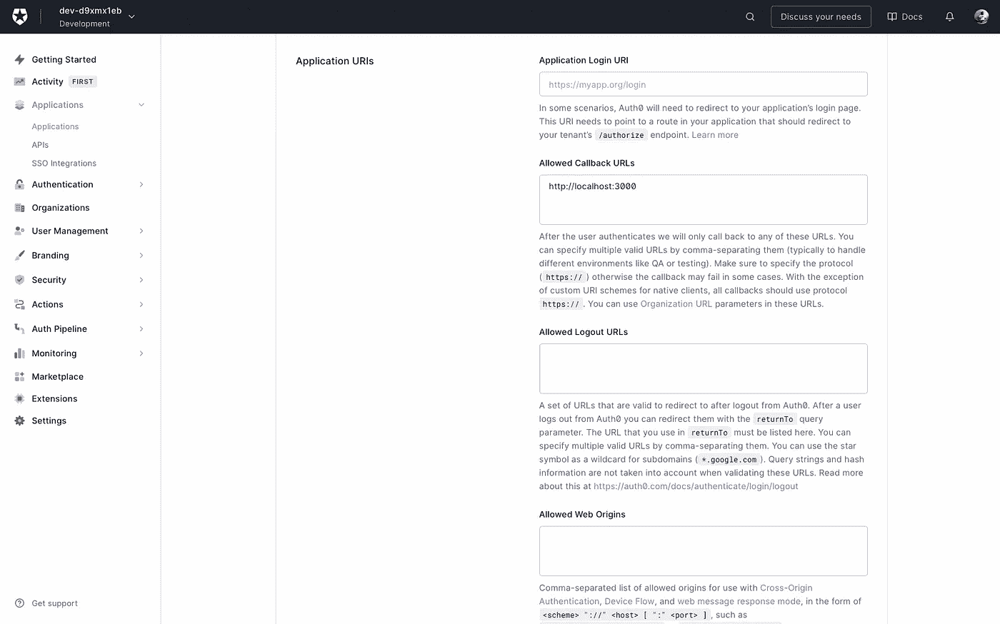
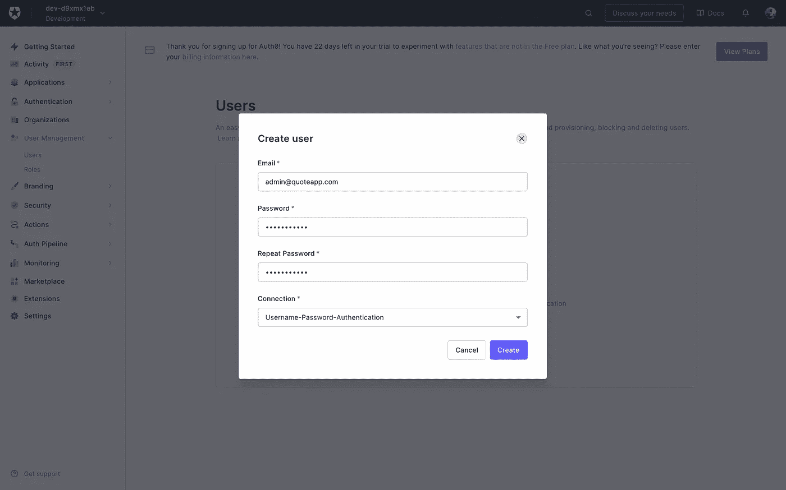

# 使用 Dgraph 和 Auth0 保护 GraphQL 端点—设置 Auth0

> 原文：<https://betterprogramming.pub/securing-your-graphql-endpoint-with-dgraph-and-auth0-1bf9acedc0c8>

## 第 2/3 部分



> *这是一系列文章的第二部分，将解释如何为我们将使用 Dgraph 构建的示例报价应用程序设置 Auth0。如果你是这方面的新手，你可能想要* [*阅读第 1 部分*](https://medium.com/@flo_80930/securing-your-graphql-endpoint-with-dgraph-and-auth0-eb94b935f795) *来了解什么是 giong on。*
> 
> *最终目标是建立一个安全的 GraphQL 端点，您的前端应用程序和后端脚本可以通过 JWT 查询和修改数据。我们将通过一个简单应用程序的例子来完成设置 Dgraph、Auth0 和 Dgraph with Auth0 的所有必要步骤。如果您已经设置了 Auth0 并知道如何使用它，您可以安全地跳过这一部分。*

# 介绍

如果您正在阅读本系列的第 1 部分，此时您的 GraphQL 端点(您的引用和作者)是不可公开查询的。由于您可能对构建一个应用程序感兴趣，该应用程序将允许您的用户从他们的浏览器中查询报价，我们将不得不改变这一点。不幸的是，如果您将`Quote`和`Author`设置为 public，任何人都可以添加、更新、删除和查询您的节点！

你当然可以构建自己的认证服务器，但是如果已经有了像 Auth0 这样很棒的东西，而且在此之上，它还能与 Dgraph 完美地协同工作，为什么还要再次发明轮子呢？您不必处理证书和各种安全漏洞——auth 0 会处理这些问题！用 Auth0 的话说

> Auth0 是一个灵活的嵌入式解决方案，可为您的应用程序添加认证和授权服务。您的团队和组织可以避免构建自己的解决方案来验证和授权用户所带来的成本、时间和风险。

我想说的够多了，让我们建立一个账户吧——它是免费的！

# 获取 Auth0 帐户

前往[认证 0](https://auth0.com) 并注册。选择私人选项，退出所有营销电子邮件。点击下一步，我们准备好了🚀—这有多容易？


注册您的电子邮件后，选择“个人”并退出营销邮件。

你将被重定向到你的仪表板，让你做各种事情。你还将获得 22 天的试用期，以尝试 Auth0 可以做的所有事情，然后才结束免费帐户。但是不要担心，Auth0 提供了很多完全免费的功能，对于我们的小实验来说，这已经足够了。

# 设置应用程序

我们现在准备设置一个适合我们需要的应用程序。导航到`Applications > Applications`并点击已经存在的默认应用程序。这是一个通用的应用程序，这意味着它还没有为特定的用途而设置。因为我假设你有兴趣用现代框架创建一个 web 应用程序(比如 React)，点击 QuickStart 并选择 Single-Page App。

在后续屏幕中，您可以在 [Angular](https://angular.io) 、 [JavaScript](https://developer.mozilla.org/de/docs/Web/JavaScript) 、 [React](https://reactjs.org) 和 [Vue](https://vuejs.org) 之间进行选择——您在这里选择哪一个并不重要，但是如果您选择了稍后要使用的那个，那么您将获得如何将 Auth0 集成到您的应用程序中的模板和代码示例。您可以在以后更改它。



当点击 Auth0 为你生成的默认应用时，点击“快速启动”并选择“单页应用”。

完成后，让我们切换到设置，给我们的应用程序命名为报价应用程序。显然，这也可以是任何其他名称。



给你的应用取个名字。

接下来，向下滚动到应用程序属性，输入一个徽标的 URL，然后从应用程序类型下拉列表中选择单页应用程序。



在“应用程序属性”部分，从“应用程序类型”下拉列表中选择“单页应用程序”。

现在，在应用程序 URI 的部分，将您的本地主机添加到允许的回调 URL 列表，允许的 Web 源和允许的源(CORS)。如果您希望您的应用程序也允许注销用户，那么您还需要将您的本地开发端点添加到允许的注销 URL 中。对于 React 应用程序，这通常是`[http://localhost](http://localhost):3000`。这是必要的，以便允许您在前端应用程序中使用 [Auth0 SDK](https://auth0.com/docs/quickstart/spa/react/01-login) ，并允许您在开发的同时测试应用程序的登录。



将您的本地开发端点添加到允许的回调 URIs。

最后，一直向下滚动(如果需要，您可以快速停止刷新令牌循环并打开循环，但这不是强制性的)，然后单击保存更改。

# 添加使用您的应用程序的用户

如果我们没有至少一个用户被允许登录我们的应用程序，我们的整个项目将毫无意义。让我们从我们的控制面板这里设置一个。转到`User Management > Users`并点击+创建用户。给用户一个电子邮件地址*(可以是任何一个，但是如果你想稍后测试密码重置，你可能想使用一个真实的电子邮件地址)*和一个密码。用户还需要一个连接，它基本上是存储用户数据的数据库。由于 Auth0，我们已经有了一个默认连接`Username-Password-Authentication`，它是在创建帐户时生成的。你可以使用许多其他的连接*(例如，也有一个默认的谷歌社交连接)*，但是让我们坚持使用那个。



要添加用户，请输入电子邮件地址和密码。

> 如果您在这里得到一个密码太弱的错误，要么选择一个更硬的密码，要么在`Authentication > Database > Username-Password-Authentication > Password Policy`中更改密码强度。


如果您想更改“用户名-密码-身份验证”连接的密码策略。

干得好！我们也差不多完成了。该用户尚未被授权使用我们的报价应用程序，但一旦该用户首次登录，该用户将自动注册我们的应用程序*(该功能也可以在*`*Authentication > Database > Username-Password-Authentication > Settings > Disable Sign Ups*`*下禁用)。*

*我已经创建了一个 [CodeSandbox](https://codesandbox.io/s/hopeful-haslett-zgj55z?file=/src/index.js:312-474) 示例，您可以在其中测试自己的设置。只需在`index.js`中为您的报价申请替换您的 Auth0 域和客户 ID*

```
*// part of index.js<Auth0Provider
  domain=”<your-auth0-domain>”
  clientId=”<your-client-id>”
  redirectUri={window.location.origin}
>*
```

*您可以在您的 Auth0 仪表板中的`Applications > Quote App > Settings`下找到域名和客户端 ID。*

*我们完了！我希望这一切对你来说都解决了！我让您这样做是为了对您的前端应用程序进行一些试验。在本系列的第 3 部分中，我们将把 Dgraph 和 Auth0 放在一起，这将使我们的演示应用程序拥有一个安全的 GraphQL 端点。*