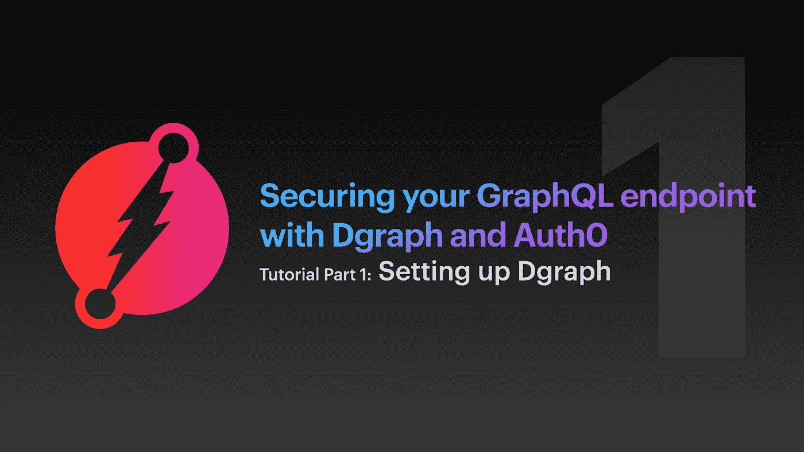
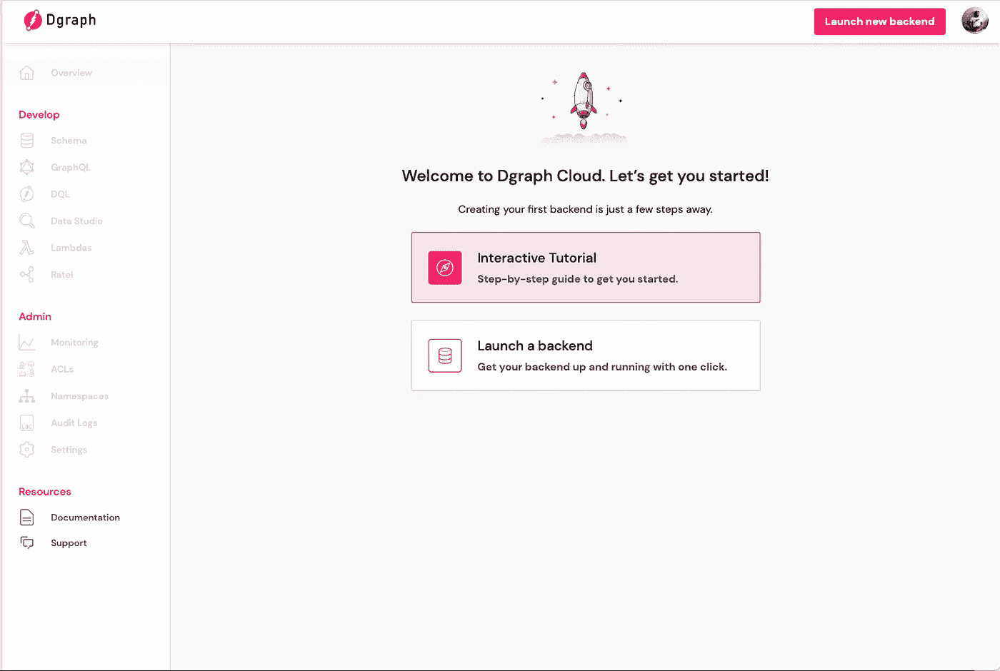
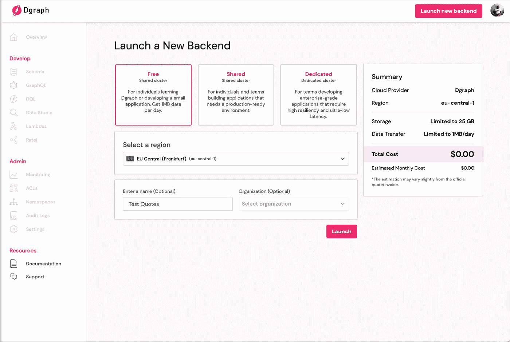
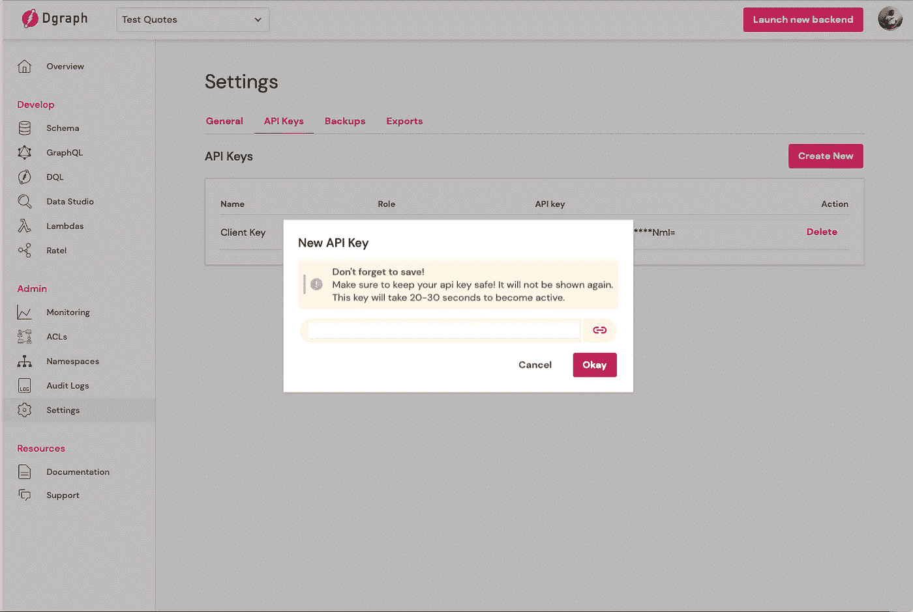
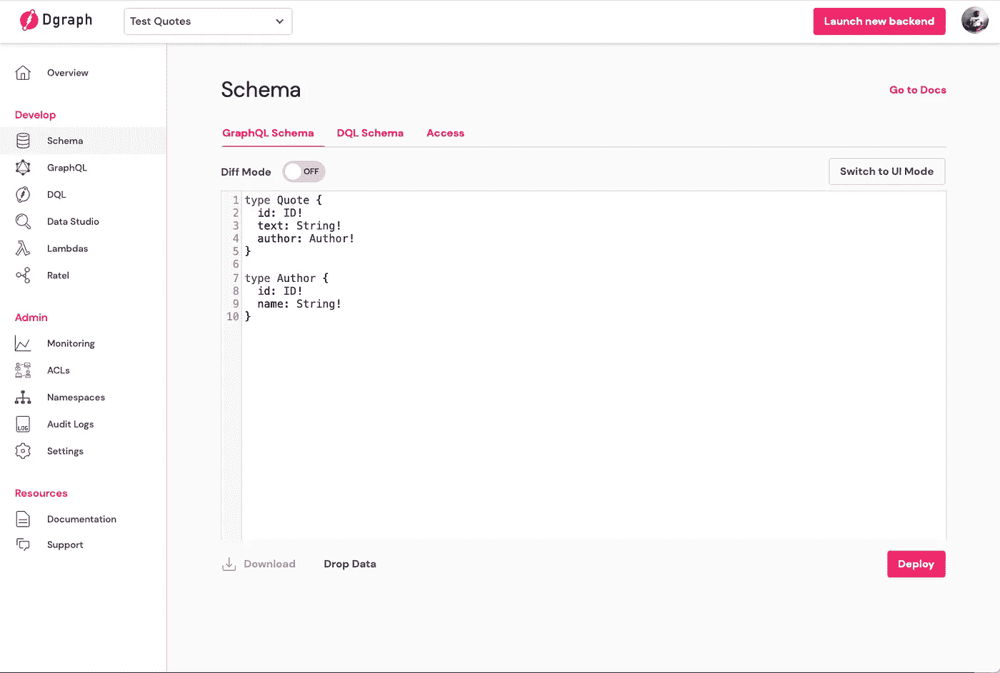
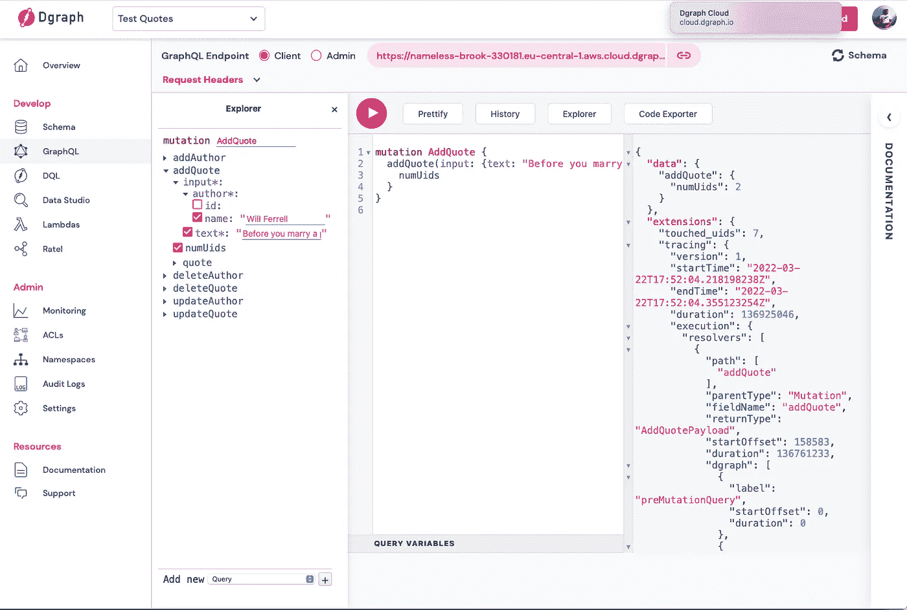
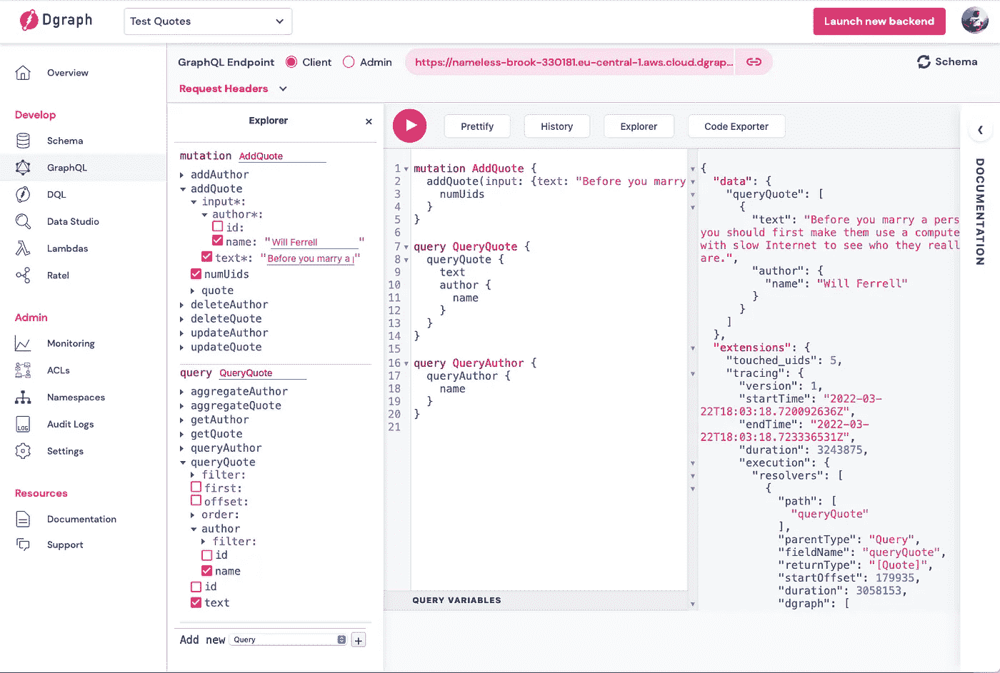

# 使用 Dgraph 和 Auth0 保护 GraphQL 端点—第 1 部分

> 原文：<https://betterprogramming.pub/securing-your-graphql-endpoint-with-dgraph-and-auth0-eb94b935f795>

## 设置数据图表



> 这是一系列文章的第一部分，这些文章将解释如何用一个示例报价应用程序来设置 Dgraph。
> 
> *最终目标是建立一个安全的 GraphQL 端点，您的前端应用程序和后端脚本可以通过 JWT 查询和修改数据。我们将通过一个简单应用程序的例子来完成设置 Dgraph、Auth0 和 Dgraph with Auth0 的所有必要步骤。如果您已经设置了 Dgraph 并知道如何使用它，您可以安全地跳过这一部分。*

# 介绍

随着 NoSQL 运动的兴起，各种产品出现在大型科技公司的产品目录中——[谷歌 GCP、](https://cloud.google.com/firestore) [亚马逊 AWS](https://aws.amazon.com/dynamodb/) 、[微软 Azure](https://azure.microsoft.com/en-au/services/cosmos-db/)——他们都看到了以一种新的、非正统的方式存储数据的潜力。灵活性、潜在的规模和易用性使得全世界的开发者创造了一股不可阻挡的新技术浪潮。

GraphQL 也经历了类似的模式。由于越来越多的应用程序变得前端繁重，开发人员开发和维护这些应用程序的需求变得越来越重要。

但是由于阅读这篇文章的人都不想读一篇关于 Dgraph 是如何产生的文章，所以我将把它留在这里，继续实际的任务。然而，如果你们中的一个想知道更多，请查看 Dgraph 博客上的 [@matt tanner 的](https://dgraph.io/blog/post/rise-of-gql-db/)文章。

# 设置数据图表

到目前为止，Dgraph 是唯一真正的 GraphQL 数据库，因此，在我看来，在不远的将来，它是 web 开发的必备工具。但是在你给他们你所有的钱之前，让我们建立一个[免费测试账户](https://cloud.dgraph.io/login?redirect=/)来看看你自己是否会选择 Dgraph 作为工具！

注册后，你应该被重定向到你的管理界面，在那里你可以做交互式教程或者直接启动后端。因为开发人员通常都很忙，所以让我们跳过教程，马上启动我们的后端。



注册 Dgraph 后重定向。点击“启动后端”开始。

我们现在进入集群选择(Dgraph 希望您花费一些钱的页面)，在这里我们选择免费共享集群选项。这不会给你带来很多好处(每天 1MB 的数据传输量和 25MB 的存储空间),但对于我们将要做的事情来说，这已经足够了。你也可以为你的后端选择一个名字——我选择了*测试引用*——但是你可以随意命名。理想情况下，您希望将集群区域设置在您附近的某个地方，但这也不是必须的，因为我们只是在测试。不过，如果你打算以后购买付费版本，你可能现在就要选择合适的地点。点击启动，我们就可以开始了🚀



启动一个新的后端。点击“免费”开始。

你现在看到了相当多的东西，但实际上大多数现在都不重要。让我们从稍后需要的一些基本设置开始。因为我们计划从一个节点环境中运行一些查询，所以我们需要一个客户机密钥用于我们的(不可公开访问的)节点。转到`Settings > API Keys > Create New`并选择`Client.`，将其命名为*客户端密钥*，然后单击创建。

> 把钥匙保存在某个地方！不会再放了！



导航至设置> API 密钥>新建以生成客户端密钥。

## 添加模式

接下来，让我们创建模式！我不会详细介绍如何编写 GraphQL 模式，所以如果你需要更多信息，我建议你从 GraphQL 官方网站[开始。要创建模式，只需点击导航标签菜单中的`Schema`。确保顶部选择了`GraphQL s´Schema`(DQL 是 Dgraph 自己的查询语言，是另一篇博客文章的特色)。一旦到了这里，我们就可以开始编写我们以后想要查询的节点了。](https://graphql.org)

我们想建立一个后端，允许我们存储报价和他们的作者。因为我们希望尽可能保持简单，所以报价只有一个字段`text`，它保存报价的文本形式，还有一个字段`Author`，它将报价的作者链接到报价。作者只有一个代表作者全名的字段`name`。`id`字段是对该节点进行润土查询和变异所必需的。感叹号表示该字段是必填的。点击 Deploy 将模式部署到您的后端。

```
// Quote
type Quote {
 id: ID!
 text: String!
 author: Author!
}// Author
type Author {
 id: ID!
 name: String!
}
```



在 Scheme > GraphQL Schema 中开始编写第一个模式。

一旦部署了模式，Dgraph 就会自动创建大量解析器来操作数据。如果你想知道 Dgraph 做了什么，你可以探索`GraphQL > Explorer.`中的东西，而我们在这里，让我们添加我们的第一个数据。开始在中间的字段输入`mutation`,然后输入你想给这个突变起的名字(我选择了`AddQuote`),然后填写右边的字段。确保您已经填写了所有必填字段，包括:

*   `text`还有
*   `author > name`

还要确保选择了`numUids`，它会告诉您在查询/变异过程中接触到的节点数量。如果出了问题。如果你只是想复制粘贴我的报价，那就请便。

```
mutation AddQuote {
 addQuote(
  input: {
   text: “Before you marry a person, you should first make them use a computer with slow Internet to see who they really are.”, 
   author: {name: “Will Ferrell”}}
 ) {
  numUids
 }
}
```



运行一个变异，将一个报价及其相应的作者添加到数据库中。

运行查询并检查数据库中有什么

是时候检查变异有没有起作用了！开始键入`query`后跟任何名字(我选择了`QueryQuote`)，然后键入`queryQuote`以获得所有引用加上相应的作者。向我们的任务列表中添加另一个查询，例如`QueryAuthor`。通过点击顶部的▶️按钮，您将被迫选择任务(让我们选择`QeryQuote`)并检查结果。



最后，通过创建 to 查询来检查数据库条目(一个用于报价，一个用于作者)。

如您所见，您也可以只查询`Authors`。因为作者和报价之间没有联系，所以运行作者查询不会给你任何关于他的报价的信息。

使用 GraphQL 和 Dgraph 可以做很多事情，但为了简单起见，我们就此打住。在本系列的第 2 部分中，我们将设置 Auth0 来保护 Dgraph 端点。