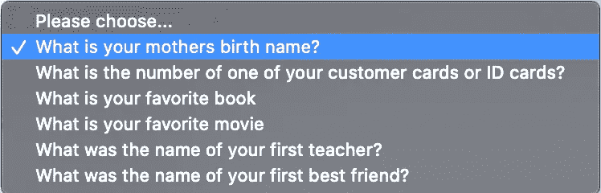

# 安全问题是一个非常糟糕的主意

> 原文：<https://betterprogramming.pub/security-questions-are-a-terrible-horrible-bad-idea-da108e303240>

## 别再问我妈妈的娘家姓了

在 [Unsplash](https://unsplash.com?utm_source=medium&utm_medium=referral) 上 [vardan harutyunyan](https://unsplash.com/@vardanharutyunyanphotography?utm_source=medium&utm_medium=referral) 拍摄的照片

当我在 Deutsche Bahn 设置我的账户时，我惊讶地看到下面的用户界面:

德国铁路帐户用户界面

在 2013 年[雅虎安全漏洞](https://www.verizonmedia.com/press/yahoo-provides-notice-to-additional-users-affected-by-previously/?guccounter=1&guce_referrer=aHR0cHM6Ly93d3cuY25ldC5jb20vbmV3cy95YWhvby1hbm5vdW5jZXMtYWxsLTMtYmlsbGlvbi1hY2NvdW50cy1oaXQtaW4tMjAxMy1icmVhY2gv&guce_referrer_sig=AQAAAFOdM-knlgaDfHmUYvhfgWAau3MAdULaPTm-FSPVTqjRqz7YtjHTca0wmoizBPfo5kzS92H5-I4L0JZLeadBliD10GbVkUJWCTbivTYPqBwei9ZoHhGZMymsWvO22dBr5IcoRJz3XQmV6L-6HZXJDu8V857xHYLDtC-xrmv_sSnw)危及 30 亿用户账户之后，现在大家都知道安全问题是一个可怕的想法。为什么他们还是一对？

# 它们很容易被猜到

安全问题背后的主要思想是它们是安全的和令人难忘的。但有了今天的社交媒体，任何人都可以浏览我的帖子，找出我高中吉祥物的名字，如果我能记住它，那么可能很多人也能。

这项 2015 年的[谷歌研究](https://research.google/pubs/pub43783/)已经证实，只需一次猜测，攻击者就有 19.7%的机会猜出英语用户对“你最喜欢的食物是什么？”。

通过 10 次猜测，攻击者将有 24%的机会猜出说阿拉伯语的用户对这个问题的答案:“你的第一位老师叫什么名字？”还有 39%的几率猜对说韩语的用户的出生城市(还有 43%的几率猜对他们最喜欢的食物)。

许多不同的用户对你通常认为独特的秘密问题也有相同的答案，例如“你的电话号码是多少？”或者“你的常旅客号码是多少？”。

然后，37%的人故意对他们的问题提供错误的答案，认为这将使他们更难猜测，而事实上，这使他们更容易找出答案。

# 他们可以被蛮力

我们要求用户输入包含小写和大写字母、数字和特殊字符的密码。

但是我们把账号恢复机制藏在一个可以暴力破解的傻问题后面？这对我来说没有任何意义！

# 他们对你的用户做了错误的假设

也许在西方世界，人们会发现安全问题是有关联的。但是我没有养宠物，我不擅长记住别人的名字，我也没有结过婚，所以我没有去度蜜月。

我在北非长大，甚至不知道娘家姓是什么意思，因为在我来的地方，女人不会随夫姓。

所以我只知道你最喜欢的菜是什么，任何认识我的人都能猜到是什么。

这是一种可怕的用户体验，它排除了任何与开发应用程序的人文化背景不同的人。这样做，我们损害了他们的隐私，因为我们缩小了他们可能会发现相关的问题。

# 结论

今天，许多可用的服务使得认证集成无缝。

请实施适当的[双因素认证](https://en.wikipedia.org/wiki/Multi-factor_authentication)流程，而不是损害您用户的隐私。

下一次有人问我最喜欢的菜是什么，我会说`cOüs;Coū!68$`！