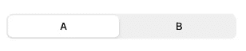
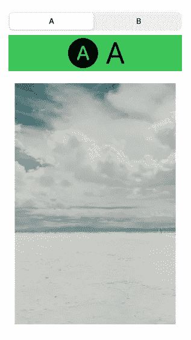
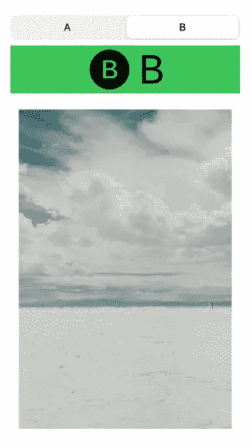

# 分段控件和 SwiftUI 2.0

> 原文：<https://betterprogramming.pub/segmented-controls-and-swiftui-2-0-e04d728ec027>

## 当分段控件的值改变时，激活我们的用户界面


由 [Markus Spiske](https://unsplash.com/@markusspiske?utm_source=medium&utm_medium=referral) 在 [Unsplash](https://unsplash.com?utm_source=medium&utm_medium=referral) 上拍摄的照片。

没有一个完全分段的控件视图，你可以将整个视图从一个分段滚动到另一个分段，这是一个缺点。但是这完全没问题，因为你可以用 SwiftUI 实现几乎任何事情。

今天，我们将创建一个完全分段的滚动效果。

# 大量

*   Xcode 12.3
*   斯威夫特伊

# 先决条件

要学习本教程，您需要了解以下方面的一些基本知识:

*   迅速发生的
*   至少 Xcode 11

# 设置分段控制

您将创建一个`state`来保存所选分段控件的值:

```
@State private var currentSegment = 0
```

您将在`VStack`中嵌入所有内容，并将`SegmentedPickerStyle`用于选取器样式:

```
VStack {
    Picker("A or B", selection: $currentSegment) {
		Text("A").tag(0)
        Text("B").tag(1)
    }.pickerStyle(SegmentedPickerStyle()).padding(.horizontal)
}
```

每个片段都被分配了自己的标签，这是惯例。

您将看到一个包含两个分段的分段控件:



# 设置第一个分段控制视图

在同一个`VStack`中，你将利用`GeometryReader`来帮助动画从一个片段过渡到另一个片段:

在分段控件的第一个视图中，您至少会看到一个同时显示图像和文本的`Label`和一个`Image`。

您的第一个屏幕将如下所示，包含您添加的所有组件:



# 设置第二个分段控制视图

在同一个`ZStack`中，您将创建另一个`VStack`，它属于第二个分段控制视图:

如果比较代码，这是一件相当重复的事情。唯一的区别是`offset`。



# 分段控制动画

现在，您有了一个具有动画过渡的工作分段控件的完整视图:

