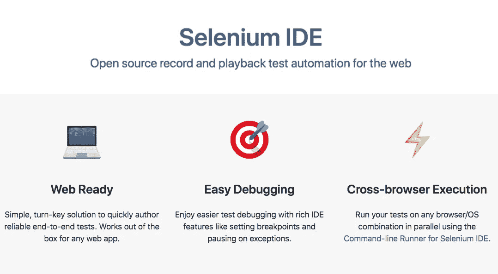
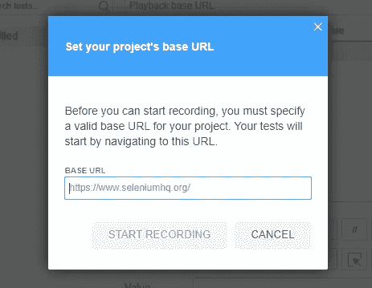
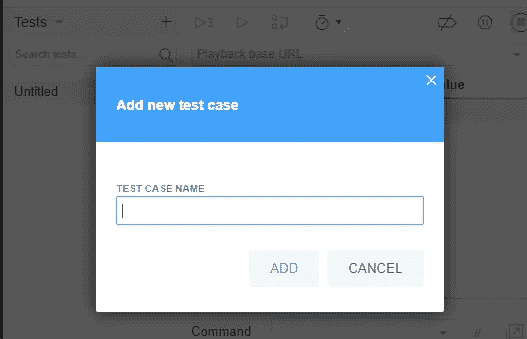
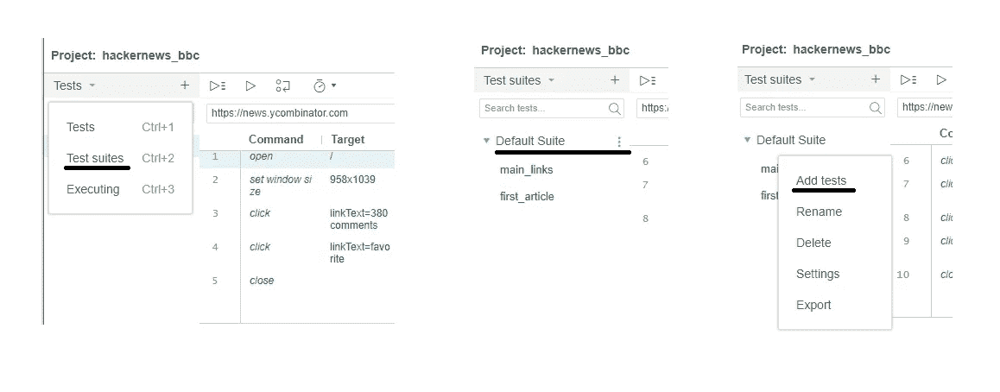
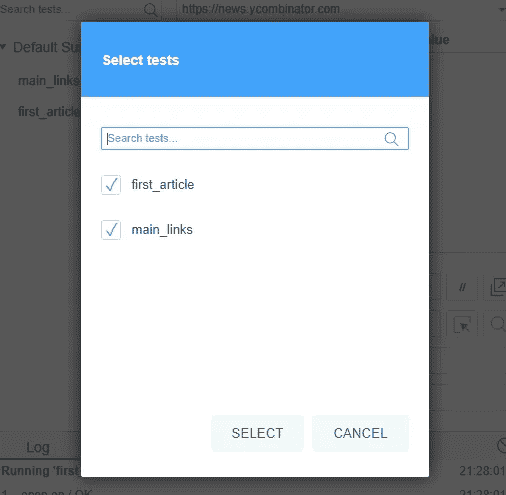
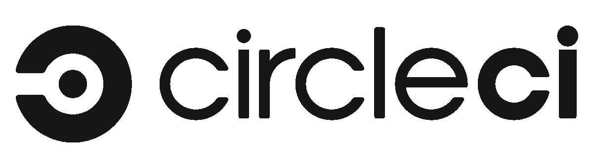

# Selenium IDE —无需编码的端到端测试

> 原文：<https://betterprogramming.pub/selenium-ide-end-to-end-testing-without-coding-b474b9c7de19>

## 您不需要手动编写 E2E 测试——试试 Selenium IDE

# 什么是端到端测试？我需要它们吗？

在 web 应用程序中进行测试是*永远*不需要的。没有人*强迫*你去集成测试，但是有测试可以帮助你过上更快乐的开发生活——确保每次你改变或添加东西的时候都有东西被测试。

端到端或 E2E 测试是一种方法，用于测试应用程序的流程从开始到结束是否按照设计执行。

整个 web 应用程序在真实场景中进行测试，比如与数据库、网络、硬件和其他服务进行通信。在这种情况下，我们将测试几个在线网站，如谷歌或黑客新闻。

# 硒 3.0

[Selenium IDE](https://github.com/SeleniumHQ/selenium-ide) ，可能是[老 Selenium](https://en.wikipedia.org/wiki/Selenium_(software)) 的侄子，被创建的目的是让 E2E 测试的记录和回放变得像用鼠标和键盘使用网络浏览器一样简单。

该项目是完全开源的，它可以作为一个[浏览器扩展](https://github.com/SeleniumHQ/selenium-ide#installation)直接安装，在不到一分钟的时间内开始进行测试。也是[官方硒族](https://github.com/SeleniumHQ/)的一部分。

# **入门**

1.  在浏览器上安装扩展 [Selenium IDE](https://github.com/SeleniumHQ/selenium-ide#installation) 。这真的很简单，只需为您的浏览器选择正确的浏览器:

*   [铬合金](https://chrome.google.com/webstore/detail/selenium-ide/mooikfkahbdckldjjndioackbalphokd)
*   [火狐](https://addons.mozilla.org/en-GB/firefox/addon/selenium-ide/)

2.开始记录你在浏览器中的动作。

3.回放测试并添加或修复您的记录器行为。

# 那么，它是如何工作的呢？

当您启动扩展时，您可以创建或打开一个新项目。如果没有其他测试，您必须设置网站的基本 URL:

然后添加一个新的测试:

您回放测试以检查一切是否正常。例如，通常某个特定步骤中一些元素需要从“css 选择器”更改为“X-Path”。

警告:您需要将您的测试添加到测试套件中，以便成组运行它！

您应该将新的测试添加到一个测试套件中，以使您能够将不同类型的测试组合在一起，并成批执行它们:

添加到测试套件，转到“测试套件”选项卡，然后按“添加测试”

如果您喜欢观看快速视频演示:

# 我可以从网站的特定路线录制测试吗？

是的—您只需将测试的第一条指令从:

`Command = open, Target = “/sub_domain_page_url”`

达到以下目标:

`Command = open, Target = /websitepagename`

# 导出结果？

您可以决定将您的测试保存为带有`.side`扩展名的 Selenium IDE 文件，或者将它们导出为各种格式的测试，例如:

*   [Mocha](https://mochajs.org/) ，通常用于 Javascript 节点项目
*   [JUnit](https://junit.org/junit5/) ，用于 Java 项目
*   [Pytest](https://docs.pytest.org/en/latest/) ，用于 Python 中的 Flask 项目

要导出，单击测试名称右侧的三个点。

我通常更喜欢保留`.side`扩展，以便轻松地添加更多测试，并能够将它们与[持续集成](https://github.com/Giorat/continuos_integration_e2e_selenium)管道集成，但我将在下一节讨论这一点。

# 与 CircleCI 的持续集成

如果你决定保留`.side`扩展，你将可以很容易地在[管道](https://github.com/Giorat/continuos_integration_e2e_selenium)中运行测试，就像免费的 [CircleCI](https://circleci.com) 一样，对于私有库也是免费的！

我已经为您创建了一个[示例库](https://github.com/Giorat/continuos_integration_e2e_selenium)，以便从 tests 文件夹和一个[的简单结构中获得灵感。circleci/config.yml](https://github.com/Giorat/continuos_integration_e2e_selenium/tree/master/.circleci) 到[配置 chrome 和 selenium](https://github.com/Giorat/continuos_integration_e2e_selenium/tree/master/.circleci) 在 Circle 的[云上运行测试。](https://circleci.com/gh/Giorat/continuos_integration_e2e_selenium)

在我的[库](https://github.com/Giorat/continuos_integration_e2e_selenium)中，我已经给了你一个运行于各种网站的 [Selenium IDE](https://github.com/Giorat/continuos_integration_e2e_selenium) 的完整例子，比如 [Google 和](https://github.com/Giorat/continuos_integration_e2e_selenium)上的 [CircleCI](https://circleci.com/gh/Giorat/continuos_integration_e2e_selenium) 这里的。

如果你想知道我是如何让它在 CirlceCI 上运行的，请阅读下一节。

如果你只是想使用我的[库](https://github.com/Giorat/continuos_integration_e2e_selenium)，我希望你我已经帮助演示了创建端到端测试是多么容易，而不必手工编写每一个测试。

# 在我的本地 PC 上运行 Selenium IDE CLI

如果你想配置 selenium 驱动程序，你可以阅读命令行运行程序的官方文档。但是我将分享一些运行 CLI 的技巧，就像我对 Travis 做的那样。您需要设置一些组件:

*   Seleniun-Side-Runner 运行测试的 CLI
*   可以从命令行运行的浏览器，在本例中为 Chrome
*   为测试 [ChromeDriver](https://chromedriver.chromium.org/) 安装合适的[驱动](https://www.seleniumhq.org/selenium-ide/docs/en/introduction/command-line-runner/)来运行你的网络浏览器。

要配置 CLI，您需要添加以下全局软件包:

`npm install -g selenium-side-runner webdriver-manager`

然后，你必须正确配置 Chrome，以便能够从命令行运行它的版本。检查它是否在您的系统路径中——如果没有，请将 Chrome 文件夹添加到您的路径中:

`google-chrome — product-version`

记下这个版本，然后使用 webdriver-manager 安装正确的 chromedriver 版本:

`webdriver-manager update — versions.chrome VERSION_ON_YOUR_PC`

例如，如果我有 chrome 版本“77.0.3865.40 ”,我会键入:

`webdriver-manager update — versions.chrome 77.0.3865.40`

最后运行测试:

`selenium-side-runner ./tests/my_side_file_test.side`

如果你想运行一个文件夹中的所有测试，只需使用“*”星号:

`selenium-side-runner ./tests/*.side`

# 我的新座右铭！

减少创建测试的疲劳=开发人员创建更多的测试！

# **来源和参考资料**

*   [https://www.seleniumhq.org/selenium-ide/](https://www.seleniumhq.org/selenium-ide/)
*   [https://www . selenium HQ . org/selenium-ide/docs/en/introduction/命令行运行程序/](https://www.seleniumhq.org/selenium-ide/docs/en/introduction/command-line-runner/)
*   [https://circleci.com/](https://circleci.com/)
*   [https://circle ci . com/GH/Giorat/continuos _ integration _ e2e _ 硒](https://circleci.com/gh/Giorat/continuos_integration_e2e_selenium)
*   [https://www.youtube.com/watch?v=1oFMPXI_YBg](https://www.youtube.com/watch?v=1oFMPXI_YBg)