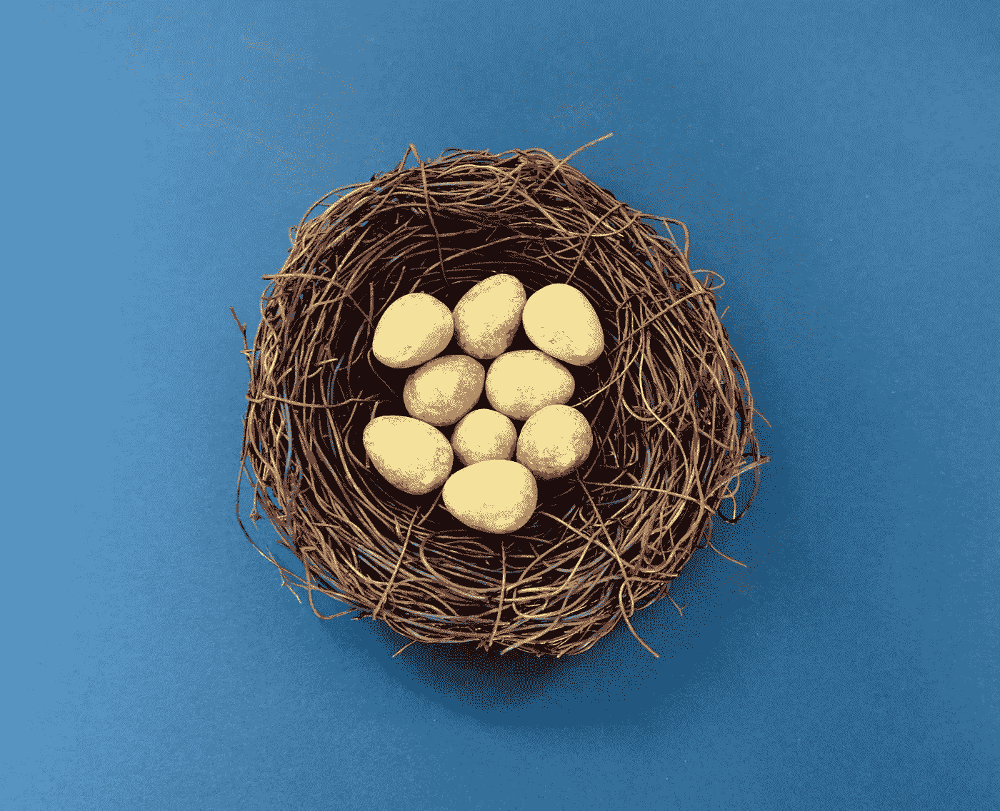
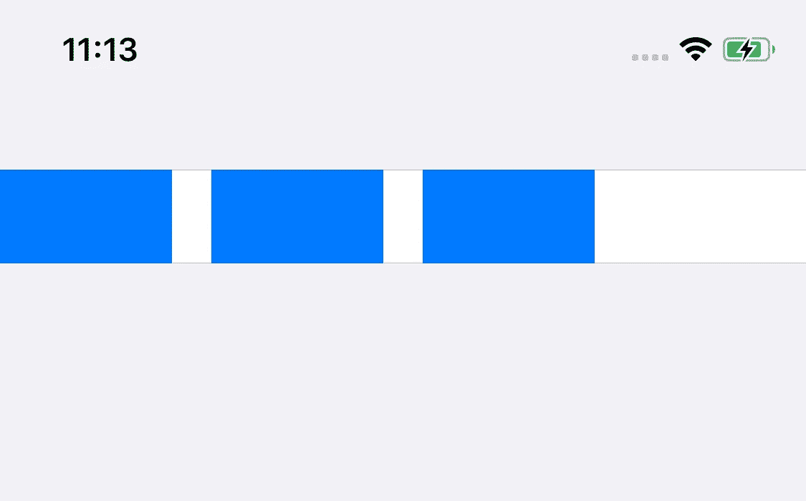
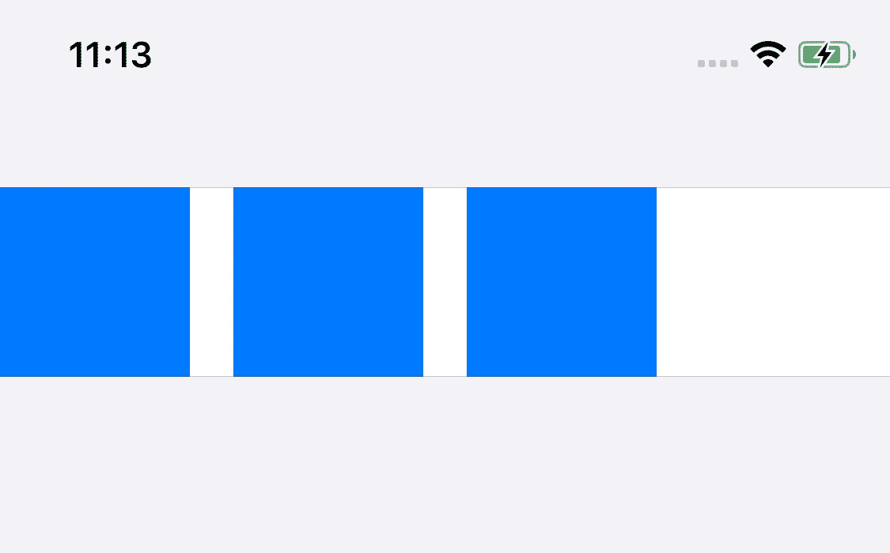
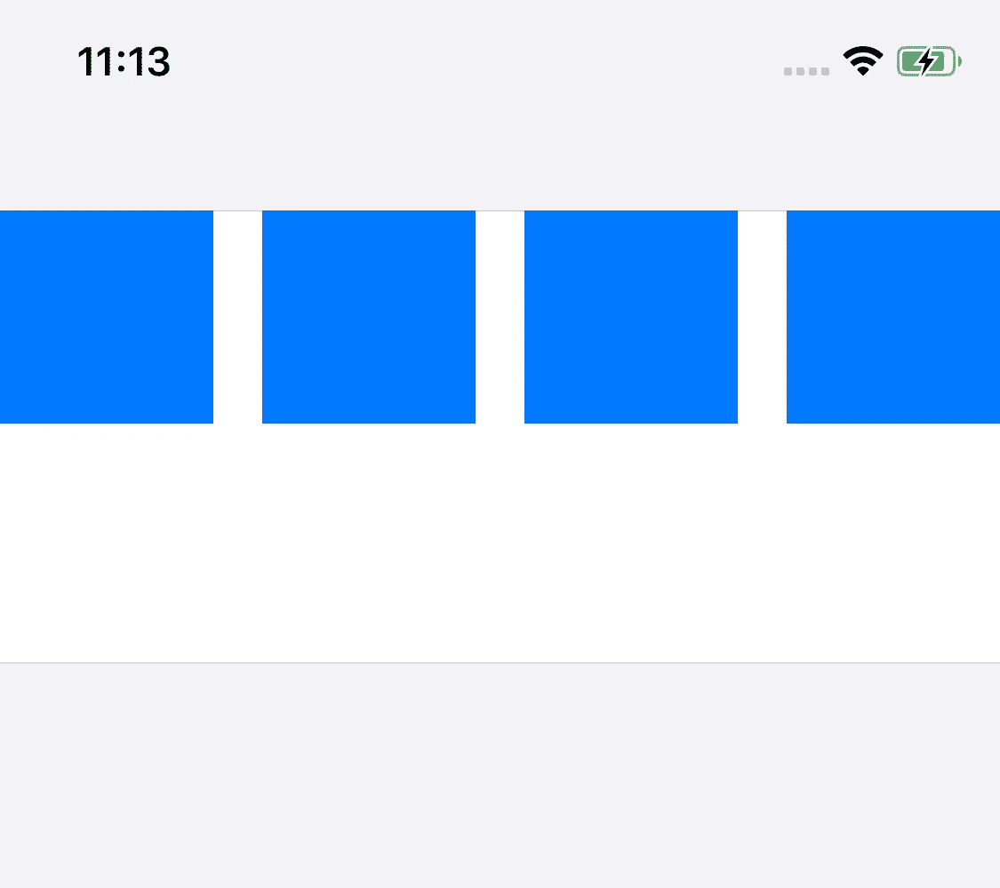
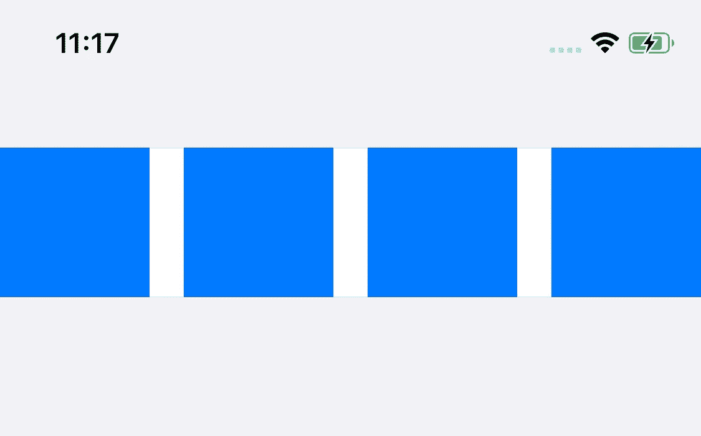

# 自我调整 Hell — UITableView 和 UICollectionView 单元格

> 原文：<https://betterprogramming.pub/self-sizing-hell-uitableview-and-uicollectionview-cells-509f0fdc7ff1>

## 快速了解如何让嵌套的自调整大小单元格工作



照片由[艾莉婕·马尚德](https://www.pexels.com/@thebstudio?utm_content=attributionCopyText&utm_medium=referral&utm_source=pexels)从 [Pexels](https://www.pexels.com/photo/white-eggs-in-brown-nest-947457/?utm_content=attributionCopyText&utm_medium=referral&utm_source=pexels) 拍摄

这篇文章的想法始于我在工作中面临的一个挑战*，*我被分配了一个任务，要实现一个*嵌套版本的自调整单元格*:在一个自调整单元格`UITableViewCell`内实现一个自调整单元格`UICollectionViewCell`。

乍一看，这似乎是一个相当简单的任务，我天真地认为从一开始一切都会“正常工作”，但伙计，我错了吗？

自从 iPhone 开发初期以来，`UITableViews`和`UICollectionViews`几乎被每个应用程序用来显示内容。

通常，这些内容不是静态的，也不总是具有相同的大小，但是由于引入了动态类型和不同的屏幕大小，因此在每个设备上正确显示内容非常重要。

几年前，随着 iOS 8 的发布，苹果增加了在`UITableViews`和`UICollectionViews`中轻松实现自我调整单元大小的能力，而无需我们自己进行这些计算。

在这篇文章中，我们将通过一些例子来看看这是如何工作的，希望这些例子能帮助那些试图让自我调整大小的细胞工作的人。

如果您想继续学习，您可以在 [GitHub](https://github.com/danmunoz/self-sizing-hell) 上找到示例代码。

# **自我评估基础知识**

在 iOS 11 中，默认情况下会启用自调整单元格，但如果我们仍然需要支持 iOS 10，那么让它工作是非常容易的。

我们只需要将`estimatedRowHeight`设置为*估计的*高度值，并让`UIKit`为我们进行计算。`UICollectionViewFlowLayout`iOS 10 以后就不需要这个值了。

系统能够根据其`contentView`中定义的约束条件自动计算单元的大小，从而使自调整单元工作。

为了帮助自动布局计算正确的大小，我们需要确保从顶部锚点到底部锚点的所有 UI 元素都有完整的约束链。我们必须确保没有不明确的布局，否则尺寸无法计算。

# **超越最简单的情况**

当我们确保有一个明确的布局时，实现自我调整`UITableView`或`UICollectionView`是相当容易的。当我们深入到更高级的东西时，事情变得有点棘手，比如将一个嵌套到另一个中。

为了解释我对此的发现，我们将看几个不同的情况来理解这是如何工作的。

在我们开始之前，请注意示例代码。

*   我们以编程方式编写所有 UI 代码，没有使用`Storyboards`或`xib`文件。
*   我们用`AutoLayout`。

# **方形视图**

为了更容易理解，我们将使用一个固定大小(80x80)的正方形视图作为`UICollectionViewCell`内部的唯一对象。

为了计算单元格的正确大小，自动布局需要知道每个单独元素的大小。在这个嵌套的例子中，自动布局需要知道`UICollectionViewCell`的大小来计算`UICollectionView`(`contentView`)的大小。

为了避免复杂性，我们将宽度和高度定义为 80 磅，以帮助自动布局计算。

`UICollectionView`位于`UITableViewCell`内部，因此自动布局需要其尺寸来计算`UITableViewCell` ( `contentView`)尺寸。

如果这是作为一个独立的`UICollectionView`来实现的，那么定义单元格内元素的大小就足够了，但是在这个嵌套的例子中，我们最终得到了如下所示的结果:



使用默认的 44 磅高度…而不是定义的 80 磅高度裁剪 UICollectionView

此外，我们还会看到以下警告记录:

```
Warning once only: Detected a case where constraints ambiguously suggest a height of zero for a table view cell’s content view. We’re considering the collapse unintentional and using standard height instead.
```

当定义`UITableView`的单元格大小时，它使用的高度为零，因此系统自动分配默认的单元格高度 44 磅。

这是因为`UITableViewCell`的大小计算发生在`UICollectionView`的`contentSize`被定义之前，所以它返回零。

为了计算自调整单元格的高度，`UITableView`在每个单元格上调用`systemLayoutSizeFitting(targetSize:horizontalFittingPriority:verticalFittingPriority:)`。此方法根据单元格内定义的布局计算高度。

调试正在发生的事情的一个好方法是覆盖这个方法，并查看对 super 的调用返回了什么。当我们这样做时，我们可以看到返回的大小是(375 x 44)，由于方形视图的高度是 80 磅，所以内容被剪裁。

# **解决方案**

我在网上寻找解决这个问题的方法，有很多关于从`systemLayoutSizeFitting`电话中回复`UICollectionView`的`contentView`的建议。



UICollectionView 有 3 个正方形，正确高度为 80 磅

虽然这种解决方案在大多数情况下都有效，如上所示，但也有一些情况下它不起作用，导致一个奇怪的长`UICollectionView`。



UICollectionView 有 4 个正方形和一个错误的高度，大到足以容纳另一行

我发现这个计算失败了，因为`UICollectionView`的`contentView`有时(还)没有调整到它的超级视图(`UITableView`)的*正确的*宽度，并且使用默认的`UIKit`值 320 磅。

如果我们运行示例项目并将方块的数量设置为 1 到 3，则计算将考虑一个 320 磅宽的框，因为方块的数量仍然适合该框，在布局过程发生后，`UITableView`具有适合这些方块的正确高度。

不幸的是，在有四个正方形的例子中，`UICollectionView`的`contentSize`也是为 320 磅宽的盒子计算的。

这意味着四个方块需要放在第二行，当布局通过时，四个方块将放在一行内(与`UITableView`宽度匹配),但是`UITableViewCell`已经用不正确的高度计算。

# **为解决问题而解决**

在玩了演示项目后，我发现我们需要强制一个额外的布局通道，以便`UITableView`可以计算正确的单元格高度，这也是在`systemLayoutSizeFitting`方法中完成的:



具有 4 个正方形和正确高度的 UICollectionView

这里发生的事情是，我们将`UITableView`的`contentView`框架设置为单元格的边界，然后我们触发新的布局传递。当我们这样做的时候，在下一轮，auto layout 将能够使用一个具有正确宽度的框来计算它的大小。

我用不同的布局尝试了这个解决方案，尤其是总是很棘手的多行`UILabel`，它似乎一直在解决这个问题。

我希望有一种更干净的方式来做这件事，所以如果你有任何建议，请发给我。

# **总结**

在本文中，我们看到了如何修复实现嵌套的自调整单元格时的一个常见问题。

根据您的具体情况，尝试调试在`systemLayoutSizeFitting`方法中返回的内容，并查看大小调整和布局传递的顺序。

网上有关于这个话题的好资料，我推荐[雷诺·林哈特的 NSSpain talk](https://vimeo.com/nsspain/2019-cells) 。

在 [GitHub](https://github.com/danmunoz/self-sizing-hell) 上找到本文使用的示例代码。

正如我在开始时提到的，我希望这个自我调整细胞如何工作的快速解释对面临同样挑战的人有用。