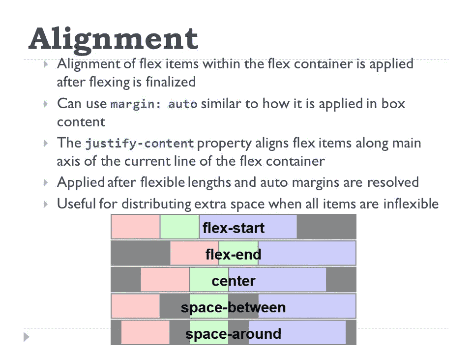
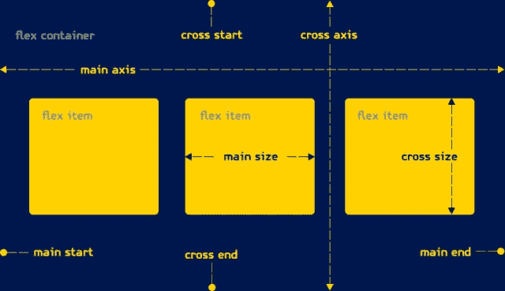
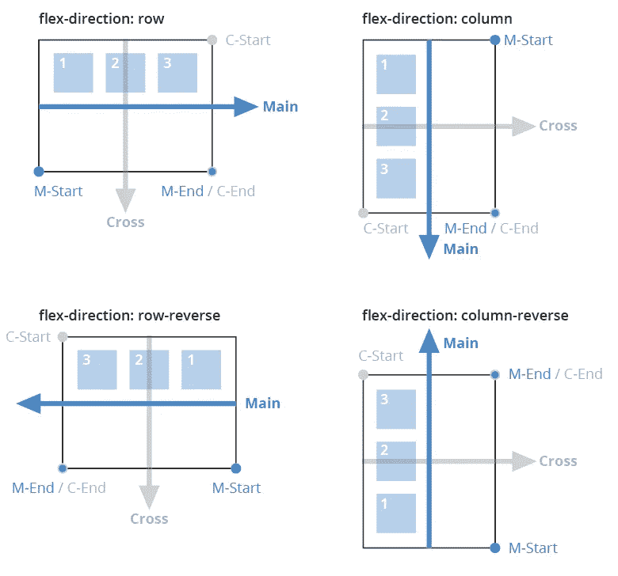
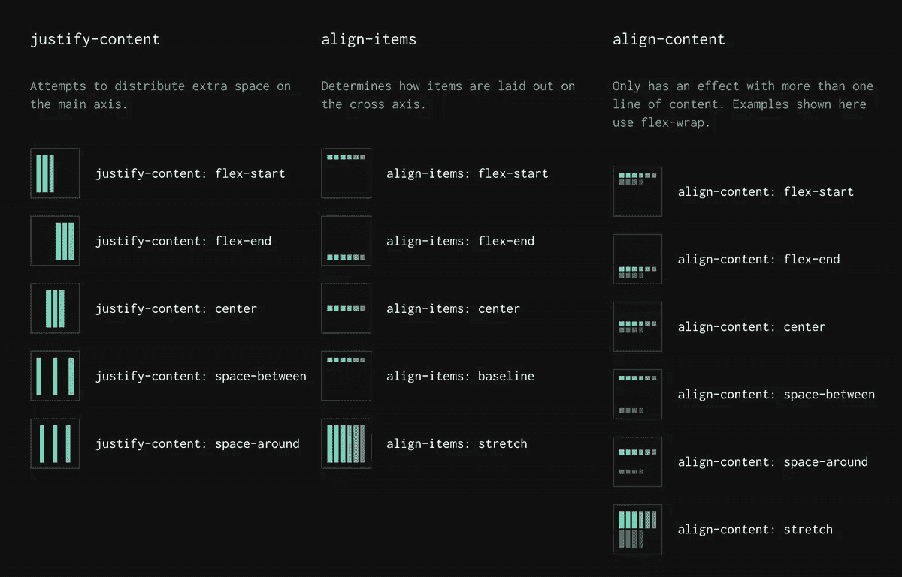
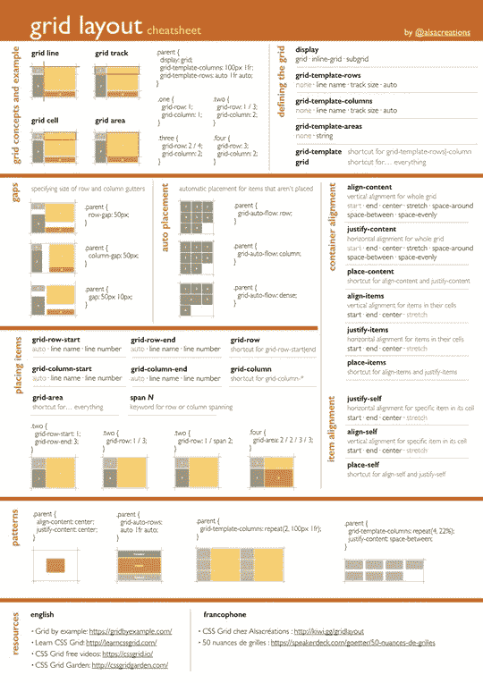

# 了解 CSS 网格和 Flexbox

> 原文：<https://betterprogramming.pub/self-taught-developer-how-to-become-a-better-front-end-developer-3-5-understanding-css-grid-and-2038419e8f72>

## 前端定位指南

照片信用 Unsplash

CSS Grid 或者 Flexbox——想知道选哪个？我们来对比一下。

CSS Grid 和 Flexbox 都是 web 布局技术。即使它们看起来有许多相似之处，但它们是为非常不同的任务而编程和开发的。它们是为解决两个不同的问题而构建的:Flexbox 是为列或行的一维布局设计的，而 Grid 是为列或行的二维布局设计的。

最终，他们不再是竞争对手，而是可以一起工作。但是 Grid 有一些 Flexbox 没有的属性，Flexbox 有一些 Grid 没有的属性。

充分理解它们，知道它们的不同和相似之处，一起使用它们，你就会拥有一个强大的容器。

# Flexbox 是基于内容的

如果您的目标是:

*   以提供固定且可预测的布局。
*   创建适用于不同屏幕尺寸的布局。
*   创建适用于多种设备的布局，根据您的设计适当填充所有必要的空间。
*   最大化它，并以可预测的方式利用它。

**Flexbox** 有一个 flex 容器和 flex 项目。flex 容器包含一个或多个 flex 项目。Flexbox 专为复杂的应用程序和网络而设计。

使用弹性盒布局时，单元或弹性项目的大小通常在弹性项目内定义。 *Flexbox 仍然使用 CSS 属性，但是更好更高效*，它在创建布局时提供了极大的灵活性，尤其是复杂的布局。

它是优雅的、轻量级的，不需要安装或打包，所以你仍然可以在一个 flex 容器中在所有可能的方向上进行布局。

*   Flexbox 在轴网格上工作。
*   flex 容器可以改变其子容器的宽度、高度和顺序。
*   项目可以增长以填充可用空间。
*   项目可以收缩以防止溢出。
*   可用空间将分布在一个、多个或所有项目中。

图片来源: [CSS 招数](https://css-tricks.com/almanac/properties/j/justify-content/)

使用 Flexbox 的另一个好处是，它允许您指定容器及其内容。您可以轻松地指定材料流动的方向、内容的换行方式以及它们如何扩展以最大化填充其空间。

无论您的目标是创建大型网站和应用程序还是小型网站，修复网站还是响应网站，flexbox 都会让您的生活更加轻松。

你可以认为 Flexbox 使用了块布局，尽管它不支持像 floats 和 columns 这样的 CSS 属性。但是，它为内容的分布和对齐提供了很大的灵活性。它旨在解决每个复杂的 web 和应用程序都有的复杂问题——媒体对象、粘性页脚、垂直居中和一些网格系统。

图片来源: [Slicejack](https://slicejack.com/introduction-to-flexbox/)

Flexbox 通过双向解决了一个重要问题(不要把它和二维混淆，flexbox 是一维的)。

Flexbox 布局被认为是方向不可知的。如果您使用了块/垂直和内联/水平，块和内联缺少的灵活性是它们都是单向的，而 flexbox 是双向的。可以加上`flex-direction: row`或者`flex-direction: column`，就这样。

如果你打算使用`Grid`，你的目的应该是将网页分成行和列。列和行都有命名区域，您可以在其中放置对象。布局将取决于您的设计和断点。每个网格区域都支持其填充、flexbox 或通常所说的对齐、边框和背景样式。

我同意 Flexbox 可能需要一段时间来学习——我也不是专家。每当我设计网页和应用程序时，我仍然会使用参考资料和备忘单。当你需要的时候，不要害怕浏览一些备忘单和指南，尤其是在处理不同的属性组合时——我们大多数人都是这样做的！

# Flexbox 备忘单

图片来源:[自举创意](https://bootstrapcreative.com/flexbox-tutorial/)

Flexbox 的详细指南:

 [## Flexbox | CSS-技巧完全指南

### 我们的 CSS flexbox 布局综合指南。这份完整的指南解释了 flexbox 的一切，重点是所有…

css-tricks.com](https://css-tricks.com/snippets/css/a-guide-to-flexbox/) 

## CSS Flexbox 教程

## 基于 Flexbox 项目的教程

## CSS Flexbox 备忘单

 [## Flexbox 备忘单和引导 Flex 备忘单— PDF 下载(2020)

### 下面是 flexbox 示例标记。您可以手动应用 flexbox CSS 属性，但是当…

bootstrapcreative.com](https://bootstrapcreative.com/resources/flexbox-cheat-sheet/) 

# 网格采用基于容器的方法

CSS Grid 是为 web 和应用程序开发的二维布局，这意味着它既可以用于列，也可以用于行。众所周知，Grid 将页面分成几个不同大小、位置甚至层的小部分。

图片来源: [SmashingMag](https://twitter.com/smashingmag/status/1030607937453010946)

这里有一个技巧——尽可能使用`repeat`属性，它可以缩短你的 CSS 代码。检查上面的图表。

网格允许我们更容易和一致地设计复杂的响应性 web 布局和应用程序。使用网格的主要原因是将页面分成列和行，每个网格区域可以定义填充、对齐、边框和背景样式。

Grid 采用表格方式，允许我们将不同的组件排列成列和行。然而，请记住 CSS 网格是很难掌握的，尤其是当你开始的时候。基于网格的布局需要一个父容器和称为项目的内部元素，可能有不同的 CSS 网格属性会分别影响它们。一些属性只能影响父容器，而其他一些属性只能作用于项目组件。

最后一点，当使用网格时，设计布局就是规划页面、空间、列和行。你必须考虑多维度来设计它们，因为这就是网格是如何创建的。您还必须记住跨多种分辨率和屏幕尺寸缩放内容的要求。

大多数东西都是独一无二的，取决于你的设计结构。

当使用网格布局时，单元格或网格项的大小在网格容器内定义。

Flex Grid 是一种基于 CSS 网格布局创建灵活布局的新方法。CSS Grid 对于开发人员来说很有用，他们可以更容易、更有效地创建复杂的响应式应用程序布局，这种布局适用于多种浏览器，通常不适用于几种 CSS 技巧。

图片来源: [alascreations](https://github.com/alsacreations/guidelines/blob/master/grid-cheatsheet.pdf)

然而，CSS Grid 需要一个现代的浏览器，比如 Google Chrome、Mozilla、Safari，而且不能与 Internet Explorer 兼容。

## 以下是查看当前支持哪些浏览器的链接:

 [## 我可以使用 HTML5、CSS3 等的支持表吗

### “我可以使用吗”提供了最新的浏览器支持表，以支持桌面和移动设备上的前端 web 技术…

caniuse.com](https://caniuse.com/#feat=css-grid) 

# Flexbox 备忘单

这里有一个更详细的使用 CSS 网格的技术教程

 [## FlexBox 入门

### Flexbox 入门 FlexBox 是一种新的 CSS 布局模式，它引入了一种强大的布局、对齐和…

www.wysiwygwebbuilder.com](http://www.wysiwygwebbuilder.com/flexbox.html) 

# 网格教程基础

观看 Dev Ed 的速成视频，解释开始使用 CSS 网格系统设计网页时需要注意的要点。

如果你更喜欢阅读，你可以在这个博客中找到关于 CSS 网格系统的更详细的解释和技术理解:

 [## 创建网格

### 在这里，我们创建了一个基本的 3x3 网格，网格轨道之间有一个小槽。我们将创建一个基本的网格，看起来像…

www.qhmit.com](https://www.qhmit.com/css/grid/tutorial/create_a_grid.cfm) 

# 网格备忘单

这里有一个教程解释了网格是如何使用图表来理解网格系统的基本原理和技术部分的，把它收藏起来供你将来参考。

 [## CSS 网格——网站和应用程序布局的瑞士军刀

### 这两个月来，我深入学习 CSS 网格。在这篇文章中，我想分享我的主要观点。制造…

weekly-geekly.github.io](https://weekly-geekly.github.io/articles/423709/index.html) 

# 基本 CSS 网格教程

# 基于 CSS 网格项目的教程

下面是我最喜欢的在线导师 Traversy Medi 的 Brad Traversy 的课程。在这里，您可以通过使用 Grid 构建一个响应式网站来学习 CSS Grid。

这是一个前端开发系列，可以在我的页面上找到，请随意查看。

感谢您的阅读！