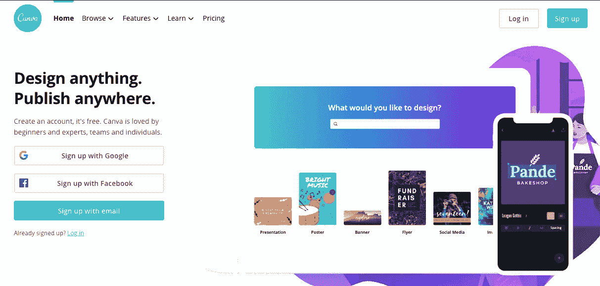
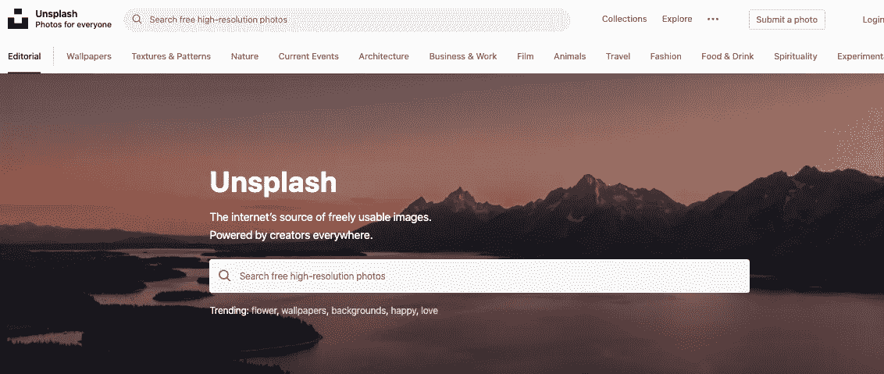
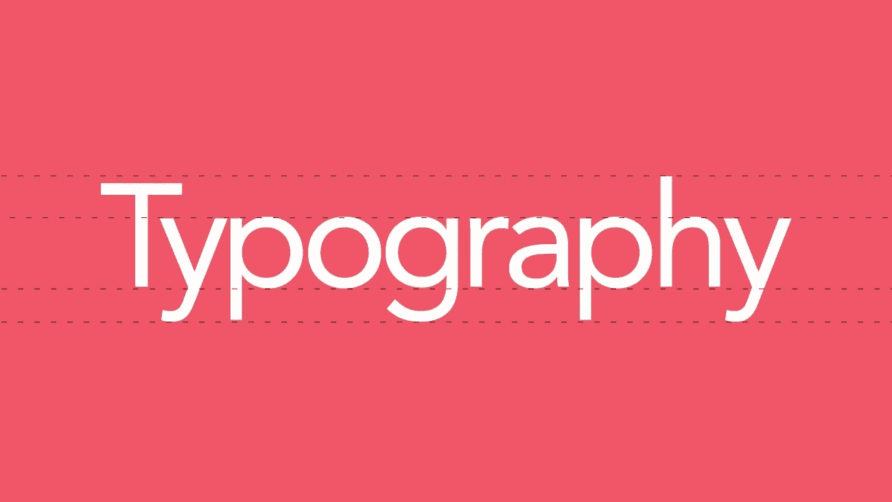
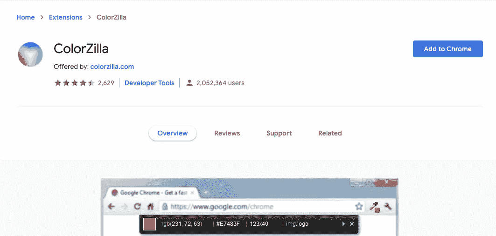
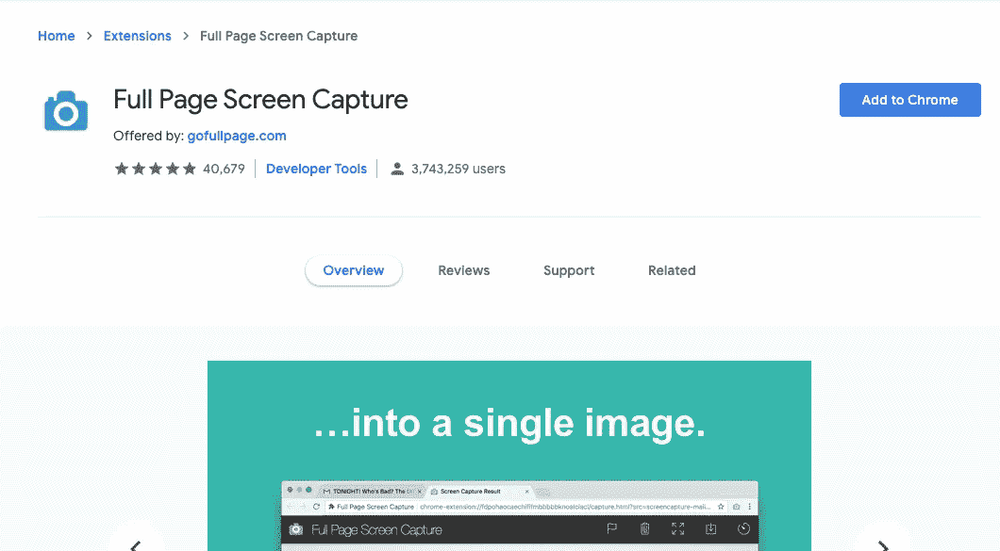
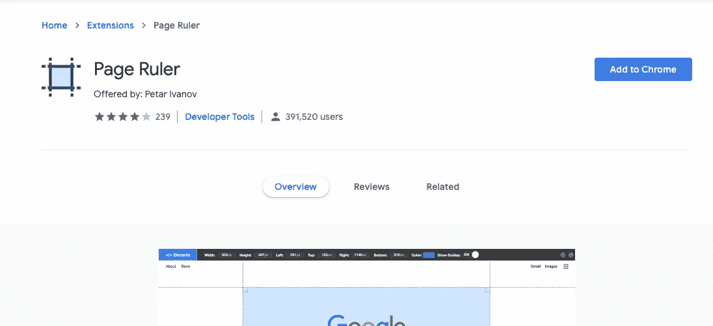
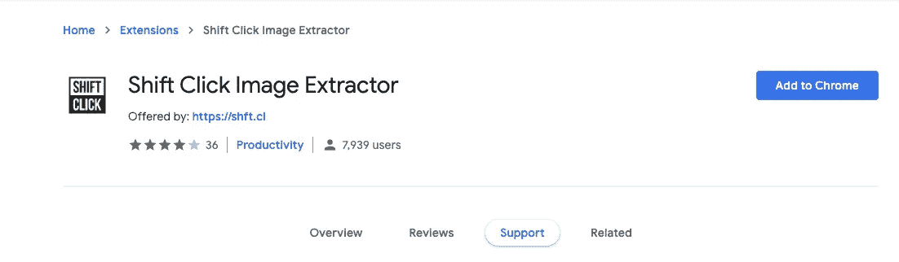
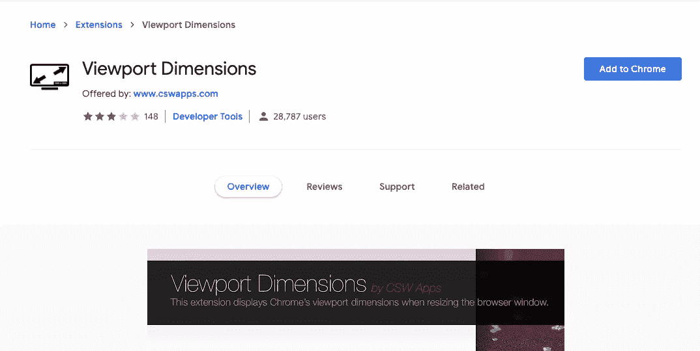
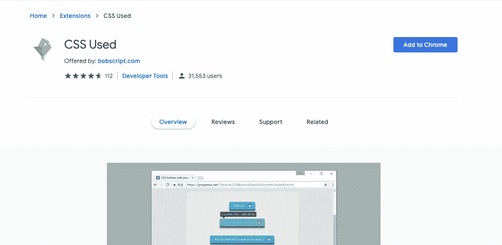
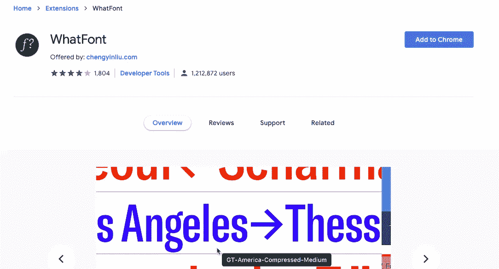

# 如何像专业人士一样编码

> 原文：<https://betterprogramming.pub/self-taught-developer-how-to-code-like-a-pro-5-5-20-must-have-cheatsheet-tools-for-every-e250d4c64978>

## 每个前端开发人员必备的 20 多个备忘单和工具

潘卡杰·帕特尔在 [Unsplash](https://unsplash.com/s/photos/laptop-on-table?utm_source=unsplash&utm_medium=referral&utm_content=creditCopyText) 上的照片

在您开始 web 开发之旅时，请将此作为您的指南和参考。

首先，前端开发不仅仅是设计，你将使用 Photoshop，Illustrator 等。

但是，作为前端开发人员，你仍然会有与设计相关的任务，但不是重点，因为作为前端开发人员，你将负责将设计变成现实。

您负责通过使用 HTML、CSS 和 JavaScript 等基础语言，将项目网站或移动应用程序的拟议图像转换为可见的功能性网站或应用程序。

作为前端开发人员，你的任务是在 web 设计人员和后端开发人员之间架起一座桥梁，将设计转化为代码，而后端开发人员可以通过插入后端代码来进行数据库操作、数据结构等工作。

前端开发的范围很广，需要不同的专业知识，在这个过程中，你会明白它有多重要，有多庞大，但你不必一下子全部掌握。

专注于学习基础和基本知识，因为这将有助于你在未来成为一名更好的前端 web 开发人员，所以专注于建立一个坚实的基础。

把这个做书签，做笔记，在旅途中作为参考，祝你好运！

# 备忘单

## **1。终极 Flexbox 备忘单**

 [## 使用 Flexbox 掌握 CSS 布局

### 观看 3 分钟的视频介绍和现场演示，您可以在上面查看源代码。任何 flexbox 布局的第一步都是…

www.sketchingwithcss.com](https://www.sketchingwithcss.com/samplechapter/cheatsheet.html) 

## **2。HTML5 JavaScript API 索引**

 [## HTML 5 JavaScript API 索引

### 编辑描述

html5index.org](http://html5index.org/) 

## **3。OverAPI.com**

 [## OverAPI.com |收集所有的小抄

### OverAPI.com 是一个收集所有备忘单的网站，全部！

overapi.com](http://overapi.com/) 

# 颜色；色彩；色调

## **4。FlatUI 颜色**

FlatUI 设计颜色选择器。

 [## 平面 UI 颜色 2 - 14 种调色板，280 种颜色🎨

### 280 种精选颜色可供复制和粘贴

flatuicolors.com](http://flatuicolors.com/) 

## **5。简单平板颜色选择器**

如果您的目标是平面设计，则可提供完美的颜色。

 [## 简单平板颜色选择器

### 您的浏览器不支持 clipboard.js -复制上面的颜色代码。

color.koya.io](http://color.koya.io/) 

## **6。颜色十六进制**

 [## 彩色十六进制 ColorHexa.com

### ColorHexa.com 是一个免费的颜色工具，提供任何颜色的信息，并生成匹配的调色板…

www.colorhexa.com](http://www.colorhexa.com/) 

## **7。调色板**

 [## 可放置的

### 编辑描述

www.palettable.io](http://www.palettable.io/ED3E75-383838-D4D4D4) 

## **8。UIGradients**

 [## uiGradients -美丽的彩色渐变

### uiGradients 是为设计师和开发人员精心挑选的美丽的颜色渐变集合。

www.uigradients.com](http://www.uigradients.com/) 

## **9。网络颜色数据**

 [## 颜色；色彩；色调

### 请捐款，以保持帮助这项服务活着！我没有得到报酬来维护这个应用程序，我不想运行广告。它…

webcolourdata.com](http://webcolourdata.com/) 

## **10。三角化**

 [## 三角化

qrohlf.com](http://qrohlf.com/trianglify/) 

# 形象

免费图像、编辑图像和背景的来源。

## 11。坎瓦

我最喜欢的[照片编辑 app](https://www.canva.com/) ，毫无疑问的必备工具。

## **12。Unsplash**

有史以来最好的资源之一！

 [## 美丽的免费图像和图片| Unsplash

### 美丽的，免费的图片和照片，您可以下载并用于任何项目。比任何版税免费或股票…

unsplash.com](https://unsplash.com/) 

## **13。图片珍宝**

 [## 免费库存照片和图像* picjumbo

### 广告展示更受欢迎的库存照片“如果你不……你每个月至少会错过 50 多张库存照片。”

picjumbo.com](https://picjumbo.com/) 

## **14。地形图**

 [## 无经纬网的高分辨率照片

### 世界上最古怪的免费高分辨率图片集，你可以用在你的个人和商业项目上…

www.gratisography.com](http://www.gratisography.com/) 

# 字体

## **15。谷歌网络字体**

最流行的一个，我强烈推荐你使用这个工具。它非常高效，有成千上万种字体可供选择，它有这么好的设计，而且它是 100%免费的，它几乎是完美的！

 [## 谷歌字体

### 通过出色的排版使网页更加漂亮、快捷和开放

www.google.com](https://www.google.com/fonts) 

## **16。字体松鼠**

 [## 免费字体！合法免费和高质量|字体松鼠

### 字体松鼠依靠广告来不断给你带来新的免费字体，并不断改进…

www.fontsquirrel.com](http://www.fontsquirrel.com/) 

# 核标准情报中心

## 17。字体牛逼

您可以即时自定义和使用的矢量图标。

 [## 字体真棒

### 编辑描述

fontawesome.io](http://fontawesome.io/) 

## 18。材料设计图标

谷歌设计的材料设计图标。

 [## 谷歌/材料-设计-图标

### 材料设计图标是谷歌的官方图标集。图标是在材料设计下设计的…

github.com](https://github.com/google/material-design-icons) 

# **谷歌 Chrome 开发工具**

## 19。ColorZilla

这是一个高级的颜色选择器工具，可以轻松地获得颜色组合，这类似于另一个叫做*滴管*的工具，它被广泛应用于 Illustrator 和 Adobe Photoshop 等图形设计软件中。

 [## 色彩奇拉

### 先进的滴管，颜色选择器，梯度发生器和其他丰富多彩的好东西

chrome.google.com](https://chrome.google.com/webstore/detail/colorzilla/bhlhnicpbhignbdhedgjhgdocnmhomnp?hl=en) 

## 20。整页截屏

与竞争对手相比，这是最好的工具。请注意，您可以下载 PDF 或 PNG 格式的截图。

 [## 整页截屏

### 完整可靠地捕获当前页面的屏幕截图——无需请求任何额外的权限！

chrome.google.com](https://chrome.google.com/webstore/detail/full-page-screen-capture/fdpohaocaechififmbbbbbknoalclacl?hl=en) 

## **21。页面标记**

这非常有用。您可以轻松地在网页中标记或绘制任何内容，可以选择颜色甚至标记的大小，最棒的是，您可以下载截图以及您创建的绘图或标记。

 [## 页面标志

### 直接在任何网站上实时绘制，无需截图！

chrome.google.com](https://chrome.google.com/webstore/detail/page-marker/jfiihjeimjpkpoaekpdpllpaeichkiod?hl=en) 

## **22。页面标尺**

每个设计师都知道对齐是至关重要的。与竞争对手相比，这是我推荐的工具，下载吧。

 [## 页面标尺

### 画一个标尺来获得像素尺寸和位置，并测量任何网页上的元素。

chrome.google.com](https://chrome.google.com/webstore/detail/page-ruler/emliamioobfffbgcfdchabfibonehkme?hl=en) 

## **23。Shift 点击图像提取器**

您是否遇到过这样的情况:您想要保存网站上的图像，但不幸的是，您无法使用右键单击来访问保存图像属性？

这个扩展帮助你解决那个问题，这可能不是很重要但是当你遇到这样的事情时是一个很好的解决方案。

 [## Shift 点击图像提取器

### 提取/共享图像:现在轻松自如

chrome.google.com](https://chrome.google.com/webstore/detail/shift-click-image-extract/aonflkdebcjkiimklgpgkclmjohclbbf/support) 

## 24。视口尺寸

当你学习 web 开发时，你将开始学习如何使你的网站具有响应性，所以你需要一个工具来帮助你查看浏览器窗口的尺寸和当前大小。

这在您设计和设置调整发生的时间时非常有用，因此此工具会向您显示准确的当前尺寸和大小。

 [## 视口尺寸

### 这个扩展在调整浏览器窗口大小时显示 Chrome 的视窗尺寸。

chrome.google.com](https://chrome.google.com/webstore/detail/viewport-dimensions/kchdfagjljmhgapoonapmfngpadcjkhk) 

## **25。使用的 CSS**

这个不错！你有没有遇到过设计非常好的网站，你想知道他们是如何编写 CSS 代码的？这里有一个很酷的工具，你可以用这个工具看到网站的 CSS 代码。

 [## 使用的 CSS

### 获取所选 DOM 及其子对象使用的所有 css 规则。

chrome.google.com](https://chrome.google.com/webstore/detail/css-used/cdopjfddjlonogibjahpnmjpoangjfff?hl=en) 

## **26。什么字体**

这是最受欢迎的 Chrome 扩展之一，被每个前端开发人员广泛使用。

这个工具用于确定特定网站上当前使用的字体，老实说，很难确定或区分不同的字体，所以这个工具是必须的。

 [## 什么字体

### 识别网页字体的最简单方法。

chrome.google.com](https://chrome.google.com/webstore/detail/whatfont/jabopobgcpjmedljpbcaablpmlmfcogm?hl=en) 

# 结论

我希望你喜欢这篇文章，我希望它给你带来一些金块，并使你受益。

感谢您的阅读！