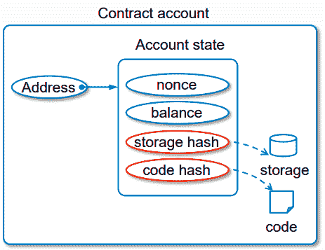
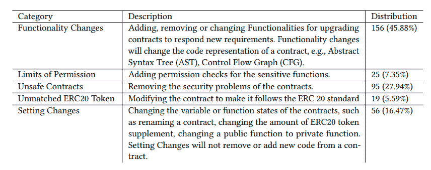

# 自毁:如何摧毁一个聪明的契约

> 原文：<https://betterprogramming.pub/selfdestruct-how-to-destroy-a-smart-contract-388a9ba51a94>

## 理解为什么以及如何创建一个“致命的”智能契约，同时考虑相对的安全影响


由 [Eric Crawford](https://unsplash.com/@emc?utm_source=medium&utm_medium=referral) 在 [Unsplash](https://unsplash.com?utm_source=medium&utm_medium=referral) 上拍摄的照片

# 什么是智能合同

“智能合约”账户只是一个运行在以太坊区块链上的程序，由代码(功能)和数据(状态)定义。

智能合约不受用户控制；相反，它们被部署到网络上，并根据它们的程序运行。然后，用户可以通过提交执行智能合约上定义的功能的交易来与智能合约进行交互。与智能合约的交互是不可逆的。



来自[以太坊 EVM 画报](https://takenobu-hs.github.io/downloads/ethereum_evm_illustrated.pdf)的智能合同表述

一旦部署到网络上，默认情况下，智能合同就不能更改或删除。但是，可以包含一个`selfdestruct`功能，允许智能合约被“删除”，擦除代码及其内部状态(存储)并留下一个空白帐户。

# 为什么要销毁合同

因此，使用`selfdestruct`功能使开发者能够从区块链中移除智能合约。但是这种过激的对策背后的原因是什么呢？

要回答这个问题，阅读[为什么智能合约会自毁是有帮助的？](https://arxiv.org/pdf/2005.07908.pdf)



[自毁原因及其在 340 个自毁智能合约中的分布](https://arxiv.org/pdf/2005.07908.pdf)

本研究发现并分析了 340 份自毁契约。通过将自毁合同定义为“前任”合同，将其升级版本定义为“继任”合同，作者通过比较“前任”合同和“继任”合同之间的差异，确定了合同被销毁的五个主要原因。

他们发现，功能变更的需求排在列表的最前面，其次是合同包含错误或表现出不良行为的情况。

此外，以太坊提供了从区块链中移除智能合约的激励。这种交易具有负的气体成本，因为该操作通过清除所有合同数据来释放区块链上的空间。这种负气体从交易的总气体成本中扣除。

# 自毁是如何工作的？

智能合约生命始于来自 EOA 或合约账户的创建交易。创建智能契约的事务的数据负载本身就是运行契约构造函数(如果存在)来初始化契约状态的字节码。

另一方面，合同的最后一口气是它的毁灭。以太坊中的`selfdestruct`是 EVM 级别的[操作码](https://github.com/wolflo/evm-opcodes/blob/main/gas.md#ab-selfdestruct)，与使用的语言或客户端无关。

这个操作码是一个名为`selfdestruct`的高级内置函数，它只接受一个参数:契约帐户中任何剩余以太网必须发送到的地址。

```
selfdestruct(address recipient);
```

一个重要的注意事项是，开发人员必须明确地将该命令添加到合同中。否则，智能合约将永远无法删除。

在契约销毁后，发送到该帐户地址的任何事务都不会导致任何代码执行，因为那里不再有任何代码可执行。

删除合同不会删除合同的交易历史(过去),因为区块链本身是不可变的。

> "所以使用自毁不同于从硬盘上删除数据."

# 让智能合同变得“凡人”

现在，我们将使用构造函数和`selfdestruct`命令创建一个简单的智能契约:

通常，希望`selfdestruct`命令只能由最初创建契约的帐户调用。因此，使用了名为`owner`的地址类型变量。事实上，在契约创建时，构造函数将这个变量赋给了`msg.sender`。

契约有一个最小的`destroy()`功能。require 语句确保只有所有者才能运行该函数。它检查所有者是否是调用者，否则失败。如果支票没问题，合同将自毁，并将任何剩余余额发送到所有者的地址。

以下测试显示了可析构契约的预期行为。

*   部署:部署合同
*   获取所有者:检查已部署契约的所有者是否正确
*   调用 destroy 失败:检查 destroy 函数是否只能从协定的所有者调用
*   调用销毁成功:从所有者帐户调用销毁函数
*   获取合同失败:检查合同代码是否不再可用

# 安全影响

对智能合约有一个普遍的误解。事实上，很多没有经验的 Solidity 开发者错误地认为，一个契约只能通过可支付的函数来获得醚。

> 那不是真的！

如前所述，任何实现了`selfdestruct`函数的契约都可以将其所有的以太网发送到一个特定的地址。如果该地址是约定地址，则在不调用任何函数(包括回退)的情况下发生醚的转移。

因此，`selfdestruct`函数是一种将 ethers 强制发送到任何契约的方法，而不管它内部实现了什么代码(即使契约缺少 payable 函数)。

这种行为意味着攻击者可以通过三个简单的步骤轻松地将以太网发送到目标合同:

1.  可以用`selfdestruct`功能创建合同
2.  给它送乙醚
3.  呼叫`selfdestruct(targetContract)`

这一弱点导致对合同实际余额的错误假设。

没有什么比一个示例游戏合同更好的来阐明这种情况如何会导致不想要的影响。

这个合同代表一个简单的游戏，并不打算在实践中使用。一个想玩的用户给契约发 0.5 以太(调用`play()`函数)。他们希望成为达到三个里程碑之一的人。里程碑是由合同确定的一段时间内拥有的醚量。当游戏结束时，第一个到达里程碑的用户可以在以太中要求奖励。当到达最后一个里程碑时，游戏结束。

攻击者可以通过自己部署的契约的`selfdestruct`功能发送少量的以太网(0.000001 也足够了)。这个简单的操作阻止任何未来的玩家达到一个里程碑。这是因为第 17 行计算的`currentBalance`将永远不会是 0.5 以太的倍数，这是由于这个小以太对合同余额的贡献(注意，玩家被迫只发送 0.5 以太增量)。

这里的问题是第 17 行的`this.balance`使用不当。契约逻辑应该避免依赖于契约的平衡，因为它可能被恶意操纵。

一个可能的解决方案是使用自定义变量(例如`depositedEth`)并增加它来安全地跟踪沉积的乙醚。该变量不会受到`selfdestruct`调用的影响，因为它不再引用`this.balance`。

```
uint currentBalance = depositedEth + msg.value;
```

感谢您的阅读。我希望你喜欢这篇文章。

让我知道你对它的想法。