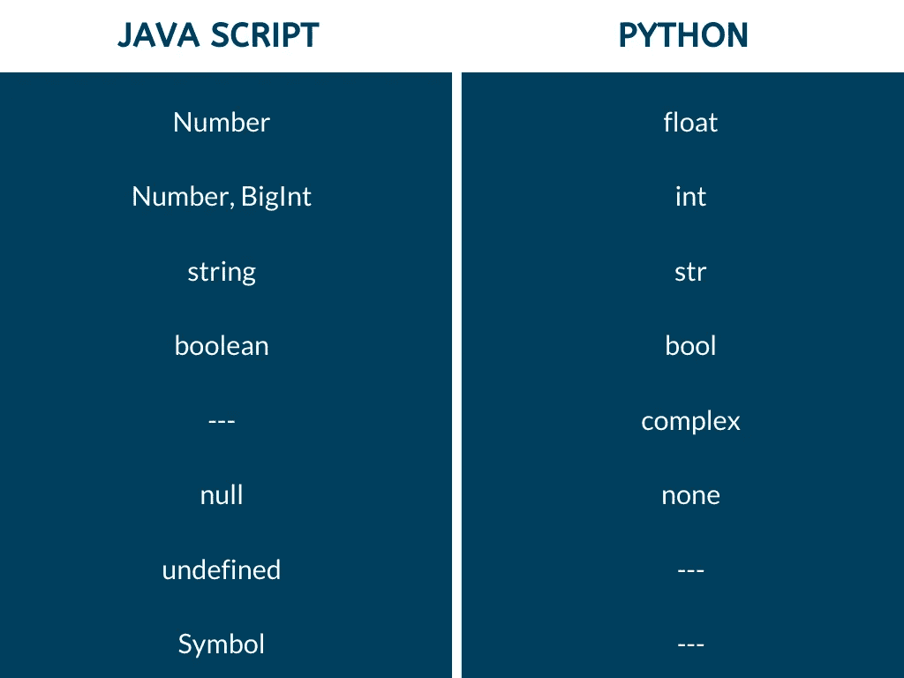
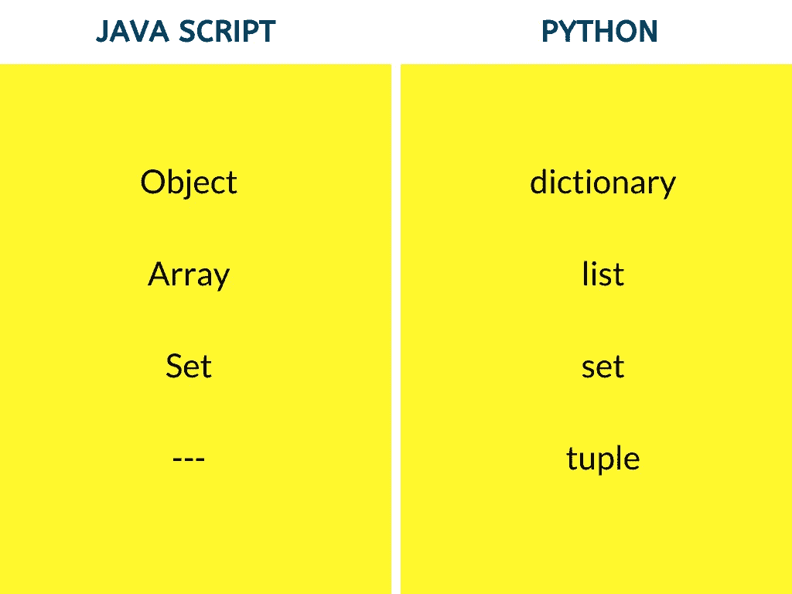

# JavaScript 和 Python 之间的语义差异

> 原文：<https://betterprogramming.pub/semantic-differences-between-javascript-and-python-ed21b1f3ce50>

## 世界上最流行的两种编程语言之间的差异


我是一个全栈 web 开发人员。在过去的几天里，我一直专注于数据结构和算法，因为对于一个程序员来说，如果你不擅长解决问题，其他什么都不重要——每个程序员都应该有解决问题的坚实基础。

前两天开始学 Python，开始更好的理解语言。我开始将它与 JavaScript 进行比较，因为这是我每天工作的语言。

JavaScript 和 Python 是两种非常重要的语言。虽然包括我在内的许多人都知道 JavaScript 或 Python，但我们并没有意识到这两种语言之间的细微差别。

我注意到了很多语义上的差异，我想为了帮助自己和他人，我应该对比一下目前为止我在这两种语言中遇到的一些基本概念(基础)。因此，如果您熟悉 JavaScript 或 Python，并且想学习另一种语言，那么您就来对地方了！

声明:我是 Python 新手，主要用 JavaScript 编写代码。如果我没有提到这两种语言之间的某些差异，那可能是因为我没有讲到那里。

开始吧！

# 评论

## **JavaScript**

对单行注释使用双斜线(`//`)，对多行注释使用(`/* */`)。

## **Python**

对单行注释使用磅(`#`)，对多行注释使用三重引号(`“”” “””`)

## **代码块**

## **JavaScript**

JavaScript 中的每个代码块都用花括号(`{}`)括起来，每个语句都以分号(`;`)结束

```
var a = 2;
if(a>0){
console.log("Positive");
}
else{
console.log("Negative");
}
```

## **Python**

Python 中的每个代码块都使用缩进。它不使用花括号或圆括号。相反，空白在 Python 中用于缩进——每条语句都以新的一行结束。

```
a = 2
if a>0:
  print("Positive")
else:
  print("negative")
print("does not belong to else block")
```

这里，if-else 示例中的两个代码块都缩进了两个空格。最终的打印结果(“不属于 else 块”)没有缩进，因此它不属于 else 块。

# 数据类型

讨论 JavaScript 和 Python 中数据类型的区别需要另外一篇文章。现在，我们将讨论它们之间的一些主要区别。



原始数据类型

*   蓝色的表格显示了 JavaScript 和 Python 中的简单(或)原始数据类型。JavaScript 中的`Number`数据类型表示`Int`和`float`值，这将由编译器在运行时确定。JavaScript 中的`BigInt` (ES 10)用于存储大的整数值，而 Python 使用`Int`来表示所有大小的整数。
*   `null`关键字在 JS 中用于描述空值，`none`在 Python 中用于描述空值。
*   Python 没有任何`undefined`和`symbol`的概念——这些是 JavaScript 独有的。
*   Python 有一种称为`complex`的特殊数据类型，它以 x+yj 的形式表示复数，其中 x 是实部，y 是虚部。

```
a=3+4j
print(a.real)    #3
print(a.imag)    #4
```



非原始数据类型

*   黄色表格表示 JavaScript 中的复杂(或)非原始数据类型。Python 中的列表存储所有数据类型的元素(就像 JavaScript 中的数组一样)。
*   但是 Python 中的数组是用`NumPy`、`array`等库定义的。Python 中的数组只包含相同数据类型的元素。Python 中的列表和数组有很大的不同。我们可以在数组而不是列表上执行多种数学运算。
*   JavaScript 中的对象类似于 Python 中的字典。两者都包含键/值对。但是对象是 JavaScript 的基本构件，而 Python 中的字典仅仅是存储属性的容器。
*   Python 中的 Tuple 是一个不可变的列表(不能改变)。一旦列表被描述为元组，我们就不能在 Python 中重新定义值。JavaScript 不包含任何元组的概念。
*   因此，Python 有内置的哈希表(字典)，可以在哈希中使用。而 JavaScript 没有任何内置的哈希表、方法或库。

# **变量声明**

## **JavaScript**

JavaScript 中变量的声明是通过使用三个主要关键字来完成的:`var`、`let`和`const`。这些声明决定了如何使用变量(作用域)。

## **Python**

Python 不使用任何关键字来声明变量。相反，它使用变量名直接赋值:

```
a = 3
print (a)  # 3
```

# 如果-否则

## **JavaScript**

JavaScript 中使用的条件语句有`if`、`else if`、`else`和`switch`。

## **Python**

JavaScript 中使用的条件语句有`if`、`elif`、*、*、*、*、`else`。

`elif`是`else-if`的简写符号，Python 不包含`switch`语句。相反，`dictionary`可以作为它的替代品。

# 三元运算符

## **JavaScript**

`Ternary operator(?:)`是 JS 中对 3 个操作数进行操作的条件运算符。语法是`(condition)?(expressionI*fTrue*):(expression*IfFalse*);`

```
var age = 26;
var beverage = (age >= 21) ? "Beer" : "Juice";
console.log(beverage); // "Beer"
```

## **Python**

Python 中的三元运算符是一个条件运算符，遵循语法`(expressionIfTrue) if (condition) else (expressionIfFalse)`:

```
a, b **=** 10, 20
min **=** a **if** a < b **else** b
**print**(min)
```

# 标识运算符

## **JavaScript**

恒等运算符(`===`)也称为“严格相等运算符”，比较两个操作数并检查它们的相等性，但不强制它们，即检查两个操作数的数据类型。它返回一个布尔值。JavaScript 只有一个标识操作符。

```
var a=3,b="3";
console.log(a==b);  // true
console.log(a===b); // false
```

## **Python**

Python 有两个标识操作符:`is`和`is not`

如果操作符两边的操作数都指向同一个对象，那么`is`操作符的计算结果为真，而`is not`是`is`的逆操作。

```
x **=** 5
**if** (type(x) **is** int):
print ("true")             # true
**if (** type(x) **is** **not** int**):** print ("true")
```

# **会员操作者**

## **JavaScript**

成员资格运算符检查对象中的指定属性。JavaScript 只有一个成员操作符— `in`。

```
const user= {name: 'Sara', age: 19, sex: "female"};
console.log('name' in car);
// output: true
```

## **巨蟒**

成员资格运算符用于验证值的成员资格。Python 有两个成员操作符: `in`和`not in`

```
x **=** 24
y **=** 20
list **=** [10, 20, 30, 40, 50 ]
**if** ( x **not** **in** list ):
print ("not present")      # Output:True
```

# 环

## **JavaScript**

JavaScript 中有三个循环:

*   入口控制循环:`for`和`while`(执行语句前评估的测试条件)。
*   退出受控循环:`do - while`(语句执行后评估的测试条件)

```
// for loop
var c **=** ["red", "green", "blue", "purple"];
for (var i **=** 0; i**<**4; i**++**){
console.log(c[i]);
}
// prints array// while
var c **=** ["red", "green", "blue", "purple"];
while(i<4){
console.log(c[i]);
i++;
} // prints array
```

## **Python**

Python 中的两个循环—— `for`和`while`。它没有显示任何内置的 do-while 概念

*而 Python 中的*循环显示了与 JS 中的循环的*相似的行为。考虑到上面给出的例子，*

```
c **=** ["red", "green", "blue", "purple"]
i **=** 0
while i<4:
print(c[i])
i **+=** 1             # i++ is invalid
```

Python 不支持`++`和`--`递增和递减运算符。相反，我们可以使用`x+=1`和 `x-=1`来执行相同的操作。

`for`循环用于迭代一个序列(列表、数组、元组)。它利用`in`算子和`range()`函数进行迭代。我们可以使用接受三个整数参数的`range()`函数生成一个数字序列:`start`、`stop`和`step`。

*   `start` —告诉我们从哪个指定位置(可选)开始，默认从 0 开始。
*   `stop` —告诉我们在指定位置之前结束或停止一个整数(必需)。
*   `step` —指定序列中两个整数之间的增量(可选)。

```
x = range(5)
for n in x:
print(n)           # 1,2,3,4x = range(3,9)
for n in x:
print(n)           # 3,4,5,6,7,8x = range(2,20,2)
for n in x:
print(n)           # 2,4,6,8,10,12,14,16,18
```

这就是我注意到的 JavaScript 和 Python 语义之间的一些基本区别。如果你觉得我错过了什么，请不要犹豫，在下面分享。