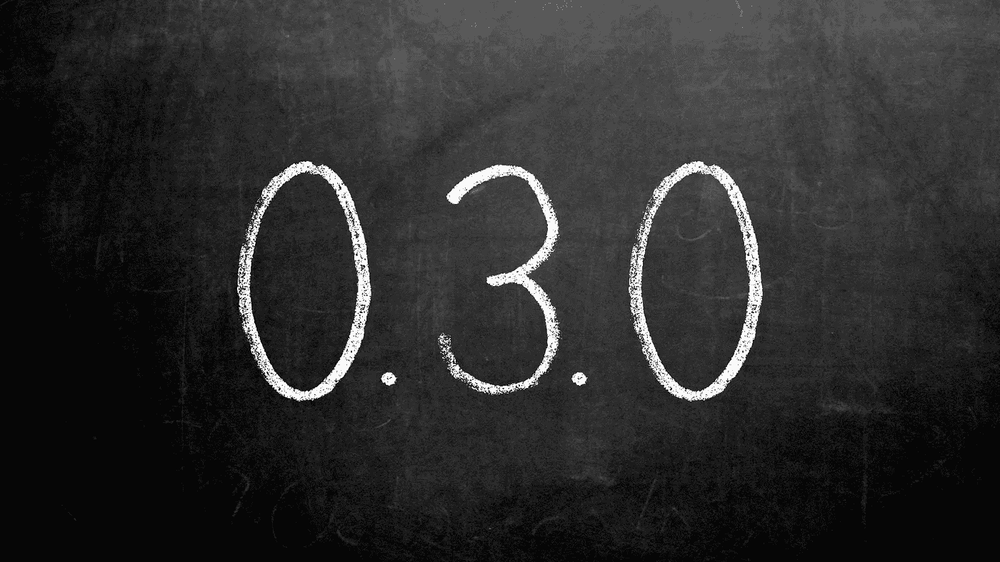
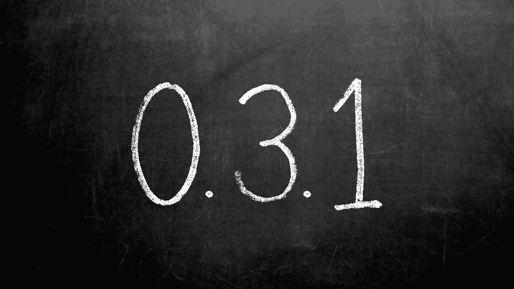
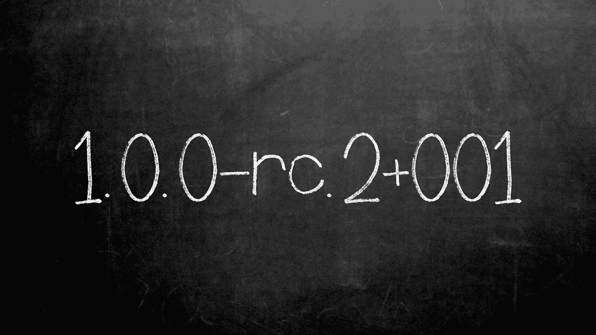

# 语义版本控制

> 原文：<https://betterprogramming.pub/semantic-versioning-b24d29ca1aef>

## 编程基础

## 揭开永远的神秘面纱，避免“依赖地狱”

版本 0.1.0

去年，我制作了下面的视频来解释语义版本控制，但是我仍然遇到许多人不理解它是如何工作的。所以，在这篇文章中，我将向那些喜欢阅读而不是观看的人解释它。

解释 SemVer 的 YouTube 视频

语义版本化表明自库的最后一个版本以来的变化类型，以及这些变化是否破坏了向后兼容性。这一点非常重要，因为打破向后兼容性可能需要为使用者更改代码。

语义版本控制有一个定义好的结构和规则，规定了版本如何变化。该结构需要主要版本(x)，其次是次要版本(y)，最后是补丁版本(z)。

SemVer 结构

每个部分都是没有前导零的非负整数。自上一版本以来的更改类型决定了您要增加或重置版本的哪个部分。

每个版本都应该有一个独特的版本。这有助于开发人员在提供反馈或错误报告时，轻松识别个人使用的版本。

让我们看一个从版本 0.1.0 开始的例子。

版本 0.1.0

拥有 zero 的主要版本意味着初始开发，任何事情都可能在任何时候发生变化。

让我们假设我们是在第三个初始版本 0.3.0 上。

版本 0.3.0

下一个变化引入了向后兼容的错误修复，但没有增加新的功能。此版本的版本必须是 0.3.1。

版本 0.3.1

此版本通知所有用户，它包含一个错误修复，可以安全升级到，因为它不包含重大更改。

> 一旦我意识到补丁版本的变化意味着错误修复，当我看到补丁版本变化时，我开始更频繁地更新我的库。如果我知道该版本修复了错误，为什么我不升级？

当库开发人员添加新的向后兼容功能时，下一个版本必须将次要版本更新为 4。语义版本控制的规则规定，递增的数字右边的所有值都必须重置为零。所以下一个版本一定是 0.4.0。

版本 0.4.0

如果下一个版本只包含向后兼容的错误修复，版本号必须是 0.4.1。

版本 0.4.1

随着初始开发的放缓，开发人员可能希望开始获得关于 1.0.0 版本的反馈。因此，版本号必须更改，以向那些测试人员表明这些是早期版本，在正常发布之前可能会引入重大更改。这可以通过添加可选的预发布版本来实现。

例如，1.0.0-rc.2 表示第二个候选版本。

带有预发布版本号的版本

预发行版通过在修补程序版本后附加连字符和点分隔的标识符来表示。标识符只允许 ASCII 字母数字字符和连字符。请注意，当主版本从 0 增加到 1 时，右侧的所有值都重置为 0。

可以添加的最后一个可选版本是构建元数据。构建元数据通过在补丁或预发布版本后附加加号和点分隔的标识符来表示。

包含内部版本元数据的版本

让我们回顾一下规则，假设发布的版本是 1.0.0。错误修复会将补丁版本增加到 1.0.1。新的向后兼容特性将增加次要版本，并将补丁版本重置为 1.2.0。唯一必须发布 2.0.0 版本的情况是所做的更改会破坏向后兼容性。

作为 1.0.0 版本的消费者，任何 1.x 版本都应该是安全的。尽管如此，每当您创建一个新版本时，您都应该测试您的代码是否继续按预期运行。如果您正在考虑升级到一个新的主要版本，请仔细阅读发行说明，看看您可能需要进行哪些代码更改。

在这篇文章中，我们讨论了语义版本控制的结构，以及每个部分何时应该递增或重置的规则。你可以使用此链接到[官方文件](https://semver.org/)了解在比较版本时如何处理优先级。

我鼓励每个发布代码的人通过实现语义版本来帮助你的消费者。