# 使用 Node.js、Lambda 和 AWS SES 无服务器发送电子邮件

> 原文：<https://betterprogramming.pub/send-emails-serverlessly-with-node-js-lambda-and-aws-ses-186cba40d695>

## 在几分钟内设置好您自己的电子邮件服务器

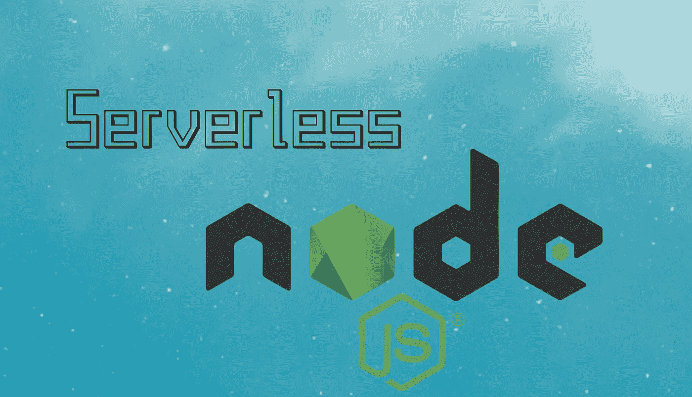

作者照片。

向用户发送电子邮件正成为越来越受欢迎的功能。社交媒体影响者正在为未来的产品销售积累自己的电子邮件列表，品牌也在这样做，以确保他们可以与用户保持联系，并保持品牌知名度。有许多 SaaS 公司正在帮助人们自动发送电子邮件。然而，他们确实为很少的工作花费了相当多的钱。

如果您是一名具有 Node.js 或 Python 基本技能的开发人员，为什么不利用 AWS 快速地从头开始创建呢？

电子邮件服务器的使用情形通常与应用服务器非常不同。应用程序服务器，尤其是大型应用程序，重视 24/7 全天候运行，以便能够更快地响应用户查询。然而，发送电子邮件是一个非常小的功能，不需要任何状态，需要“按需”运行，而不是全天候运行。这符合无服务器架构用例的所有条件。此外，如果我们利用 AWS，我们可以看到创建这样的架构是多么容易。

让我们开始吧。

# 步骤 1:验证电子邮件

登录到 [AWS 控制台](http://console.aws.amazon.com/)，然后转到“服务”下的“SES”(简单电子邮件服务)部分从这里，转到左边的“电子邮件地址”，点击“验证新的电子邮件地址”，并通过电子邮件验证过程。这将让您通过您的电子邮件地址发送电子邮件。你最初也会被放置在一个“沙箱”环境中，在那里你只能向你验证过的邮箱发送邮件。让我们先完成这个过程，并设置好所有的代码。然后我还会告诉你如何给别人发邮件。

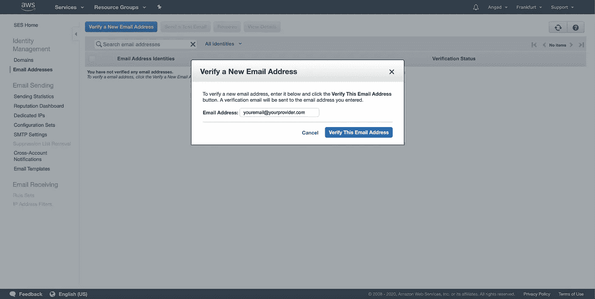

SES 电子邮件验证

# 步骤 2:创建 Lambda 函数

一旦你的电子邮件被验证，现在是时候创建一个 Lambda 了。如果你读过[这篇文章](https://medium.com/javascript-in-plain-english/create-a-server-less-api-in-10-minutes-4a4cf012eeda)，你已经知道如何创建一个，但是让我们在这里快速浏览一下。让我们来看看 AWS 仪表板中的“Lambda”服务。在这里，点击橙色的“创建函数”按钮。给它一个名字，保持所有其他设置不变，然后点击“创建函数”

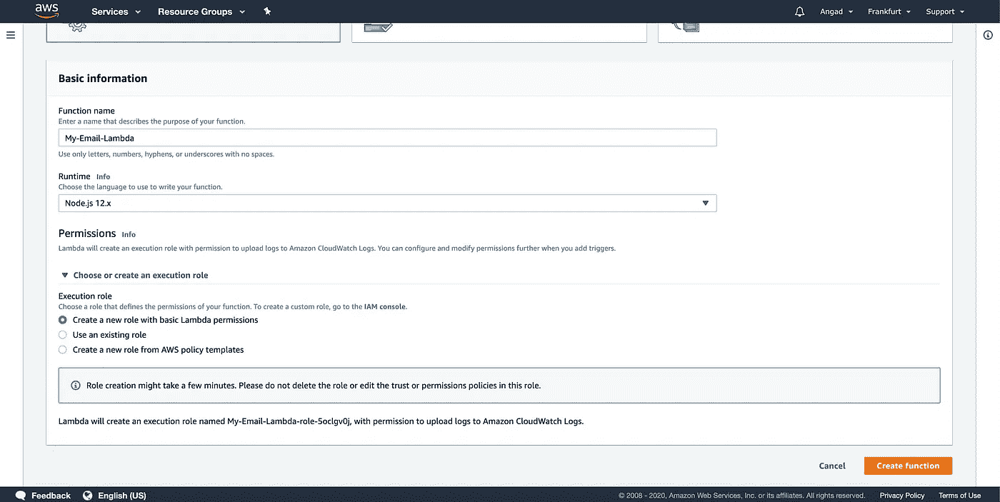

Lambda 函数创建

创建函数后，如果向下滚动，您将看到“函数代码”部分，其中包含一些样板代码。让我们用有用的东西来代替它。我写了这段通过发送电子邮件来响应事件的基本代码:

*注意:我们没有通过运行* `*npm install*` *安装 aws-sdk，然后上传一个压缩项目，这可能看起来很奇怪，但那是因为当我们在他们的节点环境中时，aws 会将这个 sdk 与核心节点包一起提供给我们，如*`*fs*`*`*https*`*。**

*那么这段代码是做什么的呢？它从进来的事件请求体中提取出`to`电子邮件地址和`subject`。然后，它使用`fs`来读取 HTML 模板，我们还没有为我们的电子邮件编写这个模板。然后，它会尝试发送一封包含相关参数的电子邮件，并捕捉任何错误。然后，我们将这些错误输出到控制台，这样我们就可以分析另一个名为 CloudWatch 的 AWS 服务是否出现了问题。现在让我们为我们的电子邮件模板写一些 HTML。你可以根据自己的需求定制你的邮件，并使用 CSS 使其看起来更漂亮。但是为了节省时间，我简单的用了一个我在网上[找到的](https://webdesign.tutsplus.com/articles/build-an-html-email-template-from-scratch--webdesign-12770)的邮件模板。随意使用同一个，不同的，或者自己写一个。为此，右键单击左侧的文件夹，然后单击“新建文件”当我们决定在 JavaScript 代码中命名我们的电子邮件模板`body.html`时，我们必须确保相应地命名我们的 HTML 文件，然后在那里粘贴/编写我们的 HTML 代码。*

*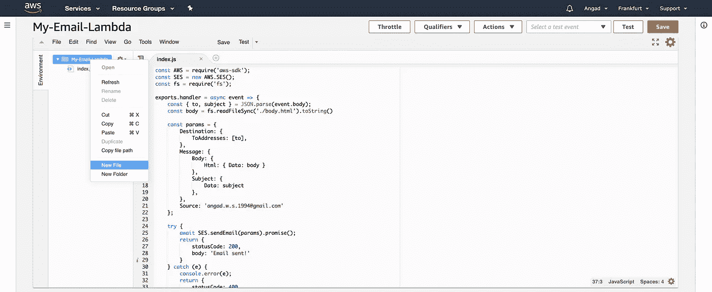*

*Lambda 代码编辑器*

*完成后，点击“保存”橙色按钮，这样我们所有的代码都保存了。*

# *步骤 3:创建 API 网关*

*现在，让我们向上滚动并单击“添加触发器”按钮。*

*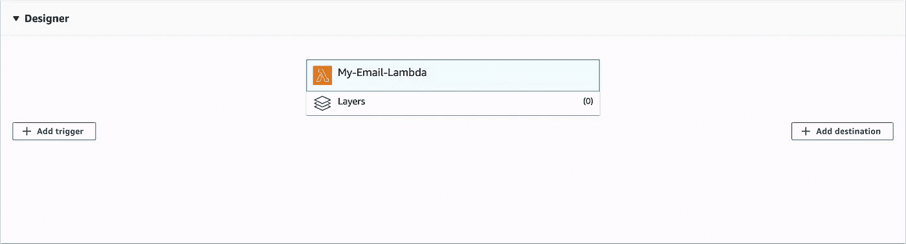*

*λ设计器*

*在下一个屏幕上，选择“API Gateway”，然后选择“Create an API”，保留默认值“HTTP API”，选择“Open”安全配置，并单击“Add”按钮。*

*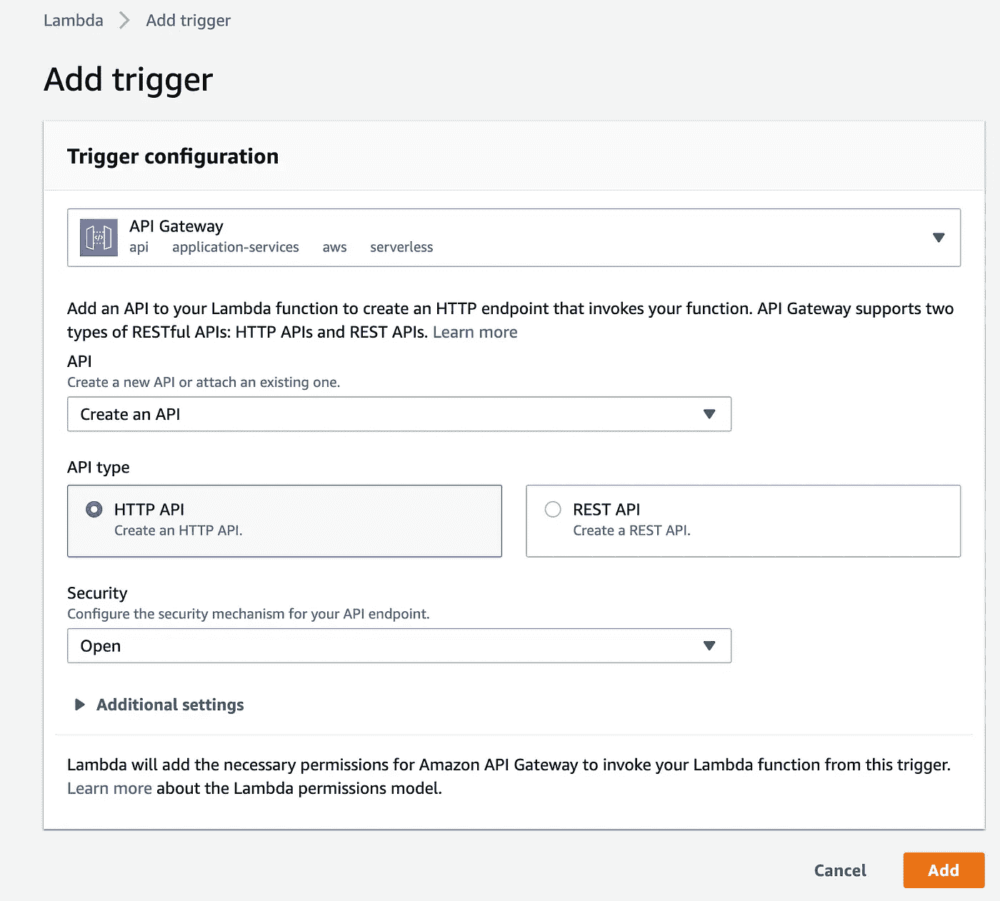*

*API 网关配置*

*现在有了一个新的 API 网关，URL 为:*

*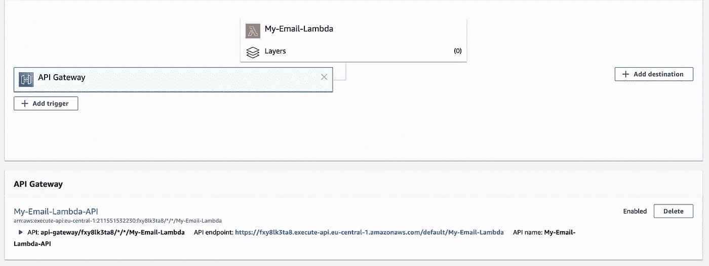*

*API 网关*

*让我们复制这个端点的 URL 并将其发送给 Postman。如果您没有安装 Postman，您应该这样做。您也可以选择使用另一个应用程序，如预装在 MAC 中的 CLI`curl`，或者编写本地 JavaScript 代码，在请求体中使用`to`和`subject`属性访问该端点，这样我们的 Lambda 就知道向谁发送电子邮件以及发送的主题。我用的是 Postman，所以我的请求看起来是这样的:*

*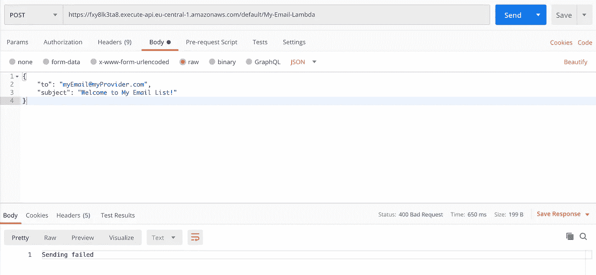*

*如果你觉得懒，这里有一个 curl 命令:*

```
*curl -d '{"to": "yourEmail@yourProvider.com", "subject": "welcome to my email list!"}' -H 'Content-Type: application/json' https://fxy8lk3ta8.execute-api.eu-central-1.amazonaws.com/default/My-Email-Lambda*
```

*只需将`to`地址替换为您验证过的电子邮件地址。如果你发出这个请求，或者看看上面的邮递员截图，你就知道请求失败了。幸运的是，我们将所有的失败输出到控制台，所以让我们看看我们的日志，找出 Lambda 函数出了什么问题。让我们前往 AWS 仪表板中的 CloudWatch 服务，单击左侧面板上的“日志组”，单击我们的 Lambda 名称，然后单击橙色的“搜索日志组”按钮。在这里，您将能够看到 Lambda 所有请求的所有日志。如果您点击标有时间戳和名称中有`ERROR`的日志，您将能够看到为什么对这个 Lambda 的请求失败的细节。它应该是这样的:*

*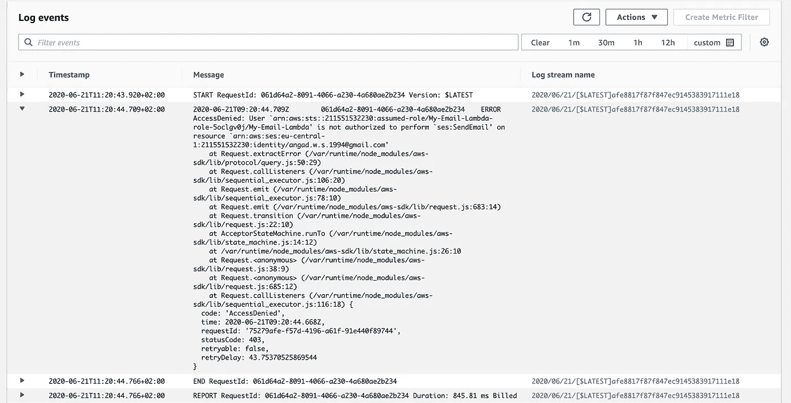*

*CloudWatch 中的错误日志*

*日志相当详细，很有帮助。它清楚地向我们解释了我们的 Lambda 没有执行`ses:SendEmail`动作的权限。*

# *步骤 4:授予 Lambda 权限*

*Lambda 类型的 AWS 资源有一个附加的角色。该角色有策略，这些策略有权限。所以要给我们的 Lambda 更多的权限，我们必须首先创建一个策略，给它正确的权限，最后把那个策略附加到我们的 Lambda 的角色上。*

*让我们回到我们的拉姆达。在这里，单击“Permissions”选项卡，然后单击“Execution role”部分下的角色。默认情况下，它的名称将类似于您的 Lambda。在我这里，它被命名为`My-Email-Lambda-role-5oclgv0j`。在角色“摘要”屏幕上，单击“附加策略”，然后单击“创建策略”我们现在将创建一个具有正确权限的策略。我们需要的权限是“SendEmail”(我们从步骤 3 的日志中知道)，它属于“SES”服务。这里有一个截图可以帮助您进行配置:*

*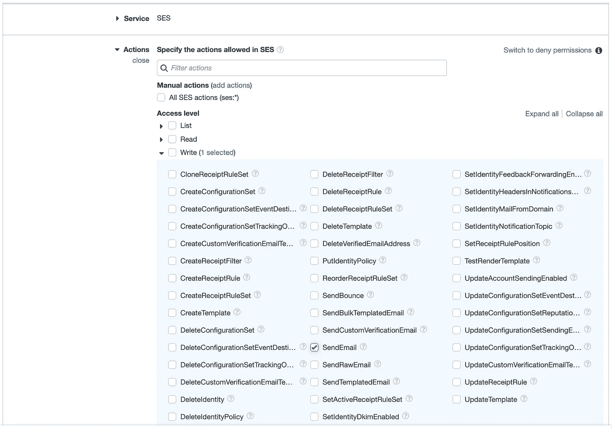*

*权限配置*

*为了简单起见，在策略配置的下一步中，我们选择“所有资源”:*

*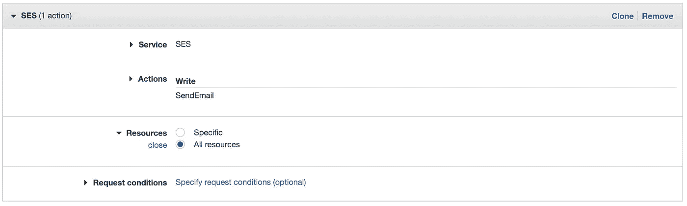*

*策略创建*

*然后，让我们单击“审查策略”，给我们的策略起一个描述性的名称，如“SendingEmailsPolicy”，然后单击“创建策略”策略成功创建后，让我们返回角色的摘要页面。您应该可以在“IAM”服务->角色->您的角色名称下轻松找到它。*

*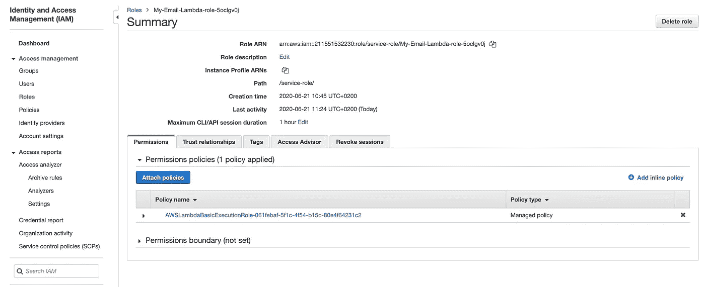*

*角色摘要*

*在此屏幕上，让我们单击“Attach policies”按钮，搜索我们刚才创建的策略(希望您选择了一个描述性的名称)，然后单击“Attach policy”*

*现在，如果我们用这个命令再次触发 Lambda:*

```
*curl -d '{"to": "yourEmail@yourProvider.com", "subject": "welcome to my email list!"}' -H 'Content-Type: application/json' https://fxy8lk3ta8.execute-api.eu-central-1.amazonaws.com/default/My-Email-Lambda*
```

*我们在终端中得到一个响应，说:“电子邮件已发送！”让我们通过电子邮件来确认这一点:*

*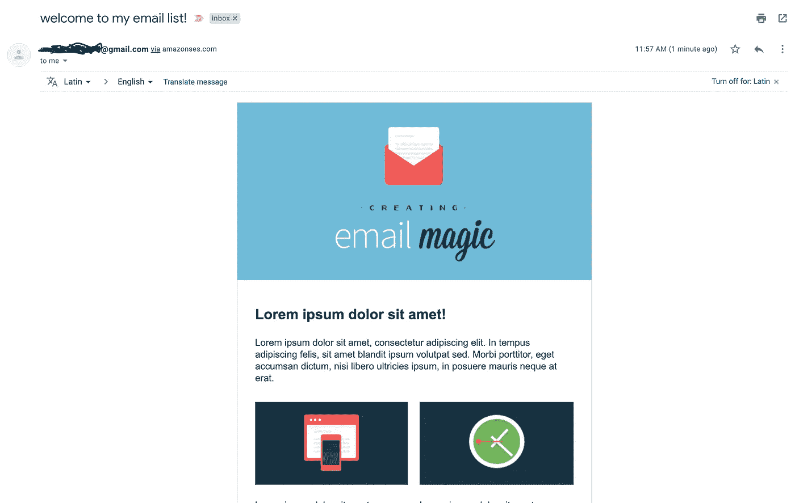*

*太好了！我收到了一封来自我自己的电子邮件，但我们已经设置了我们的代码和架构，因此如果我们想向他人发送电子邮件，我们可以通过一个带有电子邮件文本输入和提交按钮的网站前端来简单地做到这一点。“提交”按钮应该向我们的 API 端点发送一个请求，并随后发送用户输入的电子邮件。*

# *给别人发电子邮件*

*正如步骤 1 中所讨论的，您目前处于“沙箱”环境中。这是有一定限制的。您只能通过电子邮件发送经过验证的电子邮件地址。您在 24 小时内最多只能发送 200 封电子邮件。您每秒钟最多只能发送一封电子邮件。如果你打算使用这项服务给你的几个用户发电子邮件，你将不得不请求 AWS 把你的帐户移出沙箱。这非常容易，通常 AWS 支持团队需要 24 小时来验证。你可以按照[这个教程](https://docs.aws.amazon.com/ses/latest/DeveloperGuide/request-production-access.html)来做。*

*我希望你觉得这篇文章有趣并且有用。感谢阅读！*