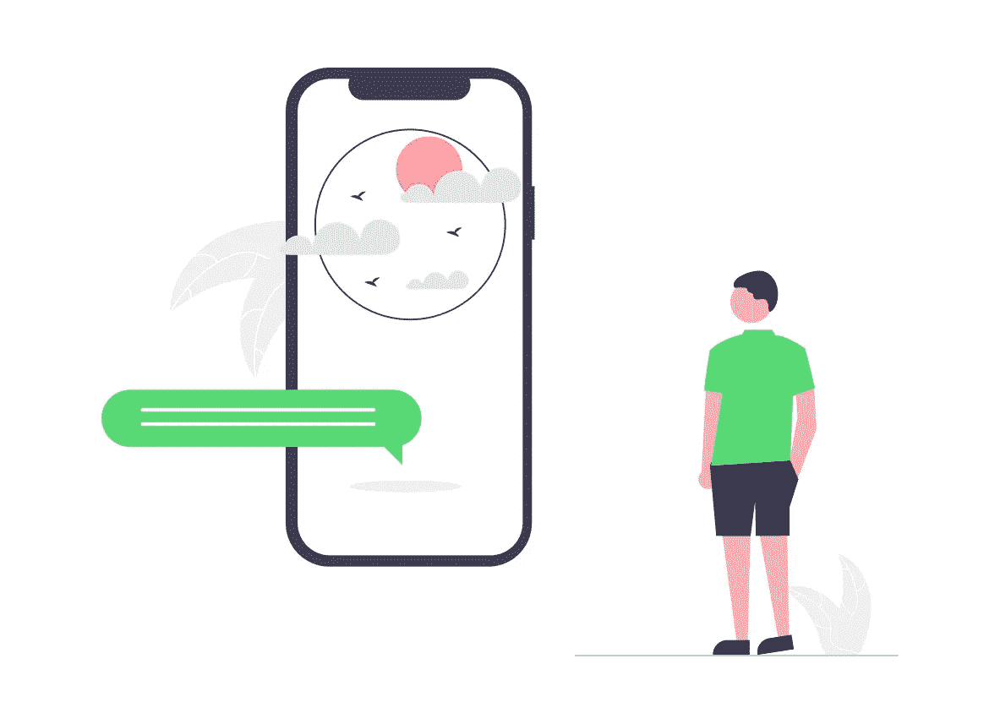
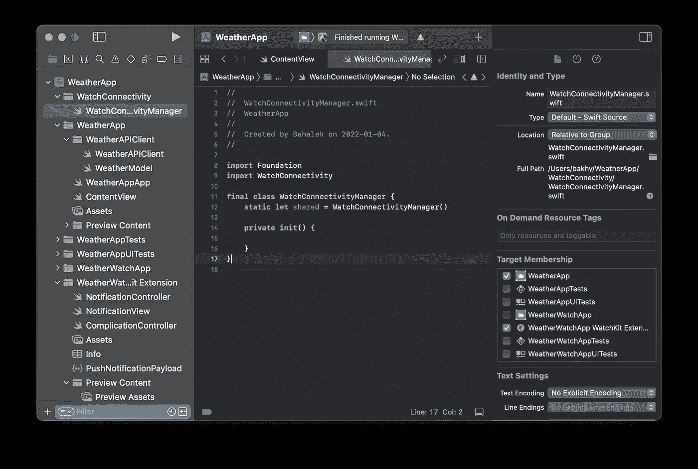
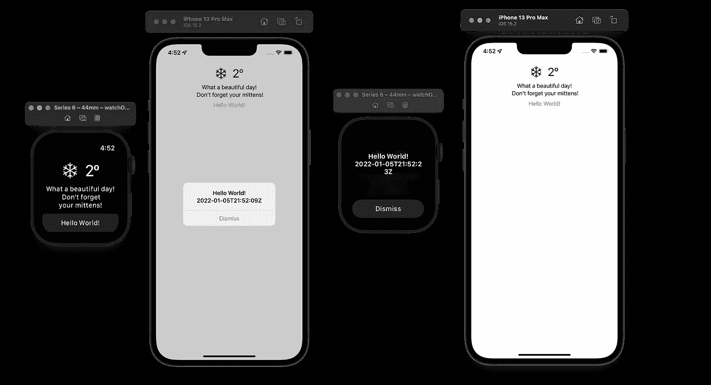

# 使用手表连接在 watchOS 和 iOS 应用程序之间发送数据

> 原文：<https://betterprogramming.pub/sending-data-between-watchos-and-ios-apps-cf924e21b3c2>

## 在 SwiftUI iOS 和 watchOS 应用程序之间建立沟通桥梁，以获取状态更新



来源:[未绘制](https://undraw.co/)

这是上一篇文章的延续，上一篇文章展示了如何将 watchOS 应用目标添加到现有的 iOS 项目中。这一部分包括:

*   [手表连接](https://developer.apple.com/documentation/watchconnectivity)及其为 iOS 和 watchOS 应用程序之间的数据传输提供的方法。
*   配置并激活`WCSession`实现 iOS 和 watchOS 应用之间的双向通信。
*   发送消息。
*   接收信息。

和以前一样，我在这个演示中使用 Xcode13.2。

# 观察连接性

为了在 iOS 应用和 watch 应用之间传输数据，我们需要使用 [WCSession](https://developer.apple.com/documentation/watchconnectivity/wcsession) :

> 启动 WatchKit 扩展与其配套 iOS 应用程序之间的通信的对象。

`WCSession`提供了五种传输数据的方式，可用于将数据从 iOS 应用程序发送到 watch 应用程序，反之亦然。

*   `[updateApplicationContext(_:)](https://developer.apple.com/documentation/watchconnectivity/wcsession/1615621-updateapplicationcontext)`可用于在计数器应用仅关心数据的最新状态时向计数器应用发送数据(例如:一天中完成的步数，用户将仅关心最新值)。此方法将覆盖以前的数据，因此只有最新的更新可用。
*   `[sendMessage(_:replyHandler:errorHandler:)](https://developer.apple.com/documentation/watchconnectivity/wcsession/1615687-sendmessage)`当您需要立即传输字典数据时可以使用。Apple 不保证这些信息的传递。对于要传递的消息，对方必须是可到达的。如果使用手表来发送数据，iOS 应用程序将从后台唤醒并变得可访问，而手表应用程序则相反。
*   `[sendMessageData(_:replyHandler:errorHandler:)](https://developer.apple.com/documentation/watchconnectivity/wcsession/1615617-sendmessagedata)`同上，但发送的是数据对象而不是字典。
*   `[transferUserInfo(_:)](https://developer.apple.com/documentation/watchconnectivity/wcsession/1615671-transferuserinfo)`用于在后台传输字典数据。这些消息保证以 FIFO 方式尽快传递，即使计数器应用程序暂停。
*   `[transferFile(_:metadata:)](https://developer.apple.com/documentation/watchconnectivity/wcsession/1615667-transferfile)`用于传输带有文件元数据的图像和可选字典等文件。

# 设置 WCSession

您可以添加代码，直接在发送或接收数据的类中配置和激活一个`WCSession`实例，但是这需要每个类都符合`WCSessionDelegate`协议。因此，我们将在单例类中这样做。

在您的 Xcode 项目中创建一个文件夹，并添加一个 iOS 应用程序目标和 watch 应用程序扩展目标都可以使用的新 swift 文件。

我将该文件命名为`WatchConnectivityManager`，并添加了通常的单例代码。



要配置和激活一个会话，您需要获取一个对默认会话对象的引用，给它分配一个委托并调用`activate()`。

这将在 iOS 和 watchOS 应用程序之间建立连接:

```
if WCSession.isSupported() {
    WCSession.default.delegate = self    
    WCSession.default.activate()
}
```

因此，我们将把这段代码添加到我们的 WatchConnectivityManager 的构造函数中，并添加与`[WCSessionDelegate](https://developer.apple.com/documentation/watchconnectivity/wcsessiondelegate)`协议的一致性。`[WCSessionDelegate](https://developer.apple.com/documentation/watchconnectivity/wcsessiondelegate)`协议继承自`[NSObjectProtocol](https://developer.apple.com/documentation/objectivec/nsobjectprotocol)`，这意味着`WatchConnectivityManager`需要继承自`NSObject`。

还要考虑的一点是，委托方法`sessionDidBecomeInactive`和`sessionDidDeactivate`在 watchOS 上不可用，因此我们需要为平台*(第 22 行)*添加一个编译器检查。

第 25 行激活一个会话，以防它被停用。如果用户拥有几块手表，并且我们需要支持手表切换，就会出现这种情况。

至此，您已经在 watch 应用程序和 iOS 应用程序之间建立了连接。接下来我们将看看发送和接收消息。

# 发送消息

为了演示的目的，我们将只发送一个简单的字符串从手表到 iOS 应用程序，反之亦然，每当用户点击一个“Hello World”按钮。

`transferUserInfo(:_)`方法最适合我们的用例，但是根据[苹果文档](https://developer.apple.com/documentation/watchconnectivity/wcsessiondelegate/1615633-session)系统不会在模拟器上调用`didReceiveUserInfo`委托方法。

所以我们将无法在模拟器上对收到的这些信息做出反应。


因此，我将使用`[sendMessage(_:replyHandler:errorHandler:)](https://developer.apple.com/documentation/watchconnectivity/wcsession/1615687-sendmessage)`来代替。

首先，让我们在`WatchConnectivityManager`中添加一个功能，如果从 iOS 应用程序发送，则向手表发送一条简单的文本消息，反之亦然。不要忘记检查您是否有活动的会话和配对的设备。

现在在内容视图中添加一个按钮来调用这个函数:

现在让我们编写代码来接收消息并测试它是否工作。

# 接收消息

为了接收使用`[sendMessage(_:replyHandler:errorHandler:)](https://developer.apple.com/documentation/watchconnectivity/wcsession/1615687-sendmessage)`方法发送的消息，我们需要实现来自`WCSessionDelegate`协议的`session(_:didReceiveMessage:)`方法。

一旦我们收到消息，我们可以在主线程上将它作为一个发布变量存储在`WatchConnectivityManager`中，因为我们应该总是确保我们在主线程上发布。

然后，我们的内容视图将观察这个变量的变化，并在状态变化时显示一个弹出警告。

`WatchConnectivityManager`中的最终代码:

现在让我们添加代码来观察内容视图中通知消息的变化。在内容视图中，我们将为`WatchConnectivityManager`添加`ObservedObject`变量。

```
@ObservedObject **private** **var** connectivityManager = WatchConnectivityManager.shared
```

然后我们将从`watchConnectivityManager`绑定`notificationMessage`到警报。

现在，当你在手机和手表上运行应用程序并点击“Hello World！”按钮，您将在柜台应用程序上看到警告。



现在，你有了一个既可以在手表上运行又可以在手机上运行的应用程序，可以在手机和手表之间来回发送数据，以更新用户界面和显示通知。希望这对你有帮助。

编码快乐！