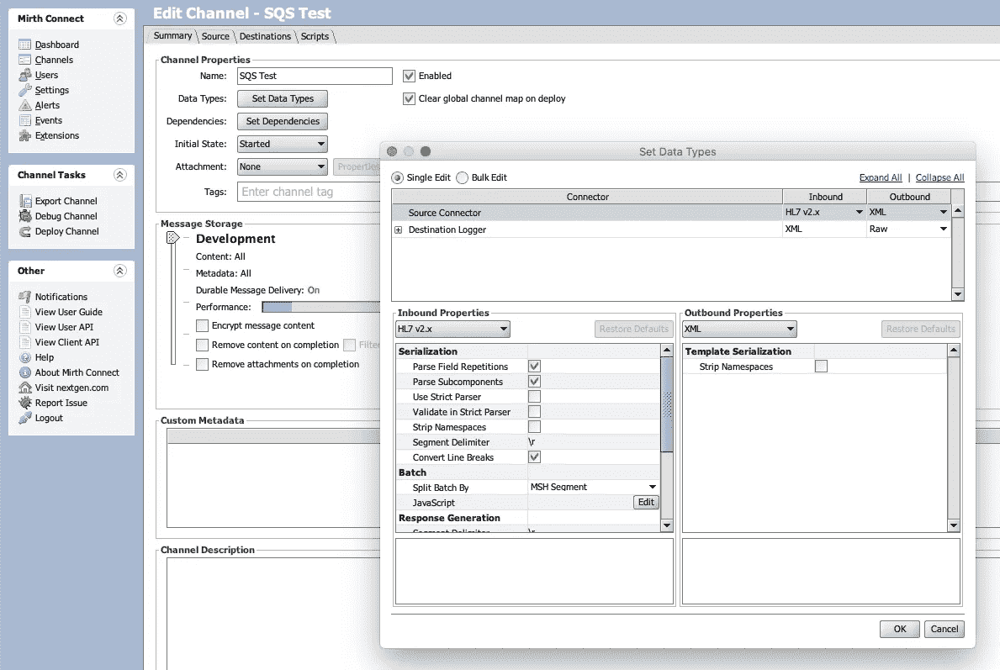
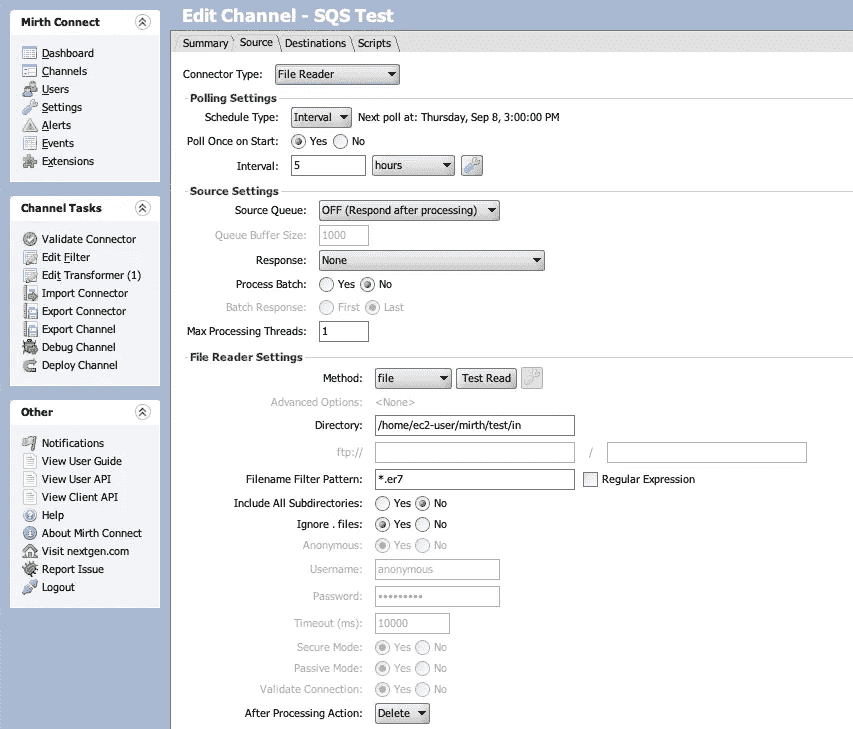
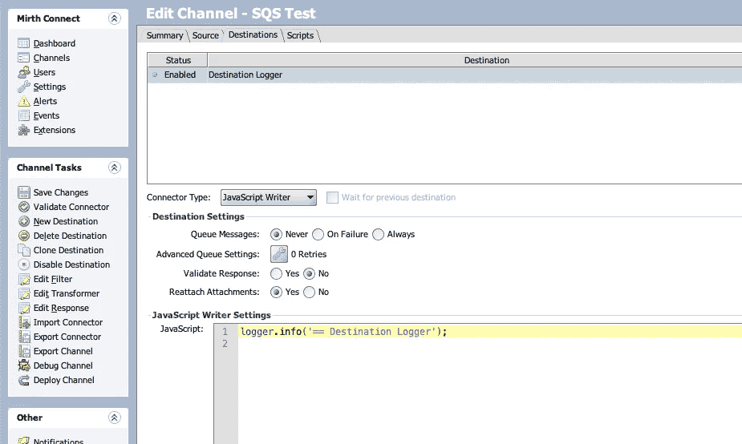
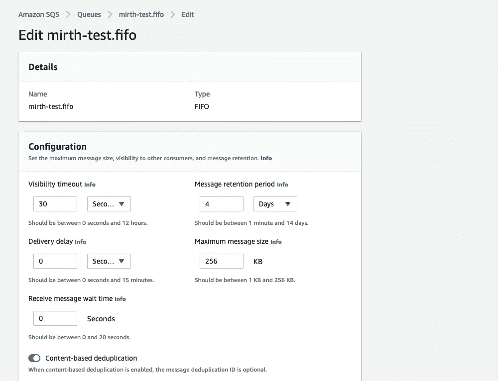
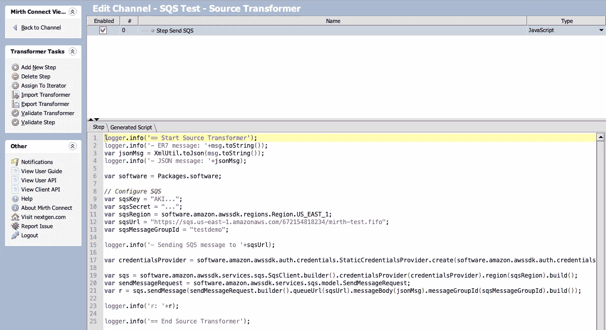

# 如何从“欢乐连接”向 SQS 自动气象站发送 HL7 v2 消息

> 原文：<https://betterprogramming.pub/sending-hl7-v2-messages-to-aws-sqs-from-mirth-connect-a7f0e467b241>

## 从静态 Rhino JavaScript 上下文调用 AWS Java SDK


作者图片

当使用 HL7 v2 和诸如亚马逊 SQS 这样的网络服务时，我通常会选择[无服务器 HAPI](https://medium.com/towards-data-science/sending-hl7-v2-messages-with-hasura-hapi-and-serverless-9cd1630876a4) 作为轻量级接口选项。但是最近，我接手了一个项目，该项目已经广泛使用了 Johnny Connect，因此坚持使用它来处理传入的 HL7 v2，然后将转换后的 JSON 消息发送到目的地 SQS 队列是有意义的。

在这篇文章中，我将概述我们如何设置它(TL；DR grab the Johnny[channel XML](https://gist.github.com/s1monj/969be43e5fe817c9ff6e578aac8f8123))，为了简单起见，我们将把 ER7(管道分隔)HL7 v2 源消息作为磁盘上的文本文件，并使用 Mirth File Reader 连接器将其拉入。

# 第一个想法:API 网关

我是 AWS API 网关的忠实粉丝，我最初的想法是轻松地使用 HTTP 发送者目的地连接器，并简单地将消息体通过 HTTP 发送到 [API 网关 SQS 代理](https://medium.com/@pranaysankpal/aws-api-gateway-proxy-for-sqs-simple-queue-service-5b08fe18ce50)。这本来可以快速设置并易于测试和故障排除，但是客户没有 API Gateway 的经验，除非绝对必要，否则不愿意开始使用额外的 AWS 服务。公平的决定。

# 第二个想法:JavaScript + HTTP 发送器

对于没有特定性能需求的敏捷集成开发，轻量级脚本语言总是我比编译型编程语言更喜欢的选择，我唯一比 JavaScript 更喜欢的就是 TypeScript。不幸的是，JavaScript 的 joyful Rhino 实现不支持 Node.js，因此不能处理包，也不支持 Web 浏览器特性，因此不能获取带有`<script src="...`标签的附加库。

这样做的结果是，如果我们想在 hayway JavaScript 运行时中包含 JavaScript 依赖库，我们需要粘贴每个依赖的源代码，或者从 Transformer 步骤中引用每个文件，对于像 AWS SDK 这样大的库来说，这是不切实际的。

*好吧，如果我不能使用 AWS SDK，也许我可以手动创建头部，签署请求并将其传递给 HTTP 发送者目的地连接器？*

我通过粘贴 [crypto-js](https://code.google.com/archive/p/crypto-js/downloads) 代码并遵循 [AWS 指令](https://docs.aws.amazon.com/general/latest/gr/signature-v4-examples.html#signature-v4-examples-javascript)创建了一个签名密钥。这一切都很好地结合在一起，我能够将一个工作的 AWS SigV4 `Authentication` header 传递给 happy。然而，当您尝试使用 AWS 的[有据可查的](https://docs.aws.amazon.com/general/latest/gr/sigv4-signed-request-examples.html)但极其复杂的过程来手动签署请求时，真正的乐趣就开始了。五分钟后我放弃了。

# 好吧，那就 Java 吧

是咬紧牙关的时候了。我的最终解决方案的大纲如下。

## 第一步:让 AWS SDK JARs 充满欢乐

在目标机器上创建一个 Maven `pom.xml`文件，并在下面添加源代码。顾名思义，`jar-with-dependencies`插件抛出一个包含所有依赖项的 JAR。运行`mvn clean package`，然后将`./target/awslibs-1.0-SNAPSHOT-jar-with-dependencies.jar`复制到欢乐定制 lib dir(在我的例子中，它是`/opt/mirthconnect/custom-lib`)。现在一定要重新开始欢笑。

## 第二步:创建欢乐频道

设置入站和出站数据类型(我通常使用 Raw 进行出站，以查看测试时发生了什么)，并使用文件读取器源。我们可以简单地在目的地的 JavaScript Writer 连接器中添加一个日志语句。



欢乐频道数据类型(图片由作者提供)



欢乐频道来源(图片由作者提供)



欢乐频道目的地(图片由作者提供)

## 步骤 3:创建 SQS 队列

对于这个项目，我们使用了一个 FIFO 队列，唯一需要注意的配置是打开基于内容的重复数据删除，因此您不必在请求中使用重复数据删除 id。



亚马逊 SQS FIFO 队列配置(图片由作者提供)

## 第四步:从欢笑中传递 SQS 信息

回到通道配置的源代码，编辑转换器，并创建一个新的 JavaScript 步骤。



欢笑源转换步骤(图片由作者提供)

我有很多使用各种语言的 AWS SDK 的经验，但是在静态上下文中从 Rhino JavaScript 引擎调用 Java SDK 完全不同于我以前编写的任何代码。如果不是 Vibinchander 的博客[中的一篇文章](http://vibinchander.com/2022/06/14/read-aws-s3-bucket-using-mirth-aws-sdk-2-19-x-version/)让我走上了正确的道路，我根本不可能解决这个问题。所以要感谢 Vibinchander，你应该看看他的博客，了解更多伟大的集成技巧。

保存了我们的转换器，重新部署了我们的通道，再加上一点运气，我们现在应该能够将一个 HL7 v2 ER7 格式的消息文本文件放入文件阅读器目录，然后在我们的 SQS 队列中看到 JSON 消息。

排队快乐！

```
**Want to Connect?**If you need assistance or want more reading on healthcare interoperability and integration, head over to [whitebrick.com](https://whitebrick.com) and don’t hesitate to reach out.
```