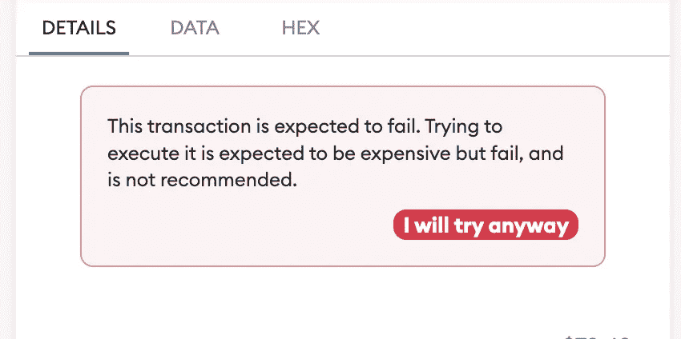
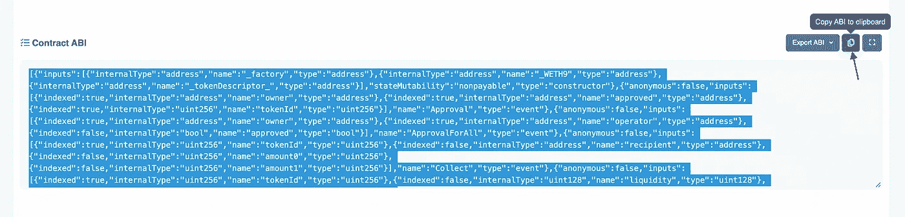

# 使用 Ethers.js 向智能合约发送静态调用

> 原文：<https://betterprogramming.pub/sending-static-calls-to-a-smart-contract-with-ethers-js-e2b4ceccc9ab>

## 通过在发送交易前检查交易是否会失败，节省数百万美元的油费



Metamask 交易确认截图

几个月前，我在试图确认一项以太坊交易时，从 Metamask 获得了上述错误信息。当时 Metamask 刚刚添加了这个功能，我[在推特上给](https://twitter.com/tjelailah/status/1481862406678716417)写了关于它是 UX 的一大改进。

显然，我在测试与 Uniswap 智能合约的交互时，在 dApp 上输入了无效的输入变量。出于好奇，我还是发送了事务，看看它是否真的会失败——是的，它失败了。

但是，Metamask 是如何知道事务将要失败的呢？这个问题在我脑海里徘徊了一段时间，直到我找到了答案。

如果你也像我一样好奇，请继续阅读这篇文章，我会告诉你如何在发送之前使用`ethers.js`来检查交易的有效性。

# 区块链交易

默认情况下，区块链交易是不可变的，这意味着没有办法逆转已经确认的交易。例如，如果你把 ETH 发送到错误的以太坊地址，你就没有办法恢复它。除非地址所有者好心给你退款。

防止这种情况的一种方法是在确认交易之前仔细检查地址，或者使用易于阅读的 ENS 名称。但是其他种类的交易呢(例如铸造非关税壁垒)？

根据 [Buycoins Research](https://twitter.com/BuycoinsR) 的 [Tubbycat NFT 销售分析](https://dune.xyz/BuycoinsR/Tubbycat-NFT-minting-analysis)，约 776 ETH(当时约 200 万美元)用于失败的交易费用。就失败交易给整个生态系统造成的损失而言，这只是很小的一部分。这些交易费一部分被烧掉，一部分到了矿商手里。

虽然还有其他因素(如抢先运行攻击)可能导致挂起的事务最终失败，但一些事务失败可以通过事先检查其有效性来防止。

# 静态呼叫

> 不是执行事务的状态改变，而是可以要求一个节点*假装*一个调用没有改变状态并返回结果。
> 
> 这实际上不会改变任何状态，而是免费的。在某些情况下，这可以用来确定事务是失败还是成功。

让我们考虑这个例子:

艾丽丝想在鲍勃的快餐店里点一个汉堡，但是她必须开车去那里取。鲍勃做的汉堡是全县最好的，而且卖得很快。

如果爱丽丝在汉堡卖完之后开车去餐馆，她会浪费时间、精力和汽油。因此，她需要在去餐馆之前知道汉堡是否还有。

鲍勃的餐馆有一个网站，他在那里更新销售额，这样人们就可以看到还剩多少汉堡。如果爱丽丝查看网站，发现汉堡已经卖完了，她就呆在家里，不会浪费资源开车去。

否则，她会开车去餐馆买她最喜欢的汉堡。这种情况类似于如何进行静态调用来检查事务是否可能失败。

# 使用 NodeJS 进行静态调用

在本节中，我们将对 [Uniswap V3 合约](https://rinkeby.etherscan.io/address/0xc36442b4a4522e871399cd717abdd847ab11fe88)进行静态调用，并尝试转移我们不拥有的流动性头寸。

在进入代码之前，确保你已经安装了`ethers`。如果没有，请使用以下命令安装它:

```
npm install --save ethers
```

安装成功后，在 Etherscan 上打开 Uniswap 合同[代码](https://rinkeby.etherscan.io/address/0xc36442b4a4522e871399cd717abdd847ab11fe88#code)。向下滚动至合同 ABI，并将其复制到剪贴板。



Uniswap V3 ABI

*   创建一个`abi.json`文件并将 ABI 粘贴到其中。
*   接下来，创建一个用于进行静态调用的新文件。
*   将`ethers`库和`abi`导入到代码中。

```
const { ethers, providers } = require('ethers');require('dotenv').config()const abi = require('./abi.json')
```

*   定义合同地址、签署人并初始化合同。

```
const contractAddress = "0xC36442b4a4522E871399CD717aBDD847Ab11FE88"const signer = new ethers.Wallet( process.env.PRIVATE_KEY,
   providers.getDefaultProvider('mainnet'));const contract = new ethers.Contract(contractAddress, abi, signer);
```

这个例子使用来自`ethers`的默认提供者。然而，在创建您的应用程序时，请确保在 [Infura](http://infura.io) 上注册您自己的提供商，以提高您的请求率/限额，并获得通话指标。

*   定义交易变量。

```
const from = "0x66fe4806cD41BcD308c9d2f6815AEf6b2e38f9a3"const to = "0xC41672E349C3F6dAdf8e4031b6D2d3d09De276f9"const tokenId = 100
```

`from`地址既不是令牌`100`的所有者，也不是令牌`100`的授权使用者，因此不能将其转移到其他地址。不过我们还是试试用`callStatic`的方法转移一下，看看结果如何。

```
const transaction = async () => { const a = await contract.callStatic.transferFrom(from, to, tokenId) console.log(a)}transaction()
```

当您尝试这样做时，应该会得到类似下面的错误。

```
reason: 'ERC721: transfer caller is not owner nor approved',
  code: 'CALL_EXCEPTION',
  method: 'transferFrom(address,address,uint256)',
  errorArgs: [ 'ERC721: transfer caller is not owner nor approved' ],
  errorName: 'Error',
  errorSignature: 'Error(string)',
  address: '0xC36442b4a4522E871399CD717aBDD847Ab11FE88',
  args: [
    '0x66fe4806cD41BcD308c9d2f6815AEf6b2e38f9a3',
    '0xC41672E349C3F6dAdf8e4031b6D2d3d09De276f9',
    100
  ],
  transaction: {
    data: '0x23b872dd00000000000000000000000066fe4806cd41bcd308c9d2f6815aef6b2e38f9a3000000000000000000000000c41672e349c3f6dadf8e4031b6d2d3d09de276f90000000000000000000000000000000000000000000000000000000000000064',
    to: '0xC36442b4a4522E871399CD717aBDD847Ab11FE88',
    from: '0xC41672E349C3F6dAdf8e4031b6D2d3d09De276f9'
  }
}
```

你可以把`reason: ‘ERC721: transfer caller is not owner nor approved’`看成这个事务会失败的原因。最重要的是，静态调用是一个`read-only`函数，是无气的。

通过在你的 dApp、机器人等中集成一个静态调用。，你会省下一大笔本可以用来支付失败交易的油费的钱。

如果您设法跟进到这一点，那么您一定成功地向区块链发送了一个静态调用。干得好！

您可以查看下面的完整代码: