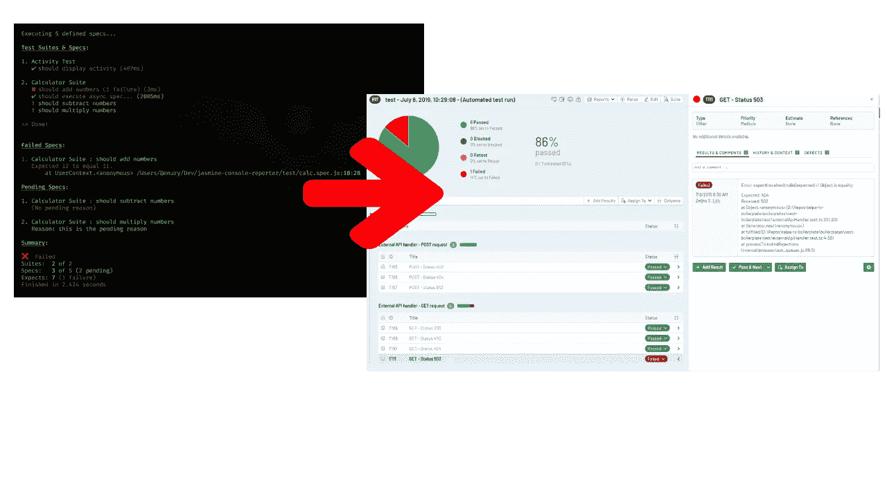
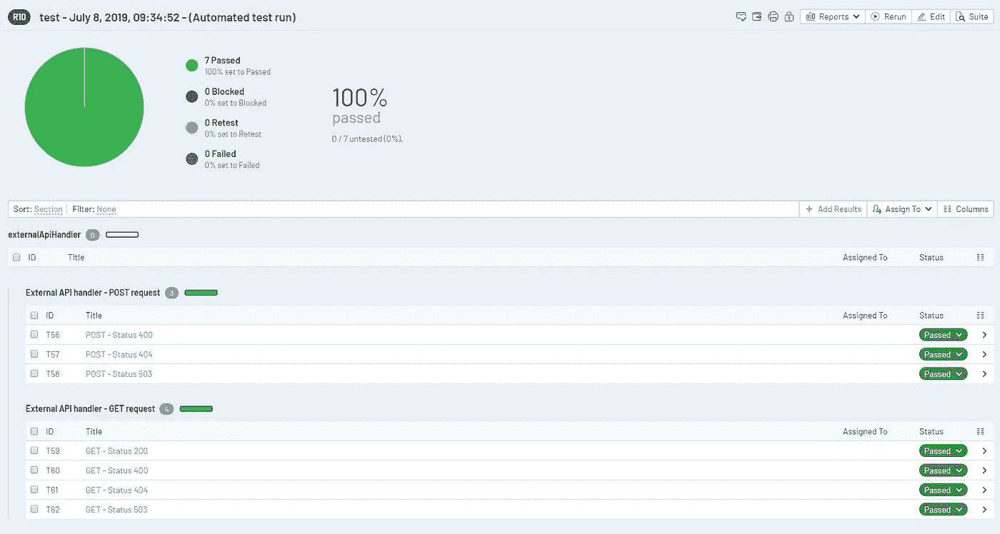
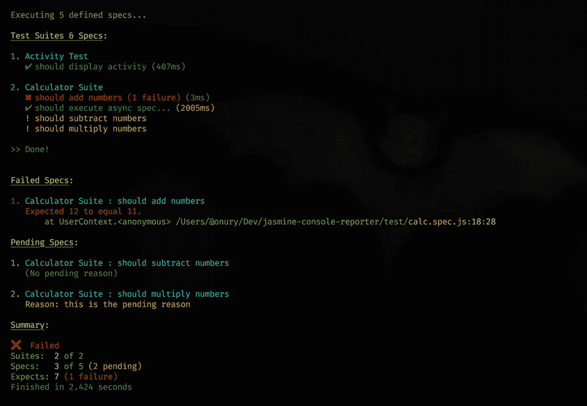
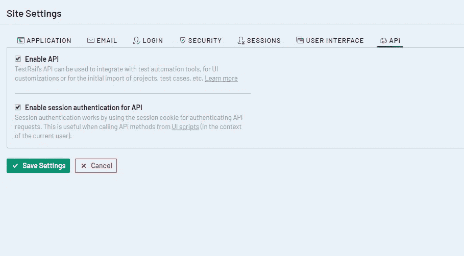
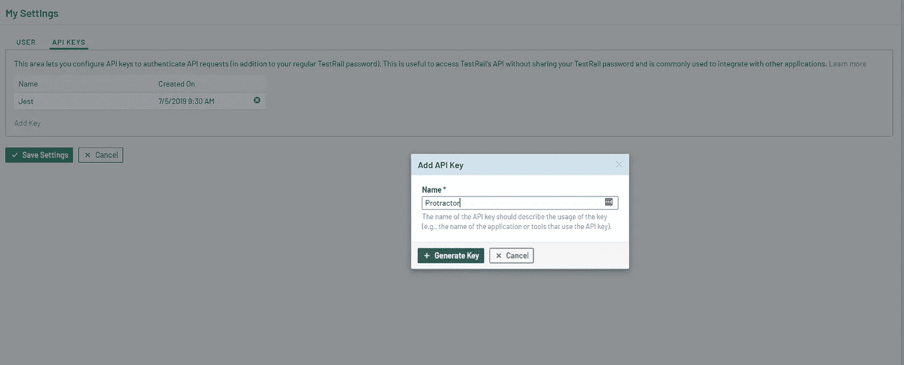
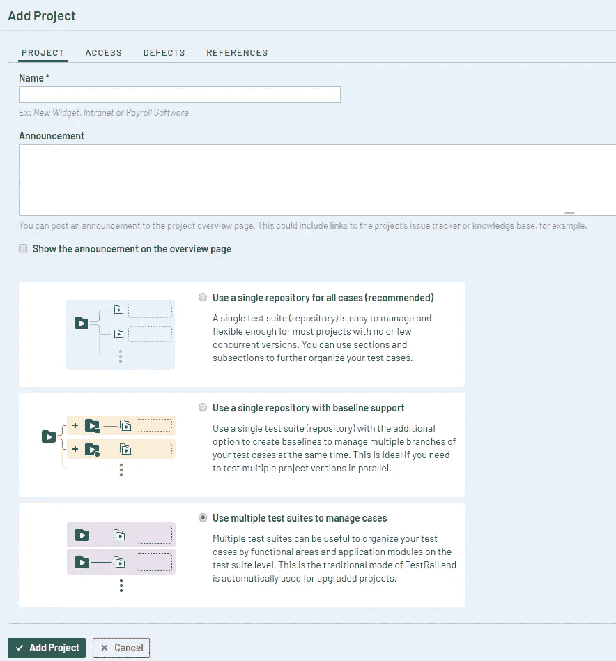
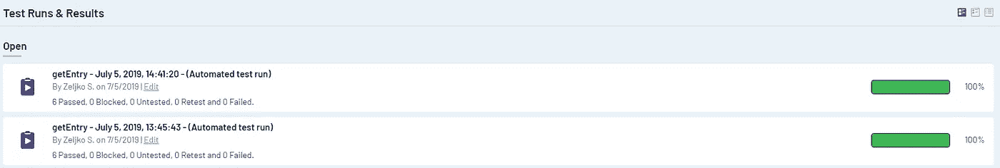
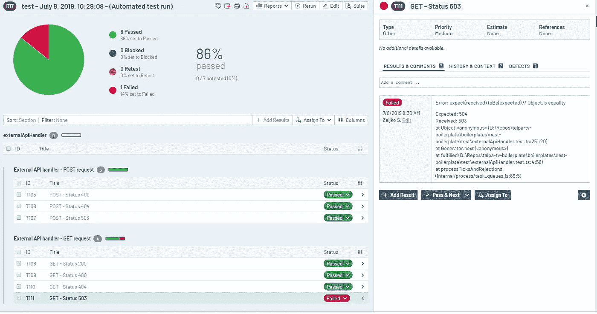

# 将量角器/Jasmine 的测试结果发送到 TestRail

> 原文：<https://betterprogramming.pub/sending-test-results-from-protractor-jasmine-to-testrail-e10dabf9c9bb>

## 记录自动化测试运行的解决方案



我们最近在工作中有一些空闲时间，所以我们致力于解决记录我们的自动化测试运行的问题。

我们认为向我们的利益相关者展示比自动化测试结果的控制台输出更多的东西会更好，所以我们决定使用 [TestRail](https://www.gurock.com/testrail) 作为我们记录测试用例及其结果的平台。

TestRail 有一个 API，我们找到了一个与它交互的库，所以我们决定使用它在自动化测试运行结束时上传结果。

我们只需要创建一个工具，可以在运行后立即自动上传来自[量角器](https://www.protractortest.org/#/frameworks) ( [茉莉](https://jasmine.github.io/))的测试结果。

# 为什么选择 TestRail？

> “TestRail 帮助您管理和跟踪您的软件测试工作，并组织您的 QA 部门。其直观的基于 web 的用户界面使创建测试用例、管理测试运行和协调整个测试过程变得非常容易。”— [*测试轨*](https://www.gurock.com/testrail) 。

我们选择 TestRail 是因为它的可定制的测试计划结构、API 访问和易用性。这个 API 给了我们从自定义插件中创建测试运行和发布测试结果的能力。



在 TestRail 中成功试运行

# 茉莉记者

在研究了我们的选项之后，我们发现连接量角器和 TestRail 的最佳方式是创建一个定制的 Jasmine reporter，因为它让我们能够访问所有的测试用例数据和结果。

我们继承了 [Jasmine 控制台报告器](https://github.com/onury/jasmine-console-reporter),因为它为我们提供了所有必要的功能，我们可以用我们的定制方法升级这些功能。

它有一个很好的可定制的测试运行控制台输出。



测试结果显示在控制台报告程序中

# Jasmine 2 测试轨道

我们通过创建一个定制的 Jasmine reporter:Jasmine 2 TestRail 解决了我们的(也可能是您的)问题。

你可以在 [GitHub](https://github.com/Slobo989/jasmine-2-testrail) 上找到:

[](https://github.com/Slobo989/jasmine-2-testrail) [## Slobo989/jasmine-2-testrail

### 将量角器与测试轨结合使用的模块。- Slobo989/jasmine-2-testrail

github.com](https://github.com/Slobo989/jasmine-2-testrail) 

# 启用 TestRail API

为了使用 TestRail API，需要由管理员在您的 TestRail *站点设置*中启用它。



在网站设置中启用 API

此外，如果您想使用 API 认证而不是密码，请在 TestRail 站点设置中启用 API 的会话认证，并在您的*用户*设置中添加 API 密钥。我们建议您这样做。



在用户设置中添加 API 密钥

# 安装和使用此软件包

这个软件包托管在 [npm](https://www.npmjs.com/) 上，您可以通过运行 npm 命令来安装它:

```
npm i jasmine-2-testrail
```

报告器必须在配置
之外导入和声明，并包含在量角器配置文件的`onPrepare`部分。

当您在 TestRail 中创建新项目时，您可以为您的测试用例组织选择不同的选项。

您需要选择“使用多个测试套件来管理案例”来使我们的插件正确工作，因为特定的项目和套件 id 是发送测试结果所必需的。



在您的量角器配置文件中，您需要导入我们的 reporter 并添加一个`afterLaunch`部分，其中您必须调用`createRun()`方法。

该方法有 3 个参数:

*   项目 ID(必填)是您在 TestRail 上创建的项目的 ID。
*   Suite ID(必填)是您要从中添加案例的套件的 ID。
*   `runName`(可选)是将要创建的运行的自定义名称。

不要忘记在`afterLaunch`的末尾加上`return new Promise(() => true)`，因为需要它来完整地完成我们的方法。

# **附加参数**

## **发送结果到测试轨道**

如果您不想每次都向 TestRail 发送结果，也可以添加一个参数。

在配置文件中，添加:

您还需要在`if`语句中添加`afterLaunch`部分的所有内容，如下所示:

这使您能够默认发送结果，如果您愿意，您可以通过运行如下所示的量角器来禁用它:

默认情况下，如果不想发送结果，也可以反转这些值(`sendResultsToTestRail: false`)。

## **运行名称**

您可以添加一个参数来命名 TestRail 中的运行。

```
protractor conf **--**params.runName**=**TestRun1
```

如果您没有指定运行名称，它默认为“套件名称+当前日期和时间+自动测试运行”。



使用 Jasmine 2 Testrail 创建的默认名称运行测试

# 测试示例

必须将来自 TestRail 的案例 ID 添加到每个`it()`描述的开头，并用冒号— `:`与测试名称隔开。

请注意，案例 ID 是每个测试案例的唯一且永久的 ID(例如 C125)。它不应该与测试用例 ID 混淆，后者是在创建新的运行时分配给测试用例的(例如 T325)。

# **失败的测试案例**

如果一个或多个测试失败，您可以在新的测试运行中从控制台检查完整的错误信息。



# 。环境文件示例

这个文件需要创建在与 conf 文件相同的目录中。

它必须包含您的 TestRail 的 URL、用户名(电子邮件地址)和密码(或 API 密钥)。该文件需要正确填写所有三个参数。

# 资源

*   [https://www.gurock.com/testrail](https://www.gurock.com/testrail)
*   http://docs.gurock.com/testrail-api2/start
*   【https://github.com/dlenroc/node-testrail-api 
*   [https://www.protractortest.org/](https://www.protractortest.org/#/)
*   [https://github.com/onury/jasmine-console-reporter](https://github.com/onury/jasmine-console-reporter)

感谢 [Marko Rajevic](https://github.com/markoarsenal) 帮助编写和发布这个插件。