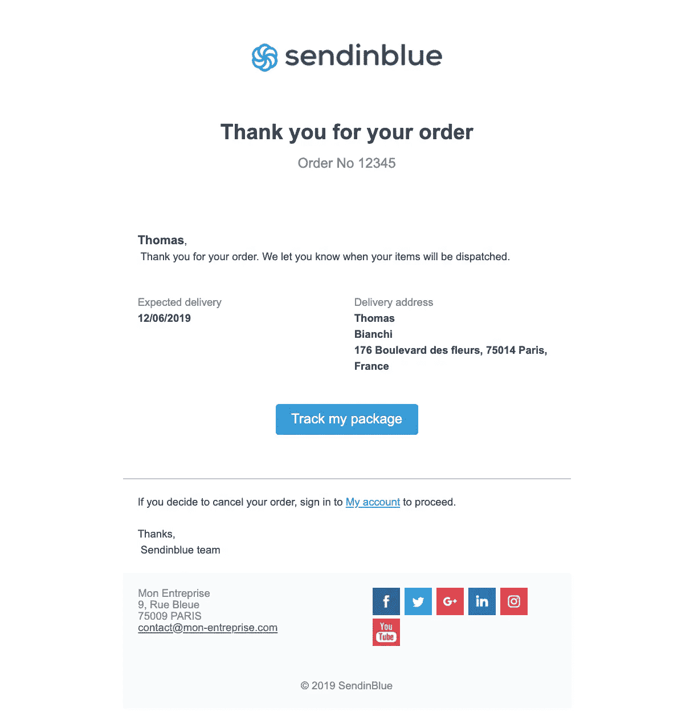

# 用 Kotlin 中的 Sendinblue 发送事务性电子邮件

> 原文：<https://betterprogramming.pub/sending-transactional-emails-with-sendinblue-in-kotlin-6f6920f49733>

## **自动化您的 Android 电子邮件营销策略**


由[布雷特·乔丹](https://unsplash.com/@brett_jordan?utm_source=medium&utm_medium=referral)在 [Unsplash](https://unsplash.com?utm_source=medium&utm_medium=referral) 上拍摄的照片

在本教程中，我们将解释如何使用 Sendinblue 发送事务性电子邮件。

> “Sendinblue 是一套全面的 SaaS 通信工具，包括电子邮件营销、交易电子邮件、短信以及[更多](https://www.sendinblue.com/features/)。”— [*Sendinblue 官方文档*](https://developers.sendinblue.com/docs)

Sendinblue 的[事务性电子邮件文档](https://developers.sendinblue.com/docs/send-a-transactional-email)推荐使用他们的 [API 客户端](https://developers.sendinblue.com/docs/api-clients)，这些客户端在: [C#](https://github.com/sendinblue/APIv3-csharp-library) 、 [Go](https://github.com/sendinblue/APIv3-go-library) 、 [Java](https://github.com/sendinblue/APIv3-java-library) 、 [Node JS](https://github.com/sendinblue/APIv3-nodejs-library) 、 [PHP](https://github.com/sendinblue/APIv3-php-library) 、 [Python](https://github.com/sendinblue/APIv3-python-library) 和 [Ruby](https://github.com/sendinblue/APIv3-ruby-library) 中可用并有文档记录。那么[科特林](https://kotlinlang.org/)呢？

首先，我们需要了解什么是事务性邮件。

> 交易电子邮件是由您的网站自动发送给某个收件人的电子邮件，该电子邮件是由该人执行的交易或特定事件(如电子商务购买或密码重置请求)引起的— [交易邮件营销人员完整指南](https://www.sendinblue.com/blog/transactional-emails-guide/)

现在我们准备开始学习教程了。

# 创建新的 Sendinblue 帐户

首先，我们需要一个 Sendinblue 帐户。有几个[计划](https://www.sendinblue.com/pricing/)可用，但我们将使用免费的，它带有一些限制，如[中所述，免费计划有限制吗？](https://help.sendinblue.com/hc/en-us/articles/208580669-Is-there-a-limit-to-the-free-plan-)

您可以在此页面创建一个新账户:[https://app.sendinblue.com/account/register](https://app.sendinblue.com/account/register)

完成这些后，就该获取我们的 Sendinblue [API 键](https://help.sendinblue.com/hc/en-us/articles/209467485-What-s-an-API-key-and-how-can-I-get-mine-)，这是开始调用 Sendinblue API 所必需的。您可以按照文档中的描述在[获取您的 API 密钥](https://developers.sendinblue.com/docs/getting-started#quick-start)下检索您的 API 密钥。

现在，我们可以开始写几行代码了。

# 安装 Sendinblue API 客户端

为了在 Kotlin 中发送事务性电子邮件，我们需要安装 [Sendinblue API 客户端](https://github.com/sendinblue/APIv3-java-library)。

如果您是 Gradle 用户，请将此依赖项添加到项目的构建文件中:

```
compile "com.sendinblue:sib-api-v3-sdk:4.1.1"
```

否则，如果您是 Maven 用户，请将以下依赖项添加到项目的构建 POM 中:

```
<dependency>
    <groupId>com.sendinblue</groupId>
    <artifactId>sib-api-v3-sdk</artifactId>
    <version>4.1.1</version>
    <scope>compile</scope>
</dependency>
```

Sendinblue API 客户端现在已经安装完毕，可以使用了。

# 定义包含动态内容的新模板

Sendinblue 允许用户定义自己的[定制模板](https://help.sendinblue.com/hc/en-us/articles/360000946299-Create-customize-transactional-email-templates)来设计电子邮件。模板支持动态内容，可以填充[联系人属性](https://help.sendinblue.com/hc/en-us/articles/360000268730#attributes)(默认情况下，一个联系人有以下属性:`EMAIL`、`FIRSTNAME`、`LASTNAME`、`SMS`、[预定义变量](https://help.sendinblue.com/hc/en-us/articles/360000268730#predefined)，自定义[交易参数](https://help.sendinblue.com/hc/en-us/articles/360000268730#transactional)。

本教程的目标不是展示如何在 Sendinblue 中定义模板。所以，要完成这一步，强烈建议遵循官方指南。

请注意:不要忘记保存您刚刚创建的模板的 ID，因为我们将在下一步中使用它。

现在我们已经有了在 Kotlin 中发送第一封事务性电子邮件所需的所有构件。让我们看看下一步怎么做。

# 发送交易电子邮件

是时候看看我们如何用 Kotlin 发送事务性电子邮件了。这可以通过下面几行代码轻松实现:

事务参数必须在`[Map](https://kotlinlang.org/api/latest/jvm/stdlib/kotlin.collections/-map/)<String,String>`对象中定义。地图是包含成对的`<key,value>`对象的集合。在每一对中，`key`是模板中定义的参数名，`value`是我们希望赋予所选参数的相应值。

Sendinblue API 客户端需要一个`SendSmtpEmailTo`对象列表，每个对象代表一个接收者。

每个收件人必须有一个电子邮件，而名称是可选的。前者应该是在 Sendinblue 中注册并分配到联系人列表的联系人，后者是将附加到电子邮件收件人的名称，它将出现在电子邮件标题中，但不会出现在电子邮件正文中。

如果您按照上一步中的描述创建了一个模板，您应该会得到以下结果:



## 额外的

我们刚刚看到了如何使用官方的 Sendinblue API 客户端发送事务性电子邮件，但是使用`POST [https://api.sendinblue.com/v3/smtp/email](https://api.sendinblue.com/v3/smtp/email)` API 也可以获得相同的结果。

# 结论

在本教程中，我们展示了如何在 Kotlin 中发送事务性电子邮件。我们通过利用官方的 Sendinblue Java API 客户端和 Kotlin 特有的与 Java 互操作的特性，成功实现了我们的目标。

我希望这篇文章对你有所帮助——感谢阅读！如果你有任何意见或建议，请告诉我。