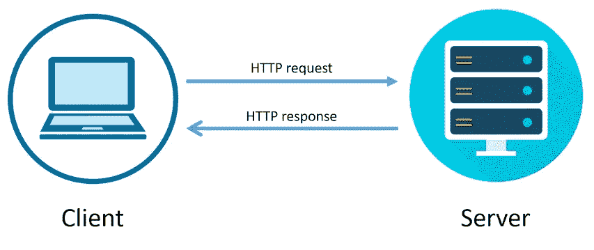

# 使用 Go 发送类型安全的 HTTP 请求

> 原文：<https://betterprogramming.pub/sending-type-safe-http-requests-with-go-eb5bd1f91558>

## 看看`go-zero`中的`httpc`包是如何用于类型安全的。



对于地鼠，我们基本上是写代码让客户请求。有时候我们需要请求第三方提供的 RESTful APIs。此时，我们觉得很难组装请求，不难，但容易出错。

比如我们要发送这样的请求，看起来很简单，但是实际写起来还是很繁琐。

```
POST /articles/5/update?device=ios HTTP/1.1
Host: go-zero.dev
Authorization: Bearer <jwt-token>{"author": "kevin", "body": "this is not important!", "title": "my title", "type":6}
```

# 走地道的路

这个 API 实际上非常简单，我们可以直接从头开始编写。

```
**func** **main**() {
    **var** buf bytes.
    encoder := json.NewEncoder(&buf)
    params := **map**[**string**]**interface**{}{
        "title":  "my title",
        "body":   "this is not important!",
        "author": "kevin",
        "type":   6,
    }
    **if** err := encoder.Encode(params); err ! = **nil** {
        fmt.Fprintln(os.Stderr, err)
        **return**
    } url := fmt.Sprintf("http://go-zero.dev/articles/%d/update?device=%s", 5, "ios")
    req, err := http.NewRequest(http.MethodPost, url, &buf)
    **if** err ! = **nil** {
        fmt.Fprintln(os.Stderr, err)
        **return**
    } req.Header.Add("Authorization", "Bearer <jwt-token>")
    cli := http.Client{}
    resp, err := cli.Do(req)
    **if** err ! = **nil** {
        fmt.Fprintln(os.Stderr, err)
        **return**
    } io.Copy(os.Stdout, resp.Body)
}
```

我们运行了一个测试，发现我们没有得到`200 OK`，转储了数据包，请求如下所示。你能想到失败的原因吗？

```
POST /articles/5/update?device=ios HTTP/1.1
Host: go-zero.dev
User-Agent: Go-http-client/1.1
Content-Length: 79
Authorization: Bearer <jwt-token>
Accept-Encoding: gzip{"author": "kevin", "body": "this is not important!", "title": "my title", "type":6}
```

失败的具体原因将在下面讨论，所以我们先解释一下这段代码。您可以看到`map[string]interface{}`用于拼接参数，对于每个字段，我们无法检查类型是否匹配。只有当我们把它发送出去并从服务器接收到`200 OK`时，我们才能确认它被正确传递。例如，`type`参数在这里被用作`int`类型，我们可能会误写成`string`类型。但是不要求还是很难发现这个参数写错了。

所以让我们看看`go-zero`中的`httpc`包是如何用于类型安全的。

# `httpc`实现

让我们看看用`httpc`包请求的代码是如何编写的。

```
**const** url = "http://go-zero.dev/articles/:id/update"**type** UpdateArticle **struct** {
    ID            **int**    `path: "id"`
    Device        **string** `form: "device,options=ios,android,web,desktop"`
    Authorization **string** `header: "Authorization"`
    Title         **string** `json: "title"`
    Body          **string** `json: "body"`
    Author        **string** `json: "author"`
    Type          **int**    `json: "type"`
}**func** **main**() {
    data := &UpdateArticle{
        ID:            5,
        Device:        "ios",
        Authorization: "Bearer <jwt-token>",
        Title:         "my title",
        Body:          "this is not important!",
        Author:        "kevin",
        Type:          6,
    } resp, err := httpc.Do(context.Background(), http.MethodPost, url, data)
    **if** err ! = **nil** {
        fmt.Fprintln(os.Stderr, err)
        **return**
    } io.Copy(os.Stdout, resp.Body)
}
```

让我们通过发送一个请求来验证代码，结果是预期的。

```
POST /articles/5/update?device=ios HTTP/1.1
Host: go-zero.dev
User-Agent: Go-http-client/1.1
Content-Length: 79
Content-Type: application/json; charset=utf-8
Authorization: Bearer <jwt-token>
Accept-Encoding: gzip{"author": "kevin", "body": "this is not important!", "title": "my title", "type":6}
```

你有没有发现，与上一个相比，多设置了一个头，`Content-Type: application/json; charset=utf-8`，而我们在之前的代码中忘记设置`Content-Type`。

`httpc`通过定义请求的类型并用`Do`发送，实现非常容易理解。有了我们代码中显示的对`path`、`form`、`header`和`json`的支持，发送`HTTP`请求就变得非常容易并且是类型安全的。

# 更多功能

除了上面显示的易用性和类型安全外，`httpc`包还有以下特点。

1.  用`context`进行超时控制。您可以通过`ctx`进行请求。
2.  自动整合`OpenTelemetry`。服务器返回的`trace-id`、`span-id`会自动写入日志，以便客户端和服务器协同调查问题。
3.  使用`httpc.Service`获得断路器能力。当服务器端出现问题时，会自动停止发送请求，避免无用的请求，减轻服务器端的压力。

```
**Want to Connect?**You're welcome to use [go-zero](https://github.com/zeromicro/go-zero) and star to support us!
```