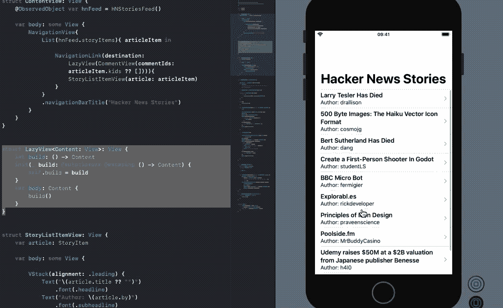

# 使用 SwiftUI、自然语言和 Combine 在 iOS 上进行情感分析:黑客新闻头条

> 原文：<https://betterprogramming.pub/sentiment-analysis-on-ios-using-swift-natural-language-and-combine-hacker-news-top-stories-d1b8d8f4f798>

## 利用苹果的反应式编程框架来处理异步任务，同时实时进行自然语言处理


照片由[好的好的好的](https://unsplash.com/@goodgoodgood?utm_source=unsplash&utm_medium=referral&utm_content=creditCopyText)在 [Unsplash](https://unsplash.com/s/photos/news?utm_source=unsplash&utm_medium=referral&utm_content=creditCopyText) 上拍摄

让应用程序具有理解文本的自然语言的能力总是让我感到惊讶。苹果去年(2019 年)在自然语言框架方面取得了一些重大进展。具体来说，引入内置的情感分析功能只能帮助构建更智能的基于 NLP 的 iOS 应用程序。

除了对自然语言框架的改进，SwiftUI 和 Combine 是 WWDC 2019 期间推出的两大亮点。

SwiftUI 是用 Swift 编写的声明式框架，帮助开发者快速构建用户界面。另一方面，Combine 是苹果自己的反应式编程框架，旨在推动现代应用程序开发，尤其是在处理异步任务时。

# 我们的目标

*   我们将使用黑客新闻 API，通过一个由 Combine 提供动力的 URLSession 来获取头条新闻。
*   随后，我们将对每个故事的顶级评论运行自然语言的内置情感分析，以了解总体反应。
*   在本教程中，我们将看到反应式编程如何使链接多个网络请求、转换并将结果传递给订户变得更加容易。

> 先决条件:对 Combine 框架有一个简单的概念会很有帮助。这里有一个[片段](https://medium.com/better-programming/a-deep-dive-into-the-combine-framework-in-swift-cffdfcc6f32c)可以在 Swift 中使用 Combine 来启动。

# 入门指南

首先，让我们创建一个新的 Xcode SwiftUI 项目。我们将使用官方的[黑客新闻 API](https://github.com/HackerNews/API) ，它提供几乎实时的数据。

为了创建一个包含黑客新闻头条的 SwiftUI 列表，我们需要设置我们的`ObservableObject`类。这个类负责从 API 获取故事，并将它们传递给 SwiftUI 列表。以下代码为您完成了这项工作:

上面的代码中发生了很多事情。让我们来分解一下:

*   `fetchTopStories`负责返回故事的整数 id 数组。
*   为了节省时间，我们将前 10 个故事标识符传递给`fetchStoryById`函数，在这里我们使用自定义发布者`FetchItem`获取黑客新闻故事，并合并结果。
*   Combine 的`collect()`操作符负责将从 API 获取的所有故事合并到一个数组中。

接下来让我们看看如何构建我们的自定义组合发布器。

# 创建自定义联合发布器

要创建一个定制的发布者，我们需要使结构符合`Publisher`协议，并设置流的`Output`和`Failure`类型，如下所示:

*   定义的`id`表示在初始化器中传递的故事标识符。
*   实现`receive(subscriber:)`方法至关重要。它将发布者连接到订阅者，我们需要确保发布者的输出与订阅者的输入具有相同的类型。
*   在`receive<S>(subscriber: S)`方法内部，我们正在发出另一个 API 请求。这一次，我们使用一个`StoryItem`模型获取故事并解码，定义如下:

```
struct StoryItem : Identifiable, Codable {
    let by: String
    let id: Int
    let kids: [Int]?
    let title: String?private enum CodingKeys: String, CodingKey {
            case by, id, kids, title
        }
}
```

然后将`StoryItems`的数组发布到 SwiftUI 视图，以获取具有内置订阅者的。以下代码负责在 SwiftUI 列表中显示黑客新闻:

`NavigationLink`负责将用户带到目的地屏幕，在那里显示注释。我们已经将我们的目的地视图—`CommentView`—包装在一个惰性视图中。这样做是为了只有当用户导航到目标视图时才加载该视图。这是 `[NavigationLink](https://medium.com/better-programming/swiftui-navigation-links-and-the-common-pitfalls-faced-505cbfd8029b)` [s](https://medium.com/better-programming/swiftui-navigation-links-and-the-common-pitfalls-faced-505cbfd8029b) 中的[常见陷阱。](https://medium.com/better-programming/swiftui-navigation-links-and-the-common-pitfalls-faced-505cbfd8029b)

在我们进入评论部分和后续的使用 NLP 的情感分析之前，让我们先来看看目前为止我们已经建立了什么:



# 获取黑客新闻评论并分析情感得分

`StoryItem`模型中的`kids`属性包含顶级注释的 id。对于多个网络请求，我们将使用与前面类似的方法，使用组合发布者。

这里的区别是包含了自然语言的内置情感分析，为每个评论给出一个情感分数，然后计算该故事的平均情感分数。

下面的代码来自于`HNCommentFeed`类，它扩展了`ObservableObject`:

一旦使用自定义发布器从 API 获取了`comments`属性，一旦我们计算了平均情感分数并将其设置在`sentimentAvg`属性上，就通过调用`didChange.send()`来手动发布该属性，该属性本身就是一个`@Published`属性包装器。

在我们查看保存评论及其各自分数的 SwiftUI 视图之前，让我们先来看看定制的 Combine publisher `FetchComment`，如下所示:

与之前的定制发布者非常相似，我们需要定义`Output`和`Failure`类型。除此之外，我们在`map`操作符中做了相当多的事情，将`CommentItem`转换成另一个新的实例，它也保存了情感分数。

让我们来看看那些重要的标有注释的。

1.  从`HNCommentFeed`中传递注释的`id`和`nlTagger`实例。`nlTagger`负责将文本分割成句子或段落单元，并处理各部分的信息。在我们的例子中，我们将它设置为处理`sentimentScore`，这是一个基于文本的正负程度在-1 到 1 之间的浮点值。
2.  从`CommentItem`实例中的 API 请求返回的注释文本是一个 HTML 字符串。通过检索数据部分(使用`utf8`，我们将它转换成一个格式化的字符串，没有 HTML 转义字符。
3.  接下来，我们已经在`nlTagger’s` `string`属性上设置了格式化字符串。这个字符串由语言标记器分析。
4.  最后，我们创建了一个新的保存`sentimentScore`的`CommentItem`实例。这个结果被向下游传递给订户。

下面给出了保存注释及其分数的`CommentView` SwiftUI 结构的代码:

我们设置了一个 SF 符号(iOS 13 中的新功能)作为导航栏按钮，其颜色代表该故事顶级评论的整体情绪。

因此，我们在应用程序中得到以下输出:


# 结论

使用苹果内置的 NLP 情感评分，我们看到大多数头条新闻在黑客新闻上吸引了两极分化的观点。虽然许多评论都很模糊，这可能会导致情绪分析甚至是定制模型的准确性问题，但苹果的内置情绪分析做得很好。自然语言框架已经取得了一些良好的进展，WWDC 2020 还有很多值得期待的地方。

让我们后退一步，看看我们在这篇文章中学到了什么。

我们看到:

*   Combine 框架如何使用 URLSession 轻松处理多个网络请求。我们设法链接请求，设置依赖 API 请求，并通过避免可怕的回调地狱来同步 API 结果。
*   如何创建自定义发布者并确保发布者和订阅者之间的契约得到维护(访问`receive`方法中的 where 子句)。
*   如何使用组合运算符为我们带来优势？我们通过在 Combine 操作符中执行自然语言处理，成功地转换了一堆评论，添加了一个额外的属性——情感分数。

接下来，您可以通过添加无限滚动功能来扩展上述实现。这给你所有的顶级黑客新闻故事。这里有一个在基于 SwiftUI 的应用程序中实现无限滚动的好参考。

上述应用程序的完整源代码可以在这个 [GitHub 库](https://github.com/anupamchugh/iowncode/tree/master/SwiftUIHNSentiments)中找到。

这一个到此为止。感谢您的阅读，我希望您喜欢 Combine 和自然语言框架的结合。