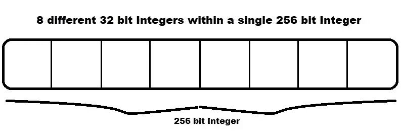
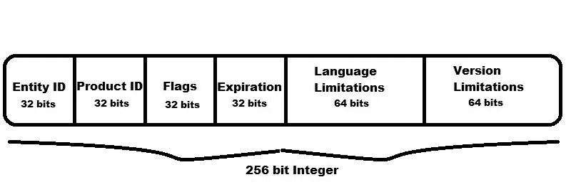
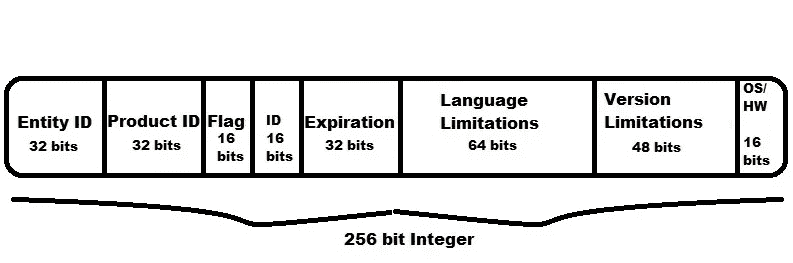

# 序列化大整数中的数据

> 原文：<https://betterprogramming.pub/serializing-data-within-large-integers-433684c8e7cd>

## 以太坊和 Dapps 使用逐位运算来序列化和反序列化单个 256 位令牌 ID 中的多个整数


移动一个大的二进制整数中的位以显示更小的整数(图片来自 [Pixabay](https://pixabay.com/?utm_source=link-attribution&utm_medium=referral&utm_campaign=image&utm_content=507790) 的 [Gerd Altmann](https://pixabay.com/users/geralt-9301/?utm_source=link-attribution&utm_medium=referral&utm_campaign=image&utm_content=507790)

数据大小的优化经常被忽略，或者可读性比数据大小更重要。然而，在为区块链上的数据存储付费时，大小确实很重要。以太坊智能合约整数占用 256 位空间，通常比需要的要大。256 位整数可以表示八(8)个不同的 32 位整数值或 32 个不同的 8 位值。由于天然气价格取决于数据大小，因此利用您支付的存储在区块链上的整数的所有位非常重要。



在单个 256 位整数中可视化多个较小的整数

明确地说，在一个较大的整数中序列化较小的整数的额外复杂性应该小心对待。只有逻辑上相关的数据才能以这种方式分组。在世界上第一个去中心化软件应用商店的开发过程中，非营利组织 [ImmutableSoft](https://www.immutablesoft.org/) 发现这条道路充满了意想不到的障碍。这是他们关于为什么、在哪里以及如何应用这种技术的故事。

ERC-721 令牌 id 是 256 位整数，必须是唯一的(在区块链称为*不可替换的*)。ImmutableSoft 创建的[不可变生态系统](https://ecosystem.immutablesoft.org/)去中心化应用程序(Dapp)将其软件许可激活定义为 ERC-721 令牌。为了表示软件许可证，它必须存储实体(组织、个人等。)和产品标识符。此外，激活限制，如有效期、版本和语言，必须永久记录在每次激活的区块链上。

起初，仅用 256 位来表示所有这些信息似乎是不可能的。这很好，因为很容易扩展我们的 ERC-721 令牌来为每个单独的令牌存储额外的数据。然而，额外的存储会增加天然气成本，并将不可变的数据移出 ERC-721 标准。我们认为，我们的令牌在标准令牌 ID 中准确地表示整个软件激活非常重要，这样令牌即使在其他 ERC-721 交换中也能被理解。随着为激活起草以太坊改进提案(EIP)的计划最终确定，谨慎的设计是明智的。

首先，我们首先检查了所有的激活变量，并为每个变量定义了一个最小整数大小。例如，假设 32 位足以识别不可变生态系统的所有注册实体是合理的。产品标识符也是如此。即使是最多产的经销商也会发现一个 32 位的整数足以标识他们所有的产品。使用通用的从纪元开始的秒表示法(C 标准库`time()`函数)，可以类似地用 32 位整数来表示到期时间。

代表一个版本需要一些自我反省。我们的折衷方案是使用四(4)个不同的 16 位整数来表示版本。在字符串点表示法中，这看起来像 1.2.3.4，每个数字表示为 16 位无符号整数(最大值为 65，535)。整个版本字段总共 64 位。到目前为止，已经使用了 160 位令牌 ID，还有 96 位可供使用。

为了灵活性和将来的可升级性，很明显我们需要一个 flags 字段来标识激活令牌所代表的类型和特性。基于设置了哪些标志位(位值 1)，256 位令牌 ID 的数据布局可以改变。我们最初这样做是为了让我们的 ERC-721 令牌能够代表应用程序中的特性，而不是激活可执行文件。例如，独特的游戏项目可以很容易地表示为生态系统中的激活。无论游戏物品是可购买的还是只能在游戏中找到的，在线游戏都可以使用不变的生态系统将它们的物品移动到区块链，而无需区块链体验。特征标志被定义为识别应用特征。但是在接下来的讨论中，我们将重点关注限制和到期标志。

为了表示语言限制，重要的是每个语言都要用自己的位来表示，以便在一次软件许可证激活中支持多种语言。在决定使用 64 位(每一位代表一种不同的语言)后，我们发现自己利用了令牌 ID 的所有 256 位。下面是我们的智能合约中的 bit 布局。所有软件许可证激活令牌都支持最高有效的 128 位，最低有效的 128 位特定于定义的标志。在这种情况下，限制标志定义了保存语言和版本限制的最后几位(或 LSB)。



首先尝试定义激活令牌的 256 位令牌 ID 的结构

我们普遍为我们的成功喝彩，并陶醉于我们的独创性——事实证明，为时过早。

在审计和测试时，我们发现该解决方案没有强制执行 ERC-721 令牌的唯一性(不可替代性)要求。我们设计中的令牌对于常见的测试和用例来说是唯一的，但是存在许多(未知的)极端情况，其中生成的令牌 ID 可能与另一个相同。例如，如果两个人同时购买激活优惠，则到期时间将是相同的，从而导致铸造新令牌的交易失败，这是一种区块链失败，可能会损失软件创建者的收入。软件创作者也有可能指定一个没有到期的报价。正是在这个用例中，问题变得非常明显并被发现。在使用此优惠进行第一次购买后，后续购买将在制造阶段失败，因为令牌 ID 不是唯一的。只有到期时间为令牌提供了唯一性。

回到绘图板。我们查看了所有的数据字段，以确定如何为每个激活引入独特性。到了紧要关头，标志的大小被减少到 16 位，以便为唯一 ID 腾出空间。对特定产品递增计数器(nonce)使用 16 位确保了唯一性。随着每个新令牌增加这个值，它还可以用来帮助记录和报告生成。

我们的难题的最后一块是激活的平台类型标志。软件许可证激活是否支持 Windows 操作系统、Mac 操作系统、Linux 或上述操作系统的某种组合？我们如此接近于适应一切，我们给了这一努力一个更多的尝试，审查语言和版本领域。有了全球抱负，我们明白我们可以，但不想限制可能的语言数量。这个版本看起来坚不可摧，但真的如此吗？

版本字段已经过优化并用于标识产品版本，不能更改。然而，有人认为，版本的最后一个数字永远不应被定义为激活的限制，原因是所有软件都应允许新版本解决缺陷修复。作为一个软件分销商，你永远不会想把自己困在一个角落里，在那里你必须重新许可你的客户，以提供一个错误修复。因此，一个版本需要四位数字的版本，但版本的最后一位数字现在在激活中可供争夺！

但是 16 位足以容纳所有的平台位吗？结果是，按照目前的定义，有 15 个平台——还有一点留给未来。好险，太险了。随着旗帜领域仍然可以升级，我们变得更加舒适，这种紧密配合和任何支点前进。



激活令牌的 256 位令牌 ID 结构的第二次修订

一旦令牌 ID 的结构最终确定，我们就在智能契约(Solidity)中定义常数，以便我们可以从整体中提取或反序列化单个整数。通过执行按位 And 运算，然后将偏移量右移，我们提取或反序列化单个整数。为了可视化，将手指放在上面想要的字段的行上(And 操作)，然后将数字向右移动，直到它与末端齐平(右移偏移量)。下面是与上图中的结构相对应的已定义的偏移和遮罩。

```
 // Offset and mask of entity and product identifiers
  uint256 constant EntityIdOffset = 224;
  uint256 constant EntityIdMask =  (0xFFFFFFFF <<
                                    EntityIdOffset);
  uint256 constant ProductIdOffset = 192;
  uint256 constant ProductIdMask =  (0xFFFFFFFF <<
                                     ProductIdOffset); // Bits to help enforce non fungible (unique) token
  uint256 constant UniqueIdOffset = 176;
  uint256 constant UniqueIdMask =  (0xFFFF <<
                                    UniqueIdOffset); // Flags allow different activation types and Value layout
  uint256 constant FlagsOffset = 160;
  uint256 constant FlagsMask =  (0xFFFF << FlagsOffset); // Expiration is last field before final 128 bit Value
  uint256 constant ExpirationOffset = 128;
  uint256 constant ExpirationMask = (0xFFFFFFFF <<
                                     ExpirationOffset); // If limitation flag set, the Value is entirely utilized // Bits 64 - 127 are for language (as defined above)
  uint256 constant LanguageOffset = 64;
  uint256 constant LanguageMask =  (0xFFFFFFFFFFFFFFFF <<
                                    LanguageOffset); // Final 64 bits is version (4 different 16 bit)
  uint256 constant LimitVersionOffset = 0;
  uint256 constant LimitVersionMask =(0xFFFFFFFFFFFFFFFF <<
                                      LimitVersionOffset);
```

要使用上面的掩码和偏移量，首先执行按位 and 运算以应用掩码，然后将结果向右移动偏移量位。下面是一个从激活令牌 ID 中提取有效期的示例。

```
// token_id is the value of the activation token iduint256 theExpiration;
theExpiration = ((token_id & ExpirationMask) >>
                 ExpirationOffset);
```

一旦智能契约表示了令牌 ID 中的所有数据字段，我们的分散式应用程序(Dapp)就有必要在单个 256 位令牌 ID 中读取(反序列化)和写入(序列化)各个值。与大多数编程语言一样，JavaScript 不支持大整数或整数常量，所以为了简单起见，我们将按照与上面的 Solidity 示例相反的顺序来执行位运算。

使用按位运算，在 And 运算之前右移允许使用由要反序列化的整数的大小定义的小局部掩码。JavaScript 32 位整数常量(“0xFFFFFFFF”)或 16 位整数常量(0xFFFF)用于在移位后屏蔽大小整数。通过右移与偏移量相等的位数，然后使用 and 运算应用局部掩码，可以将较大整数中的每个较小整数隔离出来，并赋给一个单独的变量供程序使用。

对于我们的 Dapp，我们使用了[节点。JS](https://nodejs.org/en/) 和[大整数](https://www.npmjs.com/package/big-integer)包。要安装 npm，请执行以下操作:

```
npm install big-integer
```

并在代码中包含:

```
var bigInt = require("big-integer");
```

要创建一个供 JavaScript 代码使用的大整数，必须使用`bigInt()`构造函数。智能协定调用以十六进制字符串的形式返回一个 256 位的大整数。要开始反序列化这个大整数，将十六进制字符串直接传递给`bigInt()`构造函数，用 JavaScript 创建一个 256 位整数的令牌 ID。然后结合使用`shiftRight()`操作和`and()`操作，从较大的 256 位整数中反序列化较小的整数。以较大的 256 位整数编码的每个单独的整数现在可以被解析(解串行化)并呈现给用户或由 Dapp 使用。

```
 //First create the bigInt() of the token id
  //  tokenId is the response from the blockchain
  var value = bigInt(tokenId); // De-serialize the activation bit flags and nonce
  var flags = value.shiftRight(160).and('0xFFFF');
  var nonce = value.shiftRight(176).and('0xFFFF'); // De-serialize the expiration
  var expiration = value.shiftRight(128).and('0xFFFFFFFF');
```

由于 JavaScript 不支持 64 位整数常量，语言和版本字段的掩码要求我们首先创建一个`bigInt()`来用作位掩码。有了这个掩码，我们就完成了 256 位激活令牌 ID 的反序列化。

```
 // JavaScript has no 64 bit constant support, so create
  // a bigInt to hold our 64 bit mask of all ones
  var all32bits = bigInt('0xFFFFFFFF');
  var all64bits = all32bits.or(all32bits.shiftLeft(32)); // Shift 64 bits and get 64 bits for language limitations
  var langLimitation = value.shiftRight(64).and(all64bits); // Final 64 bits is the version limitation and platform
  var verLimitation = value.and(all64bits); // OS/HW platform is taken from last 16 bits of version
  var platformLimitations = verLimitation.and('0xFFFF'); // Shift right to remove platform from the version
  verLimitation = verLimitation.shiftRight(16);
```

为了将较小的整数序列化回较大的 256 位整数，我们进行了相反的位运算。使用按位左移操作，我们创建每个较小整数的新的`bigInt()`变量，但是将位移动到它们在 256 位整数值内的最终位置。一旦所有的单个整数值都被转换成大整数，并且处于正确的位位置，我们就执行按位“或”运算将它们放在一起。我们是这样做的。

```
 // entityID, productID, preventResale, duration and
        // limitation from user input (not shown) // Product and entity are encoded in offer
        var productIdFlag = bigInt(productID).shiftLeft(192);
        var entityIdFlag =
              bigInt(entityID).shiftLeft(224); // Expiration and limitation flags
        var expirationFlag = bigInt(1).shiftLeft(160);
        var limitationFlag = bigInt(1).shiftLeft(161); // Check if prevent resale flag is set and valid
        var preventResaleFlag = bigInt(0);
        if ((preventResale == null) || (preventResale.length == 0))
          preventResale = '0';
        if (preventResale == '1')
          preventResaleFlag = bigInt(1).shiftLeft(162); // Convert the duration into an expiration
        var currentDate = new Date();
        var expirationInSeconds = currentDate.getTime() / 1000;
        expirationInSeconds += duration;

        // Initialize the token id value
        var value = bigInt(Math.ceil(expirationInSeconds)); value =
          value.shiftLeft(128).or(limitation).or(expirationFlag).
                  or(limitationFlag).or(preventResaleFlag).
                  or(productIdFlag).or(entityIdFlag);
```

好了，这就是如何将多个较小的整数序列化和反序列化为一个 256 位的大整数的蓝图。我希望这个演练有助于为其他有类似问题的人指明道路。通过一些准备工作，使用序列化在单个 256 位整数中编码和解码多个整数并不困难。干杯！