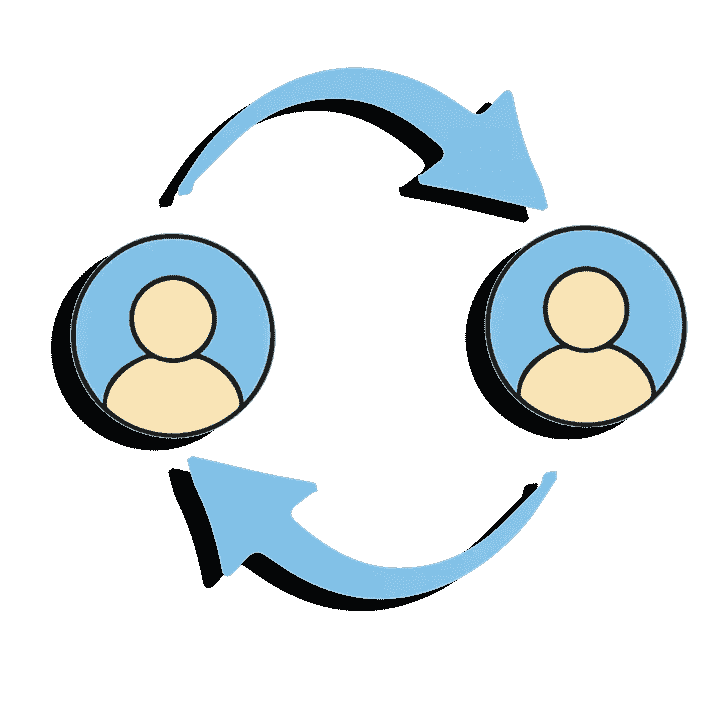

# 服务型领导

> 原文：<https://betterprogramming.pub/servant-leadership-d850ac1a7e39>

## 优秀团队的关键

领导力是一个充满激情的词。对一些人来说，它唤起了掌握和完全控制。对于其他人来说，这是一个令人生畏的可能性，推动他们舒适区的角落。尽管定义各不相同，但还是有一些简单的方法可以增强工程团队的力量。

# 什么是服务型领导？

仆人式领导是承认你不是负责人。你不是指挥，他们也不是管弦乐队，你也不是强迫下属服从的独裁者。你是团队中的一员，就像团队中的其他成员一样。

你和其他成员的关键区别在于你被赋予了一个特定的任务。你的任务是创造一个团队能够茁壮成长的环境。在这种情况下，这就是领导力。那你是怎么做到的呢？

## 使反馈正常

你并不完美。你的工程师没有一个是完美的。你们中任何一个人进步的唯一途径就是知道哪里可以进步。有些人自省程度很高，能够诚实地反思自己的行为，但没有人能一直这么自律。

鼓励你的团队以建设性和友好的方式相互提供反馈。让它正常起来。最好的开始方式是让他们给你反馈。如果他们能对你坦诚，他们也能对彼此坦诚。树立榜样。

这第一步将提升你作为领导者的能力，并提高团队的沟通技巧。

## 以心理安全为目标

不管你喜不喜欢，错误总会发生。我们唯一的决定是如何回应他们。政治迫害看似诱人，但最终是有害的。他们为创新创造了一个不安全的环境，在这个环境中，人们将不再提出新的想法，不再跳出框框思考。当失败的惩罚如此严厉时，他们为什么要冒险呢？

心理安全意味着错误、误解和过失不会立即引发相互指责的事件。相反，每个人都承认这些事情会发生，并专注于如何在未来防止这些事情的发生。

## 提问，不要给出指示

如果你以前经历过一个问题，很容易让对话变得短路。当你能确切地告诉他们该做什么时，为什么要让他们说出来呢？这种方法的问题是双重的。

*   这让人失去力量。团队需要拥有他们构建的解决方案。如果一个解决方案是自上而下推出的，他们就不会得到关键的所有权。
*   这剥夺了他们学习的机会。通过交谈一会儿并着手解决问题，他们正在练习他们的故障排除技能。

相反，问他们一两个问题。如果你有信心，他们可以是领导型的，也可以是开放式的。问题很聪明，因为它们仍在创造解决方案。一个好的仆人式领导鼓励团队拿出好的解决方案，而不是强迫他们接受一种方法。

## 总是问“我能帮什么忙？”

类似于上面的，但是一个更一般的建议。不要出现在团队面前，告诉他们你要做什么。问问他们想要什么，让他们知道你是有空的，如果他们需要的话，提供支持。

有时候他们可能会完全迷失，你需要给他们一些指点。艺术是解决何时停止指向的问题。对此没有通用的建议，我只能说你需要了解房间里的气氛。