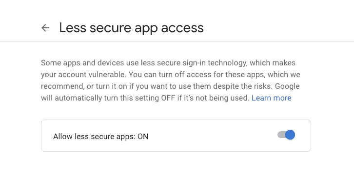
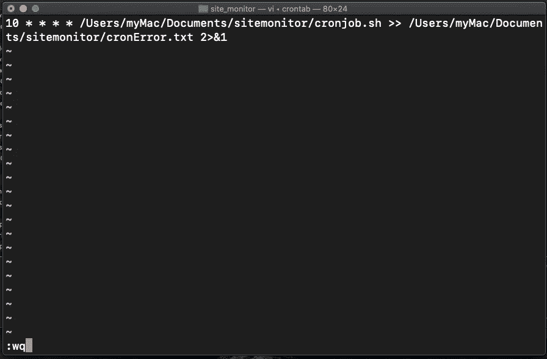
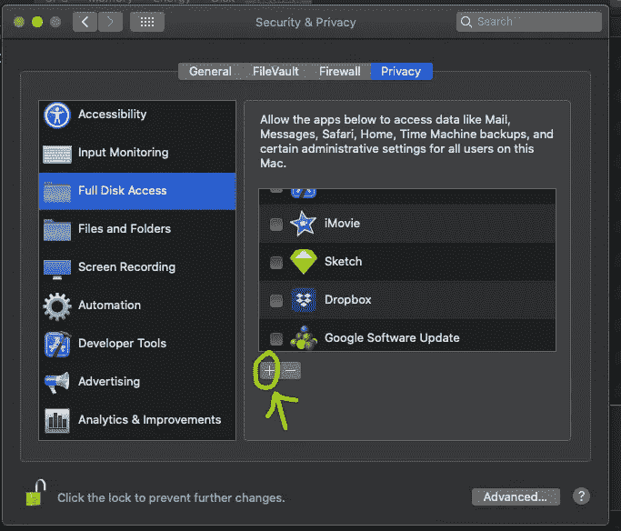
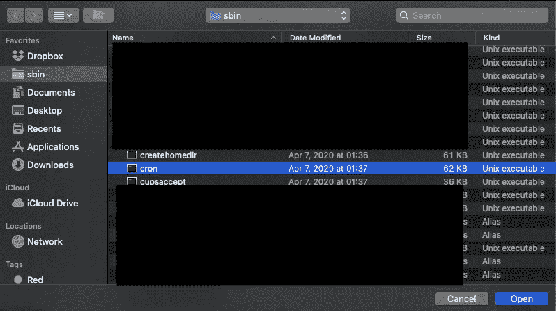

# 服务器停机了吗？使用 Python 向您的团队发送自动警报

> 原文：<https://betterprogramming.pub/server-monitoring-and-sending-alert-to-them-team-when-its-down-using-python-script-cb843084c0a9>

## 并创建一个网站监控脚本来跟踪停机时间


由[乌萨马·阿扎姆](https://unsplash.com/@ussamaazam?utm_source=medium&utm_medium=referral)在 [Unsplash](https://unsplash.com?utm_source=medium&utm_medium=referral) 拍摄的照片

这些年来，我遇到过很多服务器停机而客户端让我们知道的问题。我想很多像我一样的其他开发者也面临过类似的问题。从软件公司和开发者的角度来看都不太好！

作为一个对 Python 这样的脚本语言一无所知的 iOS 开发者，我一直觉得被束缚住了，从来不敢尝试。是的，有可用的系统监控工具——既有开源的，也有付费的，这些都可以使用，但是当我只想在服务器停机时向团队成员发送简单的电子邮件和短信警报时，在系统中集成另一个依赖项——我不喜欢这个想法。

我家里有一台 Mac mini，它可以 24/7 全天候稳定连接互联网，所以我想——为什么不用它每隔几分钟或一小时连接我项目的服务器，并检查它的状态呢？我决定坐下来，从这里或那里学习一些知识，以便能够编写脚本并在 cron 中运行，以便在服务器停机时提醒我。

我决定包括三件事:

*   当我的脚本无法 ping 通服务器时，向所有队友(包括项目经理)发送一封电子邮件通知。
*   向项目经理和团队领导发送短信提醒。
*   在晚上的时候用声音提醒我(出于实验目的)。

由于我对这门语言知之甚少，我决定一步一步来。

# **步骤 1:创建新项目(站点监视器)**

这很容易。我打开终端，为项目和虚拟环境创建一个新目录，然后激活它:

```
mkdir sitemonitor
cd sitemonitor/
python3 -m venv monitor_env
source monitor_env/bin/activate
```

# **步骤 2:在 JSON 文件中创建项目信息结构**

我需要决定监视器需要的项目信息的基本结构。我需要项目名称、ping 的服务器 URL 路径来查找服务器的状态，然后需要项目成员的信息:他们的姓名、电子邮件地址(用于电子邮件提醒)和手机号码(用于短信提醒)。由于我将使用一个试用的 Twilio 帐户，并决定根据项目的严重性，为一个项目开/关短信提醒，我添加了另一个键:`send_sms_alert`。

```
[
 {
  "server" : "[u](https://stage.servare.app/)rl here",
  "project_name": "project name here",
  "send_sms_alert" : false,
  "manager": {
   "name" : "manager name here",
   "email" : "[m](mailto:ssingh@outcodesoftware.com)anager email address here",
   "number" : "manager mobile number here"
  },
  "lead": {
   "name" : "lead name here",
   "email" : "lead email address here",
   "number" : "lead mobile number here"
  },
  "other_members" : [
   {
    "name" : "member 1 name here",
    "email" : "[m](mailto:sshrestha@outcodesoftware.com)ember 1 email address here",
    "number" : "[m](mailto:sshrestha@outcodesoftware.com)ember mobile number here"
   }
  ]
 }]
```

# **步骤 3:从 JSON 文件加载项目**

```
import jsondef check_server_down(project):
    # here we ping the server and check it's statusdef load_projects():
    f = open('projects.json')
    projects = json.load(f)
    for project in projects:
         check_server_down(project) f.close()load_projects()
```

# 步骤 4:ping Project Server URL 以检查其 HTTP 响应状态代码

我们假设我们有一个端点，如果服务器启动，它总是用`200 OK`来响应。为此，我们需要首先安装请求库。但是我们需要确保我们已经激活了虚拟环境。

```
(monitor_env) Ashwins-MacBook-Pro:sitemonitor myMac$ pip install requests
```

现在，我们调用 URL，所以在我们之前写的方法`checkServerDown`中:

```
import logging
import requests
import jsondef check_server_down(project):
    r = requests.get(project['server'], timeout=timeOutTime)

    if r.status_code != 200:
        logging.error("Server down of project {} at   {}".format(project['project_name'], datetime.now()))
        send_email_alert(project)
        if project['send_sms_alert']:
           send_sms_alert(project)
        play_alert()def load_projects():
    f = open('projects.json')
    projects = json.load(f)
    for project in projects:
        check_server_down(project) f.close()load_projects()
```

同样出于日志记录的目的，我们使用日志记录模块。

如上所示，我们有三种方法:发送电子邮件提醒，短信提醒和播放声音提醒。接下来我们将编写它们的实现。

# **第五步:发送邮件提醒**

要发送电子邮件警报，我们需要导入`smtplib`模块和一个 smtp 服务提供商。在这个例子中，我们将使用 Gmail 作为我们的 smtp。然而，为此，我们需要提供访问权限。因此，请转到您希望用作发送电子邮件提醒的默认电子邮件的 google 帐户链接:

[https://myaccount.google.com/lesssecureapps](https://myaccount.google.com/lesssecureapps)

并启用，如下图所示:



```
import smtplibsmtpEmail = "SMTP_EMAIL_ADDRESS"
smtpPassword = "SMTP_PASSWORD"
emailFrom = "EMAIL_FROM"def send_email_alert(project):
    conn = smtplib.SMTP('smtp.gmail.com',587) # create a new connection
    conn.ehlo()
    conn.starttls()
    conn.login(smtpEmail, smtpPassword) projectName = project['project_name']
    subject = '{} server is down'.format(projectName) manager =  project['manager']
    lead = project['lead'] projectMembers = project['other_members']
    membersNames = ', '.join(map(str,list(map(lambda x: x['name'], projectMembers))))
    message = """The {} project server seems to be down. Please contact your team mates and fix it Team members:
       Project Manager: {}
       Mobile Number: {} Team Lead: {}
       Mobile Number: {} Other Members: 
       {} """.format(projectName, manager['name'], manager['number'], lead['name'], lead['number'], membersNames) emailTo = list(map(lambda x: x['email'], projectMembers))
    emailTo.insert(0, lead['email'])
    emailTo.insert(0, manager['email'])
    emailMessage = 'Subject: {}\n\n{}'.format(subject, message)

    conn.sendmail(emailFrom,emailTo,emailMessage) #sends email
    conn.quit() # closes the connection
```

上面，我们创建了一个 SMTP 连接，然后创建了一个团队成员、项目经理和项目领导的电子邮件地址列表，然后使用这些地址从`emailFrom`发送电子邮件。在邮件正文中，我们添加了所有团队成员的详细信息和项目详细信息。

在这之后，我不喜欢在脚本上写电子邮件和密码，所以决定从`env`文件中加载。

# **步骤 6:为凭证创建 env 文件**

为此我们需要创建一个新的。env 文件，并在那里添加我们所有的凭证:

```
SMTP_EMAIL_ADDRESS=Email_address_here
SMTP_PASSWORD=your_smtp_email_password_here
EMAIL_FROM=your_from_email_for_alert_here
```

然后安装`python-dotenv`库:

```
(monitor_env) Ashwins-MacBook-Pro:sitemonitor myMac$ pip install python-dotenv
```

现在从`env`文件加载要使用的凭证:

```
from dotenv import load_dotenv
from pathlib import Path
import osenv_path = Path('.') / '.env'
load_dotenv(dotenv_path=env_path)smtpEmail = os.getenv("SMTP_EMAIL_ADDRESS")
smtpPassword = os.getenv("SMTP_PASSWORD")
emailFrom = os.getenv("EMAIL_FROM")
```

# **第七步:发送短信提醒**

我决定给系统添加一个短信提醒，这是给项目经理和团队领导的。为此，我创建了一个新的 Twilio 账户，并获得了我的测试 Twilio 电话号码:[https://www.twilio.com/login](http://I decided to add SMS alert too in the system which will be for the project manager and team lead. For this, I created a new Twilio account and got my test Twilio phone number: https://www.twilio.com/login)

我在我的项目中安装了 Twilio 库:

```
(monitor_env) Ashwins-MacBook-Pro:sitemonitor myMac$ pip install twilio
```

接下来在我的`env`文件中添加了 Twilio 凭证:

```
TWILIO_SID=TWILIO_SID_HERE
TWILIO_AUTH_TOKEN=TWILIO_AUTH_TOKEN_HERE
```

然后添加了发送短信提醒所需的代码:

```
from twilio.rest import Clientdef send_sms_alert(project):
    account_sid = os.getenv("TWILIO_SID")
    auth_token  = os.getenv("TWILIO_AUTH_TOKEN") client = Client(account_sid, auth_token)
    messageBody = '{} server is down. Please have a look in the system. This auto generated message has been sent to other team members as well. Thank you.'.format(project['project_name']) manager =  project['manager']
    lead = project['lead'] projectMembers = project['other_members'] mobileNumbers = list(map(lambda x: x['number'], projectMembers))
    mobileNumbers.insert(0, lead['number'])
    mobileNumbers.insert(0, manager['number'])
    mobileNumbers = list(set(mobileNumbers)) # remove the duplicates for number in mobileNumbers:
      message = client.messages.create(
          to=number, 
          from_="+19177655746",
          body=messageBody) 
```

# **第八步:播放声音提示**

出于学习的目的，我决定在服务器停机时也增加声音播放功能。为此，我添加了`simpleaudio`库:

```
(monitor_env) Ashwins-MacBook-Pro:sitemonitor myMac$ pip install simpleaudio
```

现在播放一个声音，我添加了一个警告:

```
import simpleaudio as safilename = 'RedAlert.wav'
wave_obj = sa.WaveObject.from_wave_file(filename)def play_alert():
    play_obj = wave_obj.play()
    play_obj.wait_done()
```

这就完成了我们的脚本，现在，当服务器因项目而停机时，它会发送电子邮件、SMS 并播放音频。现在我们需要一个脚本，使用一个`cro` n 作业每隔几分钟或几小时执行一次。

# **步骤 cron 作业的 Shell 脚本**

为此，我们在项目的同一目录下创建一个 shell 脚本，名为 cronjob.sh:

```
#!/bin/bashcd /Users/myMac/Documents/sitemonitor
source monitor_env/bin/activate
python monitor.py
```

需要使用以下命令使该脚本可执行:

```
Ashwins-MacBook-Pro:sitemonitor myMac$ chmod 777 cronjob.sh
```

以上命令使 cronjob.sh 文件可读、可写且可执行:

```
Ashwins-MacBook-Pro:sitemonitor myMac$ ls -l
-rwxrwxrwx@ 1 myMac  staff     134 Jan 19 18:56 cronjob.sh
```

更多详情见:[https://en.wikipedia.org/wiki/Chmod](https://en.wikipedia.org/wiki/Chmod)

# **步骤 10:添加新的 cron 作业**

在类似 Unix 的操作系统上，`crontab`命令打开 cron 表进行编辑。cron 表是计划在系统上定期运行的任务列表。

一些基本的`crontab`命令:

```
> crontab -l 
this lists all the cron job in the system> crontab -r
this removes all the cron job in the system> crontab -e
this creates a new cron job in the system
```

现在，因为我们需要为我们的可执行脚本添加一个新的`cron`作业，它每 10 分钟执行一次:

```
Ashwins-MacBook-Pro:sitemonitor myMac$ crontab -e
```

这将打开您的 vim 编辑器，您可以在其中编写以下内容:

```
10 * * * * /Users/myMac/Documents/sitemonitor/cronjob.sh >> /Users/myMac/Documents/sitemonitor/cronError.txt 2>&1
```

接下来，按 Esc，然后按 wq 并按 enter，如下图所示:



现在，如果我们去列出`cron`的工作，它会显示这个结果:

```
Ashwins-MacBook-Pro:sitemonitor myMac$ crontab -l
```

这就是我们需要做的 cronjob 现在每 10 分钟执行一次。

# **步骤 11:使 cron 作业在 MacOS (Catalina 和更高版本)中运行**

对于使用 Catalina 或更高版本的 mac 用户，由于 Mac 的安全功能，该作业将不会执行。为此，我们需要最后一步:

打开**系统偏好>安全和隐私>隐私>全磁盘访问:**



现在，我们需要将`cron`添加到列表中。

为此，在您的终端中:

```
Ashwins-MacBook-Pro:sitemonitor myMac$ cd /usr
Ashwins-MacBook-Pro:sitemonitor myMac$ open .
```

然后将 sbin 文件夹拖到收藏夹部分。因此，当我们将`cron`添加到全磁盘访问时，将很容易导航到该项目。



现在 cron 作业应该运行良好。

这对我来说是一次学习经历。如果你有任何问题，请在下面的评论区告诉我。谢谢你。

编码快乐！